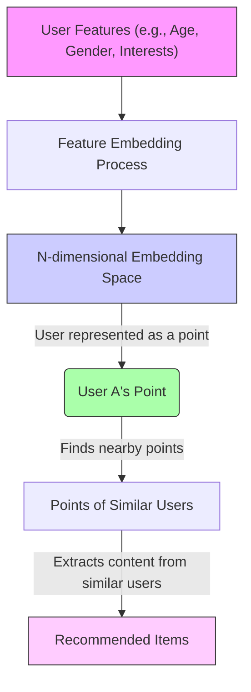
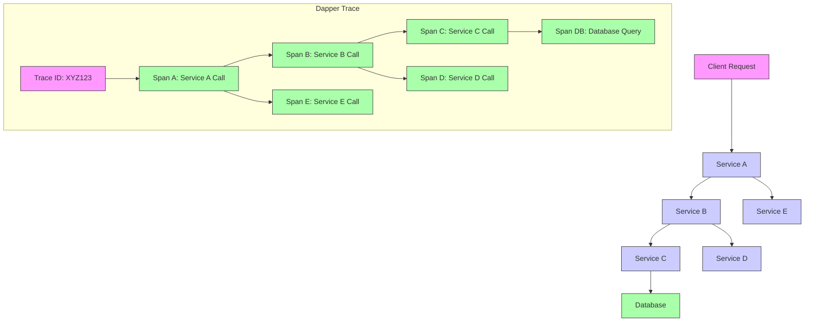
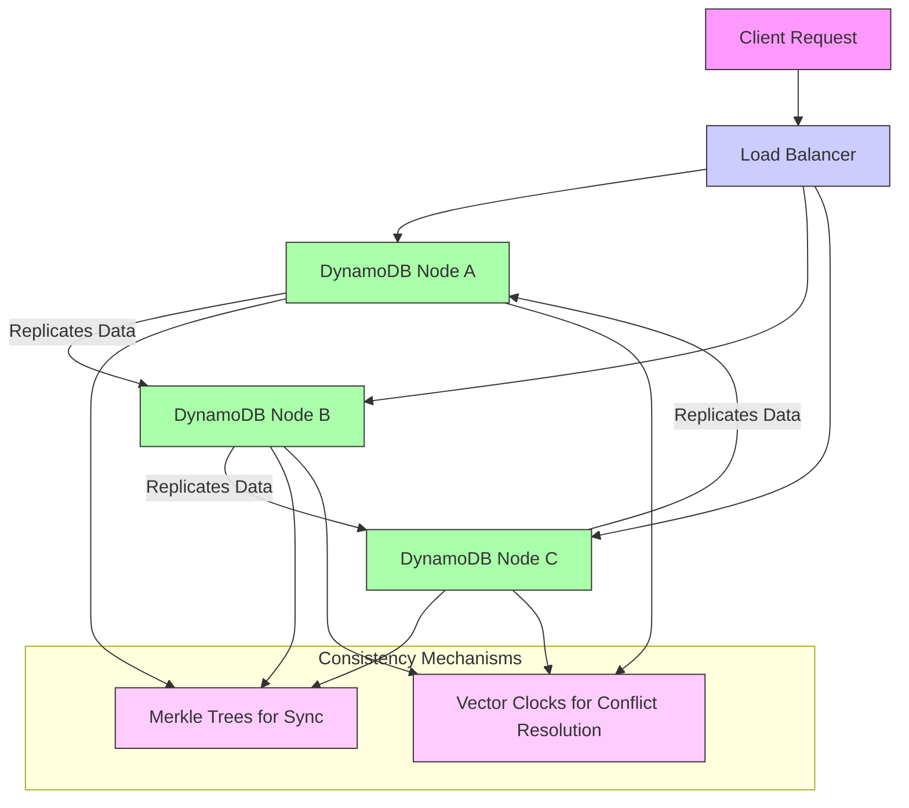

# 20 Whitepapers That Changed The World [For Senior Software Engineers] (1080P30) - Part 1

_screenshots/frame_00-00-00.jpg)

# Essential White Papers for Backend Engineers

Reading white papers is crucial for backend engineers, especially those in senior or staff-level positions. They provide invaluable insights into:
*   **Implementation Details:** Understanding how complex systems are actually built.
*   **Practical Aspects:** Gaining knowledge about real-world challenges and solutions.
*   **Trade-offs:** Learning the rationale behind design choices, which are often dictated by specific product requirements and constraints.

_screenshots/frame_00-00-23.jpg)

## Case Study: MemCashed at Meta (Facebook)

A prime example of a design trade-off influenced by product requirements comes from Meta's (Facebook's) use of **MemCashed**, an open-source caching software they heavily modified.

### The Scaling Challenge: Sharding vs. Redundancy

[SCREENSHOT-01-09-00]

Meta faced significant scaling challenges with MemCashed, needing to deploy numerous nodes. A key architectural decision involved choosing between **sharding** and **redundancy**.

*   **Sharding:**
    *   **Concept:** Dividing a large dataset (key space) into smaller, independent partitions called "shards." Each shard is then assigned to a specific set of servers.
    *   **Analogy:** Imagine a library with millions of books. Sharding would be like creating separate rooms for "fiction," "non-fiction," "biographies," etc., each managed by different librarians.
    *   **Benefit:** Allows for horizontal scaling, as new servers can be added to handle new shards or distribute load across existing ones.

*   **Redundancy:**
    *   **Concept:** Duplicating the entire key space (or significant portions) across multiple servers simultaneously.
    *   **Analogy:** Instead of separate rooms, you have multiple copies of the *entire* library in different buildings, so if one building is busy or unavailable, you can go to another.
    *   **Benefit:** Improves availability and read throughput, as requests can be served by any available replica.

### Why Facebook Opted Against Sharding for Certain Workloads

While sharding is a common scaling strategy, it presented unique problems for Facebook due to their specific query patterns, particularly **aggregate queries**.

Consider a typical client request for a user's profile on Facebook:
*   The profile itself.
*   Friend connections.
*   Likes on posts.
*   User's news feed.

This single request would involve fetching data that could potentially reside on multiple different shards if the key space were split granularly. Hitting multiple shards for a single user query would introduce significant overhead and latency, making performance worse rather than better.

**Comparison: Sharding vs. Redundancy in Facebook's Context**

| Feature           | Sharding                                  | Redundancy                                     |
| :---------------- | :---------------------------------------- | :--------------------------------------------- |
| **Data Partition** | Divides key space into distinct sets      | Duplicates entire (or large parts of) key space |
| **Server Assignment** | Each set handled by a specific server group | Multiple servers handle the same key space    |
| **Core Benefit**  | Horizontal scaling, load distribution     | High availability, read scalability            |
| **Facebook's Challenge** | **Aggregate queries** (e.g., user profile) would hit *multiple* shards, increasing complexity and latency. Splitting the key space would worsen performance. | Managing consistency across many redundant servers for small key spaces can be costly and lead to eventual consistency issues. |

In this scenario, the complexity and performance degradation introduced by sharding for aggregate queries outweighed its benefits, highlighting how **product requirements directly influence architectural trade-offs**.

---

## Top 20 White Papers for Backend Engineers

Let's delve into some of the must-know white papers.

### 20. Monolith: A Real-Time Recommendation System (TikTok)

[SCREENSHOT-02-43-00]

*   **Source:** TikTok
*   **Focus:** Delivering real-time recommendations to millions of users at scale.

**The Challenge of Recommendation Systems:**
Recommendation algorithms typically have two main components:
1.  **Batch Component:** Processes large datasets offline to generate recommendations (e.g., daily or hourly updates). These recommendations are often more accurate but not immediate.
2.  **Real-Time Component:** Provides immediate recommendations based on current user activity. The challenge is often that the quality of these real-time recommendations is not as good as batch-generated ones.

**Monolith's Innovation: User Feature Embeddings**

Monolith addresses this by finding an efficient way to **embed user features**.

*   **What are Embeddings?**
    *   An embedding transforms complex data (like user characteristics or item properties) into a numerical vector (a list of numbers).
    *   This vector represents a **point in an N-dimensional space**. The "N" here refers to the number of dimensions, which can be very large.
    *   **Analogy:** Imagine a person as a point in a huge virtual room. Each dimension (X-axis, Y-axis, Z-axis, etc.) represents a specific characteristic:
        *   X-axis: Age (e.g., Gorov is 25)
        *   Y-axis: Gender (e.g., Gorov is male)
        *   Z-axis: Country (e.g., Gorov is from India)
        *   Alpha-axis: Probability of watching chess videos (e.g., Gorov has a high probability)
        *   And so on, for potentially hundreds or thousands of dimensions.
    *   In this N-dimensional space, users with **similar characteristics or interests are located "close" to each other**.

*   **How it works for Recommendations:**
    1.  **Embed Users:** Each user (e.g., Gorov) is converted into a point in this N-dimensional space based on their features.
    2.  **Find Neighbors:** To recommend something to Gorov, the system efficiently finds other users (and the content they interact with) that are "close" to Gorov's point in this space.
    3.  **Generate Recommendations:** Content liked by nearby users is then recommended to Gorov. For example, if Gorov likes chess videos, and people who like chess videos also tend to like programming tutorials, then programming tutorials might be recommended to Gorov.

*   **Engineering Challenge:** The core problem for engineers is how to **efficiently embed** millions of users and then **quickly find similar users and generate recommendations** in real-time at the massive scale of TikTok. This paper provides insights into handling such a challenge.



### 19. FlexyRaft (Meta/Facebook)

*   **Source:** Meta (Facebook)
*   **Focus:** Enhancing the **Raft consensus algorithm** for global, large-scale distributed systems.

**Traditional Raft Algorithm and its Scalability Issue:**

The Raft algorithm is a popular consensus algorithm designed to help a cluster of machines agree on a single value, even if some machines fail. Its core concept is **quorum**:
*   A **quorum** requires a **majority** of nodes in a cluster to agree on a particular value or state change for it to be committed.
*   **Example:** In a cluster of 5 nodes, at least 3 nodes must agree. In a cluster of 100 nodes, at least 51 nodes must agree.

**The Scalability Problem with Traditional Raft:**
While effective for smaller, localized clusters, traditional Raft's quorum mechanism faces significant scalability challenges in **globally distributed systems**:
*   **Latency:** If you have servers in India, the US, and Europe, getting a majority of *all* these globally dispersed nodes to agree on every operation introduces high latency due to network delays across continents.
*   **Performance Bottleneck:** As the number of nodes increases, the overhead of coordinating a global majority vote for every decision becomes a severe performance bottleneck. It's simply not practical for systems with hundreds or thousands of nodes spread worldwide.

**FlexyRaft's Solution: Hierarchical Quorum**

FlexyRaft introduces a more flexible, **tree-like hierarchical structure** for achieving consensus. Instead of a flat global quorum, it organizes nodes into sub-clusters (e.g., regional clusters), each with its own local Raft quorum.

*   **Concept:**
    1.  **Local Consensus:** Nodes within a specific region (e.g., India) agree on a value using their local Raft quorum. They elect a **leader** for that region.
    2.  **Inter-Region Consensus:** The leaders of different regions (e.g., the leader from India, the leader from the US, and the leader from Europe) then form a *higher-level* Raft quorum among themselves. This higher-level quorum agrees on the global state or critical updates.
    3.  **Rough Consistency:** This hierarchical approach allows for efficient local consistency while maintaining a "roughly consistent" global state without every single node needing to communicate with every other node globally for every decision.

*   **Benefit:** This design significantly reduces the communication overhead and latency inherent in large, geographically distributed systems, making Raft more viable for global scale deployments like those at Meta.

```mermaid
graph TD
    subgraph Global Consensus (Leaders Only)
        LeaderUS["Leader (US)"] -- "Global Agreement" --> LeaderEU[Leader (Europe)]
        LeaderUS -- "Global Agreement" --> LeaderIN[Leader (India)]
        LeaderEU -- "Global Agreement" --> LeaderIN
    end

    subgraph US Cluster (Local Raft Quorum)
        LeaderUS --> NodeUS1[Node US1]
        LeaderUS --> NodeUS2[Node US2]
        LeaderUS --> NodeUS3[Node US3]
    end

    subgraph Europe Cluster (Local Raft Quorum)
        LeaderEU --> NodeEU1[Node EU1]
        LeaderEU --> NodeEU2[Node EU2]
        LeaderEU --> NodeEU3[Node EU3]
    end

    subgraph India Cluster (Local Raft Quorum)
        LeaderIN --> NodeIN1[Node IN1]
        LeaderIN --> NodeIN2[Node IN2]
        LeaderIN --> NodeIN3[Node IN3]
    end

    style LeaderUS fill:#f9f,stroke:#333,stroke-width:2px
    style LeaderEU fill:#f9f,stroke:#333,stroke-width:2px
    style LeaderIN fill:#f9f,stroke:#333,stroke-width:2px
    style NodeUS1 fill:#ccf,stroke:#333,stroke-width:1px
    style NodeUS2 fill:#ccf,stroke:#333,stroke-width:1px
    style NodeUS3 fill:#ccf,stroke:#333,stroke-width:1px
    style NodeEU1 fill:#ccf,stroke:#333,stroke-width:1px
    style NodeEU2 fill:#ccf,stroke:#333,stroke-width:1px
    style NodeEU3 fill:#ccf,stroke:#333,stroke-width:1px
    style NodeIN1 fill:#ccf,stroke:#333,stroke-width:1px
    style NodeIN2 fill:#ccf,stroke:#333,stroke-width:1px
    style NodeIN3 fill:#ccf,stroke:#333,stroke-width:1px
```

---

...FlexyRaft is a significant advancement as it tackles the complexities of distributed consensus in large, globally dispersed systems, offering a more scalable and performant alternative to traditional Raft deployments. Understanding FlexyRaft also provides deeper insights into the fundamental workings of the Raft algorithm itself, and for those interested, its predecessor, Paxos. Mastering distributed consensus mechanisms is a critical skill for any backend engineer.

_screenshots/frame_00-03-41.jpg)
_screenshots/frame_00-03-51.jpg)

### 18. Spanner (Google)

*   **Source:** Google
*   **Focus:** A globally distributed database that offers **strong consistency guarantees** and **transactions** across its distributed nodes, a challenging feat for such a vast system.

**Key Features and Engineering Marvels:**
*   **Global Distribution:** Spanner is designed to operate across multiple continents and data centers.
*   **Strong Consistency:** Unlike many distributed NoSQL databases that opt for eventual consistency for better availability, Spanner provides strong consistency, meaning all replicas of data are always up-to-date and consistent, even across vast geographical distances.
*   **Transactions:** It supports global, externally consistent distributed transactions, ensuring that operations spanning multiple data centers behave as if they were executed on a single, centralized database.
*   **TrueTime API:** This is Spanner's secret sauce. Google invested millions of dollars to develop and deploy highly accurate, synchronized atomic clocks (via GPS and atomic masters) in all its data centers.
    *   **Purpose:** TrueTime provides a tight bound on the uncertainty of clock synchronization across all servers. This bounded uncertainty allows Spanner to make strong guarantees about the order of events and transactions globally, which is crucial for strong consistency without sacrificing too much performance.
    *   **How it helps:** By knowing the precise time interval during which an event occurred (rather than a single point in time), Spanner can ensure that transactions commit in a globally consistent order, even in the face of network latency.

_screenshots/frame_00-04-12.jpg)

**TrueTime API Methods:**

| Method         | Returns                                         | Description                                                                                                                                                                                            |
| :------------- | :---------------------------------------------- | :----------------------------------------------------------------------------------------------------------------------------------------------------------------------------------------------------- |
| `TT.now()`     | `TTinterval {earliest, latest}`                 | Returns a time interval that is guaranteed to contain the current physical time. This interval explicitly accounts for clock uncertainty.                                                                |
| `TT.after(t)`  | `true` if `t` has definitely passed             | Returns `true` if the given timestamp `t` is definitely in the past relative to the current time interval. Used to ensure events are ordered correctly.                                               |
| `TT.before(t)` | `true` if `t` has definitely not arrived yet    | Returns `true` if the given timestamp `t` is definitely in the future relative to the current time interval. Used to ensure operations do not proceed before a certain time.                       |

*   **Extreme Fault Tolerance:** Spanner is engineered to be exceptionally resilient, designed to remain operational even in the face of major disasters (e.g., entire data centers going offline). This robustness is a testament to Google's comprehensive fault-tolerant mechanisms.

### 17. MindSweeper (Meta/Facebook)

*   **Source:** Meta (Facebook)
*   **Focus:** A sophisticated **Root Cause Analysis (RCA) system** designed to automatically identify the underlying causes of anomalies and problems in large-scale production systems.

_screenshots/frame_00-04-33.jpg)

**The Problem:**
In complex, distributed systems, anomalies (e.g., a sudden drop in user engagement, an increase in latency) are frequent. While **anomaly detection** systems can flag *when* something is wrong, they don't explain *why*. Manually sifting through countless metrics and logs to find the root cause is impractical at Meta's scale.

**MindSweeper's Approach:**
1.  **Anomaly Detection (Initial Step):**
    *   Imagine a graph representing a system metric (e.g., API requests per second).
    *   For a smooth, predictable graph (like a straight line or parabola), simple calculus (differentiation) can flatten it out, making deviations obvious.
    *   For highly complex, noisy graphs with many fluctuations, MindSweeper uses advanced statistical methods (analogous to multiple differentiations) to identify "problem points" or significant deviations from expected behavior. These are the detected anomalies.

2.  **Root Cause Identification (The Core of MindSweeper):**
    *   Once an anomaly is detected, MindSweeper doesn't stop there. It then attempts to correlate the anomalous metric with thousands of other potential contributing factors (e.g., code deployments, infrastructure changes, specific service metrics).
    *   **Correlation:** It looks for factors whose changes are highly correlated with the observed anomaly. If a particular factor changed just before the anomaly appeared, it's a strong candidate for the root cause.
    *   **Example:** If sales suddenly drop, MindSweeper might analyze various metrics. It could discover a strong correlation with a recent increase in "landing page load failures." This suggests that users aren't even reaching the product page, which then explains the drop in sales.

**Benefits and Applicability:**
*   **Automation:** Automates a process that would be impossible to do manually in large organizations.
*   **Efficiency:** Drastically reduces the time to identify and resolve issues, minimizing downtime and business impact.
*   **Scalability:** Essential for medium to large organizations with complex, interconnected systems where manual investigation is not feasible. For startups, manual investigation might suffice, but as systems grow, automation becomes critical.

```mermaid
graph TD
    MonitorMetrics[Monitor System Metrics] --> DetectAnomaly{Anomaly Detected?}
    DetectAnomaly -- "Yes" --> CorrelateFactors[Correlate Anomalies with Contributing Factors]
    CorrelateFactors --> IdentifyRootCause[Identify Root Cause (e.g., Code Change, Infrastructure Issue)]
    IdentifyRootCause --> ResolveProblem[Resolve Problem]
    DetectAnomaly -- "No" --> MonitorMetrics

    style MonitorMetrics fill:#f9f,stroke:#333,stroke-width:1px
    style DetectAnomaly fill:#f9f,stroke:#333,stroke-width:1px
    style CorrelateFactors fill:#ccf,stroke:#333,stroke-width:1px
    style IdentifyRootCause fill:#afa,stroke:#333,stroke-width:1px
    style ResolveProblem fill:#fcf,stroke:#333,stroke-width:1px
```

### 16. Cassandra

*   **Source:** Apache (originally Facebook's DynamoDB clone)
*   **Focus:** A highly scalable, distributed NoSQL database designed to handle large amounts of data across many commodity servers, providing high availability with no single point of failure.

**Key Characteristics:**
*   **Cluster Architecture:** Cassandra operates as a peer-to-peer distributed system where all nodes are identical, without a single master. This eliminates single points of failure.
*   **Gossip Protocol:** Nodes communicate using a gossip protocol to discover each other and exchange state information, ensuring eventual consistency across the cluster.
*   **Tunable Consistency:** Cassandra allows developers to choose the level of consistency for each read/write operation, ranging from very strong (requiring a quorum of replicas) to eventual (allowing faster operations but with potential temporary inconsistencies). This is a classic **consistency vs. availability** trade-off.
*   **Open Source:** While it shares architectural similarities with Amazon DynamoDB, Cassandra's open-source nature has made it a popular choice for companies seeking a highly available, scalable database solution without vendor lock-in.

**Note:** While acknowledged as a valuable open-source project, some perceive its white paper as less groundbreaking compared to others, given its conceptual similarities to DynamoDB. Nevertheless, as an engineer, understanding Cassandra's architecture and design choices is highly beneficial due to its widespread adoption.

### 15. FoundationDB (Apple)

*   **Source:** Apple (acquired from a startup)
*   **Focus:** A distributed, transactional key-value store that provides **strong consistency** and **ACID transactions** (Atomicity, Consistency, Isolation, Durability) typically associated with relational databases, but within a highly scalable NoSQL architecture.

**Key Innovations:**
*   **Novel Testing Techniques:** FoundationDB is particularly renowned for its innovative and exhaustive testing methodologies. They developed advanced techniques, including randomized fault injection and simulation testing, to rigorously prove that their transactional guarantees hold even under extreme failure conditions in a distributed environment. This is a significant contribution to the field of distributed systems.
*   **Key-Value Data Model:** It primarily functions as a key-value data store, which is a fundamental and widely used type of NoSQL database.
*   **Scalable Consistency:** FoundationDB aims to solve the often-conflicting goals of scalability and strong consistency. It demonstrates how a distributed system can achieve high throughput and low latency while maintaining strict transactional integrity.

**Significance:** This paper is a must-read for engineers interested in building highly consistent and scalable systems, especially those looking to understand how full ACID transactions can be achieved in a distributed NoSQL context.

### 14. Amazon Aurora

*   **Source:** Amazon Web Services (AWS)
*   **Focus:** A cloud-native relational database service (RDBMS) that re-architects traditional databases to achieve unprecedented levels of **scale** and **high availability** for relational workloads. It's more of an architectural pattern paper than a new consensus algorithm.

**Architectural Innovations for Scale and Availability:**
*   **Decoupled Storage and Compute:** Aurora separates the compute (database engine) and storage layers. This allows each layer to scale independently.
*   **Distributed, Fault-Tolerant Storage:** Aurora's storage system is a custom, distributed, log-structured storage service that replicates data six ways across three Availability Zones. This provides extreme durability and availability.
*   **Fast Crash Recovery:** Because storage and compute are separate, recovery from crashes is significantly faster, as the database engine doesn't need to perform traditional crash recovery on the entire data volume.
*   **Seamless Node Management:** Aurora is designed to seamlessly add and remove compute nodes (replicas) to handle varying loads and maintain availability, without impacting the underlying data.
*   **High Performance:** By offloading much of the I/O processing to the distributed storage layer, Aurora can achieve performance comparable to or better than commercial databases at a fraction of the cost.

**Core Principles:**
*   **Scale:** Designed for massive scaling of relational database workloads.
*   **High Availability:** Engineered for extreme uptime and resilience, ensuring databases remain accessible even during failures.
*   **Operational Ease:** Simplifies database management by automating tasks like patching, backups, and replication.

---

**Amazon Aurora (Continued)**

*   **Hiding Complexity:** A crucial aspect of Aurora's design is its ability to abstract away its internal complexities from the end-user. While offering powerful features and customization, it aims to prevent users (especially startups) from needing to deeply understand or manage the intricate distributed architecture. This balance between customizability and ease of use is a key trade-off explored in the paper.

_screenshots/frame_00-06-57.jpg)
_screenshots/frame_00-07-07.jpg)

```mermaid
graph TD
    Client[Client Application] --> RDSAPI[Amazon RDS API / Console]
    RDSAPI --> ControlPlane[Aurora Control Plane]
    ControlPlane --> HM[Host Manager]
    HM --> DBEngine[Aurora DB Engine (Compute)]
    DBEngine -- "Writes Log Records" --> StorageService[Aurora Distributed Storage Service]
    StorageService -- "6-way Replication" --> AZ1[Availability Zone 1]
    StorageService -- "6-way Replication" --> AZ2[Availability Zone 2]
    StorageService -- "6-way Replication" --> AZ3[Availability Zone 3]

    subgraph Storage Node Operations
        SNInput[Incoming Queue]
        SNInput --> SNProcess[Process Log Records]
        SNProcess --> SNPersist[Persist to In-Memory Queue]
        SNPersist --> SNOffload[Offload to Distributed Log]
        SNOffload --> SNCoalesce[Coalesce Data Pages]
        SNCoalesce --> SNS3Backup[Backup to S3]
        SNS3Backup --> SNValidate[Validate CRC Codes]
    end

    style Client fill:#f9f,stroke:#333,stroke-width:1px
    style RDSAPI fill:#ccf,stroke:#333,stroke-width:1px
    style ControlPlane fill:#afa,stroke:#333,stroke-width:1px
    style HM fill:#fcf,stroke:#333,stroke-width:1px
    style DBEngine fill:#f9f,stroke:#333,stroke-width:1px
    style StorageService fill:#ccf,stroke:#333,stroke-width:1px
    style AZ1 fill:#afa,stroke:#333,stroke-width:1px
    style AZ2 fill:#afa,stroke:#333,stroke-width:1px
    style AZ3 fill:#afa,stroke:#333,stroke-width:1px
```

### 13. Pregel (Google)

*   **Source:** Google
*   **Focus:** A system for **large-scale graph processing**. It's designed for analyzing patterns *within* graphs rather than primarily maintaining the graph data itself.

**Purpose and Applications:**
*   **Graph Analysis:** Pregel is optimized for computations that involve traversing relationships within massive graphs.
*   **Examples:**
    *   **PageRank Algorithms:** Determining the importance of web pages based on links, a core component of search engines.
    *   **Social Network Analysis:** Finding connections, communities, or influential users in social graphs.
    *   **Recommendation Systems:** Analyzing user-item interaction graphs to suggest new items.
*   **Batch Processing:** These types of complex graph computations are typically performed in batch mode due to their computational intensity.
*   **Insight into SEO:** Understanding Pregel's principles can provide a foundational understanding of how Google's search algorithms (like PageRank) might work behind the scenes, offering insights into Search Engine Optimization (SEO).
*   **Practical Aspects:** The paper emphasizes practical aspects of building and operating such a system at scale, making it highly relevant for engineers.

### 12. Dapper (Google)

*   **Source:** Google
*   **Focus:** Google's distributed tracing system. It's designed to track the flow of individual requests as they traverse through potentially hundreds of microservices in a large-scale distributed architecture.

**The Problem Dapper Solves:**
In a microservices environment, a single user request might involve calls to dozens or hundreds of different services. If something goes wrong (e.g., a request is slow or fails), pinpointing *which* service caused the issue and *where* in the call chain the delay occurred is incredibly difficult without a tracing system. Dapper is a foundational step in **root cause analysis (RCA)** for distributed systems.

**Key Concepts and Design Choices:**
*   **Request Tracing:** Dapper assigns a unique `trace ID` to each incoming request. This ID is then propagated across all services involved in processing that request.
*   **Spans:** Each operation within a service (e.g., a database query, an RPC call to another service) is represented as a "span." Spans are nested to show parent-child relationships, forming a tree-like structure for the entire request.
*   **Sampling:** It's impractical to log and trace *every* single request at Google's scale. Dapper employs **sampling** techniques, tracing only a subset of requests, to provide sufficient visibility without overwhelming the logging and storage infrastructure.
*   **Minimal Overhead:** A critical design goal for Dapper was to ensure that the tracing system itself does not significantly impact the performance of the services it monitors. This requires careful instrumentation and efficient data collection.
*   **Inter-system Code Reviews:** Due to its pervasive nature, engineers integrating Dapper into their services undergo rigorous reviews to ensure correct implementation and minimal performance impact on the broader Google infrastructure. This highlights the concept of **inter-system dependencies and their impact on architectural integrity**.

_screenshots/frame_00-08-11.jpg)



### 11. Chubby (Google)

*   **Source:** Google
*   **Focus:** A distributed lock service designed to provide coarse-grained locking, master election, and configuration management for Google's large-scale distributed systems. It is conceptually similar to Apache ZooKeeper.

**Core Functionality:**
*   **Distributed Locks:** Chubby provides a mechanism for different processes or services across a distributed system to acquire and release locks, ensuring that only one process can access a shared resource or perform a critical operation at a time.
    *   **Analogy:** Imagine multiple construction crews needing to use a single crane. A distributed lock ensures only one crew can "acquire the crane" (the lock) at any given time, preventing conflicts.
*   **Leader Election:** It facilitates the election of a "leader" or "master" among a group of replica servers. This leader then takes on specific responsibilities (e.g., coordinating operations, handling writes), while others act as followers or backups.
*   **Configuration Management:** Chubby can also be used to store and distribute configuration data across a cluster, ensuring all services operate with the same settings.

**Technical Details and Importance:**
*   **Underlying Consensus:** Internally, Chubby uses the Paxos consensus algorithm to achieve fault-tolerant agreement among its replicas. However, the paper primarily focuses on the *practical implementation challenges* and *design choices* made when building such a critical service, rather than a deep dive into Paxos itself.
*   **Fundamental Component:** Distributed locks and leader election are fundamental building blocks for many distributed systems, enabling reliable transactions, high availability, and coordinated operations.
*   **File System Analogy:** The paper discusses how one might conceptually use a file system metaphor to manage locks (e.g., creating/deleting files to represent lock acquisition/release), though the actual implementation is far more robust.

### 10. Megastore (Google)

*   **Source:** Google
*   **Focus:** A distributed data store at Google that provides **relational database semantics**, including **ACID transactions**, on top of a NoSQL foundation. This is notable because Google typically favors NoSQL solutions (like BigTable).

**The Challenge:**
How do you offer the familiar and powerful features of a relational database (like SQL queries, strong consistency, and transactions) when your underlying storage is a simpler NoSQL key-value store? This is the core problem Megastore addresses.

**Key Aspects:**
*   **Relational Semantics over NoSQL:** Megastore provides a relational data model and supports ACID transactions across distributed data, even though its storage layer is built on a NoSQL system (specifically, BigTable).
*   **Scalability and Reliability:** It's designed to be highly scalable and reliable, typical of Google's infrastructure.
*   **Trade-offs:** The paper details the trade-offs made to achieve relational capabilities on a NoSQL backend, particularly regarding consistency models and performance characteristics.
*   **Implementation Details:** It's valuable for understanding how complex features like indexes, foreign keys, and transactionality can be implemented on top of simpler, distributed data structures. It provides insight into how databases are constructed from fundamental building blocks.
*   **Testing:** The paper also covers the rigorous testing methodologies employed to ensure the system's correctness and robustness in a large-scale environment.

### 9. BigTable (Google)

*   **Source:** Google
*   **Focus:** A fundamental **NoSQL distributed storage system** developed by Google. It's a highly scalable, high-performance, and fault-tolerant system designed to manage petabytes of structured data across thousands of commodity servers.

**Significance:**
*   **Backbone of Google Services:** BigTable powers numerous core Google services, including Google Search, Google Earth, Gmail, Google Analytics, and more. Its reliability and performance are critical to Google's operations.
*   **NoSQL Pioneer:** BigTable was one of the earliest and most influential NoSQL databases, pioneering concepts that later became common in other NoSQL systems (e.g., column-family stores, eventual consistency options).
*   **Data Model:** It provides a sparse, distributed, persistent multi-dimensional sorted map. This means data is organized by row key, column family, and timestamp, allowing for flexible schema evolution.
*   **Underlying Storage for Others:** As seen with Megastore, BigTable often serves as the underlying storage layer for higher-level Google services that require more complex data models or transactional guarantees. Understanding BigTable is crucial for understanding how many Google services are built.

_screenshots/frame_00-10-06.jpg)

**BigTable's Architecture (High-Level):**

| Component      | Role                                                                                                                                                                                                        | Analogy                                                                                                 |
| :------------- | :---------------------------------------------------------------------------------------------------------------------------------------------------------------------------------------------------------- | :------------------------------------------------------------------------------------------------------ |
| **Master**     | Coordinates tablet servers, handles tablet assignments, garbage collection, and schema changes.                                                                                                               | The librarian who organizes where all the book sections (tablets) are and assigns librarians to them.   |
| **Tablet Server** | Manages a set of "tablets" (shards of data), handles read/write requests for its tablets, and communicates with the GFS/Colossus (Google's file systems) for persistent storage.                          | The individual librarians responsible for specific sections of books, helping you find/store books.      |
| **Tablets**    | Contiguous ranges of rows within a table. A table is dynamically partitioned into tablets based on the row keys.                                                                                             | A specific section of books (e.g., "Fiction A-D") within the library.                                   |
| **GFS/Colossus** | Google's distributed file systems, providing the underlying persistent storage for BigTable's data.                                                                                                         | The actual shelves and storage rooms where all the physical books are kept.                             |

**Why it's important for engineers:**
Reading the BigTable paper provides a deep understanding of how a massively scalable, fault-tolerant NoSQL database is designed and implemented. It covers critical concepts like data partitioning, replication, consistency models, and the challenges of operating such a system at Google's scale.

---

### 9. BigTable (Google) (Continued)

*   **Versioned Data:** One of BigTable's powerful features is its ability to store multiple versions of data for a single cell, identified by timestamps. This allows applications to retrieve older states of data (e.g., an older version of a web page), making it suitable for applications requiring historical data or temporal analysis.

_screenshots/frame_00-10-17.jpg)
_screenshots/frame_00-10-29.jpg)

*   **Pioneering Concepts:** Many of the principles introduced by BigTable, such as **hot shards** (where certain data partitions experience disproportionately high traffic) and mechanisms for maintaining consistency across multiple data shards, are now considered standard practice in distributed database design. At the time of its inception, these were novel solutions.

### 8. MapReduce (Google)

*   **Source:** Google
*   **Focus:** A programming model and an associated implementation for processing and generating large datasets with a parallel, distributed algorithm on a cluster of commodity hardware.

**The Problem Solved:**
As systems scale, vast amounts of data are generated and stored across various services. This data needs to be processed for analytics, recommendations, reporting, or archival purposes. Performing these operations efficiently on massive datasets using inexpensive hardware was a significant challenge over a decade ago.

**Core Concept: Map and Reduce Operations:**
MapReduce simplifies large-scale data processing by breaking down complex tasks into two fundamental operations:
1.  **Map:**
    *   **Purpose:** Takes a set of input key-value pairs and processes each pair independently to generate a new set of intermediate key-value pairs.
    *   **Analogy:** Imagine you have a huge pile of books and you want to count the occurrences of each word. The "Map" step would involve each worker (computer) going through a subset of books and outputting (word, 1) for every word it finds.
2.  **Reduce:**
    *   **Purpose:** Takes all intermediate values associated with the same intermediate key and combines them into a smaller set of output values.
    *   **Analogy:** After the "Map" step, you'd have many (word, 1) pairs. The "Reduce" step would group all identical words and sum their counts (e.g., (apple, 1), (apple, 1) -> (apple, 2)).

**Impact and Legacy:**
*   **Highly Influential:** MapReduce was an extremely novel and intelligent solution. It immediately inspired numerous open-source projects.
*   **Open Source Implementations:** Projects like Apache Hadoop and Apache Spark are direct descendants or variations of the MapReduce architecture, demonstrating its profound impact on the big data ecosystem.
*   **Programming Language Integration:** The core concepts of mapping, filtering, and reducing have become so fundamental that they are now integrated into modern programming languages (e.g., Java Streams API, Python's `map()` and `reduce()` functions).

**Importance for Engineers:** Understanding MapReduce is crucial not only for historical context but also because its underlying principles of parallel processing and data transformation are widely applied in modern data engineering and distributed computing.

### 7. Google File System (GFS)

*   **Source:** Google
*   **Focus:** A scalable distributed file system designed to handle Google's massive data processing needs. It is the foundational storage layer for many other Google services, including BigTable.

**Key Characteristics and Design Philosophy:**
*   **Foundation of Google's Infrastructure:** GFS provides reliable and efficient storage for the vast amounts of data generated and used by Google's applications. It abstracts away the complexities of managing physical storage across thousands of machines.
*   **Not Just Files:** Despite its name, GFS stores more than just traditional "files." It's a general-purpose distributed storage system that can back various higher-level data structures and services, as exemplified by BigTable.
*   **Optimized for Google's Workloads:** GFS was designed with Google's specific workload characteristics in mind:
    *   **Large Files:** It handles very large files (gigabytes to terabytes) efficiently.
    *   **Sequential Reads/Appends:** Optimized for large streaming reads and appending new data, rather than random small writes or in-place modifications.
    *   **Fault Tolerance:** Built to tolerate frequent component failures by replicating data and automatically recovering.
*   **Master-Chunkserver Architecture:**
    *   **Master:** A single master server manages metadata (namespace, access control, file-to-chunk mappings, chunk locations) and coordinates operations.
    *   **Chunkservers:** Store data in fixed-size "chunks" (typically 64MB) and perform read/write operations. Chunks are replicated across multiple chunkservers for durability and availability.

**Influence on Open Source:**
*   **Hadoop Distributed File System (HDFS):** GFS is widely considered the inspiration for HDFS, the core storage component of the Apache Hadoop ecosystem. HDFS shares many architectural similarities and design principles with GFS, demonstrating the paper's profound impact on the broader distributed systems community.

**Importance:** The GFS white paper is arguably one of the most popular and influential technical papers for software engineers. It provides fundamental insights into designing and implementing large-scale, fault-tolerant distributed storage systems.

### 6. TAO (The Associations and Objects System) (Meta/Facebook)

*   **Source:** Meta (Facebook)
*   **Focus:** A highly optimized, **in-memory graph database** specifically designed to serve Facebook's social graph at massive scale, providing low-latency access to social connections and objects.

**The Problem:**
Representing and querying a social network (users, their posts, likes, friendships, comments, etc.) as a graph is intuitive. However, scaling traditional relational databases or even generic NoSQL solutions to handle the immense size and dynamic nature of Facebook's graph, with billions of users and trillions of edges, is incredibly challenging.
*   **Relational Databases:** Can become complex with many joins for graph traversals.
*   **NoSQL (e.g., Key-Value Stores):** Can be hacked to represent graphs (e.g., adjacency lists), but often lack efficient graph traversal capabilities at scale.

**TAO's Solution: In-Memory Graph Database:**
*   **Graph-Native:** TAO is purpose-built for graph data, directly modeling **objects** (e.g., users, photos, posts) and **associations** (e.g., friendships, likes, comments) between them.
*   **In-Memory:** To achieve extremely low-latency reads, TAO heavily leverages memory caching. The most frequently accessed parts of the social graph reside in RAM.
*   **Scale and Performance:** It's designed to handle Facebook's immense read traffic (trillions of reads per day) with millisecond latencies, making it an engineering marvel.
*   **Practicality:** The paper emphasizes the practical engineering challenges and solutions involved in building and operating such a critical, high-performance system.

**Analogy:** Imagine a complex web of interconnected nodes (people, photos) and lines (friendships, likes). TAO is like having a super-fast, perfectly indexed brain that can instantly tell you all the connections related to any given node, rather than having to search through a giant, slow filing cabinet (traditional database).

**Importance:** For engineers interested in graph databases, social networks, or extreme-scale low-latency systems, TAO is an essential read.

### 5. MemCashed (Facebook)

*   **Source:** Facebook (modified open-source Memcached)
*   **Focus:** Facebook's highly optimized, large-scale distributed caching system. It highlights the practical trade-offs and optimizations made to deploy a caching layer that serves billions of requests per second.

**Review (as touched on earlier):**
*   We previously discussed MemCashed in the context of Facebook's decision between sharding and redundancy, driven by aggregate query patterns. This paper delves deeper into the *why* and *how* of their specific implementation.

**Key Trade-offs and Optimizations:**
*   **TCP vs. UDP:** The paper discusses the choice between TCP (reliable, connection-oriented) and UDP (unreliable, connectionless) for communication between clients and cache servers. Facebook's version of MemCashed likely makes specific choices or optimizations here based on their traffic patterns (e.g., favoring UDP for speed with application-level reliability for certain use cases).
*   **Replication vs. Sharding (Revisited):** The paper elaborates on Facebook's chosen strategy for data distribution and redundancy within the caching layer, detailing how they balance consistency, availability, and performance.
*   **Practicality:** The paper is lauded for its focus on the pragmatic engineering decisions and optimizations required to operate a caching system at Facebook's scale, covering aspects like memory management, network efficiency, and failure handling.

**Importance:** This paper offers invaluable insights into the real-world challenges and solutions for building and operating a massive, highly performant caching infrastructure. It's considered one of the top papers for understanding practical system design.

### 4. Monarch (Google)

*   **Source:** Google
*   **Focus:** Google's **time-series database** and monitoring system. It's designed for extremely high reliability and availability, specifically to monitor the health of *all* other Google systems, even if those systems (including their primary databases) are themselves experiencing failures.

**The Monitoring Challenge:**
How do you monitor a system if the monitoring system itself relies on the very components it's supposed to monitor? For example, if your primary database goes down, how can your monitoring system report that if it needs the database to store its metrics?

**Monarch's Design Philosophy (Self-Reliant Monitoring):**
*   **Extreme Reliability:** Monarch is engineered to be exceptionally robust and isolated. It's designed to continue running and collecting/reporting metrics even if other critical Google infrastructure components (like other databases or core services) fail.
*   **Independent Operation:** It uses its own highly resilient storage and processing mechanisms that are decoupled from the systems it monitors. This ensures that it can report on failures even when those failures impact the rest of the infrastructure.
*   **Practicality:** The paper details the practical architectural choices and fault-tolerance mechanisms that enable Monarch to achieve this level of self-reliance and continuous operation at Google's scale.

**Importance:** Monarch is a crucial read for engineers building monitoring systems or any highly critical infrastructure where the monitoring layer must be more resilient than the systems it oversees. It demonstrates how to design for ultimate survivability in a distributed environment.

---

### 4. Monarch (Google) (Continued)

*   **In-Memory Design (for critical paths):** To achieve this extreme reliability and performance, Monarch likely keeps critical monitoring data and its own operational state in memory as much as possible, reducing dependencies on slower, less reliable disk I/O or other databases.
*   **GorillaDB (Facebook's Counterpart):** Facebook developed a similar time-series database called **GorillaDB**. While Monarch is presented as an engineering marvel due to its sheer scale and reliability, GorillaDB is also highly regarded, particularly for its practical optimizations and focus on performance, often choosing performance over extreme consistency if the use case allows. Both companies independently arrived at the need for such a specialized time-series database for monitoring.

_screenshots/frame_00-14-15.jpg)
_screenshots/frame_00-14-25.jpg)

*   **Persistence "Cheat":** GorillaDB, for instance, might "cheat" on the persistence side by leveraging existing solutions like OpenTSDB, focusing its innovation on the in-memory, real-time aspects of the time-series database. This highlights a common engineering trade-off: build what's critical, leverage what's available.

**Importance:** Both Monarch and GorillaDB demonstrate how critical it is to have a robust, independent monitoring system that can function even when other parts of the infrastructure are failing. This paper is essential for understanding resilient system design.

### 3. Amazon DynamoDB

*   **Source:** Amazon
*   **Focus:** A highly available, scalable, and eventually consistent key-value store that pioneered many concepts in distributed NoSQL databases.

**Key Contributions and Impact:**
*   **Pioneering Distributed Database:** DynamoDB (the paper, not the AWS service) is a foundational work in distributed systems. It describes how Amazon built a highly available, eventually consistent key-value store to meet its internal needs (e.g., for its shopping cart service) where availability was paramount.
*   **Engineering Feat:** The paper details complex, research-level algorithms and data structures that were practically implemented and scaled to production.
    *   **Merkle Trees:** Used for efficient replica synchronization and consistency checks, allowing nodes to quickly identify inconsistencies without transferring all data.
    *   **Vector Clocks:** Used to resolve conflicts when multiple versions of data exist due to eventual consistency.
*   **High Availability and Performance:** DynamoDB prioritizes extreme availability and low-latency performance, even at the cost of strong consistency (opting for eventual consistency by default).
*   **Tunable Consistency:** Like Cassandra (which was inspired by DynamoDB), it offers tunable consistency, allowing applications to choose the level of consistency required for specific operations.
*   **Impact on AWS and Industry:** The concepts in the DynamoDB paper propelled Amazon's engineering prowess and heavily influenced the design of many subsequent NoSQL databases and cloud services, including the commercial AWS DynamoDB service. It's one of the most impactful papers in the distributed systems world.



### 1. Zanzibar (Google)

*   **Source:** Google (now open-sourced)
*   **Focus:** Google's global authorization system, responsible for determining whether a user has permission to access a specific resource. It's lauded for its practical optimizations and robust fault tolerance at immense scale.

**The Problem:**
At Google's scale, managing access control for billions of users and trillions of resources (documents, photos, videos, services) is incredibly complex. Every request needs to be quickly checked for authorization. This system must be:
*   **Highly Available:** Authorization must work even if other systems are down.
*   **Low Latency:** Permissions checks must be extremely fast.
*   **Globally Consistent:** A user's permissions should be consistent everywhere.
*   **Scalable:** Must handle Google's immense traffic.

**Zanzibar's Innovation and Practicality:**
*   **Simplified Core Algorithm:** The core algorithm for authorization (how data schema and APIs define permissions) is surprisingly concise, often described in just a page or two. This simplicity in concept allows for robust implementation.
*   **Optimization Layering:** The true brilliance of Zanzibar lies in its extensive layers of **optimization on top of optimization**. These practical optimizations are what enable it to operate efficiently at Google's scale.
    *   **Caching:** Aggressive caching of authorization results.
    *   **Rate Limiting:** Sophisticated rate limiting mechanisms to protect the system from overload.
    *   **Fault Tolerance:** Designed with extreme fault tolerance, ensuring authorization checks continue even during widespread failures. The paper details how these concepts are applied in a real-world, high-stakes environment.
*   **Open Source:** Google's decision to open-source Zanzibar (as "Authzed" and "OpenFGA") is highly significant, providing the industry with a blueprint for building a global-scale authorization system.

_screenshots/frame_00-16-42.jpg)
_screenshots/frame_00-17-21.jpg)

**Importance for Engineers:**
Zanzibar is considered one of the most important white papers for backend engineers because it showcases:
*   **Practical System Design:** How a seemingly simple core idea can be transformed into an extremely robust and performant system through meticulous engineering and layered optimizations.
*   **Real-world Challenges:** It provides concrete examples of how concepts like rate limiting and fault tolerance are implemented and refined at a scale of billions of users and requests.
*   **Authorization Architecture:** It's a definitive guide for anyone looking to design or understand modern, scalable authorization systems.

---

This concludes the list of 20 essential white papers for backend engineers. Each paper offers unique insights into the practical aspects, trade-offs, and engineering marvels involved in building and operating large-scale distributed systems. Reading them will deepen your understanding of fundamental concepts and prepare you for senior engineering challenges.

---

_screenshots/frame_00-17-23.jpg)

## Conclusion and Further Engagement

This comprehensive list covers 20 essential white papers that every backend engineer, particularly those aspiring to or in senior roles, should consider reading. These papers offer deep insights into the design, implementation, and operational challenges of large-scale distributed systems at leading tech companies like Google, Meta (Facebook), and Amazon.

**Key Takeaways from these Papers:**
*   **Implementation Details:** Go beyond theoretical concepts to understand practical system construction.
*   **Practicality and Trade-offs:** Learn why specific design choices are made, often balancing conflicting requirements like consistency, availability, and performance.
*   **Scale:** Grasp the complexities of building systems that serve billions of users and handle trillions of requests.
*   **Fault Tolerance:** Discover robust mechanisms for ensuring systems remain operational even in the face of failures.
*   **Innovation:** Witness groundbreaking solutions to complex distributed computing problems.

The papers are typically well-written and provide a solid foundation for understanding modern system design principles.

**Call to Action:**
Feel free to share your thoughts on these white papers in the comments below. If you have other white papers you find particularly insightful, please mention them with a brief description of why you recommend them (e.g., for their discussion of trade-offs, practicality, scale, or ease of understanding). Engaging in such discussions can further enrich our collective knowledge.

---

