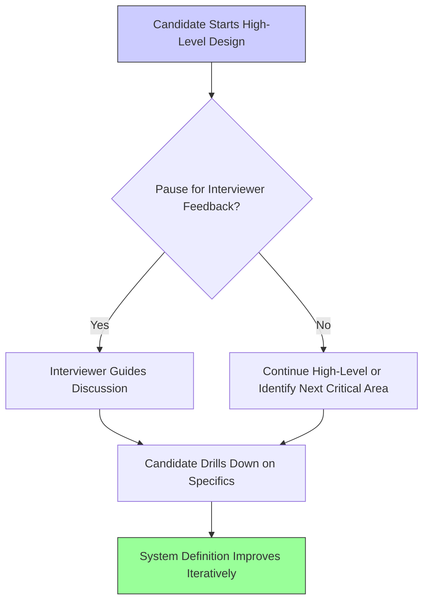

# 5 Tips For System Design Interviews (1080P60) - Part 1

## 5 Essential Do's and Don'ts for System Design Interviews

These tips are crucial for maximizing your performance in system design interviews, whether you're actively interviewing or practicing.

### 1. Do Not Go Into Detail Prematurely

_screenshots/frame_00-00-00.jpg)

A common pitfall in system design interviews is diving too deep into specific implementation details too early in the discussion. This often happens when candidates start drawing out services, databases, and client connections.

**What Premature Detail Looks Like:**

_screenshots/frame_00-01-55.jpg)
_screenshots/frame_00-02-06.jpg)
_screenshots/frame_00-02-41.jpg)

As illustrated in the screenshots, premature detail can involve:
*   **Protocol Specification:** Immediately stating, "I'll use HTTP for external communication and TCP/UDP internally," instead of focusing on the functional flow.
*   **Database Specifics:** Declaring detailed database configurations like "I'll use two databases, one for read-only and one for write-only," before the core data model or access patterns are established.
*   **Specific Components:** Drawing a `GATEWAY` and immediately detailing its internal workings or specific features without first defining the overall system boundaries and major components.

**Why This is Detrimental:**

*   **Wasted Time:** You consume valuable interview time discussing aspects that might not be relevant or critical at that stage.
*   **Lack of Interviewer Feedback:** When you monologue with excessive detail, the interviewer may not interject. They might let you continue down a path that isn't what they intended to explore, leading you astray.
*   **Negative Impression:** If you go down the wrong path and have to backtrack, it not only wastes time but also signals a lack of strategic thinking. In a real-world scenario, such backtracking translates to wasted resources and money.

**Recommended Approach: Iterative Refinement**

Instead of premature detail, adopt an iterative approach:

1.  **Start High-Level:** Begin with a broad overview of the system's components and their interactions.
2.  **Pause and Seek Feedback:** After outlining a high-level component or flow, pause. This allows the interviewer to provide direction, ask clarifying questions, or guide you to areas they want you to explore in more detail.
3.  **Drill Down on Demand:** Only delve into specifics when:
    *   The interviewer explicitly asks for more detail on a particular component or aspect (e.g., "Tell me more about the database schema" which would then lead to an Entity-Relationship Diagram (ERD)).
    *   You identify a specific point that is crucial for the system's core functionality or performance and requires immediate attention.

This approach ensures you address the most important aspects first and align your discussion with the interviewer's expectations.

### 2. Do Not Have a Set Architecture in Mind

Another common mistake is entering the interview with a pre-conceived "favorite" architecture (e.g., Model-View-Controller (MVC), Event-Driven, Publisher-Subscriber) and attempting to force the problem's requirements into that mold.

**Why This is Problematic:**

*   **Inflexibility:** A pre-determined architecture might not be the optimal solution for the specific problem at hand. Different requirements often necessitate different architectural patterns.
*   **Misalignment with Requirements:** You might end up trying to "fit" the given requirements into an unsuitable architecture, leading to a suboptimal or overly complex design.
*   **Interviewer Testing:** Interviewers often intentionally introduce requirement changes or constraints during the interview to test your adaptability and flexibility. If you're rigid with a fixed architecture, you'll struggle to pivot, which is a critical skill for a system designer. They want to see if you can iterate and adapt your design based on evolving needs.

**Recommended Approach: Be Flexible and Requirement-Driven**

*   **Understand Requirements First:** Thoroughly understand all functional and non-functional requirements before proposing any architectural patterns.
*   **Propose Based on Need:** Suggest architectural patterns (e.g., microservices, monorepo, message queues) that directly address the identified requirements and constraints.
*   **Be Ready to Adapt:** Be prepared to modify or even discard initial architectural ideas as new requirements or trade-offs are introduced by the interviewer. Your design should evolve organically with the discussion.

Flexibility demonstrates that you can critically evaluate different approaches and select the most appropriate one for a given scenario, rather than blindly applying a familiar pattern.

---

### 3. Keep It Simple, Stupid (KISS Principle)

_screenshots/frame_00-03-39.jpg)

While it's important to discuss details, avoid getting excessively granular on one specific part of your system. This is often referred to by the programming adage: **KISS - Keep It Simple, Stupid**.

**What "Too Much Detail in One Area" Looks Like:**

_screenshots/frame_00-04-26.jpg)

As demonstrated in the screenshot, an example of this might be:
*   **Over-optimizing a single service:** For a `SERVER 1` component, you might propose a dedicated heartbeat server *just for that service* and a separate analytics database *only for that service*.
*   **Losing Sight of the Big Picture:** This micro-focus makes your view of the overall system very narrow. You might design a highly complex solution for a small part, while overlooking simpler, system-wide solutions. For instance, if you need analytics for one service, perhaps a centralized analytics platform for the entire system would be more efficient.

**Why This is Detrimental:**

*   **Bloated Components:** Individual components become unnecessarily complex and difficult to manage.
*   **Poor System Balance:** Your architecture diagram might become disproportionate, with one part heavily detailed and others barely sketched out. This is a strong indicator that your design might be over-engineered in one area or that components can be simplified or extracted.
*   **Missed Opportunities for Reusability:** Features designed for one service (like analytics or monitoring) might be generalizable across the entire system. Focusing too narrowly prevents you from identifying these opportunities.

**Recommended Approach: Step Back and Simplify**

*   **Regularly Review the Entire Architecture:** Frequently take a step back to view your entire system diagram.
*   **Look for Imbalances:** If one part of your diagram is significantly more detailed or complex than others, it's a signal to re-evaluate.
*   **Identify Shared Concerns:** Look for common functionalities (e.g., logging, monitoring, authentication, data storage) that can be abstracted into shared, reusable components or services, rather than being duplicated or overly specialized within each individual service.
*   **Simplify and Extract:** If a component is becoming too complex, consider if parts of its functionality can be extracted into separate, simpler services that serve a broader purpose.

### 4. Justify Your Design Choices

_screenshots/frame_00-06-48.jpg)

This is arguably one of the most critical and frequently overlooked aspects of system design interviews. **Every design decision you make should be backed by a clear justification.**

**The Problem with Unjustified Statements:**

*   **Example:** Stating, "I will use a NoSQL database like Cassandra."
*   **The Missing Piece:** The immediate and logical follow-up question is "Why?"
*   **Awkward Silence/Weak Justification:** Many candidates, feeling pressured by silence or the need to constantly speak, might offer a vague or half-hearted reason, or simply state it because it's a "cool" technology. This demonstrates a lack of deep understanding.

**Why This is Crucial:**

*   **Demonstrates Understanding:** Justifications show that you understand the trade-offs involved in your choices and can connect them directly to the problem's requirements.
*   **Avoids Negative Points:** Without a solid reason, a seemingly good choice can become a negative point if it's not actually suitable for the specific use case. For example, choosing Cassandra for a system that requires strong transactional consistency might be a poor fit.
*   **Reflects Real-World Decision Making:** In professional settings, every architectural decision has implications for cost, scalability, maintenance, and performance. Justifying your choices mirrors this real-world responsibility.

**Recommended Approach: Think Before You Speak**

*   **Connect to Requirements:** Always link your design decisions back to the functional or non-functional requirements.
    *   "I'm choosing Cassandra because the system needs very high write throughput and eventual consistency is acceptable for this data."
    *   "A relational database like PostgreSQL is suitable here because we need strong ACID properties for financial transactions."
*   **Consider Trade-offs:** Be prepared to discuss the pros and cons of your chosen technology or approach compared to alternatives.
*   **Embrace Silence (Briefly):** It's okay to take a moment to formulate your thoughts and justifications. A thoughtful, justified answer is far better than a quick, unbacked one.

### 5. Be Aware of Current Technologies

_screenshots/frame_00-07-23.jpg)

While avoiding premature detail and unjustified statements, it is highly beneficial to demonstrate familiarity with specific, commonly used technologies. This shows you're grounded in practical implementation and aware of existing solutions.

**Why This is Important:**

*   **Practicality:** Naming specific technologies (e.g., "Amazon DynamoDB" instead of just "a NoSQL database," or "MySQL/PostgreSQL" instead of "a relational database") shows you understand how abstract concepts translate into real-world tools.
*   **Knowledge and Experience:** It indicates that you keep up with industry trends and available off-the-shelf solutions.
*   **Efficiency:** Using well-known, mature technologies often means less development time, less testing, and leveraging community support. This is a positive signal to interviewers as it implies faster implementation and reduced risk.
*   **Confidence:** It adds credibility to your design when you can point to concrete examples of how components would be implemented.

**Examples of Technologies to Be Aware Of:**

| Component Type       | Generic Description      | Specific Technologies (Examples)                                |
| :------------------- | :----------------------- | :-------------------------------------------------------------- |
| **Databases**        | NoSQL Database           | Cassandra, Amazon DynamoDB, MongoDB, Redis                      |
|                      | Relational Database      | MySQL, PostgreSQL, Amazon RDS                                   |
| **Load Balancing**   | Load Balancer            | Nginx, HAProxy, Amazon Elastic Load Balancer (ELB)              |
| **Message Queues**   | Message Queue/Broker     | RabbitMQ, Apache Kafka, Amazon SQS, Google Pub/Sub              |
| **Coordination**     | Distributed Coordinator  | Apache ZooKeeper, etcd                                          |
| **Caching**          | Distributed Cache        | Redis, Memcached                                                |
| **Containerization** | Container Orchestration  | Kubernetes, Docker Swarm                                        |
| **APIs**             | API Gateway              | Amazon API Gateway, Kong                                        |
| **Monitoring**       | Monitoring/Logging       | Prometheus, Grafana, ELK Stack (Elasticsearch, Logstash, Kibana) |

By integrating specific technology names into your justified design, you paint a more complete and credible picture of your proposed system.

---

These five do's and don'ts form the core pillars for a successful system design interview. By mastering them, you demonstrate not just technical knowledge but also critical thinking, adaptability, and practical experience.

---

### Three Pillars of a Successful System Design Interview

Beyond the specific do's and don'ts, a strong system design interview performance is built upon three fundamental pillars:

_screenshots/frame_00-07-26.jpg)

#### 1. Clarity of Thought

*   **Definition:** This refers to your ability to articulate your ideas, design choices, and thought processes in a clear, concise, and understandable manner. It's about organizing your thoughts logically and presenting them effectively.
*   **Why it's Important:**
    *   **Effective Communication:** If you can clearly explain your complex system design to an interviewer, it demonstrates your ability to communicate effectively with future teammates and stakeholders in a real-world project.
    *   **Structured Problem Solving:** Clear communication often stems from clear thinking. It shows you can break down a large problem into manageable parts and explain your approach systematically.
*   **How to Improve:** Practice explaining your designs out loud, perhaps to a peer or by recording yourself. Focus on logical flow, using precise terminology, and avoiding jargon where simpler terms suffice.

#### 2. Flexibility

*   **Definition:** This is your capacity to adapt your design and thought process in response to new information, changing requirements, or interviewer feedback. It's about being open to modifying your initial ideas.
*   **Why it's Important:**
    *   **Dynamic Problem Solving:** Real-world system design is rarely a static process; requirements evolve, and constraints emerge. Interviewers often introduce changes to test this adaptability.
    *   **Collaborative Mindset:** Being flexible shows you can incorporate different perspectives and work collaboratively towards the best solution, rather than being rigid or defensive about your own ideas.
    *   **Avoiding "Silver Bullets":** As discussed earlier, flexibility prevents you from getting stuck on a single architectural pattern that might not be suitable for the given problem.
*   **How to Improve:** Actively listen to interviewer questions and prompts. Be willing to revisit parts of your design and explain *why* you are making adjustments. Consider alternative solutions and discuss their trade-offs.

#### 3. Knowledge

*   **Definition:** This encompasses your understanding of fundamental computer science concepts, distributed systems principles, common architectural patterns, and awareness of existing technologies and their use cases.
*   **Why it's Important:**
    *   **Informed Decisions:** Solid knowledge allows you to make informed design choices, understand the implications of those choices, and justify them effectively.
    *   **Efficiency:** Knowing about off-the-shelf solutions and established patterns helps you design systems that are robust, scalable, and efficient to build, rather than reinventing the wheel.
    *   **Problem Recognition:** A broad knowledge base helps you quickly recognize common system design problems and apply proven solutions.
*   **How to Improve:** Continuously learn about new technologies, read up on system design case studies (e.g., how Uber or WhatsApp are designed), and understand the underlying principles of scalability, availability, consistency, and fault tolerance.

By consistently demonstrating **Clarity of Thought**, **Flexibility**, and **Knowledge** throughout your system design interview, you present yourself as a well-rounded and capable system designer.

---

