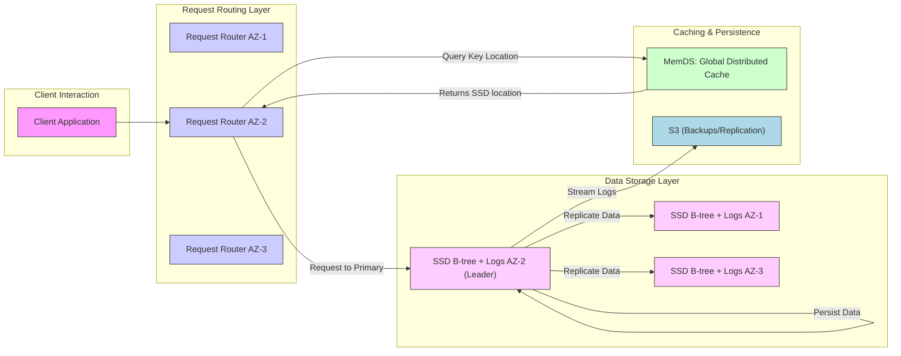

# Amazon Dynamodb： A Scalable, Predictably Performant, And Fully Managed Nosql Database Service (1080P25) - Part 1

_screenshots/frame_00-00-00.jpg)
_screenshots/frame_00-00-13.jpg)

## Amazon DynamoDB: An Overview

Amazon DynamoDB, a prominent **NoSQL data store**, is a highly scalable and performant database service, detailed in a 2022 whitepaper. It boasts over 1 million customers and handles an impressive 79.8 million requests per second during peak loads, totaling roughly 10 trillion requests daily.

Its significant popularity stems from several key advantages:
*   **Ease of Setup**: Simplifies the process of deploying and configuring a database.
*   **Auto-scaling**: Automatically adjusts its capacity to meet varying demand, removing the need for manual resource management.
*   **Massive Data Storage**: Capable of storing petabytes of data, even for individual clients, demonstrating its immense scalability.

_screenshots/frame_00-00-39.jpg)

### Core Guarantees and Characteristics of DynamoDB

DynamoDB differentiates itself from many traditional NoSQL databases by offering robust consistency and transactional guarantees, alongside a strong focus on predictable performance:

1.  **ACID Transactions**:
    *   Contrary to the common perception that NoSQL databases sacrifice ACID properties for scalability, DynamoDB provides full **ACID (Atomicity, Consistency, Isolation, Durability)** guarantees.
    *   Specifically, the **Isolation (I)** property ensures **Serializable** transactions. This means that concurrent transactions execute as if they were processed one after another in some serial order, preventing anomalies and ensuring data integrity.

2.  **Flexible Consistency Models**:
    *   DynamoDB offers a choice between two consistency models, allowing developers to optimize for either immediate consistency or higher availability/lower latency:
        *   **Eventual Consistency**: After a write, reads might temporarily return stale data, but the data will eventually become consistent across all replicas. This model prioritizes availability and low latency.
        *   **Strong Consistency**: Reads always return the most recent committed data. This ensures immediate data consistency but might introduce slightly higher latency or reduced availability during network partitions or failures.

3.  **Predictable Performance (Low Variance)**:
    *   A hallmark of Amazon's engineering culture, and a key characteristic of DynamoDB, is its emphasis on **consistent and predictable performance**, particularly regarding latency.
    *   Instead of optimizing solely for the lowest possible latency (which can often lead to high variance), DynamoDB aims for a **stable and predictable latency profile**. For example, if an operation typically takes 5 seconds, it will consistently take around 5 seconds, rather than fluctuating wildly between 10 milliseconds and 10 seconds.
    *   **Benefit**: This predictability is crucial for user experience and system reliability, as high variance (or "jitter") can be more disruptive to applications and users than a consistently higher, but predictable, response time.

### DynamoDB Request Flow Architecture

DynamoDB's architecture is designed with clear separation of concerns to ensure efficient, reliable, and highly available request processing.

_screenshots/frame_00-01-18.jpg)

The process of a client request in DynamoDB typically follows these steps:

1.  **Client Initiation**:
    *   A client application sends a read or write request for a specific data key.

2.  **Request Router**:
    *   The request first arrives at a **Request Router**. These routers are responsible for directing traffic and load balancing.
    *   **Concern Separation**: This layer isolates the concerns of request routing and load balancing from the core data storage, contributing to the system's modularity and robustness.
    *   **Availability Zone (AZ) Awareness**: While Request Routers and storage nodes often reside within the same Availability Zone for optimal performance, a Request Router can intelligently forward a request to a primary data node located in a different AZ if the key's primary replica resides there. The goal is to minimize cross-AZ communication where possible.

3.  **MemDS (Global Distributed Cache)**:
    *   Before forwarding the request to a storage node, the Request Router queries **MemDS**, a global distributed cache.
    *   **Purpose**: MemDS acts as a lookup service, quickly identifying which Solid State Drives (SSDs) currently hold the data for the requested key, including the location of the primary replica.

4.  **Primary Data Node (SSD Leader)**:
    *   Based on information from MemDS, the Request Router sends the request to the designated **primary data node** (also known as the leader) for that specific key.
    *   **Data Persistence**: The primary node is responsible for writing the data to its local SSD storage.
    *   **Replication**: After persisting the data, the primary node then replicates this data to other replica nodes associated with that key across different Availability Zones. This replication ensures high availability and durability, meaning data remains accessible and safe even if one node or AZ fails.

5.  **S3 Integration (for Backups and Disaster Recovery)**:
    *   In parallel with data being stored and replicated on SSDs, a continuous stream of transaction logs from the primary data nodes is sent to **Amazon S3 (Simple Storage Service)**.
    *   **Benefits**: This streaming log mechanism provides critical capabilities for:
        *   **Backups**: Enabling point-in-time recovery and snapshot creation, allowing data to be restored to any previous state.
        *   **Disaster Recovery**: Offering an additional layer of data durability and resilience against catastrophic failures by ensuring data is safely stored off-instance.

This sophisticated architecture underpins DynamoDB's ability to deliver high availability, strong durability, and consistently predictable performance at massive scale.

---

### DynamoDB Streams: Change Data Capture and Indexing

_screenshots/frame_00-04-07.jpg)
_screenshots/frame_00-04-20.jpg)
_screenshots/frame_00-06-49.jpg)
_screenshots/frame_00-07-39.jpg)

DynamoDB utilizes **DynamoDB Streams** to provide a real-time, ordered flow of item-level changes in a table. This is a powerful feature serving multiple purposes:

*   **Change Data Capture (CDC)**: Streams act as a continuous log of all modifications (inserts, updates, deletes) to data in DynamoDB tables. Clients can subscribe to these streams to consume these data changes as they happen.
*   **Data Streaming**: The logs can be easily streamed, enabling integration with other services for various use cases like analytics, auditing, or triggering serverless functions (e.g., AWS Lambda).
*   **Eventually Consistent Indexing**: Streams are particularly well-suited for building and maintaining **Global Secondary Indexes (GSIs)**.
    *   When an item in the main table changes, that change is captured in the stream.
    *   A separate process (often a Lambda function triggered by the stream) reads these changes and updates the GSI accordingly.
    *   Since the updates to the GSI occur asynchronously via the stream, GSIs are inherently **eventually consistent**. This means there might be a slight delay between a write to the main table and the corresponding update appearing in the GSI.
    *   **Example**: If you need to query users by `department ID`, and `department ID` is not your table's primary key, you can create a GSI on `department ID`. DynamoDB Streams ensure that this GSI stays synchronized with the main table's data, allowing efficient queries based on this attribute.

### Read Consistency Models in Detail

DynamoDB offers flexibility in how clients read data, specifically concerning consistency after a write operation. This choice impacts performance and data freshness.

Consider a scenario where a client sends a `put` request to update data for a key. This request first goes to the Request Router, which directs it to the primary (leader) SSD. The primary persists the data and then initiates replication to its replicas.

| Feature           | Strong Consistency (Get Operation)                 | Eventual Consistency (Get Operation)                  |
| :---------------- | :------------------------------------------------- | :---------------------------------------------------- |
| **Read Source**   | Request Router **always** sends read requests to the **primary (leader) replica**. | Request Router **may** send read requests to **any replica** (primary or secondary) for load balancing. |
| **Data Freshness**| **Guaranteed** to return the most recent committed data. Since all writes go to the primary, a read from the primary will always reflect the latest state. | **May return stale or slightly old data**. If the read request hits a replica before it has received the latest update from the primary, it will return the older data. |
| **Example Scenario**| After a `put` request, a strongly consistent `get` will immediately reflect the new data. | After a `put` request, an eventually consistent `get` might still return the old data if replication hasn't completed to the replica it queries. It's even possible to read data that was just "deleted" if the tombstone (deletion marker) hasn't propagated. |
| **Latency**       | Potentially higher, as it requires interaction with the specific primary node. | Potentially lower, as it can be routed to the nearest or least loaded replica. |
| **Use Case**      | Critical operations where immediate data accuracy is paramount (e.g., bank transactions, user login status). | High-read throughput scenarios where slight delays in consistency are acceptable (e.g., social media feeds, product recommendations). |

### Leader Election and Replica Architectures

The selection of the primary (leader) node for a specific key is crucial for managing writes and ensuring consistency.

*   **Leader Election Algorithm**: DynamoDB uses **Multi-Paxos** for leader election. Multi-Paxos is a distributed consensus algorithm, a variation of Paxos, designed to reliably elect a leader and ensure agreement among nodes in a distributed system, even in the presence of failures.

*   **Leader Node Characteristics**:
    *   The leader node for a key is responsible for all write operations for that key.
    *   It maintains a **B-tree** index on its SSD. A B-tree is a self-balancing tree data structure that keeps data sorted and allows for efficient searches, sequential access, insertions, and deletions. This structure enables fast lookups and range queries.

*   **Replica Node Characteristics**:
    *   Not all replicas are required to maintain a full B-tree (a "materialized view" of the data).
    *   Some replicas may primarily store **logs** of changes.
    *   **Trade-offs in Replica Design**:
        *   **Replicas with B-trees**: Ideal for handling read requests efficiently, as they have a readily indexed copy of the data.
        *   **Replicas with Logs Only**: These replicas are sufficient for ensuring **high durability and persistence** of data, as they hold the complete history of changes. However, reading directly from a logs-only replica would be inefficient (potentially O(N) complexity to reconstruct the data from logs), making them unsuitable for direct read serving.
        *   **Benefit of Logs-Only Replicas**: By having some replicas focus only on logs, DynamoDB reduces the computational load on these nodes, which in turn **improves overall write throughput** for the primary, as replication can be less resource-intensive.

### Log Propagation and Formal Verification

The integrity and reliable propagation of transaction logs are fundamental to DynamoDB's replication and data consistency.

*   **Log Propagation to Streams**: The logs generated by primary nodes are propagated directly to the **DynamoDB Streams service**. This ensures that all data changes are captured and made available for various downstream processes, including replication to other database instances.
*   **Criticality for Replication**: These change logs are the backbone of DynamoDB's internal database replication mechanism. Without reliable log propagation, data consistency across replicas and Availability Zones would be compromised.
*   **Formal Verification with TLA+**: To guarantee the correctness and reliability of their change propagation and replication logic, Amazon engineers use **TLA+ (Temporal Logic of Actions)**.
    *   TLA+ is a formal specification language used for designing, modeling, and verifying concurrent and distributed systems.
    *   By using TLA+, DynamoDB's engineers can mathematically prove that their replication protocols behave as expected under all possible conditions, including failures, ensuring that data changes are indeed propagated correctly and consistently throughout the system.

### The Complexity of MemDS Cache

While appearing as a simple component in the high-level design, the **MemDS** (Global Distributed Cache) is exceptionally complex due to its critical role in the system.

*   **Critical Path Component**: MemDS is in the **critical path** of virtually every read and write request. This means that any latency, instability, or error in MemDS directly impacts the performance and reliability of every operation in DynamoDB.
*   **Challenge**: Designing a global, distributed cache that can handle trillions of requests daily with single-digit millisecond latency and high availability, while also providing accurate metadata (like key locations on SSDs), presents significant engineering challenges. Its complexity lies in ensuring extreme performance, consistency, and fault tolerance across a massive distributed environment.

---

### The Criticality and Unique Management of MemDS Cache

_screenshots/frame_00-08-04.jpg)
_screenshots/frame_00-08-26.jpg)

The **MemDS** global distributed cache plays a pivotal role in DynamoDB's performance, as it's the first point of contact for Request Routers seeking data locations (primary and replicas). Its efficiency directly impacts overall system responsiveness.

*   **High Cache Hit Rate**: Ideally, MemDS maintains an extremely high hit rate, often around **99.7%**. This means that for almost all requests, the necessary metadata (where to find the data) is available directly from the cache, allowing for very fast processing (e.g., 1 millisecond).
*   **The Problem of Cache Cold Starts/Failures**:
    *   If the cache fails or is undergoing repopulation (a "cold cache"), its hit rate can drop dramatically, potentially to 0%.
    *   **Impact**: This transition is catastrophic. If 997 out of 1000 requests previously took 1ms due to cache hits, and suddenly all 1000 requests miss the cache and must query the underlying data store (e.g., taking 10ms), the average latency skyrockets.
    *   **System Overload**: This sudden increase in latency reduces the system's effective throughput by a factor of 10 (e.g., from handling 1000 requests in ~1ms to 1000 requests in ~10ms). The Request Routers become overwhelmed, and the entire request path slows down, potentially leading to system instability or outages. This unpredictable behavior (high variance) is precisely what Amazon aims to avoid.

*   **Amazon's "Insane" Cache Management Strategy**:
    *   To combat the "cold cache" problem and reduce performance variance, AWS employs a counter-intuitive strategy: **clients (or rather, the cache layer itself) continuously query the database (DB) from time to time, even if the data is already in the cache.**
    *   **Why?**: This seemingly inefficient approach ensures that the cache is always "warm" and performing work, even during periods of low demand or when it has a high hit rate.
    *   **Benefits**:
        *   **Predictable Load**: By ensuring the cache always performs a baseline level of work, its operational characteristics become more predictable. You're proactively "stressing" the cache in a controlled manner.
        *   **Accurate Monitoring and Scaling**: This consistent workload allows AWS to monitor the cache's performance accurately. If the cache starts slowing down (even slightly), it's a clear signal to scale up by adding more servers.
        *   **Avoiding "Shock" Scaling**: Instead of suddenly needing to provision 20 servers after a cache crash (which would be slow and disruptive), the system can gradually scale up its cache capacity based on observed, consistent load. This prevents sudden spikes in resource demand that are hard to meet quickly.
        *   **Reduced Variance**: The ultimate goal is to reduce performance variance. By proactively managing cache load, DynamoDB can maintain a more consistent response time, embodying Amazon's cultural bias towards highly reliable and predictable systems.

### DynamoDB Data Schema: Partition Key and Sort Key

_screenshots/frame_00-09-09.jpg)
_screenshots/frame_00-11-20.jpg)

DynamoDB uses a simple yet powerful schema model centered around two primary key components: the **Partition Key** and the optional **Sort Key**. Together, they form the **Primary Key** for a table, uniquely identifying each item.

1.  **Partition Key (Hash Key)**:
    *   **Purpose**: The partition key is used to **horizontally scale** data across multiple physical partitions (storage nodes) within DynamoDB.
    *   **Mechanism**: When you `put` or `get` data, DynamoDB uses a **hash function** on the partition key value to determine which physical partition the data belongs to. This is analogous to how a hash map distributes data across buckets.
    *   **Uniqueness**: All items with the same partition key are stored together on the same partition. To uniquely identify an item in a simple primary key table (only a partition key), the partition key value itself must be unique.
    *   **Scalability**: By hashing, DynamoDB can distribute data evenly across thousands of partitions, enabling massive scalability and parallel processing of requests.

2.  **Sort Key (Range Key)**:
    *   **Purpose**: The sort key is an **optional** component of the primary key. When combined with a partition key, it forms a **composite primary key**.
    *   **Mechanism**: Within each partition, items that share the same partition key are stored in **sorted order** based on their sort key value. This is similar to how an index works in a relational database.
    *   **Benefits**:
        *   **Unique Item Identification**: The combination of partition key and sort key must be unique for each item. This allows multiple items to share the same partition key, as long as they have different sort key values.
        *   **Efficient Searches (Binary Search)**: Because data within a partition is sorted by the sort key, finding specific items or a range of items becomes highly efficient, leveraging binary search principles.
        *   **Efficient Range Queries**: You can easily query for items that fall within a specific range of sort key values for a given partition key. For example, "get all orders for customer X placed between date A and date B."
        *   **Flexible Access Patterns**: The sort key allows for more complex query patterns beyond simple key-value lookups, enabling powerful data retrieval for use cases requiring ordered data.

---

### Primary Key: Combining Partition and Sort Keys

_screenshots/frame_00-11-33.jpg)

In DynamoDB, the **Primary Key** uniquely identifies each item in a table. It is composed of either a **Partition Key** alone or a combination of a **Partition Key** and a **Sort Key**.

*   **Composite Primary Key**: When both a Partition Key and a Sort Key are defined, their combined values form the unique primary key for an item. This allows multiple items to share the same Partition Key, as long as they have unique Sort Key values.

#### Data Modeling Examples with Partition and Sort Keys

Effective data modeling in DynamoDB often involves choosing Partition and Sort keys that align with your application's most frequent access patterns.

1.  **Example: Reddit Posts Table**
    *   **Scenario**: Storing Reddit posts where you want to retrieve posts by a specific ID or within a time range.
    *   **Design**:
        *   **Partition Key**: `Post ID` (e.g., `post_123`, `post_456`)
        *   **Sort Key**: `Timestamp` (e.g., `2023-10-27T10:00:00Z`)
    *   **Access Patterns Supported**:
        *   **Retrieve a specific post**: `GetItem` using `Post ID` (Partition Key).
        *   **Find all posts in the last seven days for a specific `Post ID` prefix (e.g., posts from India if `Post ID` is prefixed with `India_`)**: You can query a specific partition (identified by the `Post ID` prefix) and then use the `Timestamp` Sort Key to retrieve items within a time range. This leverages the sorted nature of the Sort Key.

2.  **Example: User's Latest Posts**
    *   **Scenario**: Finding the latest posts made by a specific user.
    *   **Design**:
        *   **Partition Key**: `User ID` (e.g., `user_6`)
        *   **Sort Key**: `Timestamp` (e.g., `2023-10-27T10:00:00Z`)
    *   **Access Patterns Supported**:
        *   **Get posts by a user within a time range**: Query the partition for `user_6` and specify a range for `Timestamp` (e.g., `Timestamp` between `60` and `90` seconds from an epoch). This efficiently retrieves posts for a specific user within a time window.
    *   **Composite Key as Partition Key**: In some advanced patterns, you might combine attributes into a single Partition Key to support specific queries. For instance, `User ID + Post ID` as a composite Partition Key could quickly locate a specific post by a specific user. This emphasizes modeling your keys around how you intend to query the data.

### Secondary Indexes: Local and Global

DynamoDB allows you to create secondary indexes to support more diverse and efficient query patterns beyond what the primary key alone can provide.

#### 1. Local Secondary Index (LSI)

*   **Definition**: An LSI has the **same Partition Key** as the base table, but a **different Sort Key**.
*   **Storage**: LSIs are stored **locally** within the same physical partition as the base table data.
*   **Consistency**: LSIs are **strongly consistent**. When you write data to the base table, the corresponding LSI is updated synchronously, ensuring immediate consistency.
*   **Limitations**:
    *   You can create up to **20 Local Secondary Indexes** per table.
    *   LSIs do not support `Query` operations that span multiple partition key values. You must specify a single partition key for your query.
*   **Use Case Example**:
    *   **Base Table**: `User ID` (PK), `Timestamp` (SK), `Post Content`
    *   **LSI**: `User ID` (PK), `Like Count` (SK), `Post Content`
    *   This LSI allows you to efficiently query for a user's posts sorted by `Like Count` (e.g., "get my most popular posts"), whereas the base table would sort by `Timestamp`.

#### 2. Global Secondary Index (GSI)

_screenshots/frame_00-14-43.jpg)

*   **Definition**: A GSI can have a **different Partition Key** (and optionally a different Sort Key) than the base table. It provides an entirely new access path to your data.
*   **Storage**: A GSI is a **separate, independent table** that duplicates data from the base table. It has its own partitions and capacity.
*   **Consistency**: GSIs are **eventually consistent**. Changes to the base table are propagated to the GSI asynchronously via DynamoDB Streams. This means there might be a slight delay before updates appear in the GSI.
*   **Use Case Example**:
    *   **Base Table (User Posts)**: `User ID` (PK), `Post ID` (SK), `Post Content`
    *   **GSI (Post Comments)**:
        *   **Partition Key**: `Post ID` (e.g., `post_abc`)
        *   **Sort Key**: `Comment Timestamp` (e.g., `2023-10-27T10:05:00Z`)
    *   This GSI allows you to quickly fetch all comments for a specific post, sorted by time, which would be inefficient using the original `User ID` based primary key.

#### Single Table Design and Denormalization

DynamoDB's design philosophy encourages a "single table design" approach for many applications.

*   **Core Principle**: Instead of creating multiple tables for different entities (like in relational databases), you aim to store all related data for an application within a single DynamoDB table.
*   **Why?**:
    *   **Embracing Key-Value Thinking**: It forces developers to model data around access patterns using partition and sort keys, rather than relational schemas.
    *   **Avoiding Joins**: DynamoDB is optimized for fast key-value lookups and range queries, but it does **not support joins** between tables. To compensate, denormalization and data duplication are often employed.
    *   **Denormalization**: Data is intentionally duplicated across different items or indexes to ensure that all necessary information for a specific query can be retrieved with a single read operation, without needing to perform joins or multiple lookups.
*   **Caveat**: While single table design can be highly efficient for specific access patterns, it requires careful planning to ensure all required queries are supported. Global Secondary Indexes are crucial for enabling diverse access patterns on a single table.

### Capacity Booking: Read and Write Capacity Units (RCUs/WCUs)

_screenshots/frame_00-12-56.jpg)

DynamoDB operates on a concept of **provisioned throughput**, allowing users to specify the amount of read and write capacity they need. This translates to a clear pricing model where you **pay only for what you provision**, rather than for entire database nodes.

*   **Read Capacity Unit (RCU)**:
    *   One RCU represents one strongly consistent read per second for an item up to **4 KB** in size.
    *   For eventually consistent reads, one RCU provides two reads per second for an item up to 4 KB.
    *   **Example**: If your application needs to read a 4KB item (or less) once every second using strong consistency, you would provision 1 RCU. If it needs to read a 10KB item strongly consistently once per second, it would consume 3 RCUs (since 10KB falls into the 8-12KB band, requiring 3 units of 4KB capacity).

*   **Write Capacity Unit (WCU)**:
    *   One WCU represents one write per second for an item up to **1 KB** in size.
    *   **Example**: If your application needs to write a 1KB item (or less) once every second, you would provision 1 WCU. If it needs to write a 2.5KB item, it would consume 3 WCUs.

*   **Benefits of Capacity Booking**:
    *   **Predictable Performance**: By provisioning capacity, you essentially reserve a guaranteed amount of I/O operations, leading to highly predictable performance and latency for your workloads.
    *   **Cost Efficiency**: You only pay for the throughput you configure, allowing for fine-grained cost control. You don't pay for idle server resources.
    *   **Scalability**: DynamoDB automatically scales the underlying infrastructure (nodes, partitions) to meet your provisioned capacity, abstracting away complex operational tasks like sharding and cluster management.

This capacity model ensures that DynamoDB can provide consistent, low-latency performance at scale while offering a transparent and predictable cost structure.

---

### Capacity Management: Sharing and Throttling

_screenshots/frame_00-15-19.jpg)
_screenshots/frame_00-15-32.jpg)

DynamoDB's capacity model allows multiple customers to share the same underlying physical infrastructure (nodes/partitions). This multi-tenancy requires careful management to ensure fair resource allocation and prevent one customer's high demand from negatively impacting others.

*   **Shared Resources**: A single physical database node or partition in DynamoDB can host data and serve requests for hundreds of different customers.
*   **Provisioned Capacity**: Each customer provisions a specific amount of Read Capacity Units (RCUs) and Write Capacity Units (WCUs) for their tables.
    *   **1 RCU**: Allows for one strongly consistent read per second of an item up to 4 KB.
    *   **1 WCU**: Allows for one write per second of an item up to 1 KB.
*   **The Throttling Problem**:
    *   If a customer provisions, say, 1 RCU but attempts to consume 100 RCUs, this excessive usage could overwhelm the shared node and impact other customers.
    *   **Solution**: To maintain fairness and overall system stability, DynamoDB implements **throttling**. Instead of slowing down everyone, it throttles (rejects or delays) requests specifically from the customer who is exceeding their provisioned capacity. While necessary for the system, throttling can be frustrating for the customer.

### Burst Capacity with Token Bucket Algorithm

_screenshots/frame_00-17-38.jpg)
_screenshots/frame_00-18-16.jpg)

To provide a better customer experience and accommodate fluctuating workloads without forcing customers to over-provision, DynamoDB incorporates a **Token Bucket algorithm** for burst capacity. This allows customers to temporarily exceed their provisioned throughput.

*   **Addressing Customer Frustration**: Workloads often have peak times (e.g., lunchtime traffic for a food delivery app like Zomato). If Zomato provisions 500 RCUs for peak hours but only uses 200 RCUs during off-peak times, they are effectively wasting 300 RCUs for most of the day. Manually scaling capacity up and down is cumbersome.
*   **How the Token Bucket Works**:
    1.  **Token Accumulation**: For every RCU or WCU you provision, DynamoDB continuously adds "tokens" to a virtual bucket at that rate. For example, if you provision 200 RCUs, 200 read tokens are added to your bucket every second.
    2.  **Burst Capacity**: The bucket has a maximum capacity, allowing it to store up to **5 minutes** worth of accumulated, unused capacity.
        *   **Calculation Example**: If you provision 200 RCUs, your bucket can store `200 RCUs/second * 5 minutes * 60 seconds/minute = 60,000` read tokens.
    3.  **Consumption**: During periods of high demand (bursts), your application can consume tokens from this bucket at a rate much higher than your provisioned capacity, as long as there are tokens available.
        *   **Example**: During Zomato's lunch rush, instead of being limited to 200 reads per second, they can burst up to 60,000 reads (consuming saved tokens) until the bucket is empty.
*   **Benefits**:
    *   **Flexibility**: Accommodates natural fluctuations in traffic without requiring manual scaling or constant over-provisioning.
    *   **Cost Efficiency**: Customers effectively "save" unused capacity from quieter periods and can "spend" it during peak times, leading to more efficient use of their paid capacity.
    *   **Improved User Experience**: Reduces throttling incidents, leading to more consistent application performance and satisfied customers.

### Internal Challenges of Burst Capacity

While beneficial for customers, providing burst capacity introduces significant challenges for AWS's internal infrastructure management:

*   **Dynamic Resource Allocation**: AWS must dynamically find and allocate available capacity across its physical nodes and replicas to support these bursts, often beyond a single replica's immediate provisioned rate.
*   **Fair Distribution Across Replicas**:
    *   For a given partition (and its replicas), the total provisioned capacity (e.g., 100 RCUs * 3 replicas = 300 RCUs for the partition's data) must be managed across them.
    *   DynamoDB allows for uneven load distribution during bursts. For example, if a partition has 3 replicas, and the total RCU for that partition is 300, one replica might temporarily handle 200 RCUs while the others handle 50 RCUs each, as long as the total 300 RCU capacity for that partition is not exceeded.
    *   This requires sophisticated load balancing and data distribution algorithms to ensure that no single replica becomes a bottleneck or gets unfairly overloaded, even when customers are bursting.
*   **Predictable Performance with Bursting**: The core Amazon principle of low variance and predictable performance becomes even harder to maintain when allowing unpredictable bursts. AWS's system must be intelligent enough to absorb these bursts without impacting the consistent performance guarantee for all other customers.

---

### Distributed Burst Capacity and No Throttling

_screenshots/frame_00-19-19.jpg)

DynamoDB's burst capacity mechanism (Token Bucket) extends beyond individual nodes to encompass the entire partition and its replicas, offering even greater flexibility and reducing throttling incidents.

*   **Global vs. Local Throttling**:
    *   While a single physical node or replica might have a theoretical capacity, DynamoDB's throttling is primarily based on the **total provisioned capacity** for a given partition (which is distributed across its replicas).
    *   **Example**: If a partition has three replicas, and you've provisioned 100 RCUs for that partition, the total available capacity across these replicas is effectively 300 RCUs (100 RCUs per replica).
    *   During a burst, if one replica temporarily handles 200 RCUs while the other two handle 50 RCUs each (totaling 300 RCUs), this is allowed. No throttling occurs **as long as the global consumption across all replicas for that partition, including any burst tokens, does not exceed the overall provisioned and available capacity.**
*   **Customer Benefit**: This distributed burst allowance means customers are less likely to experience throttling due to "hot spots" on individual replicas, as long as their overall usage remains within their booked capacity and accumulated burst allowance. This significantly enhances the perceived fairness and reliability of the service.

### Conclusion: The DynamoDB Philosophy

Amazon DynamoDB stands out as a unique and powerful distributed database system, often described as "contrarian" due to its distinct approach compared to many other NoSQL solutions.

*   **Key Differentiators and Strengths**:
    *   **ACID Transactions in NoSQL**: It provides full ACID guarantees, including serializable isolation, which is uncommon for NoSQL databases that often prioritize availability and partition tolerance over strict consistency.
    *   **Flexible Consistency (Strong & Eventual)**: Offers developers the choice between immediate strong consistency and eventual consistency, allowing them to optimize for their specific application needs.
    *   **Predictable Performance**: A cornerstone of Amazon's philosophy, DynamoDB is engineered for consistent and predictable performance with low variance in latency. This reliability is highly valued by large-scale applications.
    *   **Ease of Use and Auto-scaling**: Its fully managed nature, simplified setup, and automatic scaling capabilities significantly reduce operational overhead for customers.
    *   **Customer-Centric Capacity Management**: Features like burst capacity (via the Token Bucket algorithm) demonstrate a commitment to customer satisfaction by accommodating fluctuating workloads and minimizing frustrating throttling events.
    *   **Robust Architecture**: Underpinned by sophisticated distributed systems concepts like Multi-Paxos for leader election, DynamoDB Streams for change data capture, and formal verification (TLA+) for correctness, ensuring high durability and reliability.
    *   **Optimized for Key-Value Access**: Its schema design (Partition Key and Sort Key) and single-table design philosophy encourage efficient data modeling for high-throughput, low-latency key-value access patterns.

DynamoDB's success and widespread adoption are largely attributed to its ability to deliver high performance and massive scalability while maintaining enterprise-grade reliability and predictability, aligning perfectly with Amazon's engineering culture of building "boring systems" that simply work, consistently.

---

