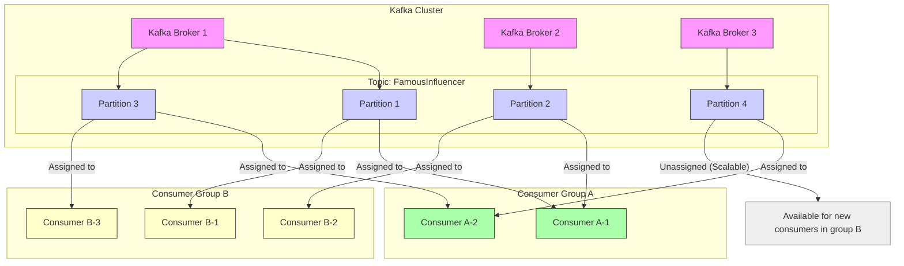

# Apache Kafka： A Distributed Messaging System For Log Processing (1080P25) - Part 1

# Apache Kafka: An Introduction to Distributed Event Streaming

_screenshots/frame_00-00-55.jpg)

Apache Kafka is a highly popular and extremely scalable distributed streaming platform, originally developed at LinkedIn in 2011. Its widespread adoption is largely due to its open-source nature and robust capabilities in handling high-throughput, fault-tolerant data streams.

## Core Functionalities and Use Cases

Kafka primarily serves two major use cases:

### 1. Message Queue (Publisher-Subscriber System)

Kafka acts as a powerful message queue, facilitating communication between **publishers** (producers) and **subscribers** (consumers).

*   **Concept**: Publishers send messages to Kafka, and subscribers receive messages from Kafka. This decouples the senders from the receivers, meaning they don't need to know about each other directly.
*   **Analogy (Instagram)**: Imagine Instagram needing to deliver a new post from a celebrity like Brad Pitt to millions of his followers.
    *   Broadcasting such a message directly to millions of individual followers is a complex and challenging task for a single application to scale reliably.
    *   Kafka provides a robust, reliable, and scalable solution for managing this massive fan-out of messages. It ensures messages are delivered efficiently and reliably, even to a vast audience, without the publisher needing to manage each follower's connection.

### 2. Event Streaming

Kafka excels at capturing, transporting, and processing continuous streams of events from various sources to different destinations. This makes it ideal for building event-driven architectures.

*   **Concept**: Instead of just sending isolated messages, Kafka treats data as a continuous, immutable log of events. Each action or change is recorded as an event.
*   **Analogy (Facebook Profile Updates)**:
    _screenshots/frame_00-01-27.jpg)
    Consider a user updating their Facebook profile:
    1.  Adding a profile picture (Event 1)
    2.  Updating their address (Event 2)
    3.  Adding their email address (Event 3)
    *   These are distinct, sequential events. Kafka can store this "event log."
    *   **Benefit**: If you need to replicate or recreate the state of a data store (e.g., for disaster recovery, analytics, or setting up a new service), you don't need to copy the entire database. You can simply "replay" the entire sequence of events from the Kafka event log into a new data store. This guarantees that the final state of the new data store will be identical to the original, ensuring data consistency across systems.

## Kafka's Core Components

_screenshots/frame_00-01-48.jpg)

Kafka is comprised of several key components that work together to enable its distributed streaming capabilities. The primary components discussed here are **Producers**, **Topics**, and **Partitions**. (Further components like Brokers and Consumers will be discussed later).

### 1. Producers

*   **Role**: Producers are client applications responsible for generating and sending messages (events) to Kafka. They are the "source" of data.
*   **Interaction**: Producers use Kafka client libraries to publish messages to specific **topics**.
*   **Analogy**: Think of producers as applications or services that generate data, like an IoT device sending sensor readings, a website logging user clicks, or a financial system processing transactions.

### 2. Topics

*   **Role**: A **topic** is a category name or feed name to which messages are published. It's a logical grouping of related messages. All messages related to a specific type of event (e.g., "user_signups", "order_updates") are published to a designated topic.
*   **Analogy**: Imagine a topic as a specific channel on a TV. Producers publish to a channel, and consumers "tune into" that channel to receive broadcasts.

### 3. Partitions

*   **Role**: Topics are divided into multiple **partitions**. Each partition is an ordered, immutable sequence of messages. Messages are appended to the end of a partition log.
*   **Scalability**: Partitions allow a topic to be distributed across multiple Kafka brokers (servers), enabling parallel processing and horizontal scalability. More partitions mean more concurrent read/write operations.
*   **Order Guarantee**: Messages within a *single partition* are guaranteed to be ordered. This means if a producer sends Message A, then Message B, to the *same partition*, Message A will always appear before Message B in that partition's log, and consumers will read them in that order.
*   **Retention**: Messages in partitions are retained for a configurable period (e.g., two weeks or longer). This allows consumers to read messages at their own pace, catch up if they fall behind, or even re-read past messages for historical analysis or reprocessing.

## Why a Centralized System (Kafka Brokers)?

A common question arises: why not have producers send messages directly to consumers, bypassing a system like Kafka (brokers)? While seemingly simpler, this direct approach has significant drawbacks:

| Feature           | Direct Producer-Consumer (Without Kafka)                                      | Kafka-Mediated System (With Kafka)                                                              |
| :---------------- | :---------------------------------------------------------------------------- | :------------------------------------------------------------------------------------------------ |
| **Scalability**   | **Poor**: Producers must manage connections to all potential consumers. Adding/removing consumers is complex. High fan-out (like Instagram example) is difficult. | **Excellent**: Producers write quickly to Kafka, which handles distribution. Scales horizontally by adding brokers and partitions. |
| **Asynchronicity** | **Limited**: Producers often wait for consumers, or must implement complex async logic to avoid blocking.                                     | **High**: Producers write to Kafka and can continue their application logic immediately. Kafka buffers messages for consumers, decoupling their speeds. |
| **Isolation of Concerns** | **Low**: Producers must handle message delivery, retry logic, persistence, and consumer management. | **High**: Kafka abstracts away message delivery, persistence, fault tolerance, and consumer tracking, allowing producers to focus solely on generating data. |
| **Code Duplication** | **High**: Each producer application needs to implement its own logic for message persistence, retries, and error handling. | **Low**: Persistence, retries, and delivery guarantees are centralized within Kafka, reducing redundant code across applications. |
| **Reliability**   | **Challenging**: Ensuring messages are not lost and delivered reliably to all consumers is complex to implement and maintain in each application. | **High**: Kafka provides strong durability guarantees, replication, and fault tolerance, ensuring messages are not lost even if a server fails. |
| **Engineering Cost** | **High**: Significant engineering effort to build and maintain custom messaging solutions within each application. | **Lower**: Leverages a battle-tested, open-source system, saving development time and operational overhead. |

```mermaid
graph TD
    subgraph Without Kafka (Less Scalable)
        P1_direct[Producer 1] --> C1_direct[Consumer 1]
        P1_direct --> C2_direct[Consumer 2]
        P2_direct[Producer 2] --> C1_direct
        P2_direct --> C2_direct
        P1_direct -- "Manages Retries, Persistence, Consumer State" --> P1_direct
        P2_direct -- "Manages Retries, Persistence, Consumer State" --> P2_direct
    end

    subgraph With Kafka (Highly Scalable)
        P_Kafka[Producer] --> Kafka[Kafka Brokers]
        Kafka --> T1[Topic A]
        Kafka --> T2[Topic B]
        T1 --> P1_A[Partition 1A]
        T1 --> P2_A[Partition 2A]
        T2 --> P1_B[Partition 1B]
        P1_A --> C_Kafka1[Consumer 1]
        P2_A --> C_Kafka2[Consumer 2]
        P1_B --> C_Kafka3[Consumer 3]
    end

    style P1_direct fill:#fcc,stroke:#333,stroke-width:1px
    style P2_direct fill:#fcc,stroke:#333,stroke-width:1px
    style C1_direct fill:#ccf,stroke:#333,stroke-width:1px
    style C2_direct fill:#ccf,stroke:#333,stroke-width:1px
    style P_Kafka fill:#fcc,stroke:#333,stroke-width:1px
    style Kafka fill:#9cf,stroke:#333,stroke-width:1px
    style T1 fill:#afa,stroke:#333,stroke-width:1px
    style T2 fill:#afa,stroke:#333,stroke-width:1px
    style P1_A fill:#ffc,stroke:#333,stroke-width:1px
    style P2_A fill:#ffc,stroke:#333,stroke-width:1px
    style P1_B fill:#ffc,stroke:#333,stroke-width:1px
    style C_Kafka1 fill:#ccf,stroke:#333,stroke-width:1px
    style C_Kafka2 fill:#ccf,stroke:#333,stroke-width:1px
    style C_Kafka3 fill:#ccf,stroke:#333,stroke-width:1px
```

The core intent behind Kafka's architecture is to provide a highly scalable, reliable, and decoupled messaging and event streaming backbone. By centralizing the message handling logic, Kafka allows producers to write messages quickly and asynchronously, offloading the complexities of persistence, retries, and consumer management. This design optimizes for **scalability**, **reliability**, and **developer efficiency**, which would otherwise be duplicated across numerous applications.

## Kafka's Ordering Guarantee

Kafka provides a crucial guarantee regarding message order:

*   **Messages within a single partition are strictly ordered.**
*   This means if a producer sends Message A, then Message B, to the *same partition*, Message A will always appear before Message B in that partition's log, and consumers will read them in that order.
*   **Important Note**: There is **no global ordering guarantee** across different partitions for the same topic. If messages are sent to different partitions, their relative order is not guaranteed. For example, Message A sent to Partition 1 might arrive after Message B sent to Partition 2, even if Message A was sent first.

---

While messages within a single partition maintain strict ordering, it's important to understand that **ordering is not guaranteed across different partitions** for the same topic. This means if messages M1 and M2 are sent to different partitions (e.g., M1 to Partition 1, M2 to Partition 2), it's possible for M2 to be consumed before M1, even if M1 was sent first.

## Kafka Brokers: The Heart of the System

_screenshots/frame_00-03-55.jpg)

*   **Definition**: Topics and their partitions reside within **Kafka Brokers**. A Kafka broker is essentially a Kafka server, a single physical or virtual machine running the Kafka software.
*   **Capacity**: A single Kafka server can host thousands of partitions, managing the storage and serving of messages.
*   **Role**: Brokers are responsible for:
    *   Receiving messages from producers.
    *   Storing messages in topics and their partitions.
    *   Serving messages to consumers.
    *   Replicating partitions for fault tolerance.

### Consumers and the Pull Architecture

*   **Role**: Consumers are client applications that read messages from Kafka topics.
*   **Pull Architecture**: Kafka employs a **pull-based architecture** for consumers. This means consumers actively request or "pull" messages from the Kafka brokers, rather than brokers "pushing" messages to them.
*   **Benefits of Pull**:
    *   **Consumer Control**: Consumers can control the rate at which they consume messages, preventing them from being overwhelmed. They can process messages at their own pace, or even pause and resume consumption.
    *   **Simpler Broker Management**: Kafka brokers are simpler because they don't need to manage complex push logic, backpressure, or keep track of every consumer's processing speed. They simply serve messages upon request.
    *   **Offset Tracking**: Consumers track their progress using **message offsets**. An offset is a unique, sequential ID for each message within a partition. It acts as an index of the last message successfully processed by a consumer from a specific partition. When a consumer restarts, it can resume from its last committed offset, ensuring no messages are missed or reprocessed unnecessarily.

## Scaling Kafka: Horizontal Expansion

As systems grow (e.g., LinkedIn's 7 trillion messages per day), all Kafka components must scale horizontally:

*   **Multiple Producers**: Many applications generate data concurrently.
*   **Multiple Brokers**: To handle increased message throughput and storage, more Kafka servers are added.
*   **Multiple Consumers**: To process messages faster and handle different processing needs, multiple consumer instances or groups are deployed.

This massive scale introduces challenges, particularly around **reliability** and **fault tolerance**. Even a small percentage of server failures (e.g., 0.1% of 7 trillion messages per day means 7 billion potential failures) can be catastrophic without robust automated recovery.

## Ensuring Reliability: Replication and Leader Election

To address failures and ensure high availability, Kafka implements a sophisticated replication mechanism:

### 1. Partition Replication

*   **Concept**: For every partition (e.g., P1 of Topic T1), Kafka maintains multiple identical copies called **replicas** across different brokers. If a partition has 3 replicas, it means the same data exists on 3 different servers.
*   **Fault Tolerance**: If one broker (and thus one replica of a partition) goes down, consumers can seamlessly switch to consuming messages from another available replica. This prevents data loss and maintains service availability.

### 2. The Primary-Replica Model (Leader-Follower)

_screenshots/frame_00-04-30.jpg)
_screenshots/frame_00-06-06.jpg)

To prevent data inconsistencies during writes and ensure strict ordering, Kafka uses a **leader-follower** model for replicas:

*   **Leader Replica**: For each partition, one replica is designated as the **leader**. All **write operations** (messages from producers) for that partition *must* go through its leader replica.
*   **Follower Replicas (Read Replicas)**: The other replicas for that partition are **followers**. They continuously pull messages from the leader replica to stay in sync. While they can serve read requests, their primary role is to replicate data and be ready to become the new leader if needed.
*   **Problem without Leader/Follower (Inconsistency Example)**:
    *   Imagine a producer writing message 4 to Replica A, but then Replica A fails before message 5 is written.
    *   The producer tries to write message 5 to Replica B.
    *   Now, Replica A has (1, 2, 3, 4) and Replica B has (1, 2, 3, 5). They are inconsistent.
    *   If a consumer reads (1, 2, 3, 4) from Replica A, and then Replica A fails, forcing the consumer to switch to Replica B, the consumer will request messages from offset 4. Replica B, however, doesn't have message 4 in its sequence, leading to data inconsistency and a broken stream for the consumer.
*   **Solution with Leader/Follower**: By enforcing that *all writes* go only to the leader, Kafka ensures a single, consistent sequence of messages for a partition. Follower replicas simply copy this sequence, guaranteeing data integrity.

### 3. Leader Election and Apache ZooKeeper

*   **Single Point of Failure (SPOF) Mitigation**: If the leader replica for a partition fails, all write operations for that partition would halt, creating a single point of failure.
*   **Automated Failover**: To prevent this, Kafka automatically promotes one of the follower replicas to become the new leader. This process is called **leader election**.
*   **Role of Apache ZooKeeper**: Apache ZooKeeper is a distributed coordination service that Kafka relies on for managing its cluster state, including:
    *   **Leader Election**: ZooKeeper plays a critical role in facilitating leader elections among replicas when a leader fails. It uses a consensus algorithm like **Paxos** (or a similar protocol) to reliably elect a new leader.
    *   **Cluster Metadata**: ZooKeeper stores metadata about Kafka brokers, topics, partitions, and consumer offsets.
*   **Election Criteria (In-Sync Replicas)**: Only follower replicas that are **in-sync** with the previous leader are eligible to participate in the leader election. An in-sync replica is one that has successfully replicated all messages from the leader within a certain timeframe (e.g., received a message from the leader in the last 10 seconds). This ensures that the newly elected leader has a complete and up-to-date copy of the partition's data, preventing data loss or inconsistencies during failover.

```mermaid
graph TD
    subgraph Producer-Consumer Flow
        Producer_Client[Producer Client] --> Write_Op[Write Operation]
        Write_Op --> Kafka_Leader[Kafka Broker: Partition Leader]
        Kafka_Leader -- "Replicates Messages" --> Kafka_Follower1[Kafka Broker: Partition Follower 1]
        Kafka_Leader -- "Replicates Messages" --> Kafka_Follower2[Kafka Broker: Partition Follower 2]
        Consumer_Client[Consumer Client] --> Pull_Op[Pull Messages (Offset)]
        Pull_Op --> Kafka_Leader
        Pull_Op --> Kafka_Follower1
        Pull_Op --> Kafka_Follower2
    end

    subgraph Leader Election Process
        Kafka_Leader_Fail[Kafka Broker: Partition Leader Fails] --> ZK_Notify[ZooKeeper Notified of Failure]
        ZK_Notify --> ZK_Election[ZooKeeper Initiates Leader Election]
        ZK_Election -- "Candidates: In-Sync Followers Only" --> Kafka_Follower1_IS[Kafka Broker: Follower 1 (In-Sync)]
        ZK_Election -- "Candidates: In-Sync Followers Only" --> Kafka_Follower2_IS[Kafka Broker: Follower 2 (In-Sync)]
        Kafka_Follower1_IS -- "Elected" --> New_Leader[New Partition Leader]
        New_Leader --> Producer_Client
        New_Leader --> Consumer_Client
        Kafka_Follower2_IS -- "Continues as Follower" --> Kafka_Follower2_IS
    end

    style Producer_Client fill:#fcc,stroke:#333,stroke-width:1px
    style Consumer_Client fill:#ccf,stroke:#333,stroke-width:1px
    style Kafka_Leader fill:#afa,stroke:#333,stroke-width:1px
    style Kafka_Follower1 fill:#afa,stroke:#333,stroke-width:1px
    style Kafka_Follower2 fill:#afa,stroke:#333,stroke-width:1px
    style Kafka_Leader_Fail fill:#f9f,stroke:#333,stroke-width:1px
    style ZK_Notify fill:#ffc,stroke:#333,stroke-width:1px
    style ZK_Election fill:#ffc,stroke:#333,stroke-width:1px
    style Kafka_Follower1_IS fill:#afa,stroke:#333,stroke-width:1px
    style Kafka_Follower2_IS fill:#afa,stroke:#333,stroke-width:1px
    style New_Leader fill:#9cf,stroke:#333,stroke-width:1px
```

---

### High Water Mark: Ensuring Data Consistency

_screenshots/frame_00-07-19.jpg)

To further guarantee data consistency and prevent consumers from reading inconsistent or incomplete data during replication, Kafka uses a concept called the **High Water Mark (HWM)**.

*   **Concept**: The High Water Mark is the offset of the last message that has been successfully replicated across *all* in-sync replicas for a given partition.
*   **Consumer Guarantee**: Consumers are only allowed to read messages up to the High Water Mark.
*   **Example**: If message 3 has been written to the leader but has not yet been replicated to all follower replicas, consumers will only be able to see messages up to offset 2. They will wait for message 3 to be fully replicated to all in-sync replicas before it becomes available for consumption.
*   **Benefit**: This mechanism ensures that consumers always read consistent data, even if a leader fails and a new leader is elected. The new leader will have all messages up to the High Water Mark, guaranteeing no data loss or gaps from the consumer's perspective.

## Optimizing Throughput: Message Batching

_screenshots/frame_00-08-32.jpg)

Sending trillions of messages individually, even small ones, creates enormous network overhead and reduces efficiency. Kafka addresses this by supporting **message batching**.

*   **Producer Side Batching**:
    *   Producers don't send messages one by one. Instead, they accumulate multiple messages into a single, larger **batch** (e.g., up to 50 KB in size).
    *   This batch is then sent to the Kafka broker as a single network request.
    *   **Benefit**: Reduces network round-trips, decreases CPU overhead on both producer and broker, and significantly increases overall throughput.
*   **Consumer Side Batching**:
    *   Similarly, consumers don't pull messages one by one. They can request a batch of messages from the broker (e.g., "give me the next 50 KB of messages").
    *   The broker then sends as many messages as possible that fit within that requested size limit.
    *   **Benefit**: Improves consumer efficiency by reducing the number of pull requests and allowing for more efficient processing of data chunks.

This batching strategy is a fundamental aspect of Kafka's high-throughput design, allowing it to handle massive volumes of data efficiently. The Kafka brokers are simplified because they don't need to manage individual message rates; they just manage offsets and serve batches.

## Message Delivery Semantics: Guarantees of Delivery

Kafka offers different guarantees regarding message delivery to consumers, each with its own trade-offs in terms of complexity, performance, and data integrity.

### 1. At Least Once Delivery

*   **Guarantee**: With "at least once" delivery, a message is guaranteed to be delivered to the consumer at least one time. It might be delivered more than once in case of failures or retries.
*   **Common Use Case**: This is Kafka's default and most common guarantee. It's suitable for scenarios where occasional duplicate processing is acceptable or can be handled by the downstream application (e.g., by making operations **idempotent**).
*   **Analogy (Verification Email)**: When you register on a website, you expect to receive a verification email *at least once*. If the first attempt fails, the system retries until it succeeds. You might get two emails if the first delivery was successful but the acknowledgment failed, causing a retry.
*   **How it Works (Consumer Perspective)**:
    1.  A consumer pulls a message (e.g., message with offset `N`).
    2.  The consumer processes the message.
    3.  **After successful processing**, the consumer sends an acknowledgment to Kafka, indicating that it has processed message `N` and Kafka can increment its stored offset for that consumer group and partition to `N+1`.
    4.  **Failure Scenario**: If the consumer processes message `N` successfully but crashes *before* sending the acknowledgment, upon restart, it will request messages from its last *acknowledged* offset (which is still `N-1` or `N`). Kafka will then re-deliver message `N`. This leads to message `N` being processed again (a duplicate).
*   **Offset Storage**: Consumer offsets can be stored either directly in Kafka brokers (recommended) or in ZooKeeper. Storing them in a fault-tolerant distributed system ensures that the consumer's progress is not lost if a broker or consumer instance fails.

### 2. At Most Once Delivery

_screenshots/frame_00-10-07.jpg)

*   **Guarantee**: With "at most once" delivery, a message is guaranteed to be delivered to the consumer at most one time. It might be lost if a failure occurs.
*   **How it Works (Consumer Perspective)**:
    1.  A consumer pulls a message (e.g., message with offset `N`).
    2.  **Immediately upon receiving the message**, the consumer sends an acknowledgment to Kafka, incrementing its offset to `N+1`.
    3.  The consumer then attempts to process message `N`.
    4.  **Failure Scenario**: If the consumer crashes *after* sending the acknowledgment but *before* successfully processing message `N`, message `N` will be considered processed by Kafka (because the offset was incremented), but it was never actually processed by the consumer. This leads to message loss.
*   **Use Case**: This guarantee is suitable for low-priority messages where occasional loss is acceptable and avoiding duplicates is paramount, such as sending non-critical user notifications.

### 3. Exactly Once Delivery

_screenshots/frame_00-10-17.jpg)

*   **Guarantee**: "Exactly once" delivery ensures that each message is processed by the consumer exactly one time, with no duplicates and no omissions. This is the strongest guarantee and the most complex to achieve in a distributed system.
*   **Complexity**: Achieving exactly once semantics is challenging because it requires coordination between producers, Kafka, and consumers to ensure atomicity across distributed operations.
*   **Kafka's Approach**: Kafka implements "exactly once" semantics by combining two key features:
    1.  **Transactions**: Kafka supports atomic writes across multiple partitions and even multiple topics. This means that a group of messages can be published as a single, atomic unit. Either all messages in the transaction are committed and become visible to consumers, or none are. This prevents partial writes or reads.
    2.  **Idempotent Producers**: Producers can be configured to be idempotent, meaning sending the same message multiple times will only result in it being written to Kafka once. This prevents duplicate messages from being written to the log in the first place, even during producer retries.

By leveraging these features, Kafka can ensure that a message is processed exactly once, even in the face of network issues or component failures. This is critical for applications where data integrity and consistent state are absolutely essential (e.g., financial transactions).

---

To achieve exactly once delivery, Kafka leverages a combination of **transactions** and **idempotent producers**, as discussed previously. For distributed transactions involving multiple Kafka brokers, this often necessitates complex coordination mechanisms, such as a **distributed two-phase commit protocol**. While highly reliable, such protocols can be expensive in terms of latency and resource usage.

## Consumer Groups: Scaling Consumption

_screenshots/frame_00-10-39.jpg)

To scale consumption and ensure that messages are processed efficiently without duplication across multiple consumers, Kafka introduces the concept of **Consumer Groups**.

*   **Concept**: A **consumer group** is a logical grouping of multiple consumer instances that work together to consume messages from one or more topics.
*   **Partition Assignment**: Within a consumer group, each partition of a topic is assigned to **exactly one** consumer instance. This assignment is exclusive.
*   **Benefit**:
    *   **No Duplicate Processing**: Since each partition is consumed by only one consumer within the group, messages from that partition are processed exactly once (within the "at least once" or "exactly once" semantics of the overall system). Consumers in the same group will not step on each other's toes by processing the same message.
    *   **Scalability**: If you need to increase processing throughput for a topic, you can add more consumer instances to the same consumer group. Kafka will automatically rebalance the partition assignments among the consumers.
    *   **Fault Tolerance**: If a consumer instance within a group fails, its assigned partitions are automatically reassigned to other active consumers in the same group, ensuring continuous processing.
*   **Analogy (Celebrity Posts)**:
    *   Imagine a "Famous Influencer" topic on LinkedIn. Celebrities like Sunil Shetty and Varun Dhawan post messages to this topic, landing in different partitions (or the same partition if key-based partitioning is used).
    *   If two consumers (Consumer 1 and Consumer 2) are part of the *same consumer group*:
        *   Consumer 1 might be assigned Partition A, consuming Sunil Shetty's posts.
        *   Consumer 2 might be assigned Partition B, consuming Varun Dhawan's posts.
    *   Neither consumer will process messages from the other's assigned partition, preventing duplicate fan-out of the same message to followers.
*   **Broker Independence**: The distribution of partitions across brokers is independent of how consumers are assigned within a group. Partitions can be distributed arbitrarily across brokers, and brokers can scale up or down without affecting the core logic of consumer group assignment.



## Kafka Optimizations: Zero-Copy

_screenshots/frame_00-13-00.jpg)
_screenshots/frame_00-13-12.jpg)

One of Kafka's significant performance optimizations is its use of **zero-copy** data transfer, particularly when reading messages from disk and sending them over the network to consumers.

*   **Traditional Data Transfer (Non-Zero Copy)**:
    1.  **Read from Disk to Kernel Buffer**: Data (e.g., Message M1) is read from the disk into the operating system's kernel buffer.
    2.  **Copy to Application Buffer**: The data is then copied from the kernel buffer into the Kafka broker's application-level buffer (e.g., Java Heap memory).
    3.  **Copy to Socket Buffer**: When a consumer requests the message, the data is copied from the application buffer into the kernel's socket buffer.
    4.  **Send over Network**: Finally, the data is sent from the socket buffer over the network to the consumer.
    *   This involves multiple context switches between user space and kernel space, and multiple data copies, which are CPU-intensive and consume memory bandwidth.

*   **Zero-Copy (Using `sendfile()` on Linux)**:
    *   Kafka leverages the `sendfile()` system call (available on Unix-like operating systems like Linux).
    *   **Optimized Flow**: Instead of multiple copies, `sendfile()` allows the operating system to directly transfer data from the file system cache to the network socket.
    *   **Mechanism**:
        1.  Data is read from the disk directly into the kernel's page cache.
        2.  A direct transfer occurs from the kernel's page cache to the network socket buffer, without any intermediate copies to user-space application buffers.
    *   **Benefits**:
        *   **Reduced CPU Cycles**: Fewer context switches and data copies reduce CPU overhead.
        *   **Reduced Memory Usage**: Avoids unnecessary allocation and copying of data in the application's heap memory.
        *   **Increased Throughput**: Kafka can send messages almost **twice as fast** compared to traditional methods.
        *   **Reduced Garbage Collection Overhead**: In Java, avoiding copies to the application heap significantly reduces the amount of short-lived objects that the Garbage Collector (GC) needs to manage. This is particularly beneficial because Java's generational GC (with "young" and "old" generations) can be inefficient at collecting large numbers of small, short-lived objects, leading to pauses and performance degradation. Zero-copy helps mitigate this "nepotism" issue where objects are promoted to the "old generation" prematurely due to frequent copying.

This optimization is crucial for Kafka's ability to achieve extremely high throughput with low latency, making it suitable for demanding real-time streaming applications.

---

### Zero-Copy and Java Garbage Collection

_screenshots/frame_00-14-24.jpg)

The zero-copy optimization in Kafka is particularly beneficial for systems written in Java, like Kafka itself, because it helps mitigate performance issues related to Java's **Garbage Collection (GC)**.

*   **Java's Generational Garbage Collection**: Java's GC typically divides the heap into "young" and "old" generations.
    *   **Young Generation**: Where new objects are initially allocated. Objects that die quickly are collected efficiently here.
    *   **Old Generation**: Objects that survive multiple young generation collections are "promoted" to the old generation.
*   **The "Nepotism" Problem (Garbage Collection Inefficiency)**:
    *   When data is copied multiple times into and out of the application's Java heap (as in traditional I/O), it creates many temporary objects.
    *   If these temporary objects (like message buffers) are large or survive long enough to be promoted to the "old generation" before they can be collected, they become harder and more expensive for the GC to manage.
    *   The GC might incorrectly identify these short-lived, but potentially large, objects as long-lived, promoting them to the old generation. This leads to:
        *   **Increased Memory Consumption**: "Dead" objects (no longer referenced) accumulate in the old generation.
        *   **Longer GC Pauses**: More frequent and longer pauses for full garbage collections, impacting application latency and throughput.
*   **How Zero-Copy Solves This**:
    *   By using `sendfile()`, Kafka avoids copying message data into the Java application's heap memory altogether.
    *   The data remains in the operating system's kernel buffers (page cache) and is directly transferred to the network socket.
    *   **Result**: This significantly reduces the number of temporary Java objects created for message transfer, thereby easing the burden on the Java Garbage Collector. It prevents the "nepotism" problem by keeping the data out of the Java heap, leading to more consistent performance and fewer GC-related pauses.

## Conclusion

Apache Kafka, developed by LinkedIn in 2011, has revolutionized how distributed systems handle messaging and event streaming. Its unique design principles and optimizations have set industry standards.

Key aspects that make Kafka a powerful and widely adopted solution include:

*   **Scalability**: Achieved through horizontal scaling of producers, brokers, and consumers, and the use of partitions.
*   **Reliability & Fault Tolerance**: Ensured by partition replication, the leader-follower model, High Water Marks, and automated leader election facilitated by Apache ZooKeeper.
*   **Performance**: Boosted by message batching and the "zero-copy" optimization, which minimizes data copies and improves I/O efficiency, especially beneficial for Java applications.
*   **Flexible Delivery Semantics**: Offering "at least once," "at most once," and "exactly once" guarantees to suit various application needs, with "exactly once" being the most robust through transactions and idempotent producers.
*   **Decoupling**: Producers and consumers are decoupled via the Kafka brokers, allowing independent scaling and development.

Kafka empowers applications to manage vast volumes of data streams, turning what would otherwise be a monumental engineering challenge into a manageable and reliable process.

---

