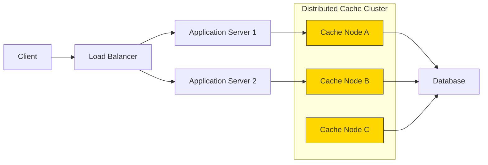

# Caching In Distributed Systems： A Friendly Introduction (1080P30) - Part 1

_screenshots/frame_00-00-00.jpg)

# Caching: Optimizing System Performance

Caching is a core concept in computer science, pervasive in almost every large-scale distributed system, often in critical sections. This section explores what caching is, its benefits, potential drawbacks, and how trade-offs can mitigate these issues.

## The Need for Caching: An Instagram News Feed Example

Consider a user requesting their news feed on Instagram. The process involves multiple steps, each contributing to the overall response time:

1.  **Client to Server Request:** The user's device sends a request to the Instagram server.
2.  **Server to Database Query:** The server queries the database to retrieve:
    *   A list of people the user follows.
    *   Posts from those followed users.
3.  **Database to Server Response:** The database returns the query results to the server.
4.  **Server to Client Response:** The server compiles the news feed and sends it back to the user's device.

_screenshots/frame_00-01-20.jpg)

Let's analyze the latency (time taken) for each step:

| Interaction             | Latency (Milliseconds) |
| :---------------------- | :--------------------- |
| User Client -> Server   | 100 ms                 |
| Server -> Database      | 10 ms                  |
| Database -> Server      | 10 ms                  |
| Server -> User Client   | 100 ms                 |
| **Total Round-Trip Time** | **220 ms**             |

### Optimization Opportunities

To optimize this system, we can focus on two primary communication paths:

1.  **Client-to-Server Communication:** Improving the speed of data transfer between the user's device and the server. This often involves network optimizations, content delivery networks (CDNs), etc.
2.  **Server-to-Database Communication:** Reducing the time the server spends waiting for database responses.

In the context of backend engineering and caching, our primary focus is on optimizing the **server-to-database communication**. While client-to-server latency (100ms each way) has a larger impact in this specific example, backend caching addresses a different, critical bottleneck: repeated database access.

## The Problem: Repeatable Work

Many users might have similar interests or demographics, leading them to request similar information. For instance:

_screenshots/frame_00-02-01.jpg)

Imagine two "young software engineers who like football and are in India." Their news feeds are likely to be very similar. Without caching, every time such a user requests their feed, the server performs the exact same database query, retrieving largely identical data. This repeated work is inefficient and consumes valuable database resources.

## The Solution: Caching

Caching addresses this inefficiency by **reducing repeatable work through storage**. Instead of re-computing or re-querying data from a slow source (like a database) every time, a cache stores the results of previous computations or queries in a faster, more accessible location (like local memory).

### How Caching Works

1.  **First Request:** When a user from a specific "cohort" (e.g., young SDEs in India who like football) requests their news feed for the first time:
    *   The server queries the database.
    *   The database generates the news feed.
    *   The server stores this generated news feed in its **local memory (cache)**.
    *   The news feed is then sent to the user.
2.  **Subsequent Similar Requests:** When another user from the same cohort (or the same user again) requests their news feed:
    *   The server first checks its local memory (cache).
    *   If the news feed is found in the cache (a "cache hit"), the server retrieves it directly from memory.
    *   The news feed is immediately sent to the user, bypassing the database entirely.

This process is analogous to keeping frequently used books on your desk (cache) instead of always going to the main library (database) every time you need them.

### Performance Benefits of Caching

Caches are designed to be significantly faster to query than databases because they are typically:

*   **Closer to the Application:** Often residing in the server's RAM or a dedicated in-memory store.
*   **Optimized for Read Access:** Designed for rapid retrieval of stored data.

Let's revisit our Instagram example with caching:

| Interaction             | Latency (Milliseconds) |
| :---------------------- | :--------------------- |
| User Client -> Server   | 100 ms                 |
| Server -> **Cache Query** | **1 ms**               |
| **Cache -> Server**     | **1 ms**               |
| Server -> User Client   | 100 ms                 |
| **Total Cached Time**   | **202 ms**             |
| **Total Non-Cached Time** | **220 ms**             |
| **Savings per Request** | **18 ms (approx. 10%)** |

By serving requests from the cache, the server-to-database communication overhead (20ms) is reduced to a mere 2ms (cache query + response). This 18ms saving per request, while seemingly small in this specific example, can lead to massive performance improvements and cost reductions at scale, especially for systems handling millions or billions of requests.

### Core Principle of Caching

The fundamental idea behind caching is to:
**"Reduce repeatable work through storage."**

Instead of performing the same expensive computation or data retrieval repeatedly, the result is stored temporarily in a fast-access memory location. When the same data is needed again, it's retrieved from this cache, leading to significant speedups and reduced load on primary data sources.

### Caching Beyond the Server

The concept of caching isn't limited to the backend server. It can be extended to client devices as well. For example, a mobile app might cache parts of the news feed locally. If a user scrolls through their feed, closes the app, and reopens it shortly after, the app can display the cached content almost instantly, providing a much smoother user experience without needing to re-fetch everything from the server.

_screenshots/frame_00-00-10.jpg)
*Note: Technologies like Memcached (as seen in the research paper snippet) are widely used, high-performance, distributed memory object caching systems that exemplify these principles in large-scale production environments like Facebook.*

---

### Caching at the Client Level

_screenshots/frame_00-03-12.jpg)

The concept of caching extends beyond the server to the client device itself. For instance, a mobile application like Instagram can implement a mini-cache on the user's phone. When the app fetches a news feed, it can store this data locally. If the user revisits the app or scrolls back to previously viewed content, the app can serve the news feed from its local cache, drastically reducing the perceived load time.

Consider the previous example where the full round-trip from client to server and back was 200 ms. If the news feed is cached on the phone, the app's response time for subsequent views of that content could drop to as low as **2 ms**. This creates an illusion of instant loading, significantly improving user experience.

## The Trade-offs and Limitations of Caching

While caching offers magical performance benefits, it's not a silver bullet. It introduces complexities and limitations, primarily related to:

1.  **Storage Capacity:** Caches use faster, more expensive memory (like RAM) which is inherently limited compared to the vast storage of databases (hard drives, SSDs). You cannot simply "take the entire database and put it in memory." For large-scale systems with terabytes or petabytes of data, this is physically and financially impossible.
2.  **Data Selection:** Since you can't cache everything, you must strategically decide *what* data to store in the cache. The goal is to cache the most frequently accessed or "popular" data to maximize the **cache hit rate** (the percentage of requests that can be served by the cache). This often involves predicting user behavior or analyzing access patterns.
3.  **Data Consistency (Write Management):** A cache is a copy of data from the primary database. When the original data in the database is updated (a "write" operation), the corresponding cached copy becomes **stale** (outdated). This raises a critical question: **How do we manage writes to ensure consistency between the database and the cache?**
    *   Should the cache be updated simultaneously with the database?
    *   Should the cache be updated later (asynchronously)?
    *   What are the implications of choosing one strategy over another?
    These are addressed by various **write policies**, which will be explored in detail later.

4.  **Cache Eviction (Overflow Management):** Because cache memory is limited, it will eventually fill up. When new, popular data needs to be added to a full cache, some existing data must be removed to make space. This process is called **eviction**.
    *   The question becomes: **What data do I kick out of the cache if there is an overflow?**
    *   For example, if a new video goes viral and countless users are querying for it, you want to move this video into the cache. But if the cache is full, which existing video should be removed to accommodate the new one?

### Cache Policies: Deciding What to Evict

To manage eviction effectively, caching systems employ **cache policies** (also known as eviction policies) – algorithms that determine which data to remove when the cache is full. These policies aim to maximize the cache hit rate by keeping the most valuable data in memory.

_screenshots/frame_00-05-08.jpg)

Some common and important cache policies for software engineers to understand include:

*   **Least Recently Used (LRU):** Evicts the item that has not been accessed for the longest period.
    *   *Analogy:* Imagine a stack of books on your desk. When you need space for a new book, you remove the one at the very bottom, assuming it's the one you haven't touched in a while.
*   **Least Frequently Used (LFU):** Evicts the item that has been accessed the fewest times.
    *   *Analogy:* You remove the book that you've opened the least number of times, regardless of when you last opened it.
*   **Other Policies:** Many other policies exist, including more advanced, machine learning-based approaches, but LRU and LFU are foundational.

### The Impact of Cache Hit Rate on Overall Latency

_screenshots/frame_00-06-33.jpg)

Even with caching, not all requests can be served from the cache. Some requests will inevitably result in a **cache miss** and require a trip to the slower database. The overall performance improvement depends heavily on the **cache hit rate**.

Let's refine our latency calculation considering a mixed scenario:

*   **Scenario:** 90% of requests are served by the cache (cache hit), and 10% require a database query (cache miss).
*   **Latency Breakdown:**
    *   Client to Server: 100 ms
    *   Server Processing (average):
        *   For 90% of requests (cache hit): 1 ms (cache query) + 1 ms (cache response) = 2 ms
        *   For 10% of requests (cache miss): 10 ms (DB query) + 10 ms (DB response) = 20 ms
    *   Weighted Average Server Processing = (0.90 * 2 ms) + (0.10 * 20 ms) = 1.8 ms + 2 ms = 3.8 ms
    *   Server to Client: 100 ms

*   **Total Average Time:** 100 ms (Client to Server) + 3.8 ms (Server Processing) + 100 ms (Server to Client) = **203.8 ms**

This shows that even with a 90% cache hit rate, the overall savings might be less than anticipated if the client-server communication dominates the latency. However, the critical benefit on the backend is the significant reduction in database load and the ability to scale services to handle many more requests without overwhelming the database.

As software engineers, our job involves:

1.  **Predicting Access Patterns:** Understanding what data is most likely to be queried frequently.
2.  **Strategic Caching:** Storing that predicted data in the cache *before* clients request it, if possible, to maximize cache hits.
3.  **Implementing Policies:** Choosing and implementing appropriate write and eviction policies to maintain consistency and optimize cache utilization.

We will delve deeper into specific write policies and cache policies in subsequent lessons. The benefits of caching are clear: reduced latency, improved scalability, and better user experience.

---

### Drawbacks of Caching

While caching offers significant benefits like reduced latency and improved performance, it introduces its own set of challenges and potential drawbacks. Understanding these is crucial for effective system design.

#### 1. Poor Cache Hit Rate (Cache Thrashing)

_screenshots/frame_00-06-44.jpg)

A cache is only beneficial if it stores the data that users are actually querying. If a request comes in and the data is *not* in the cache (a **cache miss**), the system still has to:

1.  Check the cache.
2.  Discover the data is missing.
3.  Go to the slower database to retrieve the data.
4.  Return the data to the client.

In this scenario, the cache lookup becomes a **wasteful additional computation**, actually *increasing* latency compared to going directly to the database. An unoptimized cache or one with a poor hit rate can hurt overall system performance.

**Example: Cache Thrashing with LRU Policy**

_screenshots/frame_00-07-28.jpg)
_screenshots/frame_00-07-50.jpg)

Consider a cache with a limited capacity, say, `size = 3` elements, using a **Least Recently Used (LRU)** eviction policy. Let's trace a sequence of client requests: `1, 2, 3, 4, 1, 2...`

1.  **Request `1`:**
    *   Cache Miss.
    *   Fetch `1` from DB.
    *   Cache: `[1]`
2.  **Request `2`:**
    *   Cache Miss.
    *   Fetch `2` from DB.
    *   Cache: `[1, 2]`
3.  **Request `3`:**
    *   Cache Miss.
    *   Fetch `3` from DB.
    *   Cache: `[1, 2, 3]` (Cache is now full)
4.  **Request `4`:**
    *   Cache Miss.
    *   Fetch `4` from DB.
    *   Cache is full. LRU evicts `1` (least recently used).
    *   Cache: `[2, 3, 4]`
5.  **Request `1` (again):**
    *   Cache Miss (because `1` was evicted).
    *   Fetch `1` from DB.
    *   Cache is full. LRU evicts `2`.
    *   Cache: `[3, 4, 1]`
6.  **Request `2` (again):**
    *   Cache Miss (because `2` was evicted).
    *   Fetch `2` from DB.
    *   Cache is full. LRU evicts `3`.
    *   Cache: `[4, 1, 2]`

This continuous cycle of fetching, evicting, and re-fetching frequently requested data is known as **cache thrashing**. It's a scenario where the cache does "useless work," leading to:

*   **Increased Latency:** Due to repeated cache misses and database lookups.
*   **Wasteful Memory Usage:** Data is constantly being loaded and evicted without providing sustained benefit.
*   **Increased Resource Consumption:** More CPU cycles and I/O operations are spent managing the cache rather than serving requests efficiently.

Thrashing often occurs when the working set of data (the data actively being requested) is larger than the cache capacity, or when the access pattern is not well-suited for the chosen eviction policy.

#### 2. Eventual Consistency (Data Staleness)

_screenshots/frame_00-06-44.jpg)

This is perhaps the most well-known problem in caching: maintaining consistency between the cache and the primary data source (the database, which is typically the **source of truth**).

*   **The Problem:** When data in the database is updated, the corresponding copy in the cache becomes **stale** or outdated. If a client then reads from the cache, they will receive old information.
*   **Example:** Imagine a YouTube video's like count. The actual, latest number of likes resides in the database. If the cache is updated less frequently (e.g., every minute or hour) to reduce load on the database, a user viewing the video might see a slightly older like count from the cache, not the absolute latest count.

This leads to a state of **eventual consistency**: the cache will *eventually* reflect the true state of the database, but there's a delay.

*   **Impact:**
    *   For non-critical data (like YouTube likes), this delay is often acceptable. Users expect some minor delay and prioritize fast loading.
    *   For critical data, such as financial transactions or inventory systems, stale data can lead to severe problems (e.g., displaying an incorrect account balance, selling an item that's out of stock).

The "when" of eventual consistency (how quickly the cache becomes consistent) is determined by the **cache write policy** used, which dictates how updates to the database are propagated to the cache.

### Where to Place the Cache? (Cache Location)

The physical or logical placement of the cache within your system architecture significantly impacts its performance and management. Common placements include:

1.  **In-Memory Cache (Application-Level Cache):**
    *   **Placement:** The cache resides directly within the application server's memory.
    *   **Implementation:** Often implemented as a simple data structure like a hash map (`Map` in Java, `dict` in Python) within the application code.
    *   **Pros:** Extremely fast access since it's in the same process as the application.
    *   **Cons:**
        *   Limited by the server's RAM.
        *   Not shared across multiple application instances (each server has its own cache, leading to potential data duplication and consistency challenges across servers).
        *   Data is lost if the application restarts.

    ```mermaid
    graph LR
        Client --> ServerApp[Application Server]
        ServerApp --> Cache[In-Memory Cache]
        ServerApp --> Database
        Cache -.-> ServerApp
        style Cache fill:#FFD700,stroke:#333,stroke-width:1px
    ```

2.  **Database-Level Cache:**
    *   **Placement:** The database management system (DBMS) itself often has its own internal caching mechanisms (e.g., query cache, buffer pool).
    *   **How it works:** Commonly used queries or recently accessed data blocks are cached by the database server.
    *   **Pros:** Managed automatically by the database, transparent to the application. Can improve database query performance.
    *   **Cons:** Still a part of the database system, so it might not be as fast as an application-level cache for specific use cases, and it's not directly controllable by the application logic for custom caching strategies.

    ```mermaid
    graph LR
        Client --> ServerApp[Application Server]
        ServerApp --> Database[Database Server]
        Database --> DBCache[Database Cache]
        DBCache -.-> Database
        style DBCache fill:#FFD700,stroke:#333,stroke-width:1px
    ```

3.  **Dedicated Caching Layer (Distributed Cache):**
    *   **Placement:** A separate set of servers specifically dedicated to running a caching service (e.g., Redis, Memcached).
    *   **How it works:** Application servers connect to this dedicated cache layer to store and retrieve data.
    *   **Pros:**
        *   Scalable: Can be scaled independently of application servers or databases.
        *   Shared: Data is shared across multiple application instances.
        *   Persistence options: Some distributed caches can persist data to disk.
    *   **Cons:** Adds network latency between the application and the cache. Requires managing a separate infrastructure.

    ```mermaid
    graph LR
        Client --> ServerApp1[Application Server 1]
        Client --> ServerApp2[Application Server 2]
        subgraph Distributed Cache
            CacheNodeA[Cache Node A]
            CacheNodeB[Cache Node B]
        end
        ServerApp1 --> CacheNodeA
        ServerApp2 --> CacheNodeB
        CacheNodeA --> Database
        CacheNodeB --> Database
        style CacheNodeA fill:#FFD700,stroke:#333,stroke-width:1px
        style CacheNodeB fill:#FFD700,stroke:#333,stroke-width:1px
    ```

The choice of cache placement depends on factors like application architecture, data volume, consistency requirements, and performance goals.

---

### 3. Global Cache (Distributed Cache)

_screenshots/frame_00-10-02.jpg)

A **global cache**, often referred to as a **distributed cache**, is an external, standalone system specifically designed for caching. It's a cluster of cache servers that can be queried by API calls (e.g., `get`, `put`) from various services within your system.

*   **Placement:** It's a separate layer of infrastructure, independent of your application servers and database.
*   **How it works:** Application servers send requests to the distributed cache. If the data is present, it's returned quickly. If not, the application server fetches it from the database and populates the cache.
*   **Pros:**
    *   **Independent Scalability:** The cache cluster can scale horizontally (add more servers) independently of your application servers or database. This is crucial for handling fluctuating loads.
    *   **Independent Deployment:** Changes to the caching algorithm or infrastructure do not require redeploying your application servers. This reduces deployment risks and downtime.
    *   **Shared Resource:** Multiple services or application instances can share the same distributed cache, preventing data duplication and ensuring consistency across different parts of your system.
    *   **Language Agnostic:** Often, distributed caches are accessible via standard protocols, meaning services written in different programming languages can all utilize the same cache.
*   **Cons:**
    *   Introduces network latency between the application server and the cache.
    *   Requires managing a separate infrastructure.


*Diagram: A distributed cache serving multiple application servers.*

### Choosing the Right Cache Placement (and the Reality of Production Systems)

In a typical large-scale production system, it's not a matter of choosing *one* cache placement, but rather leveraging **all three types simultaneously**:

1.  **Client-side Caching:** Mobile applications and web browsers cache data to provide immediate user feedback and reduce network calls.
2.  **In-Memory (Application-Level) Caching:** Application servers might cache frequently accessed, static configuration data or session-specific information directly in their RAM for the fastest possible access.
3.  **Database-Level Caching:** Databases inherently have internal caches (e.g., query caches, buffer pools) that automatically optimize frequently run queries or data blocks. While usually a "black box" to the application developer, this layer is crucial for database performance.
4.  **Distributed Caching Layer:** This is often the most significant caching layer for a backend software engineer in a large-scale distributed system. It provides a shared, scalable, and independent caching solution that multiple services can utilize.

**Why is Distributed Caching so important for backend engineers?**

*   **Independent Scalability:** It can be scaled up or down based on caching needs, without affecting other parts of the system.
*   **Independent Deployments:** Updates or changes to the cache system don't require redeploying core application services.
*   **Centralized & Shared:** Provides a single, consistent source of cached data that all services can access, avoiding data duplication and simplifying consistency management across the application layer.
*   **Decoupling:** Separates caching logic from application logic, making both more modular and easier to maintain.

### Conclusion: Key Takeaways for Caching

_screenshots/frame_00-11-15.jpg)

To summarize the introduction to caching:

*   **Time Savings:** Caching primarily saves time by:
    1.  **Reducing network calls:** Less data needs to be fetched over the network (e.g., from a database or remote API).
    2.  **Avoiding repeated computations:** Results of expensive operations are stored and reused.
    3.  **Reducing database load:** Fewer queries hit the primary database, freeing up its resources.
*   **Policy Matters:** The effectiveness of caching heavily depends on the **caching policy** (eviction policy) used. A poorly chosen policy can lead to cache thrashing and negate the benefits.
*   **Placement Matters:** The **placement of the cache** (client-side, in-memory, database-level, or distributed) impacts latency, scalability, consistency, and management overhead.

Ultimately, effective caching requires careful consideration of your system's specific needs, data access patterns, and consistency requirements to make the right choices for policies and placement.

---

