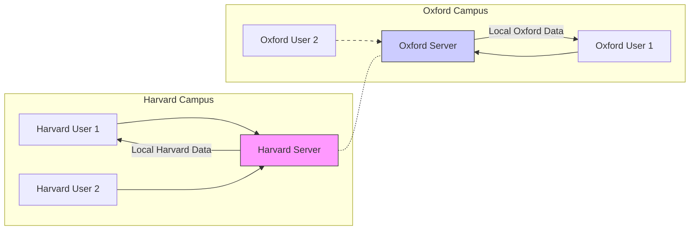
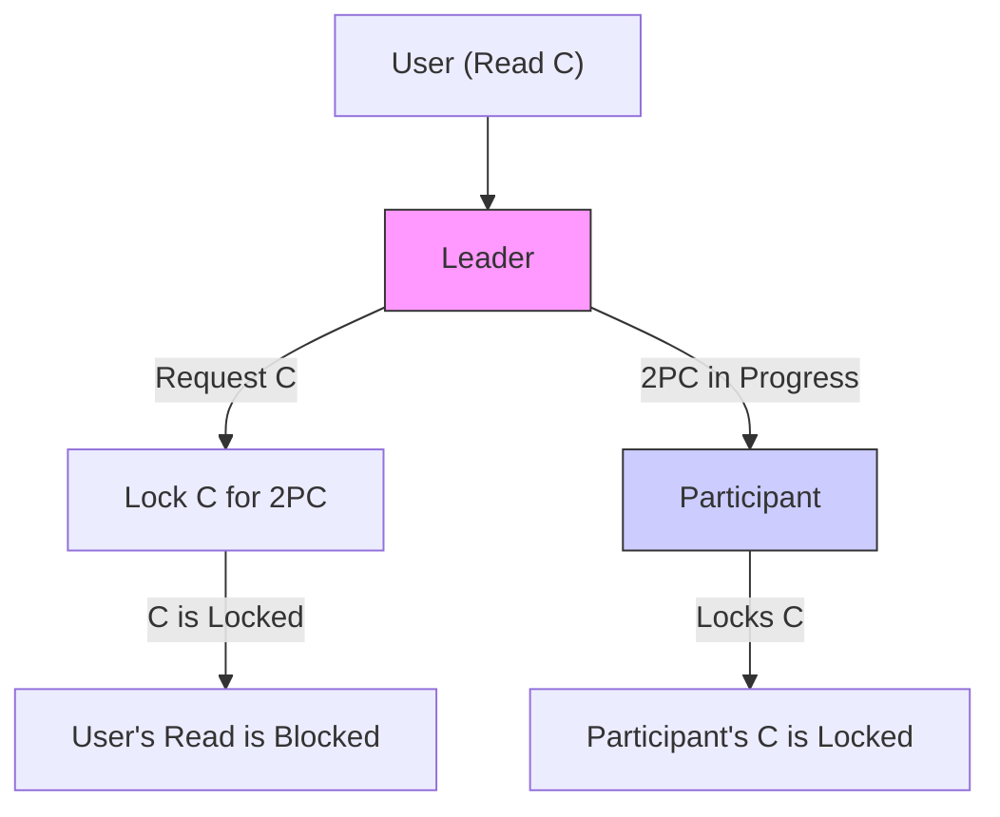

# Data Consistency And Tradeoffs In Distributed Systems (1080P25) - Part 1

### Understanding Data Consistency in Distributed Systems

_screenshots/frame_00-00-00.jpg)

**Consistency** is a fundamental concept in computing, particularly in the realm of data management and distributed systems. At its core, consistency ensures that all copies of data, especially when multiple copies exist, are in agreement and reflect the same state. If you have two or more identical pieces of data stored in different locations, consistency dictates that they must match each other.

This concept frequently appears in various contexts:

*   **CAP Theorem:** In distributed systems, the 'C' in CAP stands for Consistency. It highlights the trade-offs between Consistency, Availability, and Partition Tolerance.
*   **ACID Properties:** In database transactions, the 'C' in ACID stands for Consistency. It ensures that a transaction brings the database from one valid state to another, maintaining all defined rules and constraints.

_screenshots/frame_00-00-18.jpg)

### The Single-Server Paradigm: A Foundation for Understanding

To grasp the challenges consistency addresses, let's first consider a simple, centralized system, much like Facebook might have started in its early days on the Harvard campus.

#### System Setup

*   **Single Server:** The entire application runs on one machine.
*   **Single Data Copy:** All data (e.g., user profiles, posts) resides in one central database or file system on this single server.
*   **User Interaction:** All users connect directly to this single server to access or modify data.

_screenshots/frame_00-01-53.jpg)

#### Data Flow Example: Creating and Accessing a Profile

1.  **User A Creates Profile:** User A sends a request to the server to create their profile.
2.  **Server Stores Profile:** The server processes the request and stores "Profile A" in its local database.
3.  **User B Accesses Profile:** User B sends a request to the server to view "Profile A".
4.  **Server Retrieves and Returns:** The server directly queries its local database for "Profile A" and returns it to User B.

In this single-server scenario, consistency is inherently "perfect" because there is only one copy of the data. Any update to "Profile A" immediately affects the only existing copy, ensuring that subsequent reads will always retrieve the latest information. There are no other copies to synchronize or reconcile.

### Inherent Problems of a Single-Server Architecture

While simple and offering perfect consistency, a single-server setup quickly becomes impractical for real-world applications due to several critical limitations:

| Problem                     | Description                                                                                                                                                                                                                                                                                                                                                                                                                                                                                                                                                                                                                                                                                                                                                                                                                                                                                                                                                                                                                                                                                                                                                                                                                                                                                                                                                                                                                                                                                                                                                                                                                                                                                                                                                                                                                                                                                                                                                                                                                                                                                                                                                                                                                                                                                                                                                                                                                                                                                                                                                                                                                                                                                                                                                                                                                                                                                                                                                                                                                                                                                                                                                                                                                                                                                                                                                                                                                                                                                                                                                                                                                                                                                                                                                                                                                                                                                                                                                                                                                                                                                                                                                                                                                                                                                                                                                                                                                                                                                                                                                                                                                                                                                                                                                                                                                                                                                                                                                                                                                                                                                                                                                                                                                                                                                                                                                                                                                                                                                                                                                                                                                                                                                                                                                                                                                                                                                                                                                                                                                                                                                                                                                                                                                                                                                                                                                                                                                                                                                                                                                                                                                                                                                                                                                                                                                                                                                                                                                                                                                                                                                                                                                                                                                                                                                                                                                                                                                                                                                                                                                                                                                                                                                                                                                                                                                                                                                                                                                                                                                                                                                                                                                                                                                                                                                                                                                                                                                                                                                                                                                                                                                                                                                                                                                                                                                                                                                                                                                                                                                                                                                                                                                                                                                                                                                                                                                                                                                                                                                                                                                                                                                                                                                                                                                                                                                                                                                                                                                                                                                                                                                                                                                                                                                                                                                                                                                                                                                                                                                                                                                                                                                                                                                                                                                                                                                                                                                                                                                                                                                                                                                                                                                                                                                                                                                                                                                                                                                                                                                                                                                                                                                                                                                                                                                                                                                                                                                                                                                                                                                                                                                                                                                                                                                                                                                                                                                                                                                                                                                                                                                                                                                                                                                                                                                                                                                                                                                                                                                                                                                                                                                                                                                                                                                                                                                                                                                                                                                                                                                                                                                                                                                                                                                                                                                                                                                                                                                                                                                                                                                                                                                                                                                                                                                                                                                                                                                                                                                                                                                                                                                                                                                                                                                                                                                                                                                                                                                                                                                                                                                                                                                                                                                                                                                                                                                                                                                                                                                                                                                                                                                                                                                                                                                                                                                                                                                                                                                                                                                                                                                                                                                                                                                                                                                                                                                                                                                                                                                                                                                                                                                                                                                                                                                                                                                                                                                                                                                                                                                                                                                                                                                                                                                                                                                                                                                                                                                                                                                                                                                                                                                                                                                                                                                                                                                                                                                                                                                                                                                                                                                                                                                                                                                                                                                                                                                                                                                                                                                                                                                                                                                                                                                                                                                                                                                                                                                                                                                                                                                                                                                                                                                                                                                                                                                                                                                                                                                                                                                                                                                                                                                                                                                                                                                                                                                                                                                                                                                                                                                                                                                                                                                                                                                                                                                                                                                                                                                                                                                                                                                                                                                                                                                                                                                                                                                                                                                                                                                                                                                                                                                                                                                                                                                                                                                                                                                                                                                                                                                                                                                                                                                                                                                                                                                                                                                                                                                                                                                                                                                                                                                                                                                                                                                                                                                                                                                                                                                                                                                                                                                                                                                                                                                                                                                                                                                                                                                                                                                                                                                                                                                                                                                                                                                                                                                                                                                                                                                                                                                                                                                                                                                                                                                                                                                                                                                                                                                                                                                                                                                                                                                                                                                                                                                                                                                                                                                                                                                                                                                                                                                                                                                                                                                                                                                                                                                                                                                                                                                                                                                                                                                                                                                                                                                                                                                                                                                                                                                                                                                                                                                                                                                                                                                                                                                                                                                                                                                                                                                                                                                                                                                                                                                                                                                                                                                                                                                                                                                                                                                                                                                                                                                                                                                                                                                                                                                                                                                                                                                                                                                                                                                                                                                                                                                                                                                                                                                                                                                                                                                                                                                                                                                                                                                                                                                                                                                                                                                                                                                                                                                                                                                                                                                                                                                                                                                                                                                                                                                                                                                                                                                                                                                                                                                                                                                                                                                                                                                                                                                                                                                                                                                                                                                                                                                                                                                                                                                                                                                                                                                                                                                                                                                                                                                                                                                                                                                                                                                                                                                                                                                                                                                                                                                                                                                                                                                                                                                                                                                                                                                                                                                                                                                                                                                                                                                                                                                                                                                                                                                                                                                                                                                                                                                                                                                                                                                                                                                                                                                                                                                                                                                                                                                                                                                                                                                                                                                                                                                                                                                                                                                                                                                                                                                                                                                                                                                                                                                                                                                                                                                                                                                                                                                                                                                                                                                                                                                                                                                                                                                                                                                                                                                                                                                                                                                                                                                                                                                                                                                                                                                                                                                                                                                                                                                                                                                                                                                                                                                                                                                                                                                                                                                                                                                                                                                                                                                                                                                                                                                                                                                                                                                                                                                                                                                                                                                                                                                                                                                                                                                                                                                                                                                                                                                                                                                                                                                                                                                                                                                                                                                                                                                                                                                                                                                                                                                                                                                                                                                                                                                                                                                                                                                                                                                                                                                                                                                                                                                                                                                                                                                                                                                                                                                                                                                                                                                                                                                                                                                                                                                                                                                                                                                                                                                                                                                                                                                                                                                                                                                                                                                                                                                                                                                                                                                                                                                                                                                                                                                                                                                                                                                                                                                                                                                                                                                                                                                                                                                                                                                                                                                                                                                                                                                                                                                                                                                                                                                                                                                                                                                                                                                                                                                                                                                                                                                                                                                                                                                                                                                                                                                                                                                                                                                                                                                                                                                                                                                                                                                                                                                                                                                                                                                                                                                                                                                                                                                                                                                                                                                                                                                                                                                                                                                                                                                                                                                                                                                                                                                                                                                                                                                                                                                                                                                                                                                                                                                                                                                                                                                                                                                                                                                                                                                                                                                                                                                                                                                                                                                                                                                                                                                                                                                                                                                                                                                                                                                                                                                                                                                                                                                                                                                                                                                                                                                                                                                                                                                                                                                                                                                                                                                                                                                                                                                                                                                                                                                                                                                                                                                                                                                                                                                                                                                                                                                                                                                                                                                                                                                                                                                                                                                                                                                                                                                                                                                                                                                                                                                                                                                                                                                                                                                                                                                                                                                                                                                                                                                                                                                                                                                                                                                                                                                                                                                                                                                                                                                                                                                                                                                                                                                                                                                                                                                                                                                                                                                                                                                                                                                                                                                                                                                                                                                                                                                                                                                                                                                                                                                                                                                                                                                                                                                                                                                                                                                                                                                                                                                                                                                                                                                                                                                                                                                                                                                                                                                                                                                                                                                                                                                                                                                                                                                                                                                                                                                                                                                                                                                                                                                                                                                                                                                                                                                                                                                                                                                                                                                                                                                                                                                                                                                                                                                                                                                                                                                                                                                                                                                                                                                                                                                                                                                                                                                                                                                                                                                                                                                                                                                                                                                                                                                                                                                                                                                                                                                                                                                                                                                                                                                                                                                                                                                                                                                                                                                                                                                                                                                                                                                                                                                                                                                                                                                                                                                                                                                                                                                                                                                                                                                                                                                                                                                                                                                                                                                                                                                                                                                                                                                                                                                                                                                                                                                                                                                                                                                                                                                                                                                                                                                                                                                                                                                                                                                                                                                                                                                                                                                                                                                                                                                                                                                                                                                                                                                                                                                                                                                                                                                                                                                                                                                                                                                                                                                                                                                                                                                                                                                                                                                                                                                                                                                                                                                                                                                                                                                                                                                                                                                                                                                                                                                                                                                                                                                                                                                                                                                                                                                                                                                                                                                                                                                                                                                                                                                                                                                                                                                                                                                                                                                                                                                                                                                                                                                                                                                                                                                                                                                                                                                                                                                                                                                                                                                                                                                                                                                                                                                                                                                                                                                                                                                                                                                                                                                                                                                                                                                                                                                                                                                                                                                                                                                                                                                                                                                                                                                                                                                                                                                                                                                                                                                                                                                                                                                                                                                                                                                                                                                                                                                                                                                                                                                                                                                                                                                                                                                                                                                                                                                                                                                                                                                                                                                                                                                                                                                                                                                                                                                                                                                                                                                                                                                                                                                                                                                                                                                                                                                                                                                                                                                                                                                                                                                                                                                                                                                                                                                                                                                                                                                                                                                                                                                                                                                                                                                                                                                                                                                                                                                                                                                                                                                                                                                                                                                                                                                                                                                                                                                                                                                                                                                                                                                                                                                                                                                                                                                                                                                                                                                                                                                                                                                                                                                                                                                                                                                                                                                                                                                                                                                                                                                                                                                                                                                                                                                                                                                                                                                                                                                                                                                                                                                                                                                                                                                                                                                                                                                                                                                                                                                                                                                                                                                                                                                                                                                                                                                                                                                                                                                                                                                                                                                                                                                                                                                                                                                                                                                                                                                                                                                                                                                                                                                                                                                                                                                                                                                                                                                                                                                                                                                                                                                                                                                                                                                                                                                                                                                                                                                                                                                                                                                                                                                                                                                                                                                                                                                                                                                                                                                                                                                                                                                                                                                                                                                                                                                                                                                                                                                                                                                                                                                                                                                                                                                                                                                                                                                                                                                                                                                                                                                                                                                                                                                                                                                                                                                                                                                                                                                                                                                                                                                                                                                                                                                                                                                                                                                                                                                                                                                                                                                                                                                                                                                                                                                                                                                                                                                                                                                                                                                                                                                                                                                                                                                                                                                                                                                                                                                                                                                                                                                                                                                                                                                                                                                                                                                                                                                                                                                                                                                                                                                                                                                                                                                                                                                                                                                                                                                                                                                                                                                                                                                                                                                                                                                                                                                                                                                                                                                                                                                                                                                                                                                                                                                                                                                                                                                                                                                                                                                                                                                                                                                                                                                                                                                                                                                                                                                                                                                                                                                                                                                                                                                                                                                                                                                                                                                                                                                                                                                                                                                                                                                                                                                                                                                                                                                                                                                                                                                                                                                                                                                                                                                                                                                                                                                                                                                                                                                                                                                                                                                                                                                                                                                                                                                                                                                                                                                                                                                                                                                                                                                                                                                                                                                                                                                                                                                                                                                                                                                                                                                                                                                                                                                                                                                                                                                                                                                                                                                                                                                                                                                                                                                                                                                                                                                                                                                                                                                                                                                                                                                                                                                                                                                                                                                                                                                                                                                                                                                                                                                                                                                                                                                                                                                                                                                                                                                                                                                                                                                                                                                                                                                                                                                                                                                                                                                                                                                                                                                                                                                                                                                                                                                                                                                                                                                                                                                                                                                                                                                                                                                                                                                                                                                                                                                                                                                                                                                                                                                                                                                                                                                                                                                                                                                                                                                                                                                                                                                                                                                                                                                                                                                                                                                                                                                                                                                                                                                                                                                                                                                                                                                                                                                                                                                                                                                                                                                                                                                                                                                                                                                                                                                                                                                                                                                                                                                                                                                                                                                                                                                                                                                                                                                                                                                                                                                                                                                                                                                                                                                                                                                                                                                                                                                                                                                                                                                                                                                                                                                                                                                                                                                                                                                                                                                                                                                                                                                                                                                                                                                                                                                                                                                                                                                                                                                                                                                                                                                                                                                                                                                                                                                                                                                                                                                                                                                                                                                                                                                                                                                                                                                                                                                                                                                                                                                                                                                                                                                                                                                                                                                                                                                                                                                                                                                                                                                                                                                                                                                                                                                                                                                                                                                                                                                                                                                                                                                                                                                                                                                                                                                                                                                                                                                                                                                                                                                                                                                                                                                                                                                                                                                                                                                                                                                                                                                                                                                                                                                                                                                                                                                                                                                                                                                                                                                                                                                                                                                                                                                                                                                                                                                                                                                                                                                                                                                                                                                                                                                                                                                                                                                                                                                                                                                                                                                                                                                                                                                                                                                                                                                                                                                                                                                                                                                                                                                                                                                                                                                                                                                                                                                                                                                                                                                                                                                                                                                                                                                                                                                                                                                                                                                                                                                                                                                                                                                                                                                                                                                                                                                                                                                                                                                                                                                                                                                                                                                                                                                                                                                                                                                                                                                                                                                                                                                                                                                                                                                                                                                                                                                                                                                                                                                                                                                                                                                                                                                                                                                                                                                                                                                                                                                                                                                                                                                                                                                                                                                                                                                                                                                                                                                                                                                                                                                                                                                                                                                                                                                                                                                                                                                                                                                                                                                                                                                                                                                                                                                                                                                                                                                                                                                                                                                                                                                                                                                                                                                                                                                                                                                                                                                                                                                                                                                                                                                                                                                                                                                                                                                                                                                                                                                                                                                                                                                                                                                                                                                                                                                                                                                                                                                                                                                                                                                                                                                                                                                                                                                                                                                                                                                                                                                                                                                                                                                                                                                                                                                                                                                                                                                                                                                                                                                                                                                                                                                                                                                                                                                                                                                                                                                                                                                                                                                                                                                                                                                                                                                                                                                                                                                                                                                                                                                                                                                                                                                                                                                                                                                                                                                                                                                                                                                                                                                                                                                                                                                                                                                                                                                                                                                                                                                                                                                                                                                                                                                                                                                                                                                                                                                                                                                                                                                                                                                                                                                                                                                                                                                                                                                                                                                                                                                                                                                                                                                                                                                                                                                                                                                                                                                                                                                                                                                                                                                                                                                                                                                                                                                                                                                                                                                                                                                                                                                                                                                                                                                                                                                                                                                                                                                                                                                                                                                                                                                                                                                                                                                                                                                                                                                                                                                                                                                                                                                                                                                                                                                                                                                                                                                                                                                                                                                                                                                                                                                                                                                                                                                                                                                                                                                                                                                                                                                                                                                                                                                                                                                                                                                                                                                                                                                                                                                                                                                                                                                                                                                                                                                                                                                                                                                                                                                                                                                                                                                                                                                                                                                                                                                                                                                                                                                                                                                                                                                                                                                                                                                                                                                                                                                                                                                                                                                                                                                                                                                                                                                                                                                                                                                                                                                                                                                                                                                                                                                                                                                                                                                                                                                                                                                                                                                                                                                                                                                                                                                                                                                                                                                                                                                                                                                                                                                                                                                                                                                                                                                                                                                                                                                                                                                                                                                                                                                                                                                                                                                                                                                                                                                                                                                                                                                                                                                                                                                                                                                                                                                                                                                                                                                                                                                                                                                                                                                                                                                                                                                                                                                                                                                                                                                                                                                                                                                                                                                                                                                                                                                                                                                                                                                                                                                                                                                                                                                                                                                                                                                                                                                                                                                                                                                                                                                                                                                                                                                                                                                                                                                                                                                                                                                                                                                                                                                                                                                                                                                                                                                                                                                                                                                                                                                                                                                                                                                                                                                                                                                                                                                                                                                                                                                                                                                                                                                                                                                                                                                                                                                                                                                                                                                                                                                                                                                                                                                                                                                                                                                                                                                                                                                                                                                                                                                                                                                                                                                                                                                                                                                                                                                                                                                                                                                                                                                                                                                                                                                                                                                                                                                                                                                                                                                                                                                                                                                                                                                                                                                                                                                                                                                                                                                                                                                                                                                                                                                                                                                                                                                                                                                                                                                                                                                                                                                                                                                                                                                                                                                                                                                                                                                                                                                                                                                                                                                                                                                                                                                                                                                                                                                                                                                                                                                                                                                                                                                                                                                                                                                                                                                                                                                                                                                                                                                                                                                                                                                                                                                                                                                                                                                                                                                                                                                                                                                                                                                                                                                                                                                                                                                                                                                                                                                                                                                                                                                                                                                                                                                                                                                                                                                                                                                                                                                                                                                                                                                                                                                                                                                                                                                                                                                                                                                                                                                                                                                                                                                                                                                                                                                                                                                                                                                                                                                                                                                                                                                                                                                                                                                                                                                                                                                                                                                                                                                                                                                                                 

---

### The Challenge of Latency in Centralized Systems

Beyond the issues of a single point of failure and vertical scaling limits, a centralized single-server system faces a significant challenge: **latency**.

_screenshots/frame_00-03-04.jpg)
_screenshots/frame_00-03-35.jpg)
_screenshots/frame_00-03-46.jpg)

**Latency** refers to the delay experienced when data travels from its source (the server) to its destination (the user, or vice versa). In a geographically widespread system:

*   **Physical Distance Matters:** If a user in Oxford (UK) tries to connect to a server in Harvard (US), the data has to travel across continents. This physical distance, combined with the time it takes for data to traverse various network hops (routers, cables), introduces considerable delay.
*   **Example:** A 100-millisecond (ms) latency might be typical for cross-continental communication. While this might seem small, for interactive applications like a social network, it significantly degrades user experience. Reducing this latency to, say, 10ms, is often physically impossible due to the speed of light and network infrastructure limitations.

```mermaid
graph LR
    OxfordUser[Oxford User] --> |High Latency (e.g., 100ms)| HarvardServer[Harvard Server (Single Data Copy)]
    HarvardServer -- "Profile A" --> OxfordUser

    style HarvardServer fill:#f9f,stroke:#333,stroke-width:1px
```
*Analogy:* Imagine trying to have a real-time conversation with someone on the other side of the world using a walkie-talkie. There's always a noticeable delay between speaking and hearing a response, even if you speak immediately. That delay is latency.

### Evolution to a Multi-Server, Non-Sharing Architecture

To mitigate the problems of single points of failure and improve localized performance, a natural next step for a growing service like Facebook would be to introduce **multiple servers**.

_screenshots/frame_00-06-22.jpg)

In its early expansion, Facebook might have opted for a decentralized approach without immediate data sharing:

*   **Regional Servers:** Deploying separate servers in different geographical regions, e.g., one in Harvard (US) and another in Oxford (UK).
*   **Dedicated Data Copies:** Each server would primarily hold data relevant to its local user base. Harvard students connect to the Harvard server, Oxford students connect to the Oxford server.
*   **No Cross-Server Communication:** Crucially, in this initial model, there's no direct communication or data synchronization between the Harvard and Oxford servers.


*Explanation:* The dashed line between `HarServer` and `OxfServer` indicates that while they exist, they don't actively share or synchronize data in this specific model.

#### Benefits of this Approach:

*   **Reduced Local Latency:** Users connect to their geographically closest server, drastically reducing the time it takes for data to travel.
*   **Improved Local Scaling:** Each server can be scaled vertically to handle its local user base, distributing the load.

#### Major Drawback: No Data Sharing

The most significant limitation of this non-sharing multi-server model is the **lack of data interoperability**.

*   **Isolated Data:** A Harvard student cannot easily see an Oxford student's profile if that profile only exists on the Oxford server.
*   **Limited Functionality:** For a social network like Facebook, the ability to connect and share information globally is fundamental. This architecture fundamentally breaks that core functionality.
*   **Product Fit:** This model might be suitable for niche applications where data sharing isn't critical (e.g., campus-specific event boards where users only care about their local campus activities). However, for a global social platform, it's unsustainable.

### Persistent Problems in the Non-Sharing Multi-Server Model

Even with multiple servers, the core issues are not fully resolved:

1.  **Single Point of Failure (Still Exists per Server):** If the Oxford server goes down, all Oxford students lose access to their data, even if the Harvard server is operational. Each server remains a single point of failure for its dedicated user base.
2.  **Cross-Continental Latency (Still a Problem):** While local latency is reduced, if a Harvard student *does* need to access Oxford data (by connecting directly to the Oxford server), they still face the high cross-continental latency.

    ```mermaid
graph LR
        HarUser[Harvard User] --> |High Latency (e.g., 100ms)| OxfServer[Oxford Server (Oxford Data)]
        OxfServer -- "Oxford Profile" --> HarUser
        style OxfServer fill:#ccf,stroke:#333,stroke-width:1px
    ```
3.  **Cost of Vertical Scaling (Mitigated, Not Eliminated):** While the load is distributed, each individual server still faces vertical scaling limits if its local user base grows excessively.

### Addressing Latency: The Role of Caching

To combat the persistent latency issues, especially for cross-continental data access, a common technique is **caching**.

*   **Concept:** Instead of always fetching data from the remote (origin) server, a local server can store a temporary copy of frequently accessed remote data.
*   **Process:**
    1.  A Harvard user requests an Oxford profile.
    2.  The Harvard server first checks its local cache.
    3.  If the Oxford profile is not in the cache, the Harvard server fetches it from the Oxford server (incurring high latency once).
    4.  Once retrieved, the Harvard server stores a copy of the Oxford profile in its local cache.
    5.  The profile is then returned to the Harvard user.
    6.  For subsequent requests for the same Oxford profile from any Harvard user, the Harvard server can serve it directly from its local cache, significantly reducing latency.

*Analogy:* Imagine a library in your town (Harvard server) that doesn't have a rare book. They can order it from a distant national library (Oxford server), which takes time. Once it arrives, they keep a copy of it locally (cache it) so that anyone else in your town wanting to read it can get it instantly from your local library.

While caching effectively reduces read latency, it introduces a new, critical challenge: **data consistency**. Now, we have multiple copies of the same data (the original on the Oxford server and the cached copy on the Harvard server). What happens if the original Oxford profile changes? How does the Harvard cache know to update or invalidate its copy? This is where the core problem of consistency truly emerges in distributed systems.

---

### Caching: A Partial Solution to Latency

As discussed, introducing regional servers helps with localized latency. However, when users need to access data residing on a distant server (e.g., a Harvard student accessing an Oxford profile), the high cross-continental latency persists. To mitigate this, **caching** is employed.

_screenshots/frame_00-06-33.jpg)
_screenshots/frame_00-06-44.jpg)

**How Caching Works (for a remote read):**

1.  A user (e.g., from Harvard) requests data (e.g., "Profile A") that primarily resides on a remote server (e.g., Oxford).
2.  The local server (Harvard server) receives the request.
3.  Instead of immediately forwarding the request to Oxford, the Harvard server first checks its **local cache**.
4.  **Cache Miss:** If "Profile A" is not found in the Harvard cache:
    *   The Harvard server sends a request to the Oxford server.
    *   The Oxford server retrieves "Profile A" and sends it back to the Harvard server.
    *   The Harvard server then **stores a copy** of "Profile A" in its local cache.
    *   Finally, "Profile A" is returned to the Harvard user. This initial fetch still incurs high latency.
5.  **Cache Hit:** If "Profile A" is already in the Harvard cache from a previous request:
    *   The Harvard server immediately serves "Profile A" from its local cache. This response is very fast and avoids cross-continental latency.

```mermaid
graph LR
    HarUser[Harvard User] --> ReqA[Request Profile A]
    ReqA --> HarServer[Harvard Server]
    HarServer -- "Does A exist in cache?" --> CacheCheck[Local Cache Check]

    CacheCheck -- "No (Cache Miss)" --> FetchRemote[Fetch A from Oxford]
    FetchRemote --> |High Latency| OxfServer[Oxford Server (Original Data)]
    OxfServer -- "Return Profile A" --> HarServerCache[Store A in Harvard Cache]
    HarServerCache --> HarServer

    CacheCheck -- "Yes (Cache Hit)" --> HarServer

    HarServer -- "Return Profile A (Fast)" --> HarUser

    style HarServer fill:#f9f,stroke:#333,stroke-width:1px
    style OxfServer fill:#ccf,stroke:#333,stroke-width:1px
```

**Limitations of Caching for Latency:**

*   **Not a Complete Solution:** Caching reduces *average* latency, but it doesn't eliminate it entirely.
    *   **Cache Misses:** The first time a piece of data is requested, or if it's evicted from the cache (due to cache replacement policies), a cache miss occurs, and the full high latency is still experienced.
    *   **Cache Invalidation Overhead:** Maintaining an up-to-date cache adds complexity, which relates directly to the consistency problem we're about to discuss.

### Embracing Full Data Replication for Resilience and Performance

To truly overcome single points of failure and significantly reduce latency for *all* operations (reads and writes), the ultimate step is to **replicate data across multiple servers**. This means each server holds a complete or partial copy of the *entire* dataset, not just cached subsets.

_screenshots/frame_00-08-47.jpg)

Consider a scenario where both the US (Harvard) and Europe (Oxford) servers hold identical copies of all user data (e.g., profiles A, B, and C).

```mermaid
graph LR
    subgraph US_Region [US Server (Harvard)]
        US_Data[Data: A, B, C]
    end

    subgraph EU_Region [Europe Server (Oxford)]
        EU_Data[Data: A, B, C]
    end

    US_User[US User] --> US_Region
    EU_User[EU User] --> EU_Region

    style US_Region fill:#f9f,stroke:#333,stroke-width:1px
    style EU_Region fill:#ccf,stroke:#333,stroke-width:1px
```

#### Benefits of Full Data Replication:

*   **Elimination of Single Point of Failure:**
    *   If the US server (and its data) crashes, users can simply connect to the Europe server, which has an identical copy of all data. The system remains operational.
    *   *Analogy:* Having two copies of your crucial documents in two different safety deposit boxes. If one bank vault is compromised, your documents are safe in the other.
*   **Significant Latency Reduction:**
    *   Users always connect to their geographically closest server, regardless of which data they need to access or modify, as all data is available locally.
    *   For example, a US user can update "Profile C" on the US server directly, and the response is immediate. The challenge then becomes propagating this change to the Europe server.

### The Emergence of the Consistency Monster

With full data replication, while we solve reliability and latency, we confront the "big monster": **Consistency**.

**The Core Problem:** If you have multiple copies of data (e.g., "Profile C" on the US server and "Profile C" on the Europe server), **consistency demands that all these copies must be identical at any given point in time or eventually.**

**The Challenge Illustrated:**

1.  A US user updates "Profile C" on the US server, changing its value from `C` to `C++`.
2.  The US server immediately updates its local copy to `C++` and sends a quick response back to the user, who experiences low latency.
3.  Now, the US server has `C++`, but the Europe server still has the old `C`. The copies are *inconsistent*.
4.  The fundamental problem becomes: **How do we propagate this update (`C++`) from the US server to the Europe server to ensure both copies are identical?**

```mermaid
graph LR
    US_User[US User] --> US_Server[US Server (Data: A, B, C)]
    US_Server -- "Update C to C++" --> US_Server_Updated[US Server (Data: A, B, C++)]
    US_Server_Updated -- "Immediate Response" --> US_User
    
    EU_Server["Europe Server (Data: A, B, C)"]

    US_Server_Updated -.- EU_Server
    linkStyle 4 stroke-dasharray: 5 5;
    style US_Server fill:#f9f,stroke:#333,stroke-width:1px
    style EU_Server fill:#ccf,stroke:#333,stroke-width:1px
```
*The dashed line indicates the lack of immediate synchronization, leading to inconsistency.*

### Initial Approaches to Consistency (and their limitations)

How do we make the `C++` on the US server reflect on the Europe server?

1.  **Manual Synchronization (or very infrequent updates):**
    *   **Concept:** For applications with extremely rare data updates, one might tolerate temporary inconsistencies or perform manual synchronization.
    *   **Example:** In some very old or niche banking systems, ledger entries might be recorded locally, and global consistency is achieved much later (e.g., end of day, end of week) by batch processing and distributing updates. The immediate user might see their balance updated, but other branches might not see it until the next day.
    *   **Pros:** Simplest to implement, low overhead if updates are truly minimal.
    *   **Cons:** Not suitable for dynamic, interactive systems where users expect immediate and universal consistency (like social media). This approach deliberately sacrifices strong consistency for simplicity and availability.

This manual or delayed approach highlights that consistency isn't always "instantaneous." The "how" and "when" of propagating updates to ensure all data copies match are at the heart of distributed consistency models.

---

### The Imperative of Real-time Consistency

While manual or delayed synchronization (like in some banking scenarios) might be tolerable for infrequent updates, modern real-time systems like social media platforms cannot afford such delays. Users expect immediate updates to their content and to see others' changes instantly. Therefore, the challenge is to propagate changes quickly and ensure all replicated copies of data reflect the latest state without significant lag.

#### Propagating Updates with Network Protocols

To achieve rapid propagation, we rely on network protocols. **TCP (Transmission Control Protocol)** is often a good candidate for this, as it offers:

*   **Reliable Delivery:** Guarantees that data sent will eventually arrive at its destination, or the sender will be notified of failure.
*   **Ordered Delivery:** Ensures that data packets arrive in the same order they were sent.
*   **Error Checking:** Detects corruption during transmission.

**Basic Update Flow (Ideal Scenario):**

1.  **Initiate Update:** A US user updates "Profile C" on the US server, changing its value from `C` to `C++`.
2.  **Local Commit & Propagation:** The US server immediately updates its local copy to `C++` and, concurrently, sends an "update message" (e.g., "Change C to C++") to the Europe server.
3.  **Remote Update:** The Europe server receives this message and updates its local copy of "Profile C" to `C++`.

_screenshots/frame_00-09-54.jpg)
_screenshots/frame_00-10-19.jpg)

```mermaid
graph LR
    US_User[US User] --> US_Server[US Server (C)]
    US_Server -- "Update C to C++" --> US_Server_Updated[US Server (C++)]
    US_Server_Updated -- "Send Update (C->C++)" --> Europe_Server[Europe Server (C)]
    Europe_Server -- "Receive Update" --> Europe_Server_Updated[Europe Server (C++)]

    style US_Server fill:#f9f,stroke:#333,stroke-width:1px
    style Europe_Server fill:#ccf,stroke:#333,stroke-width:1px
    style US_Server_Updated fill:#f9f,stroke:#333,stroke-width:1px
    style Europe_Server_Updated fill:#ccf,stroke:#333,stroke-width:1px
```

#### The Reality: Unreliable Networks and the Need for Acknowledgments

The ideal scenario above assumes perfect message transmission, which is rarely the case in real-world distributed systems. Networks are inherently unreliable, prone to:

*   **Message Loss:** Packets can be dropped.
*   **Network Outages:** Connectivity can be temporarily or permanently lost.
*   **Server Failures:** The receiving server might be down or unresponsive.

To confirm successful delivery and update, **acknowledgments (ACKs)** are crucial.

**Update Flow with Acknowledgments:**

1.  **US Server Sends Update:** The US server sends the "Update C to C++" message to the Europe server.
2.  **Europe Server Receives & Updates:** If the Europe server receives the message, it updates its data to `C++`.
3.  **Europe Server Sends ACK:** The Europe server then sends an acknowledgment message back to the US server.
4.  **US Server Confirms:** If the US server receives the ACK, it knows the update was successful on the Europe side.

_screenshots/frame_00-10-45.jpg)

```mermaid
graph LR
    US_Server_A["US Server (A)"] --> SendUpdate["Send Update C->C++"]
    SendUpdate -- "Message (unreliable)" --> Europe_Server_B[Europe Server (B)]
    Europe_Server_B --> ReceiveUpdate["Receive Update"]
    ReceiveUpdate --> CommitB[Commit C++ Locally]
    CommitB --> SendACK["Send ACK"]
    SendACK -- "ACK (unreliable)" --> US_Server_A_ReceiveACK[US Server (A) Receive ACK]

    style US_Server_A fill:#f9f,stroke:#333,stroke-width:1px
    style Europe_Server_B fill:#ccf,stroke:#333,stroke-width:1px
```

**Handling Failures with Retries:**

What if the update message or the acknowledgment gets lost, or the Europe server is down?

*   **Retries:** The US server can implement a retry mechanism. If it doesn't receive an ACK within a certain timeout, it can re-send the update message.
*   **Retry Limits:**
    *   **Infinite Retries:** The US server keeps retrying indefinitely (e.g., every 5 seconds) until an ACK is received. This ensures eventual consistency but can consume resources and may never succeed if the Europe server is permanently down.
    *   **Finite Retries:** The US server attempts the update a fixed number of times (e.g., 5 retries). If all fail, it might:
        *   Mark the record as inconsistent.
        *   Log the failure for manual intervention.
        *   Decide to tolerate temporary inconsistency for that specific data point.

### The Two Generals' Problem: The Fundamental Barrier to Certainty

Despite acknowledgments and retries, a fundamental problem in distributed systems prevents two parties from ever being absolutely *certain* that a message (and its acknowledgment) has been successfully received by both sides over an unreliable network. This is known as the **Two Generals' Problem**.

_screenshots/frame_00-13-04.jpg)
_screenshots/frame_00-13-30.jpg)

**The Scenario:**
Imagine two generals (General A and General B) positioned on two hills, separated by a valley controlled by the enemy. They want to attack the enemy simultaneously. They can only communicate by sending messengers through the valley, but a messenger might be captured or lost.

*   **General A sends a message:** "Attack at dawn."
*   **General B receives and sends an ACK:** "Received. Will attack at dawn."
*   **General A receives the ACK:** Now General A knows General B received the message. But General B doesn't know if General A received *this* ACK.
*   **General A sends an ACK of the ACK:** "Received your ACK."
*   **General B receives the ACK of the ACK:** Now General B knows General A received B's ACK. But General A doesn't know if General B received *this* ACK of the ACK.

This creates an infinite regress of acknowledgments. Neither general can ever be 100% certain that the other general has definitively committed to the attack *and* knows that the first general knows they've committed.

**Implication for Distributed Consistency:**

*   In our example, if the US server (General A) sends an update to the Europe server (General B), and the Europe server sends an ACK back:
    *   The US server knows the Europe server *received* the update.
    *   But the Europe server doesn't know if its ACK *reached* the US server. If the ACK is lost, the US server might retry the update, leading to duplicate operations or inconsistencies if not handled carefully.
    *   If the Europe server waits for an "ACK of its ACK" before committing, it's essentially waiting on the US server, perpetuating the same uncertainty.
*   **Conclusion:** The Two Generals' Problem proves that perfect, simultaneous agreement on a commit across an unreliable network is impossible to guarantee without external coordination or making assumptions (e.g., "if I don't hear back, assume failure"). This fundamental limitation means that achieving strong consistency in distributed systems requires more sophisticated protocols than simple message passing and acknowledgments.

---

### Addressing Consistency: The Leader-Follower Architecture

To overcome the challenges of the Two Generals' Problem and achieve better consistency and availability, a common architectural pattern in distributed systems is the **Leader-Follower (or Master-Slave) model**.

_screenshots/frame_00-13-56.jpg)
_screenshots/frame_00-14-21.jpg)

In this model:

*   **Leader (or Master):** One designated server (e.g., the US server) is given a special role. It is the **only node that can accept and commit write operations** (updates) to the data.
*   **Followers (or Replicas/Slaves):** Other servers (e.g., the Europe server) are followers. They **receive updates from the leader** and primarily serve **read operations**.

**How it works:**

1.  **Write Operations:** Any update request (e.g., a user wants to change "Profile C" to `C++`) *must* first go to the Leader.
2.  **Leader Commits Locally:** The Leader processes the update and commits the change to its local data copy.
3.  **Leader Propagates Updates:** The Leader then sends regular updates or a stream of changes to all its Followers.
4.  **Followers Apply Changes:** Followers receive these updates and apply them to their own data copies, becoming consistent with the Leader.
5.  **Read Operations:** Read requests can be served by any Follower, or by the Leader itself.

```mermaid
graph LR
    User[User] --> |Write Request (Update C)| Leader[Leader (US Server)]
    Leader --> |Commit C++ Locally| LeaderData[Leader Data (C++)]
    LeaderData -- "Replicate Updates" --> Follower[Follower (Europe Server)]
    Follower --> FollowerData[Follower Data (C)]
    FollowerData -- "Apply C++" --> FollowerDataUpdated[Follower Data (C++)]

    User_Read[User] --> |Read Request (Read C)| Follower_Read[Follower (Europe Server)]
    Follower_Read --> FollowerDataUpdated

    style Leader fill:#f9f,stroke:#333,stroke-width:1px
    style Follower fill:#ccf,stroke:#333,stroke-width:1px
    style LeaderData fill:#f9f,stroke:#333,stroke-width:1px
    style FollowerData fill:#ccf,stroke:#333,stroke-width:1px
    style FollowerDataUpdated fill:#ccf,stroke:#333,stroke-width:1px
```

**Benefits of Leader-Follower:**

*   **No Single Point of Failure (for reads):** If the Leader fails, a Follower can often be promoted to Leader. If a Follower fails, other Followers can still serve reads.
*   **Reduced Read Latency:** Users can read from their closest Follower, providing fast responses.
*   **Simplified Writes:** All writes go through a single point (the Leader), simplifying conflict resolution.

**The Inconsistency Problem in Leader-Follower:**

Despite its advantages, the Leader-Follower model introduces a critical consistency challenge:

*   **Asynchronous Replication:** If the Leader updates its data and immediately responds to the client *before* the update has been fully propagated and applied by all Followers, there's a window of inconsistency.
*   **Dirty Reads:** A user reading from a Follower that hasn't yet received or applied the latest update will see stale (old) data. This is known as a **dirty read**.
*   **Trade-off:** If a Follower *waits* for the update to arrive and be applied before serving a read, it ensures consistency but sacrifices **availability** during that waiting period. The system appears "dead" or unresponsive to the user.

### The CAP Theorem: Consistency vs. Availability Trade-off

_screenshots/frame_00-15-35.jpg)

This inherent tension between ensuring data is always up-to-date (Consistency) and ensuring the system is always responsive (Availability) is a core tenet of the **CAP Theorem**. In the presence of **Partition Tolerance** (the ability of a distributed system to continue operating despite network failures that partition the system), you can only choose to guarantee either **Consistency** or **Availability**, but not both simultaneously.

*   **Pure Consistency (CP System):** If you prioritize consistency, the system might become unavailable if it cannot guarantee that all replicas have the latest data (e.g., a Follower might refuse to serve a read if it hasn't received the latest update from the Leader).
*   **Pure Availability (AP System):** If you prioritize availability, the system will always respond, even if it means serving stale or inconsistent data (e.g., a Follower serves a read immediately, even if it hasn't received the latest update from the Leader).

The "how much consistency are you looking for?" question is central to designing distributed systems, as it directly impacts system availability and performance.

### Two-Phase Commit (2PC) Protocol: A Path to Strong Consistency

To achieve **strong consistency** across multiple participants in a distributed transaction, especially when updates must be atomic (all-or-nothing), protocols like **Two-Phase Commit (2PC)** are used. While complex and with their own drawbacks, they provide a mechanism to ensure all data copies are consistent.

_screenshots/frame_00-15-10.jpg)

**Purpose:** 2PC is a distributed algorithm that ensures all participating nodes in a distributed transaction either **commit** (apply) the transaction or **abort** (rollback) it. It prevents a situation where some nodes commit while others abort, leading to inconsistency.

**Participants:**

*   **Coordinator (Leader):** Initiates and manages the transaction.
*   **Participants (Followers):** The other nodes involved in the transaction that need to apply the changes.

**The Two Phases:**

1.  **Phase 1: The Prepare Phase (Voting Phase)**
    *   **Coordinator Action:** When the Coordinator receives a transaction request (e.g., a complex update involving multiple statements or services), it first sends a `prepare` message to all Participants. This message asks them if they are ready to commit the transaction.
    *   **Participant Action:** Each Participant:
        *   Performs all necessary operations for the transaction (e.g., writes data to a temporary log, locks resources).
        *   Ensures it can successfully commit the transaction.
        *   If ready, it sends a `vote-commit` (acknowledgment) message back to the Coordinator.
        *   If not ready (e.g., due to an error, resource unavailability), it sends a `vote-abort` message.

2.  **Phase 2: The Commit Phase (Decision Phase)**
    *   **Coordinator Action:**
        *   The Coordinator waits to receive responses from *all* Participants.
        *   **If all Participants sent `vote-commit`:** The Coordinator sends a `global-commit` message to all Participants.
        *   **If any Participant sent `vote-abort` or failed to respond within a timeout:** The Coordinator sends a `global-abort` message to all Participants.
    *   **Participant Action:**
        *   If a Participant receives a `global-commit` message, it permanently commits the transaction (e.g., applies changes from its temporary log to the actual database, effectively "hitting Control S"). It then sends an acknowledgment back to the Coordinator.
        *   If a Participant receives a `global-abort` message, or if it times out waiting for a decision from the Coordinator, it rolls back the transaction (undoes any changes made in the prepare phase).

```mermaid
graph TD
    Client[Client] --> Coordinator[Coordinator (Leader)]
    Coordinator -- "1. Send Prepare Request" --> Participant1[Participant 1 (Follower)]
    Coordinator -- "1. Send Prepare Request" --> Participant2[Participant 2 (Follower)]
    
    Participant1 -- "2. Vote (Ready/Abort)" --> Coordinator
    Participant2 -- "2. Vote (Ready/Abort)" --> Coordinator

    subgraph Phase 1: Prepare (Voting)
        Coordinator
        Participant1
        Participant2
    end

    Coordinator -- "3. Send Global Commit/Abort" --> Participant1
    Coordinator -- "3. Send Global Commit/Abort" --> Participant2

    Participant1 -- "4. Acknowledge Commit/Abort" --> Coordinator
    Participant2 -- "4. Acknowledge Commit/Abort" --> Coordinator

    subgraph Phase 2: Commit (Decision)
        Coordinator
        Participant1
        Participant2
    end

    style Coordinator fill:#f9f,stroke:#333,stroke-width:1px
    style Participant1 fill:#ccf,stroke:#333,stroke-width:1px
    style Participant2 fill:#ccf,stroke:#333,stroke-width:1px
```

**Use Cases:** 2PC is used in scenarios where strict atomicity and strong consistency are paramount, such as:

*   **Distributed Database Transactions:** Ensuring a transaction affecting data across multiple databases either succeeds on all or fails on all.
*   **Financial Systems:** Critical operations like transferring money where the exact balance must be consistent across all ledgers.
*   **Message Queues (e.g., Kafka):** In some cases, to ensure an event is reliably pushed to multiple systems.

While 2PC provides strong consistency, it comes with its own set of complexities, including performance overhead and potential blocking issues if the coordinator fails during the protocol. These aspects are crucial for advanced distributed system design.

---

### Two-Phase Commit (2PC): Deep Dive into Edge Cases

While the Two-Phase Commit (2PC) protocol promises strong consistency, its real-world implementation involves handling numerous edge cases and failure scenarios. Understanding these nuances is crucial to grasp its complexities and limitations.

_screenshots/frame_00-17-53.jpg)
_screenshots/frame_00-18-45.jpg)

#### Phase 1: The Prepare Stage - Detailed Breakdown

When the Coordinator (Leader) sends a `prepare` message to its Participants (Followers), it's not just a simple query. It initiates a sub-transaction on each Participant:

1.  **Begin Transaction:** Each Participant starts a local transaction.
2.  **Execute Statements:** All the operations (statements) associated with the distributed transaction (e.g., `Statement 1`, `Statement 2`, ... `Statement N` for updating data `C` to `C++`) are executed locally by the Participant.
3.  **Hold State:** The Participant holds these changes in a temporary state (e.g., in a transaction log or memory), but **does not commit them** to its main database.
4.  **Ready to Commit (or Abort):**
    *   If all operations are successful and the Participant is ready to commit, it sends a `vote-commit` (acknowledgment) message to the Coordinator. This signifies: "I've done my part, I'm ready to save, just waiting for your final instruction."
    *   If any operation fails or the Participant cannot prepare, it sends a `vote-abort` message.

```mermaid
graph TD
    subgraph Participant Process
        BeginTxn[BEGIN TRANSACTION] --> Stmt1[Execute Statement 1]
        Stmt1 --> Stmt2[Execute Statement 2]
        Stmt2 --> ...
        ... --> StmtN[Execute Statement N]
        StmtN -- "Ready to Commit, but NOT committed" --> ReadyState[Hold in Prepared State]
        ReadyState --> SendVote[Send Vote-Commit/Abort to Coordinator]
    end
    style BeginTxn fill:#add8e6,stroke:#333,stroke-width:1px
    style Stmt1 fill:#add8e6,stroke:#333,stroke-width:1px
    style Stmt2 fill:#add8e6,stroke:#333,stroke-width:1px
    style StmtN fill:#add8e6,stroke:#333,stroke-width:1px
    style ReadyState fill:#add8e6,stroke:#333,stroke-width:1px
    style SendVote fill:#add8e6,stroke:#333,stroke-width:1px
```

_screenshots/frame_00-19-37.jpg)
_screenshots/frame_00-20-16.jpg)



#### Handling Failures in the Prepare Phase

*   **Coordinator's Perspective:** If the Coordinator does not receive `vote-commit` from *all* Participants within a specified timeout (or receives any `vote-abort`):
    *   It assumes failure for that Participant (or the entire transaction).
    *   It then decides to **abort the entire distributed transaction**.
    *   The Coordinator will send `global-abort` messages to all Participants (including those who voted `commit`).
*   **Participant's Perspective (Timeout):** If a Participant sends `vote-commit` but does not receive a `global-commit` or `global-abort` message from the Coordinator within a defined timeout (e.g., 5-6 minutes):
    *   It assumes the Coordinator or the network has failed.
    *   **Crucially, the Participant cannot simply roll back on its own.** This is a common misconception and a major point of failure in naive implementations.

#### The Problem with Self-Initiated Rollbacks by Followers

Let's re-examine the `C` to `C++` update scenario.

1.  **Leader's Commit:** The Leader, upon receiving all `vote-commit` ACKs, commits `C++` to its local database. It then sends `global-commit` messages to all Participants.
2.  **Follower's Dilemma:**
    *   Suppose a Follower receives the `prepare` request, updates its local temporary state to `C++`, and sends `vote-commit`.
    *   Now, imagine the `global-commit` message from the Leader gets lost, or the Leader crashes *after* sending the `global-commit` but *before* the Follower receives it.
    *   If the Follower, after a timeout, *independently decides to roll back* its `C++` to `C`, then we have a severe consistency problem:
        *   The Leader's data is `C++`.
        *   This Follower's data is `C`.
        *   Any read operation from this Follower will return stale data (`C`), leading to **inconsistency**.

_screenshots/frame_00-20-29.jpg)

This scenario is exactly why followers **cannot** autonomously roll back based on a timeout alone in 2PC. They are in an "in doubt" state and must wait for the Coordinator's definitive instruction (`global-commit` or `global-abort`).

#### The Role of the Coordinator in Rollbacks

In a robust 2PC implementation:

*   **Leader-Driven Rollback:** If the Leader decides to abort the transaction (due to a Participant's `vote-abort`, timeout, or its own failure), it *must* send a `global-abort` message to all Participants.
*   **Participants Wait for Instruction:** Participants that have sent `vote-commit` and are in the "prepared" state *must wait indefinitely* for a `global-commit` or `global-abort` message from the Coordinator. They cannot proceed or roll back on their own. This waiting can lead to **blocking** if the Coordinator fails.

**Summary of the Problem:**

The critical point is that once a Participant sends `vote-commit`, it has effectively "locked" its resources for that transaction and is ready to commit. It cannot unilaterally decide to abort because the Coordinator might have already decided to commit the transaction globally and might have already committed its own local state. If the Participant then rolls back, it will become inconsistent with the Coordinator and other Participants that successfully committed.

This "blocking" behavior of 2PC (where Participants wait indefinitely for the Coordinator) is a major reason why more advanced consensus algorithms (like Paxos or Raft) are often preferred in highly available distributed systems, as they offer non-blocking guarantees while maintaining strong consistency.

---

### Two-Phase Commit (2PC): Handling Failures in the Commit Phase

Even if the Prepare phase of 2PC completes successfully (all Participants vote `commit`), failures can still occur during the Commit phase.

_screenshots/frame_00-22-00.jpg)
_screenshots/frame_00-22-12.jpg)

#### Retries in the Commit Phase

*   **Lost Commit Message:** The `global-commit` message sent by the Coordinator to a Participant might get lost due to network issues.
*   **Lost Acknowledgment (ACK) of Commit:** A Participant might successfully commit the transaction but its acknowledgment back to the Coordinator gets lost.

In both these cases, the Coordinator, not having received an ACK, will **retry sending the `global-commit` message** to the Participant.

```mermaid
graph TD
    Coord[Coordinator] --> SendCommit["Send Global-Commit"]
    SendCommit -- "Message Lost/ACK Lost" --> Part[Participant]
    Part --> ProcessCommit[Process Commit]
    ProcessCommit --> SendACK[Send ACK (potentially lost)]
    
    Coord -- "No ACK, Retries" --> SendCommit
    
    style Coord fill:#f9f,stroke:#333,stroke-width:1px
    style Part fill:#ccf,stroke:#333,stroke-width:1px
```

#### The Importance of Idempotence

Retrying commit messages without causing duplicate operations or errors is possible due to the concept of **idempotence**.

*   **Idempotence Defined:** An operation is idempotent if executing it multiple times produces the same result as executing it once.
*   **How 2PC Achieves Idempotence:** Each transaction in 2PC is associated with a unique **Transaction ID**.
    *   When a Participant receives a `global-commit` message for a specific Transaction ID:
        *   If it's the **first time** receiving this commit for that ID, it performs the commit.
        *   If it has **already committed** for that same Transaction ID (perhaps from a previous retry), it simply acknowledges successfully without re-doing the work. It effectively says, "I've already done that, thanks for checking!"
*   **Benefit:** This mechanism ensures that even with retries, the system remains consistent and avoids unintended side effects from repeated operations.

### The High Cost of Absolute (Strong) Consistency

While 2PC aims for absolute consistency, it comes at a significant cost, particularly impacting **availability** and **performance**.

_screenshots/frame_00-23-19.jpg)
_screenshots/frame_00-23-41.jpg)

#### 1. Impact on Availability: Blocking Operations

To guarantee strong consistency during a 2PC transaction, especially when updates are in progress:

*   **Resource Locking:** Both the Leader and Participants typically **lock** the data (e.g., specific rows like 'C') involved in the transaction. This means no other read or write operations can access that data until the 2PC transaction is fully completed (committed or aborted).
*   **Blocking Reads:** If a user tries to `GET` (read) the locked data (`C`) during the 2PC process, their request will be blocked. They will receive no response and effectively experience system unavailability for that data.
*   **"System is Down" Analogy:** For the end-user, a blocked request is indistinguishable from a system that is unresponsive or "down." They are waiting indefinitely for a response that might not come quickly.



#### 2. Performance Overhead

*   **Increased Latency for Writes:** 2PC involves multiple network round-trips (prepare, vote, commit, ack) between the Coordinator and all Participants. This inherently adds latency to write operations.
*   **Resource Consumption:** Maintaining transaction logs, locks, and managing state across multiple nodes consumes significant computational resources.

#### 3. Physical Cost

*   The complexity and resource demands of maintaining such a strictly consistent system can translate into higher infrastructure costs (more powerful servers, more robust networking).

**Conclusion on Strong Consistency:**

Achieving absolute consistency, especially with protocols like 2PC, is technically feasible and essential for certain critical applications (e.g., financial transactions where even momentary inconsistency is unacceptable). However, the trade-off is often a significant reduction in **availability** (due to blocking) and **performance** (due to overhead).

### Introducing Eventual Consistency: A More Flexible Approach

Given the high costs associated with strong consistency, many modern distributed systems opt for a more pragmatic approach called **Eventual Consistency**.

*   **Core Idea:** Instead of guaranteeing that all data replicas are instantly consistent after an update, eventual consistency guarantees that if no new updates are made to a given data item, *eventually* all reads of that item will return the last updated value.
*   **Trade-off:** It prioritizes **availability** and **performance** over immediate consistency. It allows for temporary periods where data replicas might be inconsistent.
*   **Use Cases:** This model is highly suitable for applications where slight delays in data propagation are acceptable and user experience benefits greatly from high availability and low latency (e.g., social media feeds, e-commerce product catalogs).

The next section will delve deeper into the concept of Eventual Consistency, exploring its guarantees, implications, and common implementations.

---

### 2PC: The Price of Total Consistency

The Two-Phase Commit (2PC) protocol, as explored, is designed to ensure that all participating nodes in a distributed transaction either fully commit or fully abort, thereby maintaining strong consistency across all data replicas.

_screenshots/frame_00-25-33.jpg)

#### Ensuring Consistency Through Retries and Idempotence

*   **Commit Phase Failures:** Even if a `global-commit` message is lost or its acknowledgment (ACK) fails to reach the Coordinator, the Coordinator will persistently **retry** sending the `global-commit` message to the Participant.
*   **Idempotence is Key:** This retry mechanism works seamlessly because 2PC transactions are **idempotent**. Each transaction has a unique Transaction ID. If a Participant receives a `global-commit` message for a Transaction ID it has already processed and committed, it simply re-sends its acknowledgment without re-executing the transaction. This prevents duplicate operations and ensures that eventual success is guaranteed without harmful side effects.
*   **Guaranteed State:** Once the Coordinator receives a final acknowledgment for the `global-commit` from all Participants, it is certain that all replicas are consistent. For example, if the Leader has `C++`, and it receives ACKs from all Followers, it knows that all Followers also now have `C++`.

#### The Unavoidable Cost: Sacrificing Availability for Strong Consistency

While 2PC delivers absolute consistency, it exacts a heavy toll on system **availability** and **performance**.

*   **Blocking Reads and Writes:** During the entire 2PC process (from the `prepare` phase until the `global-commit` is acknowledged by all participants), the data involved in the transaction (e.g., `C`) is typically **locked** across all participating nodes.
    *   Any attempt by another user to `GET` (read) or `UPDATE` (write) this locked data will be **blocked**.
    *   From a user's perspective, if their read request hangs indefinitely, the system appears unresponsive or "down."
*   **No Read Availability:** This means that to guarantee absolute consistency, the system must sacrifice immediate availability of the data being updated. If you need 100% real-time consistency, you must accept that data might be temporarily inaccessible during updates.
*   **Performance Overhead:** The multiple network round-trips for `prepare`, `vote`, `commit`, and `acknowledge` messages inherently introduce significant latency for write operations. This overhead can drastically reduce the system's throughput (how many operations it can handle per second).
*   **Increased Infrastructure Cost:** The complexity of managing locks, ensuring atomicity, and handling failure scenarios in a 2PC setup often requires more robust and expensive hardware and infrastructure.

**Conclusion on Strong Consistency:**

Achieving perfect, real-time consistency across a distributed system, as aimed for by 2PC, is technically possible but comes with substantial penalties:

*   **Low Availability:** Data might be blocked and inaccessible during updates.
*   **Reduced Performance:** High latency and low throughput for write operations.
*   **Higher Operational Costs:** More complex to implement, debug, and maintain.

This trade-off is often summarized by the **CAP Theorem**: in a partitioned network, you can only pick two out of Consistency, Availability, and Partition Tolerance. 2PC prioritizes Consistency and Partition Tolerance, inherently sacrificing Availability.

### Introducing Eventual Consistency: A Practical Alternative

Recognizing the prohibitive costs of absolute consistency for many applications, the concept of **Eventual Consistency** has become a cornerstone of modern distributed system design.

*   **Core Principle:** Eventual consistency guarantees that if no new updates are made to a given data item, *eventually* all accesses to that item will return the last updated value.
*   **Temporary Inconsistency:** This model explicitly allows for periods of temporary inconsistency where different replicas of the same data might hold different values.
*   **Prioritization:** It prioritizes **Availability** and **Performance** over immediate consistency.
*   **Analogy:** Think of a global news network. A breaking story might be published in New York immediately, but it might take a few seconds or minutes for that exact story to appear on all regional news sites worldwide. Eventually, all sites will show the same story, but there's a brief window where some are updated and others are not.
*   **Relevance:** This concept is closely tied to **Isolation Guarantees** in database systems, which define how concurrent transactions interact and what kind of consistency guarantees are provided for reads and writes.

Eventual consistency is a pragmatic choice for systems where high availability and responsiveness are more critical than instantaneous global data agreement, such as social media feeds, e-commerce shopping carts (where a small delay in stock updates might be acceptable), or user profile data. The next discussion will dive deeper into the nuances and patterns of eventual consistency.

---

