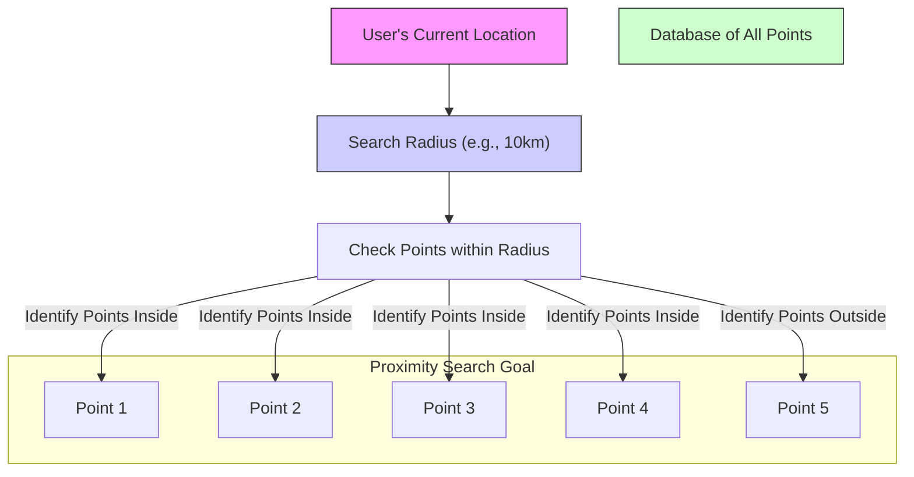
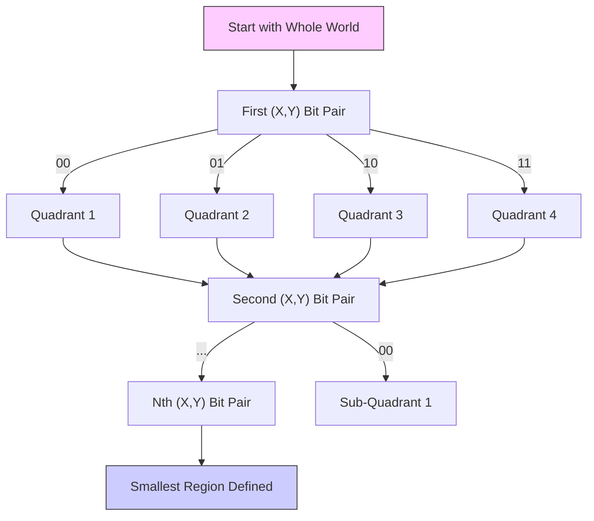

# Designing A Location Database： Quadtrees And Hilbert Curves (1080P24) - Part 1

### Location-Based Databases: Fundamentals and Challenges

Location-based databases are specialized systems designed to store, manage, and query geographical information. They are fundamental to many modern applications that rely on understanding the spatial relationships between entities.

_screenshots/frame_00-00-10.jpg)

**Real-world Applications:**
-   **Navigation and Mapping Services:** Such as Google Maps, which provides directions, points of interest, and real-time traffic updates.
-   **Food Delivery Services:** Like Swiggy, which connects users with nearby restaurants and optimizes delivery routes.
-   **Ride-Sharing Applications:** Services like Uber, which match riders with drivers based on proximity and calculate optimal routes.

#### Early Approaches: Pin Codes / Zip Codes

One of the earliest attempts to categorize and search locations quickly involved assigning unique codes to geographical areas.

-   **Concept:**
    -   In India, these are called **Pin Codes**.
    -   In the US, they are known as **Zip Codes**.
    -   The primary purpose was to assign every location to a specific post office for mail delivery.

_screenshots/frame_00-00-24.jpg)

-   **Structure of a Pin Code (Example: 400050):**
    -   `400050` can be broken down into:
        -   `4`: Represents a broad geographical zone.
        -   `00`: Indicates a specific head post office within that zone.
        -   `050`: Specifies an offset or a smaller delivery area served by that head post office.

-   **Limitations:**
    While useful for postal services, this system is not ideal for modern location-based services because it doesn't inherently understand geographical distance or connectivity.

    *Example: The Train Line Problem*
    Consider two locations with seemingly close pin codes, `400051` and `400050`. If a physical barrier like a train line separates them, a direct path might be impossible. A delivery executive might have to travel a significantly longer distance (e.g., 2 kilometers) to find a crossing, even though the numerical difference in their pin codes is minimal. This leads to inefficiencies and delays, as the system doesn't account for actual travel distance.

```mermaid
graph LR
    subgraph Postal Code System
        A[Location A: Pin 400051]
        B[Location B: Pin 400050]
        A --- "Numerically Close" ---> B
    end

    subgraph Real World
        A_real[Location A]
        B_real[Location B]
        TrainLine["(Train Line)"]
        A_real -- "Physically Close" --> TrainLine
        TrainLine -- "Separates" --> B_real
        A_real -- "2km Detour Needed" --> B_real
    end

    style A_real fill:#f9f,stroke:#333,stroke-width:1px
    style B_real fill:#ccf,stroke:#333,stroke-width:1px
    style TrainLine fill:#ccc,stroke:#666,stroke-width:1px
```

#### Core Requirements for Modern Location-Based Databases

To overcome the limitations of simple code-based systems, effective location-based databases must satisfy several key requirements:

1.  **Ability to Measure Distance Between Any Two Points:**
    -   This requires a **uniform** and **consistent** way of representing locations.
    -   Locations need to be assigned numerical values in a way that allows for direct calculation of the distance between them. This is often achieved through **uniform assignment** of coordinates.

2.  **Scalable Granularity:**
    -   The system must allow for arbitrarily breaking down larger regions into smaller and smaller regions.
    -   This means the precision of location representation should be scalable, enabling fine-grained detail when needed. For instance, you should be able to zoom in on a map and see details down to a few meters or even centimeters.

3.  **Efficient Proximity Search (Nearest Neighbors):**
    -   Given a specific point, the system must be able to quickly identify all other points within a defined radius or distance.
    -   *Example:* "Find all users within 10 kilometers of my current location." This is crucial for applications like ride-sharing or finding nearby services.

_screenshots/frame_00-03-29.jpg)



#### Evaluating Latitude and Longitude for Location Representation

Latitude and longitude coordinates are a common and intuitive way to represent points on the Earth's surface, treating it as a 2D map.

-   **Strengths:**
    -   **Distance Measurement:** Easily calculated using the **Euclidean distance formula** between two (latitude, longitude) pairs. This directly satisfies the first requirement.
    -   **Scalable Granularity:** By adding more decimal places to the latitude and longitude values, you can achieve extremely high precision, theoretically down to nanometers. This satisfies the second requirement.

-   **Weakness: Proximity Search Inefficiency**
    -   The major challenge with using raw latitude and longitude for proximity searches is performance.
    -   To find all points within a certain radius of a given point, a naive approach would involve calculating the Euclidean distance from the query point to *every single other point* in the database.
    -   This is an **O(N)** operation (where N is the total number of points), which becomes prohibitively expensive and slow for large databases (e.g., millions or billions of points globally).

#### Challenges in Numerical Representation (Accuracy)

When storing any numerical data, including latitude and longitude coordinates, in a computer system, there's an inherent limitation:

-   **Fixed Memory Allocation:** Computers allocate a fixed amount of memory (e.g., 32 bits for a `float` or 64 bits for a `double`) for numerical data types.
-   **Limited Accuracy:** Due to this fixed memory, not all real numbers can be represented precisely. For instance, the fraction `10/3` (which is `3.333...`) cannot be stored exactly as a binary floating-point number; it will be approximated.
-   **Impact:** While this might seem minor, it means that even with many decimal places, there's always a finite limit to the precision with which a point's exact location can be stored.

_screenshots/frame_00-04-09.jpg)

| Data Type | Typical Size | Representation | Accuracy Example |
| :-------- | :----------- | :------------- | :--------------- |
| `float`   | 32-bit       | Single-precision floating-point | `5.6856` (limited decimals) |
| `double`  | 64-bit       | Double-precision floating-point | More decimals, but still an approximation for irrational numbers or repeating decimals |

---

#### Understanding Numerical Accuracy and Error Ranges

When a number, especially a floating-point number (like latitude or longitude), is stored in a computer, it's represented using a finite number of bits (e.g., 32-bit `float` or 64-bit `double`). This leads to an inherent **inaccuracy** or **error range**.

_screenshots/frame_00-04-22.jpg)

-   **Concept:** Instead of storing an exact value, the computer stores an approximation. The "true" number lies within a small range around the stored value.
    -   *Example:* For a 32-bit datatype representing `10`, the actual value `X` might be stored such that `9.999999999 < X < 10.000000001`. This means there's a tiny "error area" where the precise location could be.

-   **Binary Search Analogy:**
    -   Imagine a number line. Each bit in a binary representation helps narrow down the location of a number.
    -   If a bit is `0` (and not the Most Significant Bit, MSB, which determines sign), you move to the left half of the current range.
    -   If a bit is `1`, you move to the right half.
    -   The more bits you have, the smaller this final "error range" becomes, increasing precision.

#### Representing Points with Limited Bits

This concept of error range and precision directly applies to representing geographical points (X, Y coordinates).

-   **Splitting Bits:** If you have a 64-bit datatype for a point, you could conceptually split it:
    -   32 bits for the X-axis (longitude).
    -   32 bits for the Y-axis (latitude).
    -   Each axis will have its own small error range, effectively creating an "error area" on the map where the true location lies.

-   **Impact of Fewer Bits:**
    -   If you use very few bits (e.g., just 2 bits for each axis), the partitions become very large.
    -   *Example:* With 2 bits, each axis can represent 4 distinct values (00, 01, 10, 11). This divides the entire world into 4 huge sections along the X-axis and 4 along the Y-axis. Each resulting "cell" on the map would be enormous, potentially containing entire continents.
    -   This means **low accuracy** or **low precision**.

-   **Impact of More Bits:**
    -   Increasing the number of bits increases precision.
    -   Each additional bit halves the size of the region being represented.
    -   This allows for **hierarchical representation**:
        -   You can start with a few bits to define a broad region (e.g., a continent or country).
        -   Then, add more bits to zoom in and define smaller regions (e.g., a city, a neighborhood, a specific building).
    -   *Example:* Using 6 bits for both X and Y might allow you to broadly locate India. All users within that large region could be identified by just these initial 6 bits of their coordinates.

This hierarchical approach is a good way to represent locations because it naturally supports varying levels of detail and allows for initial broad filtering.

#### Search Strategy: Interleaving Bits (Z-order Curve / Morton Code)

The challenge of proximity search (finding nearby points) with standard (X, Y) coordinates is that checking every point is too slow. A more efficient search strategy is needed, especially one that leverages the hierarchical nature of bit representation.

-   **The Problem with Separate X and Y Searches:**
    -   If you just consider the X-coordinate's bits, then the Y-coordinate's bits separately, you're essentially performing two 1D searches. This doesn't inherently group nearby 2D points together in a single sorted list.

-   **Interleaving Bits for Spatial Grouping:**
    -   Instead of comparing X bits then Y bits, we can interleave them.
    -   For a point `(X, Y)`, we take one bit from X, then one bit from Y, then the next bit from X, then the next bit from Y, and so on. This creates a single, combined binary number.

_screenshots/frame_00-06-32.jpg)

-   *Example:* For point (10, 3)
    -   Binary X (10) = `...01010`
    -   Binary Y (3) = `...00011`
    -   Interleaving: Take the first bit of X, then the first bit of Y, then the second bit of X, second bit of Y, etc. This forms a single "spatial key."

-   **Quadrant Division:**
    -   Every pair of interleaved bits (one from X, one from Y) effectively defines which of the four quadrants a point falls into relative to the center of the current region.
    -   `00`: Lower-Left quadrant
    -   `01`: Lower-Right quadrant (assuming X is first, then Y)
    -   `10`: Upper-Left quadrant
    -   `11`: Upper-Right quadrant
    -   This process recursively subdivides the space into smaller and smaller quadrants, allowing you to "zoom in" on a specific area.



#### Proximity and Prefix Matching

A significant advantage of this interleaved bit representation (often called a **Z-order curve** or **Morton code**) is that it often preserves spatial locality.

-   **Prefix Similarity Implies Proximity:**
    -   If two points have very similar interleaved binary representations (i.e., their **Most Significant Bits (MSBs)** or **prefixes** are identical for many bits), it implies that they are located within the same broad geographical region.
    -   The longer the common prefix, the closer the points are likely to be.
    -   *Analogy:* Think of street addresses. `123 Main St, Anytown, CA` is closer to `125 Main St, Anytown, CA` than to `123 Elm St, Othertown, NY`. The common prefix (`123 Main St, Anytown, CA`) indicates proximity.

-   **Benefit for Search:** This allows for efficient proximity searches. Instead of calculating Euclidean distances for every point, you can:
    1.  Generate the interleaved code for your query point.
    2.  Search for other points whose interleaved codes share a long common prefix. These points are likely to be nearby.
    3.  This effectively turns a 2D spatial search into a 1D range search on the interleaved codes, which can be indexed efficiently (e.g., using a B-tree).

#### Caveat: The "Border Problem"

While powerful, the Z-order curve has a critical limitation regarding proximity:

_screenshots/frame_00-07-32.jpg)

-   **Issue:** Two points that are physically very close but lie on opposite sides of a quadrant boundary (especially at a high level of subdivision) will have vastly different interleaved binary prefixes.
-   *Example:*
    -   Point A: `(X_A, Y_A)` which falls into a quadrant whose Morton code starts with `10...`
    -   Point B: `(X_B, Y_B)` which is just across the boundary from Point A, but falls into a quadrant whose Morton code starts with `01...`
    -   Even though A and B are physically very close, their Morton codes will have a significant mismatch in their very first bits (e.g., `10` vs `01`), making them seem distant if only the prefix is considered.
-   **Consequence:** A simple prefix search based on Morton codes might miss genuinely close points that happen to straddle these quadrant boundaries. This necessitates more complex search algorithms (e.g., checking neighboring "cells" or using spatial indexing structures designed to handle these edge cases).

---

### Spatial Data Structures: The Quadtree

To efficiently search for locations on a 2D plane, specialized data structures are required. One such structure is the **Quadtree**.

#### Quadtree Fundamentals

A Quadtree is a tree-based data structure used to divide a two-dimensional space into quadrants or regions. It's conceptually similar to a binary search tree (BST) but adapted for 2D data.

-   **Root Node:** The root of a Quadtree represents the entire spatial region (e.g., the whole world).
-   **Recursive Subdivision:**
    -   Each internal node in a Quadtree has exactly four children, corresponding to the four quadrants (North-East, North-West, South-East, South-West) of its parent region.
    -   This recursive subdivision continues down the tree, with each child node representing a smaller subregion of its parent.
-   **Decision Making:** For each point, two bits (one for X, one for Y) are used per decision to determine which of the four child quadrants it belongs to. This is related to the interleaved bit concept discussed previously.

_screenshots/frame_00-08-08.jpg)

```mermaid
graph TD
    World["World (Root Node)"]
    World --> Q1[Quadrant 1 (Top-Left)]
    World --> Q2[Quadrant 2 (Top-Right)]
    World --> Q3[Quadrant 3 (Bottom-Left)]
    World --> Q4[Quadrant 4 (Bottom-Right)]

    Q1 --> Q1_1[Sub-Quadrant 1.1]
    Q1 --> Q1_2[Sub-Quadrant 1.2]
    Q1 --> Q1_3[Sub-Quadrant 1.3]
    Q1 --> Q1_4[Sub-Quadrant 1.4]

    style World fill:#f9f,stroke:#333,stroke-width:1px
    style Q1 fill:#ccf,stroke:#333,stroke-width:1px
    style Q2 fill:#ccf,stroke:#333,stroke-width:1px
    style Q3 fill:#ccf,stroke:#333,stroke-width:1px
    style Q4 fill:#ccf,stroke:#333,stroke-width:1px
```

#### Adaptive Subdivision and Granularity

The depth to which a Quadtree subdivides regions is not fixed; it's **adaptive** and depends on the data distribution and application requirements.

_screenshots/frame_00-08-34.jpg)

-   **Threshold-Based Splitting:** A common strategy is to subdivide a node (region) only when the number of points within it exceeds a predefined **threshold**.
    -   *Example:* If a node represents a region with 20 points, and the threshold is 10, that node will be split into four children. Each child then represents a smaller subregion.
    -   This process continues until each leaf node contains points below the threshold or a maximum depth is reached.
-   **Application-Specific Granularity:**
    -   For applications requiring city-level detail, the tree might only subdivide until regions correspond to cities.
    -   For applications needing higher precision (e.g., within 1-kilometer radius), the tree will go deeper, creating smaller square regions.
    -   This allows the tree to be **scalable in granularity**, meeting the second core requirement for location-based databases.

#### Quadtree Skew and Performance Concerns

While adaptive subdivision is beneficial, it can lead to performance challenges in certain scenarios:

-   **Skewed Data Distribution:** If points are heavily concentrated in one area (e.g., a densely populated city like Mumbai) while other areas are sparse (e.g., a rural region in Iceland), the Quadtree can become **highly skewed**.
    -   The branches covering dense areas will be very deep, leading to long search paths.
    -   The branches covering sparse areas will be shallow.
-   **Worst-Case Scenario:** A very deep, skewed tree can degrade search performance, as navigating deep branches might approach linear time in the worst case, losing the logarithmic efficiency expected from tree structures.

#### The Challenge of 2D Range Queries

One of the primary motivations for advanced spatial data structures like Quadtrees (and R-trees, another common type) is the inefficiency of **range queries** in a raw 2D plane.

-   **Range Query Definition:** A range query asks for all points that fall within a specified rectangular or circular area.
-   **Difficulty in 2D:** Traditional algorithms are not inherently efficient at finding points within a 2D range without scanning a large portion of the data.

#### The Promise of 1D Conversion

In contrast to 2D, range queries on a 1D line are very well understood and highly efficient.

-   **1D Data Structures:** Data structures like **Interval Trees** and **Segment Trees** can perform range queries on a 1D line with excellent time complexities, typically **O(log N)**, where N is the number of points.
    -   *Analogy:* Imagine searching for numbers in a sorted list. You can quickly find all numbers between 50 and 100 because the list is ordered.
    -   _screenshots/frame_00-10-41.jpg) and _screenshots/frame_00-10-54.jpg) depict this concept, showing a binary tree structure over a 1D array of values, enabling efficient range searches.

-   **The "Holy Grail": Converting 2D to 1D:**
    -   If we could somehow transform a 2D plane into a 1D line while preserving spatial locality (i.e., points close in 2D remain close in 1D), we could leverage these highly efficient 1D data structures to solve 2D range queries quickly.
    -   This would convert a complex 2D problem into a much simpler, already-solved 1D problem.

#### Inspiration from Fractals: Space-Filling Curves

The idea of converting a 2D plane into a 1D line is inspired by mathematical concepts, particularly **fractals** and **space-filling curves**.

-   **Fractals and Fractional Dimensions:** Fractals are geometric shapes that exhibit self-similarity at different scales and often have "fractional dimensions" (e.g., 2.3D). This means they are more complex than a simple 2D line but less than a full 3D volume.
-   **Space-Filling Curves:** The key insight from fractals is the concept of a **space-filling curve**. These are curves that, while being 1-dimensional, can traverse and "fill" a higher-dimensional space (like a 2D plane).
    -   *Goal:* The objective is to map every point in a 2D region to a unique point on a 1D line, such that points that are close in the 2D plane are also close on the 1D line (as much as possible, given the "border problem" caveat mentioned earlier).
    -   This mapping allows us to represent 2D locations as single numbers, which can then be indexed and searched using efficient 1D data structures.

---

### Space-Filling Curves: Bridging 2D and 1D

The core idea for efficiently handling 2D range queries is to transform the 2D problem into a 1D problem. This is achieved using **space-filling curves**, which are continuous curves that pass through every point in a multi-dimensional space.

#### The Goal: Squeezing a Line into 2D Space

-   **Problem:** Efficient range queries are hard in 2D but easy in 1D (using structures like Interval Trees or Segment Trees, which achieve O(log N) search times).
-   **Solution Concept:** "Squeeze" a 1D line into the 2D plane in a way that preserves spatial proximity. This means if two points are close in 2D, their corresponding positions on the 1D line should also be close.

_screenshots/frame_00-12-11.jpg)

This process involves mapping a 2D coordinate `(x, y)` to a single 1D value, often called a **spatial index** or **geohash**.

#### Types of Space-Filling Curves

There are various ways to "squeeze" a line into a 2D space, each creating a distinct pattern or "curve." These patterns determine how 2D proximity is translated to 1D proximity.

1.  **Z-order Curve (Morton Curve):**
    -   This curve creates a "Z" shape as it fills the space.
    -   It's formed by interleaving the bits of the X and Y coordinates.
    -   *Example:*
        ```mermaid
        graph LR
            subgraph Z_Order_Curve ["Z-order Curve (Morton)"]
                Z0[0] --- Z1[1]
                Z1 --- Z2[2]
                Z2 --- Z3[3]
            end
            style Z0 fill:#fff,stroke:#333
            style Z1 fill:#fff,stroke:#333
            style Z2 fill:#fff,stroke:#333
            style Z3 fill:#fff,stroke:#333
        ```
        (Visual representation would show a Z-shape filling a 2x2 grid, starting at 0, moving right to 1, then down-left to 2, then right to 3).
    -   **Proximity:** Generally good, but suffers from the "border problem" where points physically close across quadrant boundaries might have vastly different Z-order codes.

2.  **Hilbert Curve:**
    -   This curve creates a characteristic "U" or "N" shape (depending on orientation) that folds back on itself.
    -   It is known for its **superior spatial locality preservation** compared to the Z-order curve. This means that points close in 2D are more consistently close in their Hilbert curve mapping.
    -   _screenshots/frame_00-12-39.jpg) shows a "U" shape in the first quadrant, representing a Hilbert curve.
    -   **Advantage:** Minimizes the "proximity information loss" or the "border problem" found in Z-order curves. This makes it highly preferred for spatial indexing in many applications.

    *Example (simple Hilbert curve filling a 2x2 grid):*
    ```mermaid
    graph LR
        subgraph Hilbert_Curve ["Hilbert Curve"]
            H0[0] --- H1[1]
            H1 --- H2[2]
            H2 --- H3[3]
        end
        style H0 fill:#fff,stroke:#333
        style H1 fill:#fff,stroke:#333
        style H2 fill:#fff,stroke:#333
        style H3 fill:#fff,stroke:#333
    ```
    (Visual representation would show a U-shape filling a 2x2 grid, starting at 0, moving down to 1, then right to 2, then up to 3).

3.  **Other Curves (e.g., "Alpha Curve"):**
    -   Some curves might create less optimal patterns, like an "alpha" shape mentioned in the transcript.
    -   These might involve drawing a very long curve to fill the space, which generally leads to **worse proximity information loss**. A longer, more winding curve means that two points close in 2D might be far apart on the 1D curve, making 1D range queries ineffective for 2D proximity.

#### Why the Hilbert Curve is Preferred

The Hilbert curve is often the "star of the show" in spatial indexing due to its property of **minimum loss of proximity information**.

-   **Compactness:** It is designed to be as "compact" as possible, meaning it stays within a region longer before moving to an adjacent one. This minimizes jumps in the 1D representation for physically close points in 2D.
-   **Consistency:** It provides a more consistent mapping from 2D proximity to 1D proximity, making range queries on the resulting 1D index more effective.

#### Implementing the Hilbert Curve (Recursive Subdivision)

Once a space-filling curve (like Hilbert) is chosen, the 2D space is recursively mapped to the 1D line segments.

_screenshots/frame_00-13-33.jpg)

-   **Initial Step:** The entire 2D plane (or the region of interest) is mapped to a single 1D line segment.
-   **Subdivision:**
    1.  The 2D plane is divided into four quadrants.
    2.  The corresponding 1D line segment is also divided into four sub-segments.
    3.  Each of these four 1D sub-segments is then "squeezed" into one of the four 2D quadrants according to the Hilbert curve's pattern.
    -   *Example:*
        -   The first quarter of the 1D line might map to the bottom-left quadrant of the 2D space.
        -   The second quarter to the top-left.
        -   The third to the top-right.
        -   The fourth to the bottom-right.
        (The exact mapping depends on the specific Hilbert curve variant and its rotation/reflection properties).
-   **Recursive Application:** This process repeats within each quadrant, progressively filling the 2D space with a higher-resolution segment of the 1D line.

This recursive mapping allows any 2D point to be converted into a single, unique 1D value (its Hilbert curve index), which can then be stored and efficiently queried using standard 1D indexing techniques.

---

### Hilbert Curve: Recursive Construction for Scalable Granularity

The Hilbert curve is not just a single "U" shape; it's a fractal, meaning it can be recursively applied to fill space to arbitrary levels of detail. This property is crucial for achieving scalable granularity in location-based databases.

#### Recursive Subdivision of the Hilbert Curve

The initial Hilbert curve (Level 1) divides the 2D space into four quadrants, numbered 0, 1, 2, 3, and connects them in a "U" shape.

_screenshots/frame_00-16-30.jpg)

-   **Level 1 (Base Shape):**
    -   The entire 1D line segment is conceptually mapped onto the 2D space.
    -   It's divided into four equal parts: segment 0, segment 1, segment 2, and segment 3.
    -   Each of these 1D segments is then "squeezed" into one of the four 2D quadrants according to the Hilbert pattern.
    -   *Example mapping:*
        -   Segment 0 maps to the bottom-left quadrant.
        -   Segment 1 maps to the top-left quadrant.
        -   Segment 2 maps to the top-right quadrant.
        -   Segment 3 maps to the bottom-right quadrant.
    -   This forms the basic "U" shape that connects these four quadrants.

_screenshots/frame_00-17-32.jpg)

-   **Achieving Scalable Granularity (Zooming In):**
    -   To achieve finer detail (zoom in), the recursive nature of the Hilbert curve is utilized.
    -   Each of the four quadrants from Level 1 can *itself* be subdivided into four smaller quadrants, and a new, smaller Hilbert curve (Level 2) is drawn within each.
    -   This means the 1D line segment corresponding to a quadrant (e.g., segment 0) is further broken into four sub-segments (e.g., 0.0, 0.1, 0.2, 0.3), which then map to the sub-quadrants of that region.
    -   This process can be repeated infinitely, allowing for arbitrary depth and precision, as the line segment is continuous and can fill the space to any required resolution.

#### Maintaining Continuity and Pattern

A critical challenge is ensuring the "line" remains continuous as it fills the space at deeper levels. The Hilbert curve has a special property that allows this:

-   **Rotations and Reflections:** As the curve recursively subdivides, the "U" shape (or the basic Hilbert pattern) within each sub-quadrant is often rotated or reflected.
    -   For instance, the two right quadrants might have their "U" shapes facing leftwards, while the upper-left might be in its original position, and the bottom-left might be inverted.
    -   These specific rotations and reflections ensure that the end points of the smaller Hilbert curves within each quadrant align seamlessly with the larger curve's path, creating a continuous line that completely covers the space.

_screenshots/frame_00-17-43.jpg)

-   **Visualizing Recursive Levels:**
    -   **Level 1 (Blue Lines):** Represents the initial "U" shape connecting the four main quadrants. The extreme points of these Level 1 "U"s are connected by the blue lines.
    -   **Level 2 (Red Lines):** Within each of the four Level 1 quadrants, a smaller, rotated/reflected Hilbert curve is drawn. The red lines connect the segments of these Level 2 curves. This recursive shape is more elaborate and covers the space more densely than Level 1.
    -   **Level 3 (Green Lines):** This process is repeated. Each Level 2 quadrant is further subdivided, and a Level 3 Hilbert curve (represented by green lines) is drawn within it.

```mermaid
graph TD
    subgraph Level1 [Overall Grid (Level 1)]
        Q0_L1[Q0]
        Q1_L1[Q1]
        Q2_L1[Q2]
        Q3_L1[Q3]
    end

    subgraph Level2_Q0 [Subdivision of Q0 (Level 2)]
        Q0_0_L2[Q0.0]
        Q0_1_L2[Q0.1]
        Q0_2_L2[Q0.2]
        Q0_3_L2[Q0.3]
    end

    subgraph Level2_Q1 [Subdivision of Q1 (Level 2)]
        Q1_0_L2[Q1.0]
        Q1_1_L2[Q1.1]
        Q1_2_L2[Q1.2]
        Q1_3_L2[Q1.3]
    end

    Q0_L1 --> Q0_0_L2
    Q0_L1 --> Q0_1_L2
    Q0_L1 --> Q0_2_L2
    Q0_L1 --> Q0_3_L2

    Q1_L1 --> Q1_0_L2
    Q1_L1 --> Q1_1_L2
    Q1_L1 --> Q1_2_L2
    Q1_L1 --> Q1_3_L2

    style Q0_L1 fill:#ccf,stroke:#333
    style Q1_L1 fill:#cfc,stroke:#333
    style Q2_L1 fill:#fcc,stroke:#333
    style Q3_L1 fill:#ffc,stroke:#333

    linkStyle 0 stroke:#0000FF,stroke-width:2px;
    linkStyle 1 stroke:#0000FF,stroke-width:2px;
    linkStyle 2 stroke:#0000FF,stroke-width:2px;
    linkStyle 3 stroke:#0000FF,stroke-width:2px;

    linkStyle 4 stroke:#FF0000,stroke-width:2px;
    linkStyle 5 stroke:#FF0000,stroke-width:2px;
    linkStyle 6 stroke:#FF0000,stroke-width:2px;
    linkStyle 7 stroke:#FF0000,stroke-width:2px;
    linkStyle 8 stroke:#FF0000,stroke-width:2px;
    linkStyle 9 stroke:#FF0000,stroke-width:2px;
    linkStyle 10 stroke:#FF0000,stroke-width:2px;
    linkStyle 11 stroke:#FF0000,stroke-width:2px;
```

#### The "Infinite" Nature of Hilbert Curves

-   A key characteristic of the Hilbert curve (and other space-filling fractals) is its ability to completely cover a given 2D space.
-   Because it's an **infinite line** conceptually, it can be recursively subdivided to an arbitrary depth, allowing it to map every single point in the 2D plane to a unique position on the 1D line.
-   This means a point's location can be represented with as much precision as needed, simply by extending its Hilbert curve index (adding more bits to the 1D representation).

---

#### Proximity Search with Hilbert Curve Indices

The main benefit of mapping 2D points to 1D Hilbert curve indices is to enable efficient proximity searches using 1D range queries.

-   **Converting 2D Proximity to 1D Range:**
    -   Each point in the 2D plane is assigned a unique Hilbert curve index (a single number).
    -   Because the Hilbert curve is designed to preserve spatial locality, points that are physically close in 2D will generally have Hilbert indices that are numerically close in 1D.
    -   To find points near a target point (e.g., position 29 in the Hilbert grid), you can perform a 1D range query on the Hilbert indices.

-   **Range Query Example:**
    -   If your target point has a Hilbert index of `29`.
    -   You can define a **threshold** (e.g., `+/- 6`).
    -   This translates to searching for all points with Hilbert indices in the range `[29 - 6, 29 + 6]`, or `[23, 35]`.
    -   This range `[23, 35]` on the 1D line corresponds to a contiguous region in the 2D space, allowing you to efficiently retrieve nearby points.
    -   The deeper the level of the Hilbert curve (more bits in the index), the more accurate and fine-grained this proximity search becomes.

_screenshots/frame_00-19-47.jpg)

This image shows a higher-order Hilbert curve with numerical labels for each cell. If you look at point 29, the points numerically close to it (e.g., 28, 30) are indeed physically close in the grid, demonstrating the proximity-preserving property.

#### Edge Cases and Practical Considerations

While highly effective, the Hilbert curve mapping is not perfect and has some limitations:

-   **The "Boundary Problem" Revisited:**
    -   Despite its superior spatial locality preservation, it's still possible for two physically very close points to have numerically distant Hilbert indices if they happen to fall on opposite sides of a major Hilbert curve "fold" or quadrant boundary at a higher level of recursion.
    -   *Example:* Points `18` and `29` in the diagram have a numerical difference of `11` in their Hilbert indices, yet they appear very close physically. If your threshold was `6`, point `18` would be excluded from the search for point `29`, even though it's nearby.
    -   Conversely, point `40` also has a numerical difference of `11` from `29` but is physically very far. If you increase your threshold to `11` to include `18`, you would also inadvertently include `40`.
    -   **Challenge:** Setting the optimal threshold for the 1D range query can be tricky due to these edge cases.

-   **Practical Compromise:**
    -   In most real-world applications (like food delivery or ride-sharing), the requirement is for **general proximity**, not absolute exactness down to the centimeter.
    -   For these practical scenarios, the Hilbert curve provides a sufficiently good approximation of proximity. The occasional "miss" or "false positive" due to the boundary problem is often acceptable, especially when followed by a precise Euclidean distance check on a smaller, filtered set of points.

#### Conclusion: The Power of 1D Mapping for Location-Based Services

The ability to map a 2D plane to a 1D line using space-filling curves like the Hilbert curve is a fundamental breakthrough for location-based databases.

-   **Enables Efficient Queries:** By transforming 2D coordinates into 1D Hilbert indices, we can leverage highly optimized 1D data structures (like B-trees, Interval Trees, Segment Trees) for efficient range queries.
-   **Scalability:** The recursive nature of the Hilbert curve allows for infinite granularity, meaning any point in the 2D space can be mapped to a 1D index with arbitrary precision.
-   **Real-world Impact:** This technique is foundational to the performance of modern applications that rely heavily on location data, such as:
    -   Food delivery apps (finding nearby restaurants and drivers).
    -   Taxi-hailing services (matching riders with drivers).
    -   Social and dating apps (finding nearby users).

The Hilbert curve effectively "fills" the 2D space, ensuring that every point has a corresponding 1D representation, making complex spatial queries tractable and enabling the development of highly responsive location-aware systems.

---

