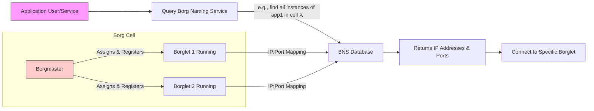

# Google Borg： Billions Of Distributed Linux Containers (1080P30) - Part 1

_screenshots/frame_00-00-00.jpg)

# Google Borg: The Foundation of Google's Infrastructure

Google Borg is a foundational system that has been the backbone of Google's operations for over two decades, first introduced internally around 2005. Despite the paper being published in 2015, Borg's longevity underscores its critical role and robust design. It serves as the primary **compute and memory provider** for nearly all processes at Google, powering approximately 98% of all Google servers.

Borg's significance lies in its ability to abstract away the complexities of infrastructure management, allowing application developers to focus solely on their code.

## Core Responsibilities and Process Lifecycle Management

Borg comprehensively manages the entire lifecycle of a process, from initial deployment to handling failures and scaling.

_screenshots/frame_00-00-48.jpg)

**Developer's Perspective:**
As an application developer, your primary concern is your application's code. Once ready, you simply deploy it to Borg. Borg then takes over, handling all the underlying infrastructure decisions and operations.

```mermaid
graph LR
    Dev[Application Developer] --> Deploy[Deploy Application Code]

    subgraph BorgSystem [Google Borg]
        Deploy --> FindDC[Finds suitable Data Center(s)]
        FindDC --> ResourceAlloc[Allocates necessary Resources (CPU, Memory)]
        ResourceAlloc --> SpinUp[Spins Up or Down Instances]
        SpinUp --> Monitor[Monitors Process Health]
        Monitor -- "Crash Detected" --> Restart[Restarts Failed Process]
        Monitor -- "Frequent Failures" --> Migrate[Migrates Process to Healthy Server]
    end

    BorgSystem --> AppRunning[Application Running Reliably]

    style Dev fill:#f9f,stroke:#333,stroke-width:1px
    style AppRunning fill:#ccf,stroke:#333,stroke-width:1px
```

This end-to-end management by Borg ensures applications are deployed, resources are allocated efficiently, and services remain available even in the face of failures.

## Key Features of Google Borg

Borg provides a suite of features that are crucial for managing Google's vast and complex infrastructure:

*   **Load Balancing:** It intelligently distributes incoming traffic across various instances of a service to ensure optimal performance and prevent any single server from becoming overloaded.
*   **Service Deployment & Hardware Utilization:** Borg ensures that services are judiciously deployed across the available hardware. This maximizes the utilization of computing resources, translating directly into cost savings for Google's massive server fleet.

    _screenshots/frame_00-01-48.jpg)

    *Conceptual view of Borg managing a large fleet of servers across data centers.*

*   **Process Lifecycle Management:** Beyond initial deployment, Borg actively manages processes by:
    *   **Restarting Crashed Processes:** If an application instance crashes, Borg automatically detects the failure and restarts it to maintain service availability.
    *   **Migrating Failing Processes:** For processes that frequently fail or exhibit instability, Borg can migrate them to different, healthier servers to ensure continuous operation.
*   **Service Discovery (Borg Naming Server - BNS):** Borg includes a mechanism, similar to a Domain Name System (DNS), called the **Borg Naming Server (BNS)**.
    *   It maintains a comprehensive list of where every process is running.
    *   This allows application developers or other services to discover the exact location (IP address, port) of a deployed application instance (e.g., specific instances of Google Maps across clusters).
*   **Auto-scaling:** Borg dynamically adjusts the number of running instances for a service based on demand. While a common feature today (2025), this was a significant innovation and a "big deal" when Borg was developed in 2005, allowing Google to efficiently handle fluctuating workloads.
*   **Capacity Planning (Observability):** Borg provides essential metrics and observability tools that aid DevOps engineers in capacity planning.
    *   By analyzing service needs and resource consumption data provided by Borg, engineers can make informed business decisions regarding future hardware purchases and infrastructure scaling.

## Scale and Characteristics

_screenshots/frame_00-03-25.jpg)

Borg operates at an extraordinary scale, exhibiting several key characteristics:

*   **Massive Scale:** Google deploys approximately **4 billion containers** (representing 4 billion processes) every week through Borg. This staggering number highlights the system's robustness and efficiency in managing an immense workload.
*   **Highly Configurable:** Given the diverse requirements of thousands of engineers across Google, Borg is designed to be highly configurable and extensible. This flexibility ensures that engineers can tailor the system to their specific needs, preventing them from developing their own disparate solutions.
*   **Highly Available:** Borg is designed for extreme high availability because virtually all of Google's critical services—including Google File System (GFS), Spanner, and Bigtable—run on top of it.
    *   A failure in Borg would effectively bring down Google's entire operation.
    *   Therefore, Borg incorporates sophisticated mechanisms to ensure it rarely fails, making it one of the most resilient systems at Google.

## Connection to Kubernetes

Borg's influence extends beyond Google's internal infrastructure. **Kubernetes**, a widely popular open-source container orchestration platform, was developed by engineers at Google who previously worked on Borg. Kubernetes shares a significant architectural resemblance to Borg, with approximately 90% of its internal design principles traceable back to the Borg paper. Studying Borg provides deep insights into the foundational concepts behind modern container orchestration.

---

## Borg vs. Kubernetes: A Comparison

While Kubernetes is heavily inspired by Borg, there are several key differences, primarily stemming from their respective origins as an internal Google system versus an open-source project.

_screenshots/frame_00-04-33.jpg)

| Feature                       | Borg                                  | Kubernetes                                  |
| :---------------------------- | :------------------------------------ | :------------------------------------------ |
| **Source Model**              | Closed-source, proprietary to Google  | Open-source, community-driven               |
| **Deployment Scale**          | Designed for very large-scale "cells" or clusters within Google | Can be deployed at virtually any scale, from small clusters to large enterprises |
| **Ease of Use & Documentation** | Less external documentation, Google-specific APIs and terminology | Easier to learn, better public documentation, generic and well-designed APIs |
| **Orchestration Model**       | **Centralized orchestration** via a single **Borgmaster** that directs tasks | **Decentralized orchestration** relying on a set of microservices (e.g., API Server, Scheduler, Controller Manager) |
| **Pod/Task Tagging**          | Limited tagging capabilities; querying requires regular expressions (regex) | Rich tagging language for pods (e.g., `app: google-maps`, `env: production`, `region: india`), improving querying and debugging |

**Analogy for Centralized vs. Decentralized Orchestration:**
*   **Borg (Centralized):** Imagine a single, all-knowing "master conductor" (Borgmaster) telling every musician (server) exactly what to play and when. If the conductor is busy or falls ill, the orchestra might struggle.
*   **Kubernetes (Decentralized):** Picture a team of specialized section leaders (microservices) who coordinate among themselves to ensure the orchestra plays harmoniously. Even if one section leader is momentarily unavailable, others can step in or continue their work, making the system more resilient.

While Borg's centralized approach has proven effective for Google's internal scale, Kubernetes' decentralized architecture is often considered more modern and resilient for general-purpose use. It's plausible that Borg has adopted some of Kubernetes' innovations, such as enhanced tagging, though this wouldn't be public information.

## Internal Mechanics of a Borg Job

_screenshots/frame_00-05-39.jpg)

Every task or application deployed on Borg is defined as a **Borg Job**. A critical attribute of each Borg Job is its **priority**, which dictates how Borg manages its lifecycle and resource allocation.

### Borg Job Priorities

Borg prioritizes jobs to ensure that the most critical services remain operational and have access to necessary resources. Priorities are ranked in descending order:

1.  **Monitoring:**
    *   **Highest Priority.** These jobs are crucial for the health and observability of the entire system.
    *   They are essential for detecting failures and ensuring that other jobs can be managed effectively. If monitoring fails, the system becomes blind.
2.  **Production:**
    *   Jobs that support live, user-facing applications (e.g., Google Maps, Search).
    *   These are critical for Google's core business and user experience.
3.  **Batch:**
    *   Jobs that run in the background, typically for data processing, analytics, or other non-real-time tasks (e.g., MapReduce jobs).
    *   These can tolerate some delays or preemption.
4.  **Free:**
    *   **Lowest Priority.** These are opportunistic jobs that run on spare capacity, often for internal research, less critical computations, or experimental tasks.
    *   They are the first to be preempted.

_screenshots/frame_00-06-12.jpg)

### Preemption Mechanism

Borg employs a preemption algorithm based on these priorities:

*   **Higher Priority Preempts Lower Priority:** If a server is running a lower-priority job (e.g., a **Batch** job) and a higher-priority job (e.g., a **Production** job) needs resources on that same server, the lower-priority job will be **preempted** (killed) to free up resources for the higher-priority one.
    *   The preempted job is then typically rescheduled elsewhere if resources are available.

```mermaid
graph LR
    JobProd["Production Job (High Priority)"]
    JobBatch["Batch Job (Low Priority)"]
    Server[Server]

    JobBatch --> Server
    JobProd --> Server
    JobProd -- "Arrives and needs Server" --> Server
    Server -- "Preempts" --> JobBatch_Killed[Batch Job (Killed)]
    Server -- "Runs" --> JobProd_Running[Production Job (Running)]

    style JobProd fill:#fcf,stroke:#333,stroke-width:1px
    style JobBatch fill:#ccf,stroke:#333,stroke-width:1px
    style JobProd_Running fill:#afa,stroke:#333,stroke-width:1px
    style JobBatch_Killed fill:#fcc,stroke:#333,stroke-width:1px
```

*   **Avoiding Cascade Preemption:** To prevent a chain reaction where a high-priority job keeps displacing others down the priority ladder (e.g., Production displaces Batch, which displaces Free, leading to many jobs being killed and rescheduled), Borg has a crucial rule:
    *   **Production jobs cannot be preempted.** Only existing **Batch** or **Free** jobs can be kicked out to make way for higher-priority tasks. This prevents critical production services from being moved around unnecessarily and ensures stability.

### Job Constraints and Rules

In addition to priority, a Borg Job definition can include **rules or constraints** that specify requirements for its execution environment. These constraints help Borg make intelligent placement decisions. Examples include:

*   **Operating System Type:** Specifying a particular OS.
*   **IP Addresses:** Requiring specific network configurations.
*   **Hardware Specifications:** Demanding a certain number of large servers, or specific hardware capabilities.
*   **Geographic Region:** For instance, requiring the job to run in a data center in "India."

While engineers can define these constraints, the speaker notes that most engineers don't heavily utilize this feature, possibly due to its complexity or Borg's ability to generally make good placement decisions without explicit guidance. Borg is designed to solve what can become a complex **linear programming problem** to efficiently allocate resources based on these constraints.

---

### Execution Environment: Linux Containers

_screenshots/frame_00-07-18.jpg)
_screenshots/frame_00-07-44.jpg)
_screenshots/frame_00-07-56.jpg)

When a Borg job runs, it doesn't typically run directly on a Virtual Machine (VM) because VMs introduce overhead and can be slower to provision. Instead, Borg leverages **Linux Containers** as the fundamental unit of execution. Containers offer a lightweight and efficient way to isolate applications.

Borg utilizes core Linux features to manage these containers:

*   **`chroot` Jail (Change Root):** This mechanism provides **security isolation**.
    *   Think of `chroot` as creating a "jail" for a process, restricting its view of the file system to a specific directory tree.
    *   This prevents a process running inside the container from accessing or tampering with files outside its designated area on the host system. It's conceptually similar to changing file permissions using `chmod`.
*   **Cgroups (Control Groups):** Cgroups are used for **resource management and allocation**.
    *   They allow Borg to limit and monitor the resources (CPU, memory, network I/O, disk I/O) that a container can consume.
    *   For example, an engineer can specify that their application needs "at least this much file storage for logs," and Cgroups ensure that resource guarantee is met.
    *   This prevents one runaway process from monopolizing system resources and affecting other applications on the same host.

**Process Management within Containers:**
When Borg needs to restart a process within a container, it sends standard Linux signals:
*   `SIGTERM` (kill -15): A polite request for the process to terminate gracefully. This allows the application to clean up resources before shutting down.
*   `SIGKILL` (kill -9): A forceful termination signal. If `SIGTERM` doesn't work, `SIGKILL` is used to immediately stop the process, ensuring it shuts down. After termination, Borg can then restart the container.

## Borg Architecture: Cells and Borgmaster

_screenshots/frame_00-08-09.jpg)

Borg organizes its infrastructure into **cells**. A single Borg cell is a large cluster of machines, typically comprising around **10,000 servers**. While this might sound like a small number at Google's overall scale, it represents a substantial computing environment.

### The Borgmaster

Each Borg cell is managed by a single, central component known as the **Borgmaster**.

*   **Central Point of Control:** The Borgmaster is responsible for:
    *   Maintaining the overall configuration of the cell.
    *   Assigning tasks (Borg jobs) to individual machines (known as **Borglets**, which are analogous to **pods** in Kubernetes).
    *   Coordinating the deployment of applications, often across thousands of machines within its cell.
*   **Single Point of Failure (SPOF):** The Borgmaster is a single point of failure for its cell. If the Borgmaster goes down, it cannot assign new tasks or reconfigure existing ones.
*   **Availability during Borgmaster Downtime:** Despite being an SPOF, the availability of services running within the cell is not severely affected by a temporary Borgmaster outage. This is because:
    *   **Borglets continue functioning:** The individual Borglets (containers) running on the machines continue to execute their assigned tasks even if the Borgmaster is unavailable. They don't immediately stop.
    *   Borg has robust mechanisms (which will be discussed later) to ensure the Borgmaster itself is highly available and can recover quickly.

### Task Assignment and Bin Packing

When a request comes to the Borgmaster to execute an application (e.g., "please run this application on 5,000 machines"), the Borgmaster performs a complex task assignment process. This involves selecting an appropriate cell and then distributing the application's instances across machines within that cell.

The distribution aims for **high fault tolerance**, meaning instances are spread across different power domains, racks, and potentially regions to minimize the impact of localized failures.

This task assignment is fundamentally a **bin packing problem**:
*   **Goal:** Efficiently pack "items" (Borglets/tasks requiring specific resources) into "bins" (servers with available capacity).
*   **Challenge:** Find the optimal placement that balances resource utilization, fault tolerance, and assignment speed.

There are different strategies for bin packing:

*   **Best Fit Strategy:**
    *   **Concept:** Find the server that has just enough (or the closest amount of) available resources to perfectly fit the incoming task.
    *   **Pros:** Maximizes resource utilization, potentially leaving larger contiguous blocks of free space on other servers for bigger future tasks.
    *   **Cons:**
        *   **Slower Assignment:** Requires more computation to find the "best" fit, leading to higher latency for task assignment.
        *   **Risk of Over-Allocation/Crash:** If an application claims it needs 30% CPU but actually consumes 35% (common with dynamic workloads like MapReduce), it can lead to the server becoming overloaded and the application crashing. This reduces resilience.
        *   **Fragmentation:** Can lead to many small, unusable gaps across servers if only "perfect" fits are sought, making it hard to place larger future tasks.

*   **First Fit / "Anyone" Strategy:**
    *   **Concept:** Quickly find *any* server that can accommodate the task, even if it's not the most efficient fit.
    *   **Pros:**
        *   **Faster Assignment:** Much quicker to schedule tasks as it doesn't need to search extensively.
    *   **Cons:**
        *   **Resource Waste:** Might leave servers with significant unused capacity if a task is placed on a server with much more available resources than it needs, potentially leading to inefficient resource utilization at scale.
        *   **Potential for Future Bottlenecks:** If a server with 60% capacity gets a 30% task, it's left with 30%. If the next task needs 40%, it won't fit, even if other servers might have had better remaining capacity had the first task been placed differently.

### Borg's Hybrid Approach

Borg adopts a **hybrid approach** to task assignment, balancing the trade-offs between speed, resource utilization, and resilience. It doesn't strictly adhere to "best fit" or "first fit" but rather combines elements to ensure tasks are assigned quickly while maintaining system stability and efficient resource use across its massive fleet. This typically means prioritizing quick assignment and resilience over absolute perfect fit, accepting some minor resource "waste" to prevent cascading failures or assignment delays.

---

### Borg Naming Service (BNS)

_screenshots/frame_00-11-21.jpg)
_screenshots/frame_00-11-46.jpg)
_screenshots/frame_00-12-25.jpg)

Once a Borglet (a containerized task) is assigned to a machine and starts running, its location needs to be discoverable. This is handled by the **Borg Naming Service (BNS)**.

*   **Functionality:** BNS is analogous to a Domain Name System (DNS). It maintains a mapping between symbolic service names and the actual IP addresses of the servers where those services are running.
*   **Naming Convention:** BNS uses a structured naming convention for Borglets, which might look something like:
    `30.app1.user-id.cell-id.borg.google.com`
    *   `30`: Instance ID (e.g., the 30th instance of `app1`).
    *   `app1`: The name of the application.
    *   `user-id`: The ID of the user who deployed the application.
    *   `cell-id`: The identifier of the Borg cell where the application is running.
    *   `borg.google.com`: A fixed domain suffix for Borg services.
*   **Discoverability:** This naming scheme allows users or other services to query BNS (potentially using regular expressions for more complex queries) to find all running instances of a particular application, deployed by a specific user, within a given cell. This is crucial for service discovery and debugging.



### Chubby: The Metadata Store

All the metadata related to Borg job execution is stored in **Chubby**.

*   **Role:** Chubby is a Paxos-based distributed lock service and a consistent key-value store used extensively by Google's infrastructure.
*   **Stored Metadata:** Chubby stores critical state information about Borg jobs and Borglets, including:
    *   **Job States:**
        *   `Pending`: Job submitted, awaiting assignment to a Borglet.
        *   `Running`: Job actively executing on a Borglet.
        *   `Stopped`: Job has terminated or been explicitly stopped.
    *   **Borglet Health:** Information about the operational status and health of individual Borglets.
    *   **Resource Allocation:** Details about which resources are assigned to which Borglets.
*   **Consistency:** Chubby is designed for high consistency, especially for writes, ensuring that all clients see the same, up-to-date state. While Google has evolved to use systems like Spanner (a globally consistent database), Chubby remains a foundational component for distributed coordination and metadata storage.

### Log Management and Monitoring

*   **Local Log Storage:** Unlike some expectations that logs would be sent directly to a distributed file system like GFS, Borglets initially store their application logs in **local files** on the machine they are running on.
*   **Log Rotation and Purging:** These local log files are actively rotated (e.g., daily or hourly) and **purged** (deleted) after a certain period (e.g., within one or two days after a Borglet finishes processing an app or is moved). This prevents log accumulation from consuming excessive local disk space.
*   **Metrics and Observability:** For system-wide monitoring and business intelligence, application metrics are emitted to a time-series data store.
    *   Historically, Google used **Borgmon** for this purpose.
    *   Currently, they use **Monarch**, a more advanced time-series database.
    *   These metrics are then sent to **Dremel**, a query service that allows engineers (e.g., DevOps) to run SQL queries.
    *   This enables them to analyze system performance, understand resource consumption patterns (e.g., "what kind of applications are taking up most of the compute power?"), and make informed business decisions regarding capacity planning and resource allocation.

### Resource Depletion and Process Killing

_screenshots/frame_00-14-07.jpg)
_screenshots/frame_00-14-20.jpg)

Machines in a Borg cell have finite resources. If a machine starts running out of a critical resource (e.g., memory), Borg initiates a process to reclaim resources:

*   **Memory Depletion:** If a machine is out of memory, Borg immediately begins killing processes to free up space. The killing order follows the established priority hierarchy:
    1.  **Low-priority jobs (Batch and Free)** are killed first.
    2.  This ensures that critical Production and Monitoring jobs are protected as long as possible.
*   **Temporary Resource Spikes (e.g., CPU Choking):** For temporary resource spikes, such as 100% CPU usage or network congestion, Borg will **wait for a short period**.
    *   It gives the system a chance to recover naturally.
    *   However, if the situation does not improve, Borg will eventually start killing processes, again starting with the lowest priority ones, to stabilize the machine.

This intelligent resource management and preemption strategy are vital for maintaining the stability and availability of Google's services, even under heavy load or unforeseen resource contention.

### Borgmaster High Availability

As previously mentioned, the Borgmaster is a single point of failure for new task assignments and reconfigurations within a cell. To mitigate this risk and ensure continuous operation, Borgmaster itself is designed for **high availability**:

*   **Replication:** There are **multiple replicas of the Borgmaster** (typically five) running simultaneously.
*   **In-Memory State:** These replicas keep their state in memory, allowing for very fast failover.
*   **Consensus (Paxos/Chubby):** While not explicitly stated in this segment, these replicas would use a consensus protocol (like Paxos, likely facilitated by Chubby) to ensure they all agree on the current state and to elect a new leader if the primary Borgmaster fails. This setup ensures that if one Borgmaster instance dies, another can quickly take over, minimizing disruption to task scheduling and management.

---

### Borgmaster High Availability (Continued)

_screenshots/frame_00-15-24.jpg)
_screenshots/frame_00-16-01.jpg)

The high availability of the Borgmaster is critical because, while Borglets continue to run even if the master is down, no new tasks can be scheduled or reconfigurations applied. Borg achieves this by having **multiple in-memory replicas** of the Borgmaster (typically five) within a cell.

*   **Leader Election:** These replicas engage in a **leader election process** using a consensus algorithm like **Paxos**.
    *   One replica is elected as the primary (leader) Borgmaster, which handles all scheduling and management operations.
    *   The other replicas are followers, maintaining synchronized in-memory copies of the state.
*   **State Synchronization:** All Borgmaster replicas keep their state synchronized. This synchronization is largely managed by **Chubby**, which acts as a persistent store for the Borgmaster's state.
*   **Failover:** If the active Borgmaster fails, the other replicas quickly detect the failure, trigger a new leader election, and one of the synchronized replicas takes over as the new leader. This ensures rapid recovery and minimal disruption to the scheduling capabilities of the cell.

```mermaid
graph LR
    subgraph BorgmasterHA [Borgmaster High Availability]
        BM1[Borgmaster Replica 1]
        BM2[Borgmaster Replica 2]
        BM3[Borgmaster Replica 3]
        BM4[Borgmaster Replica 4]
        BM5[Borgmaster Replica 5]

        BM1 -- "Paxos Consensus" --> BM2
        BM2 -- "Paxos Consensus" --> BM3
        BM3 -- "Paxos Consensus" --> BM4
        BM4 -- "Paxos Consensus" --> BM5
        BM5 -- "Paxos Consensus" --> BM1

        BM1 -- "Leader Election" --> ActiveBM[Active Borgmaster]
        ActiveBM -- "Writes State" --> Chubby[Chubby (Persistent Store)]
        Chubby -- "Reads State" --> BM1
        Chubby -- "Reads State" --> BM2
        Chubby -- "Reads State" --> BM3
        Chubby -- "Reads State" --> BM4
        Chubby -- "Reads State" --> BM5
    end

    Task[Incoming Task] --> ActiveBM
    ActiveBM -- "Schedules" --> Borglet[Borglets in Cell]

    style ActiveBM fill:#f9f,stroke:#333,stroke-width:2px
    style Chubby fill:#ccf,stroke:#333,stroke-width:1px
```

### Optimization Techniques in Borg

Borg employs several optimization techniques to enhance its efficiency, speed, and resource utilization:

1.  **Heavy Caching of Borglet Parameters:**
    *   **Concept:** Information about each Borglet (server) and its capabilities is frequently accessed by the Borgmaster for scheduling decisions. This includes static attributes like:
        *   Geographic region
        *   Physical size of the server
        *   Power connectivity/domain
        *   Available resources (CPU, memory, etc.)
    *   **Benefit:** Instead of re-computing or fetching this information repeatedly, Borgmaster caches these "scores" or definitions for each Borglet. This allows it to quickly evaluate potential placement options and make scheduling decisions with minimal latency. Only when a physical server's configuration changes is this cached information updated.

2.  **Application Classifications:**
    *   **Concept:** Instead of defining unique resource requirements for every single application instance, Borg groups applications into "classes" based on their resource consumption patterns.
    *   **Examples:**
        *   **I/O intensive applications** (e.g., database writes, large file transfers)
        *   **Memory intensive applications** (e.g., in-memory caches, large data processing)
        *   **CPU intensive applications** (e.g., complex computations, video encoding)
    *   **Benefit:** This simplifies scheduling. The Borgmaster can quickly find an appropriate Borglet (server) that best matches the resource profile of the application class, rather than evaluating individual, highly specific requirements for each application. This reduces the complexity of the bin packing problem and makes scheduling faster and more efficient.

3.  **Library Caching and Pre-assignment:**
    *   **Concept:** To accelerate application startup times, Borg intelligently schedules applications onto Borglets that already possess the necessary application libraries. This is similar to how build systems like Bazel cache dependencies.
    *   **Benefit:** By leveraging existing cached libraries on a Borglet, the time required to download and set up the application environment is significantly reduced. The speaker notes a dramatic improvement, reducing start times from **25 seconds to just 5 seconds**. This is crucial for rapid deployments and restarts across thousands of servers, making the entire deployment process very fast.

## The Enduring Impact of Google Borg

_screenshots/frame_00-16-39.jpg)

Google Borg, despite being designed in 2005 and the subject of a 2015 paper, remains the fundamental system underpinning 98% of Google's operations. Its longevity and pervasive use underscore its robust design and foresight.

Key takeaways about Borg's lasting impact:

*   **Pioneering Containerization:** Borg introduced core concepts of containerization, process isolation (`chroot`, Cgroups), and resource management long before they became mainstream in the industry.
*   **Architectural Simplicity (Core):** At its heart, Borg's internal architecture revolves around the simple yet powerful concepts of **cells**, the **Borgmaster**, and **Borglets**. Much of its complexity is externalized or built around these core components.
*   **Innovation Ahead of its Time:** Features like auto-scaling and cross-region fault tolerance, which are common expectations in cloud-native systems today, were cutting-edge innovations when Borg was first developed. Google's principal engineers effectively solved these distributed systems challenges years in advance.
*   **Foundation for Kubernetes:** Borg's influence on Kubernetes is undeniable, making it a crucial study for understanding modern container orchestration principles.

---

This concludes the notes on Google Borg. The discussion covered its foundational role at Google, its key features, a comparison with Kubernetes, its internal architecture including job priorities and scheduling, and various optimization techniques.

_screenshots/frame_00-18-23.jpg)

The core concepts of Borg – cells, Borgmaster, and Borglets – effectively encapsulate the fundamental logic of containerization and orchestration, demonstrating Google's pioneering work in this domain since 2005. Its design principles, such as auto-scaling and cross-region fault tolerance, were innovative for their time and have influenced modern distributed systems significantly.

---

