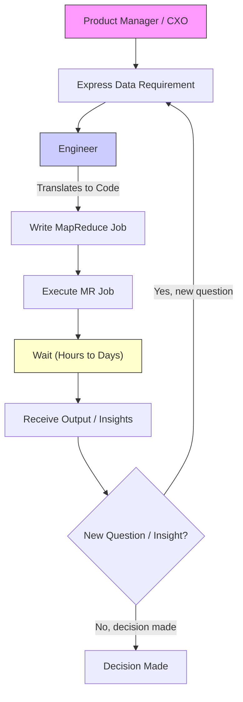

# Google Dremel： Interactive Analysis Of Web Scale Datasets (1080P25) - Part 1

_screenshots/frame_00-00-01.jpg)

# Google Dremel: A Deep Dive into Interactive Analytics

## Introduction to Google Dremel

_screenshots/frame_00-00-14.jpg)
_screenshots/frame_00-00-39.jpg)

Google Dremel, a system detailed in a seminal 2008 paper, has profoundly influenced the field of data analytics. Its impact is so significant that it continues to be used at Google, notably powering parts of **BigQuery**, over 15 years after its inception. This enduring relevance led to Dremel receiving the **VLDB Test of Time Award in 2020**, recognizing its long-term impact on database research and practice. For any software engineer, understanding Dremel is crucial due to its foundational role in large-scale data processing.

## The Challenge: Analyzing Petabytes of Data in 2008

In 2008, Google faced the challenge of analyzing **petabytes** of data. Various stakeholders, including Product Managers (PMs), engineers, and CXOs (Chief Experience Officers/Executives), frequently needed to query this vast dataset to identify patterns, gain insights, and make informed business decisions. These were often **"one-off" queries**, meaning specific, ad-hoc questions rather than recurring reports.

### The Problem with Traditional Data Processing (MapReduce Era)

_screenshots/frame_00-02-35.jpg)
_screenshots/frame_00-02-47.jpg)

At the time, the standard approach for processing such massive datasets was **MapReduce**. While powerful for batch processing, MapReduce presented significant limitations for interactive analytics:

1.  **Code-Defined Jobs**:
    *   MapReduce jobs required **engineers to write custom code or scripts** for each specific query request.
    *   Product Managers and CXOs would articulate their data needs to engineers, who would then translate these requirements into executable MapReduce jobs.

2.  **Slow Iteration Cycle**:
    *   Consider an example: A Product Manager wants to know, "What percentage of people taking long road trips (e.g., Mumbai to Goa) stop at restaurants along the way?" This information could be used to serve contextual ads.
    *   An engineer would write a MapReduce job, execute it, and provide an answer (e.g., "56%").
    *   If the PM then had a follow-up question (e.g., "Is this percentage increasing over the last three months?"), the entire process had to repeat:
        *   New requirement communicated to the engineer.
        *   Engineer writes *new* code.
        *   Engineer executes the *new* job.
        *   Wait for *new* results.

This iterative process was incredibly time-consuming, often taking **days** (typically 1 to 3 days) even with dedicated engineering resources. This slow feedback loop severely hindered decision-making.

### The Pain Points

The inefficiencies of the MapReduce-centric approach created significant frustration across different roles:

*   **Product Managers & CXOs**:
    *   Were unable to rapidly explore data and iterate on their questions.
    *   Decision-making was delayed due to long query turnaround times.
    *   Felt systems were slow and engineers were unresponsive.

*   **Engineers**:
    *   Spent a disproportionate amount of time writing custom scripts for one-off queries, rather than on core product development.
    *   Were constantly interrupted by new data requests.
    *   Dealt with the complexities of MapReduce job failures and restarts, which were often described as a "nightmare."

This situation highlighted a critical need for a more agile and responsive data analysis solution.

### Visualizing the Slow Iteration Process with MapReduce

The following diagram illustrates the cumbersome iterative query process using MapReduce:



## The Solution: Interactive Analytics

Google recognized that to overcome these challenges, they needed an **interactive analytics system**. This system had two primary goals:

1.  **Speed**: Provide query results within **one minute**. This would transform data exploration from a multi-day waiting game into a rapid, iterative process.
2.  **Efficiency**: **Free up engineers** from constantly writing custom data mining scripts, allowing them to focus on more strategic development tasks.

This push for interactive analytics was the driving force behind the development of Dremel.

---

### Empowering Users with Direct Query Access

_screenshots/frame_00-04-04.jpg)
_screenshots/frame_00-04-15.jpg)

A core aspect of Dremel's design was to **remove the dependency on software engineers** for routine data queries. Instead of engineers writing custom MapReduce jobs, Dremel aimed to provide an interface that allowed Product Managers (PMs) and other stakeholders to query data directly.

This shift offers several key benefits:

*   **Reduced Dependency**: PMs no longer need to consult engineers for every data question, significantly streamlining the data exploration process.
*   **Faster Iteration**: Stakeholders can fire queries, get immediate results, and ask follow-up questions without waiting for engineering cycles.
*   **Cost Efficiency**: Instead of highly-paid software engineers dedicating time to ad-hoc data requests, Dremel enables PMs to query data themselves or leverage more cost-effective data analysts.

### The Role of SQL

The chosen interface for direct querying in Dremel is **SQL (Structured Query Language)**. This was a strategic decision because:

*   **Familiarity**: Many Product Managers have at least a high-level understanding of SQL.
*   **Leveraging Data Analysts**: For those PMs less familiar with SQL, organizations can utilize specialized data analysts who are proficient in writing complex SQL queries. This is a more economical solution than using software engineers for data extraction.

This direct SQL access was a major factor in Dremel's success and widespread adoption in the analytics space.

## Interactive Analytics: Access Patterns and System Design

Achieving interactive query performance (results within one minute) necessitates a deep understanding of how the system will be used and optimizing for those access patterns.

### Typical Query Characteristics

Dremel was designed primarily for **statistical and aggregate queries**, rather than retrieving individual records. CXOs and Product Managers typically don't need to see every single detail (e.g., "which specific person went to which restaurant"). Instead, they require:

*   **Counts**: How many?
*   **Aggregates**: Sums, averages, percentages.
*   **Statistical Data**: Trends, distributions.

These types of queries are crucial for making high-level business decisions. To answer these questions quickly, two operations must be exceptionally fast:

1.  **Filtration**: Rapidly sifting through massive datasets to find relevant records.
2.  **Aggregation**: Efficiently combining filtered data to compute counts, sums, or averages.

## Dremel's Query Architecture: A Tree-Based System

_screenshots/frame_00-05-44.jpg)
_screenshots/frame_00-06-18.jpg)

Dremel's architecture is designed as a **tree-based system** to enable rapid, parallel processing of queries. Let's break down its components:

```mermaid
graph TD
    Client["Client (PM/Dashboard)"] --> QueryManager[Query Manager]
    QueryManager --> Root[Root Node]
    Root -- "Distributes query" --> Shard1[Shard 1]
    Root -- "Distributes query" --> Shard2[Shard 2]
    Shard1 -- "Recursively queries" --> Shard1_1[Shard 1.1]
    Shard1 -- "Recursively queries" --> Shard1_2[Shard 1.2]
    Shard2 -- "Recursively queries" --> Shard2_1[Shard 2.1]
    Shard2 -- "Recursively queries" --> Shard2_2[Shard 2.2]
    Shard1_1 --> L1[Leaf Node L1]
    Shard1_2 --> L2[Leaf Node L2]
    Shard2_1 --> L3[Leaf Node L3]
    Shard2_2 --> L4[Leaf Node L4]
    L1 --> Colossus[Colossus (Disk)]
    L2 --> Colossus
    L3 --> Colossus
    L4 --> Colossus

    subgraph Query Flow
        Client --> QueryManager
        QueryManager --> Root
    end

    subgraph Data Processing Hierarchy
        Root --> Shard1
        Root --> Shard2
        Shard1 --> Shard1_1
        Shard1 --> Shard1_2
        Shard2 --> Shard2_1
        Shard2 --> Shard2_2
        Shard1_1 --> L1
        Shard1_2 --> L2
        Shard2_1 --> L3
        Shard2_2 --> L4
    end

    style Client fill:#f9f,stroke:#333,stroke-width:1px
    style QueryManager fill:#ccf,stroke:#333,stroke-width:1px
    style Root fill:#bbf,stroke:#333,stroke-width:1px
    style Shard1 fill:#e6e6fa,stroke:#333,stroke-width:1px
    style Shard2 fill:#e6e6fa,stroke:#333,stroke-width:1px
    style Shard1_1 fill:#e0ffff,stroke:#333,stroke-width:1px
    style Shard1_2 fill:#e0ffff,stroke:#333,stroke-width:1px
    style Shard2_1 fill:#e0ffff,stroke:#333,stroke-width:1px
    style Shard2_2 fill:#e0ffff,stroke:#333,stroke-width:1px
    style L1 fill:#d3d3d3,stroke:#333,stroke-width:1px
    style L2 fill:#d3d3d3,stroke:#333,stroke-width:1px
    style L3 fill:#d3d3d3,stroke:#333,stroke-width:1px
    style L4 fill:#d3d3d3,stroke:#333,stroke-width:1px
    style Colossus fill:#f0e68c,stroke:#333,stroke-width:1px
```

Let's break down each component:

1.  **Client**:
    *   This is the user interface, typically a dashboard or an interactive tool, used by Product Managers or data analysts.
    *   Users input their SQL queries here (e.g., `SELECT COUNT(*) FROM trips WHERE location = "nearby"`).

2.  **Query Manager**:
    *   Acts as the **entry point** for all incoming queries.
    *   It performs a dual role:
        *   **Rate Limiter**: Prevents the system from being overwhelmed by too many queries at once.
        *   **Load Balancer**: Directs queries to the most appropriate and least-loaded **Root nodes** (or shards, depending on the specific implementation detail, here it's sending to the Root).

3.  **Root Node**:
    *   The **top-level node** in Dremel's query processing tree.
    *   It receives the query from the Query Manager.
    *   Its primary responsibility is to:
        *   **Determine which shards** (or sub-trees) contain the data relevant to the query.
        *   **Distribute the query** to those relevant shards.
        *   **Aggregate the results** from all child nodes once processing is complete.
        *   **Return the final response** to the client.

4.  **Shards (Intermediate Nodes)**:
    *   These are **physical servers** (not just logical entities) that form the intermediate levels of the processing tree.
    *   Each shard is responsible for a specific **key range** of data (e.g., Shard 1 manages keys K1 to K1000, Shard 2 manages keys > K1000).
    *   When a Root node determines a query needs data from a specific key range, it sends the query to the corresponding shard.
    *   **Recursive Querying**: A key feature is that shards can *recursively query their own sub-shards*. This allows Dremel to build a deep, hierarchical processing tree, distributing the query down to the lowest level where the data resides. For instance, if a query needs keys 100 and 1100, the Root might send it to Shard 1 (for key 100) and Shard 2 (for key 1100). Shard 1 would then further distribute the query to its sub-shard (e.g., Shard 1.1) that holds key 100.

5.  **Leaf Nodes (L1, L2, L3, L4, etc.)**:
    *   These are the **lowest level nodes** in the Dremel tree.
    *   They are responsible for interacting directly with the **storage layer**, which is Google's distributed file system, **Colossus (formerly GFS)**.
    *   Leaf nodes read the raw data blocks from disk, perform initial filtering, and send partial results back up the tree for aggregation.

This hierarchical, tree-based architecture, combined with the focus on parallel execution and efficient filtration/aggregation, is fundamental to Dremel's ability to provide interactive query performance on petabyte-scale datasets.

---

### Query Propagation and Data Retrieval

_screenshots/frame_00-07-36.jpg)
_screenshots/frame_00-08-09.jpg)

When a query is sent to a shard, that shard determines which of its sub-shards (or leaf nodes) are responsible for the requested data ranges. For example, if Shard 1 manages keys K1 to K1000, and a query requests key 100, Shard 1 will forward this request to the specific sub-shard or leaf node (e.g., L1) that holds data for key 100.

*   **Leaf Nodes and Storage**: The lowest level, **Leaf Nodes**, are responsible for retrieving the actual data.
    *   They first check their **local disk** for the data.
    *   If not found locally, they fetch it from Google's distributed file system. In 2008, this was the **Google File System (GFS)**; today, it's the more advanced **Colossus**. Colossus serves as the fundamental storage layer for most Google systems.

### Google's Infrastructure Components Powering Dremel

_screenshots/frame_00-08-31.jpg)
_screenshots/frame_00-09-16.jpg)

Dremel leverages Google's vast internal infrastructure, which comprises specialized systems for different functionalities:

| Infrastructure Component | Function | Dremel's Use | Analogy |
| :----------------------- | :------- | :----------- | :------- |
| **Colossus** (formerly GFS) | Distributed File Storage | Provides the persistent storage for all the data Dremel queries. | A massive, highly reliable library where all the books (data) are stored. |
| **Jupiter** | Network Capabilities | Powers Dremel's internal network communication between nodes (Root, Shards, Leaf Nodes). | The high-speed road network connecting all parts of the city (system). |
| **Borg** (inspired Kubernetes) | Compute and Memory Management | Manages the allocation of machines (servers) and threads for query processing. The shards themselves are instances managed by Borg. | The city's power grid and workforce management, ensuring enough resources (electricity, workers) are available where needed. |
| **Spanner** | Distributed Database / Configuration | Handles configuration setup and potentially metadata for Dremel's operations. | The city's master planner and record keeper, ensuring everything is set up correctly and consistently across all districts. |

When the Query Manager receives a query, it estimates the required **compute power**. This is measured as:
`Compute Power = Number of Machines × Number of Threads per Machine`
The Query Manager can dynamically adjust the number of threads or machines allocated to a query to meet performance targets. More compute power generally leads to faster query execution.

### Results Aggregation and Tree Traversal

Once the leaf nodes retrieve the relevant data (after filtration), the results are **propagated upwards** through the Dremel tree:

1.  **Leaf Nodes** send their partial results to their parent shards.
2.  **Intermediate Shards** aggregate results from their children and then send these aggregated results further up to their own parent shards.
3.  This process continues until the results reach the **Root Node**.
4.  The **Root Node** performs the final aggregation and returns the complete response to the client.

The `...` (dots) in the diagram signify that there can be *any number of levels* in this hierarchical tree, allowing Dremel to scale to immense data volumes. The Query Manager plays a crucial role in deciding how many shards are needed to efficiently aggregate a given query.

This "aggregation-up-the-tree" pattern is a common and highly efficient architecture, seen in other Google systems like Google Monarch (a monitoring system). It's analogous to how a segment tree or interval tree works, where sub-results are combined at higher nodes.

### Performance and User Experience

Dremel's tree-based architecture is highly efficient, enabling queries to be answered in **tens of seconds**, significantly faster than the days-long turnaround of MapReduce. This speed transforms the user experience:

*   **Rapid Decision Making**: Clients (PMs, CXOs) can sit at their desks, fire a query, receive results quickly, and immediately formulate new questions based on the insights gained. This iterative feedback loop is critical for agile business intelligence.
*   **No More Lunch Breaks for Queries**: The days of waiting hours or days for a query to complete are over; results are nearly instantaneous.

### Smart Prefetching for Enhanced Latency

Dremel further optimizes performance through a **smart prefetching mechanism**. After a query is executed, Dremel intelligently pre-fetches data that is likely to be relevant for subsequent queries.

*   **Example**: If a user queries, "How many people stopped at restaurants during long drives?", Dremel not only processes this query but also pre-fetches other data related to "long drives" and "restaurants" into its cache.
*   **High Cache Hit Rate**: This proactive caching leads to an impressive **95% cache hit rate** for follow-up queries. This means 95% of subsequent queries can be served directly from memory/cache, drastically reducing latency and improving the overall interactive experience.

---

### Approximate Query Results

_screenshots/frame_00-11-08.jpg)

Another significant optimization in Dremel, particularly useful for analytical queries, is the ability to provide **approximate query results**. For many business intelligence use cases, Product Managers and CXOs don't require 100% perfect accuracy. They are often content with results that are 99% or even 90% accurate if it means a substantial speedup.

*   **Trade-off**: By accepting a small margin of error (e.g., +/- 2%), Dremel can avoid waiting for all leaf nodes to respond.
*   **Tail Latency Reduction**: If one or a few leaf nodes are experiencing high latency (e.g., due to being down, network issues, or heavy load), Dremel's Query Manager can instruct the Root node to return a response as soon as it has a "sufficient" percentage of the results (e.g., 90% or 98%).
*   **Example**: If you're looking for the percentage of users who visited a restaurant on a long trip, a result of "56%" versus "56.3%" is unlikely to change a business decision. Similarly, when finding the "top K" most popular videos, the last 2% of data might be very slow to retrieve, and skipping it yields significant latency savings with minimal impact on decision quality.

This "good enough, fast enough" approach dramatically reduces query latency, especially by cutting off the "tail" of the response time distribution where outliers can cause significant delays.

## Columnar Storage: A Core Optimization

_screenshots/frame_00-12-39.jpg)
_screenshots/frame_00-13-18.jpg)
_screenshots/frame_00-13-31.jpg)
_screenshots/frame_00-14-10.jpg)

One of Dremel's most fundamental and impactful optimizations is its use of **columnar storage**. Unlike traditional row-oriented databases, Dremel stores all data in columns.

### Row-Oriented vs. Column-Oriented Storage

Let's consider a simple example of user data with `Name`, `Country`, and `Age`:

| **Row-Oriented Storage (Traditional)** | **Column-Oriented Storage (Dremel)** |
| :------------------------------------- | :----------------------------------- |
| Data is stored row by row:             | Data is stored column by column:     |
| `[Name1, Country1, Age1]`              | `[Name1, Name2, Name3]`              |
| `[Name2, Country2, Age2]`              | `[Country1, Country2, Country3]`     |
| `[Name3, Country3, Age3]`              | `[Age1, Age2, Age3]`                 |

**Benefits of Columnar Storage for Analytics:**

1.  **Faster Scans for Aggregate Queries**:
    *   If you want to calculate the `AVERAGE(Age)` of all users in a row-oriented system, you would have to scan *all* columns for *all* rows, sequentially reading `Name`, `Country`, and `Age` for each record. This means reading much more data than necessary.
    *   In a columnar system, to calculate `AVERAGE(Age)`, you only need to read the `Age` column. This means scanning only the data points relevant to your query (e.g., 3 age values instead of 9 data points for 3 rows), leading to significantly faster query execution.

2.  **Superior Compression**:
    *   Data within a single column is typically of the same data type and often exhibits similar patterns or values (e.g., many users from the same country, or a narrow range of ages).
    *   This homogeneity allows for highly effective **compression algorithms**.
    *   **Example**: If you have many repeated values, algorithms like **Run-Length Encoding (RLE)** can be very efficient. For instance, if a column contains `[A, A, A, B, B, C]`, RLE could compress it to `[A:3, B:2, C:1]`. Dremel specifically uses **non-zero run-length encoding** and other techniques.
    *   **Impact**: Better compression means:
        *   **Lesser Storage**: Reduces the disk space required.
        *   **Lesser Bandwidth**: Less data needs to be read from disk and transferred over the network.
        *   **Faster Processing**: Less data to process directly translates to faster query times.

### Dremel's Custom Compression and Data Representation

While standard RLE is beneficial, it can have drawbacks, particularly when dealing with sparseness or needing to jump into the middle of a compressed block (e.g., finding a specific record within a long sequence of zeros). Google developed its own sophisticated compression algorithms to address these challenges, which have since inspired widely used open-source formats like **Apache Parquet**.

Dremel handles complex, nested data (like JSON or Protobuf) by flattening it into a columnar format using a technique inspired by Huffman coding, which involves representing the data as a tree.

Consider a `Trip` record in Dremel, which can have a complex schema:

```mermaid
graph TD
    Trip[Trip] --> ID[id (1)]
    Trip --> Location[Location (0..*)]
    Location --> Vertex[Vertex (0..*)]
    Location --> Type[type (0..1)]
    Trip --> User[User (0..*)]
    User --> Interest[Interest (0..*)]
    Interest --> InterestID[id (1)]
    Interest --> InterestType[type (0..*)]
    User --> Country[Country (0..1)]

    style Trip fill:#f9f,stroke:#333,stroke-width:1px
    style ID fill:#ccf,stroke:#333,stroke-width:1px
    style Location fill:#ccf,stroke:#333,stroke-width:1px
    style Vertex fill:#e0ffff,stroke:#333,stroke-width:1px
    style Type fill:#e0ffff,stroke:#333,stroke-width:1px
    style User fill:#ccf,stroke:#333,stroke-width:1px
    style Interest fill:#e0ffff,stroke:#333,stroke-width:1px
    style InterestID fill:#d3d3d3,stroke:#333,stroke-width:1px
    style InterestType fill:#d3d3d3,stroke:#333,stroke-width:1px
    style Country fill:#e0ffff,stroke:#333,stroke-width:1px
```

*   A `Trip` has an `id`.
*   A `Trip` can have multiple `Location`s, each with `Vertex` (e.g., polygon coordinates) and a `type` (e.g., restaurant, playground).
*   A `Trip` can involve multiple `User`s.
*   Each `User` can have multiple `Interest`s (with `id` and `type`) and an optional `Country`.

Dremel takes these nested fields and stores them as flat columns. The ingenious part is how it uses **repetition and definition levels** to reconstruct the original nested structure from the flat columnar data. This allows Dremel to compress each individual data field (like `id`, `location.vertex`, `user.interest.type`, `user.country`) independently while still being able to reconstruct the full record efficiently when needed for querying. This approach greatly aids in efficient data retrieval and decompression during query execution.

---

### The Complexity of Columnar Data Conversion

_screenshots/frame_00-15-15.jpg)

The process of converting complex, nested data structures (like the `Trip` object with its nested `Location` and `User` fields, as previously discussed) into Dremel's flat columnar storage format is highly intricate. This involves sophisticated algorithms to handle the mapping of nested fields to flat columns while preserving the original schema's structure through metadata (like repetition and definition levels).

*   **Underlying Algorithms**: While the specifics are beyond the scope of typical engineering use, the conversion process draws parallels to concepts like **Huffman encoding**, particularly in how it might choose optimal paths or representations for data within a tree-like structure to facilitate efficient compression and decompression.
*   **Practical Relevance**: For most software engineers, understanding the deep mathematical and algorithmic details of this conversion isn't typically necessary for everyday work. However, recognizing the existence of these complex optimizations is key to appreciating Dremel's performance.
*   **Influence on Open Source**: Google's innovations in columnar storage and data representation significantly influenced the development of other prominent big data formats, notably **Apache Parquet**. Parquet, developed by engineers at Twitter and now open-source, adopted and further enhanced many of Dremel's core ideas regarding efficient columnar storage and compression for nested data.

## Conclusion: The Impact of Dremel

The Dremel paper, despite its profound impact, is remarkably concise, only eight pages long. This brevity highlights that its core ideas are powerful and elegantly explained.

Dremel fundamentally changed how large-scale analytical queries are performed, moving from a slow, engineer-dependent batch process to a rapid, interactive system accessible to business users. Its key innovations, including the tree-based query architecture, approximate query results, and especially the columnar storage with advanced compression, laid the groundwork for many modern analytical databases and data processing frameworks.

---

