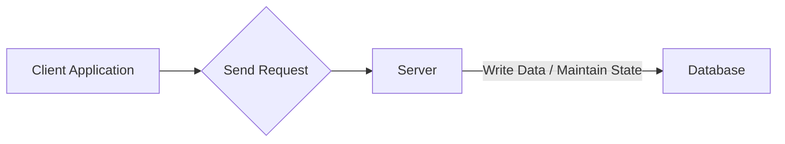

# How Databases Scale Writes： The Power Of The Log ✍️🗒️ (1080P25) - Part 1

### Optimizing Database Writes: An Introduction

This section explores strategies to enhance the efficiency of write operations within a database system, focusing on reducing I/O overhead and leveraging optimal data structures.

#### Client-Server-Database Interaction

_screenshots/frame_00-00-00.jpg)
_screenshots/frame_00-00-09.jpg)

The fundamental interaction involves:
1.  A **Client** (e.g., a web browser, mobile app) sends requests to a **Server**.
2.  The **Server** processes these requests and often needs to persist data or maintain state by writing to a **Database**.
3.  The **Database** stores and manages this data.



#### Traditional Database Structure: The B+ Tree

_screenshots/frame_00-00-46.jpg)

Databases often treat their stored data as a highly organized data structure. To facilitate fast queries, a widely adopted structure is the **B+ Tree**.

*   **Concept**: A B+ Tree is a self-balancing tree data structure that maintains sorted data and allows searches, sequential access, insertions, and deletions in logarithmic time. Unlike a binary search tree (BST) where each node has at most two children, B+ Trees can have multiple paths (children) from each node, making them "bushier" and shallower, which is ideal for disk-based storage.
*   **Performance**:
    *   `INSERT` operations: Each insertion involves finding the correct leaf node and potentially splitting nodes as the tree grows.
    *   `SELECT` (Search) operations: Involve traversing the tree from the root to the leaf node containing the desired data.

| Operation | Time Complexity (Average/Worst Case) | Explanation |
| :-------- | :----------------------------------- | :---------- |
| Insertion | `O(log n)`                           | Efficient, as it involves traversing the tree to find the correct leaf node and then inserting. Node splits might occur, propagating up the tree. |
| Search    | `O(log n)`                           | Fast, as the tree's balanced nature ensures a direct path to the data, minimizing disk I/O. |

*   **Acknowledgement Requirement**: For every `INSERT` or `SELECT` SQL command, the database typically sends an **acknowledgement** back to the server, confirming the successful execution of the request.

#### Challenges with Traditional Approach and Proposed Optimization

The traditional model, while robust, faces scalability challenges, particularly with frequent write operations:

1.  **Excessive Data Exchange**: Each request-response cycle involves not just the data, but also **acknowledgements** and **network headers**. This "unnecessary exchange" consumes bandwidth and processing power.
2.  **Numerous I/O Calls**: Every individual database operation (like an insert) often translates into a separate Input/Output (I/O) call to the disk. Frequent I/O operations are slow and resource-intensive.

**Optimization Idea 1: Condensing Data Queries**

To address these challenges, the first optimization involves **batching** or **condensing** multiple data queries (especially writes) into a single, larger query.

*   **Mechanism**: The server temporarily buffers multiple incoming write requests. Instead of sending each request individually, it bundles them into a single, larger block of data.
*   **Benefits**:
    *   **Reduced I/O Calls**: Instead of many small I/O operations, there's one larger I/O operation. This significantly reduces the overhead associated with initiating and completing disk access.
    *   **Efficient Bandwidth Usage**: Sending one large block with a single set of headers and receiving one acknowledgement is more efficient than many small packets, reducing network overhead.
    *   **Lower Request-Response Times**: Fewer I/O calls and network round-trips lead to faster overall processing.
*   **Drawback**:
    *   **Increased Server Memory Usage**: The server needs to allocate additional memory to temporarily store and buffer these incoming queries before sending them to the database.

#### The Quest for Faster Writes: Introducing the Log

While B+ Trees are excellent for balanced read/write performance, what if the primary concern is maximizing write throughput?

*   **Fastest Write Data Structure: The Linked List**
    *   Consider a simple **linked list**. Adding an element to the end (appending) is incredibly fast. You just need to update the `next` pointer of the last node to point to the new node, and the new node becomes the new tail. This is a **constant time** operation, denoted as `O(1)`.
    *   **Analogy**: Imagine a never-ending roll of paper where you just keep writing new entries at the very end. You don't need to re-organize anything in the middle.

*   **The Log: A Linked List Philosophy Applied**
    *   A **log** is a data structure that fundamentally follows the philosophy of a linked list for writes. It's an append-only sequence of records. New data is always added to the end.
    *   **Advantage**:
        *   **Extremely Fast Writes (`O(1)`)**: Appending to a log is inherently very fast because it typically involves sequential writes to disk, which are much faster than random writes.
    *   **Disadvantage**:
        *   **Very Slow Reads (`O(n)`)**: The major drawback of a pure log is its read performance. To find a specific piece of data, you often have to scan the entire log sequentially from the beginning until you find what you're looking for. The time taken grows linearly with the size of the log (`n`), making it impractical for large databases where fast lookups are crucial.

This concept of a "log" is foundational to advanced database structures like **Log-Structured Merge Trees (LSM Trees)**, which aim to combine the write efficiency of logs with the read efficiency of tree-like structures.

---

### Balancing Act: Fast Writes vs. Fast Reads

We've identified two key advantages for optimizing database writes:
1.  **Lesser I/O Operations**: By condensing multiple queries into one.
2.  **Fast Writes**: By using a log-like (append-only) structure in memory.

However, these come with significant drawbacks:
1.  **Additional Memory**: Required on the server to buffer and condense queries.
2.  **Slow Reads**: A pure log (like a linked list) inherently provides `O(N)` sequential reads, which is unacceptable for most modern applications.

_screenshots/frame_00-02-58.jpg)

#### Addressing the Drawbacks

1.  **Additional Memory**:
    *   This drawback is generally considered acceptable and often unavoidable if we want to batch operations.
    *   It can be managed by setting a **maximum buffer size** or a time limit before flushing data to the database, preventing excessive memory consumption.

2.  **Slow Reads**:
    *   This is the critical issue. For applications like social media feeds (e.g., Facebook newsfeed), users expect instant access to information. A slow read (e.g., 30 seconds to load a feed) leads to a very poor user experience.
    *   Therefore, **avoiding slow read operations is paramount**.

#### The Data Structure Dilemma: B+ Tree vs. Linked List

_screenshots/frame_00-05-10.jpg)

Let's re-evaluate the performance characteristics of the data structures discussed:

| Data Structure | Read Performance | Write Performance | Notes                                                                                               |
| :------------- | :--------------- | :---------------- | :-------------------------------------------------------------------------------------------------- |
| **B+ Tree**    | `O(log N)`       | `O(log N)`        | Excellent all-around performance, good for disk-based storage.                                      |
| **Linked List** | `O(N)`           | `O(1)`            | Super fast writes (append-only), but extremely slow reads (sequential scan).                       |
| **Sorted Array** | `O(log N)`       | `O(N)`            | Fast reads (binary search), but slow writes (insertions require shifting elements).                 |

The core problem is evident:
*   A **B+ Tree** gives `O(log N)` for both reads and writes.
*   A **Linked List** (log) gives `O(1)` for writes but `O(N)` for reads.

Why did we even consider the log if B+ Trees offer `O(log N)` for writes, which is already quite good? The reason is that `O(1)` (constant time) writes are inherently *faster* than `O(log N)` writes, especially when `N` is very large and involves disk I/O. Our goal is to push write performance to its absolute limit.

#### The "Magic Solution": Combining Strengths

_screenshots/frame_00-04-19.jpg)
_screenshots/frame_00-04-49.jpg)

The insight is to leverage the best features of both worlds:
*   Use a **log (linked list)** for extremely fast **writes** in memory.
*   Convert this data into a **sorted structure (like a sorted array or a tree)** for fast **reads**.

The crucial point is *where* this conversion happens.

*   **Avoid in-memory sorting for writes**: If we sort the data in memory for every write, the write operation itself would become slow (`O(N)` for a sorted array or `O(log N)` for a B+ tree, but still slower than `O(1)`). This defeats the purpose of using a log for fast writes.
*   **Convert at the database level (on disk)**: The data received from the client is initially appended to a log in memory. When this log is flushed to the database, it can be persisted in a sorted manner on disk. This way, the fast `O(1)` write performance is maintained on the server side (in memory), and the data on disk is optimized for `O(log N)` reads.

This hybrid approach forms the basis of advanced database architectures like **Log-Structured Merge Trees (LSM Trees)**, which we will explore further. The idea is to have distinct components optimized for writes (logs) and reads (sorted structures), and a mechanism to merge them efficiently.

```mermaid
graph TD
    subgraph Write Path (Server/Memory)
        ClientRequest[Client Request] --> FastWrite[Fast Write Operation]
        FastWrite --> InMemoryLog[In-Memory Log / Linked List]
        InMemoryLog -- "Batch & Flush" --> CondensedData[Condensed Data Block]
    end

    subgraph Read Path (Database/Disk)
        CondensedData --> ConvertToSorted[Convert to Sorted Structure]
        ConvertToSorted --> OnDiskSortedArray[On-Disk Sorted Array / Tree]
        OnDiskSortedArray --> FastRead[Fast Read Operation]
        FastRead --> ClientResponse[Client Response]
    end

    style InMemoryLog fill:#f9f,stroke:#333,stroke-width:1px
    style OnDiskSortedArray fill:#ccf,stroke:#333,stroke-width:1px
```

---

### Mechanics of Hybrid Write/Read Optimization

The core idea is to combine the best of both worlds: fast writes (using a log) and fast reads (using sorted data structures). This is achieved through a multi-stage process involving an in-memory log and on-disk sorted segments.

#### Stage 1: In-Memory Log (Fast Writes)

_screenshots/frame_00-06-11.jpg)

1.  **Append to Log**: When new data (e.g., a new record like "Jane, 31") arrives from the server, it is immediately appended to an **in-memory log**. This log acts like a simple linked list, allowing `O(1)` (constant time) write operations.
    *   **Analogy**: Imagine a scratchpad where you quickly jot down new notes at the bottom, without organizing them.
2.  **Threshold Flush**: Once the in-memory log reaches a predefined **threshold** (e.g., a certain number of records or a specific memory size), its contents are flushed to the database. This flush typically happens in a single batch.

#### Stage 2: Persisting to Disk (Sorted for Reads)

When the in-memory log is flushed, the data must be prepared for efficient reads on disk.

1.  **Sorting Before Persistence**: The batch of data from the in-memory log is **sorted** *before* being written to disk. This ensures that the data on disk is organized, enabling fast search operations.
    *   **Example**: If the log contains records `[23, 17, 47, 19, 12, 31]`, they are sorted into `[12, 17, 19, 23, 31, 47]` before being written to the database.
2.  **Efficient Reads on Sorted Data**: Once data is sorted on disk, read operations can use **binary search**, which has a time complexity of `O(log N)`. This is significantly faster than the `O(N)` sequential scan required for an unsorted log.

#### The Challenge of Continuous Data Flow

What happens when more data arrives after an initial flush?

*   **Naive Approach (Full Merge)**: One approach would be to take the newly sorted batch of data and **merge** it with the entire existing sorted database file. For example, if you have 6 new records and 10,000 existing records, you would sort all 10,006 records to create a new, fully sorted file.
    *   **Problem**: This is highly inefficient. Sorting a large dataset (e.g., 10,000 records) is an `O(N log N)` operation. Doing this for every small batch of new data would severely degrade write performance, negating the benefits of the in-memory log.

#### Optimization: Storing Data in Sorted Chunks

To avoid constant full re-sorts, the database can store data in **multiple sorted chunks** (or segments).

_screenshots/frame_00-08-31.jpg)
_screenshots/frame_00-08-43.jpg)

1.  **New Chunks**: Each time the in-memory log is flushed, it creates a **new, independently sorted chunk** on disk.
    *   **Example**: The first flush creates `Chunk 1: [12, 17, 19, 23, 31, 47]`. A subsequent flush creates `Chunk 2: [1, 36, 56, 60, 81, 99]`.
2.  **Read Operations with Multiple Chunks**: To find a record, the system now performs a **binary search on each chunk sequentially**.
    *   **Process**: Search Chunk 1. If not found, search Chunk 2. If not found, search Chunk 3, and so on.
    *   **Benefit**: This is much better than resorting the entire database for every write.
    *   **Drawback**: While better, this still leads to slow reads in large databases. If there are `K` chunks, a read operation might require `K` binary searches. If `N` is the total number of records and `S` is the size of each chunk, then `K = N/S`. So, the read time becomes `K * O(log S) = (N/S) * O(log S)`. This is still effectively `O(N)` in the worst case if `K` grows linearly with `N` (e.g., if `S` is constant). For a database with billions of records, `N/S` can still be a very large number, making reads unacceptably slow.

#### Further Optimization: Merging Sorted Chunks

To mitigate the read performance degradation from having too many chunks, a **hybrid approach** is used: **merging smaller sorted chunks into larger ones**. This is where the concept of a "merge" comes into play, utilizing techniques similar to **Merge Sort**.

_screenshots/frame_00-09-41.jpg)

1.  **Merge Sort Principle**: When two or more sorted chunks exist, they can be efficiently merged into a single, larger sorted chunk. The process involves comparing the first elements of each sorted chunk and picking the smallest one, then moving to the next element in the chosen chunk. This continues until all elements are merged.
    *   **Example**: Merging `[12, 17, 19, 23, 31, 47]` and `[1, 36, 56, 60, 81, 99]`:
        *   Compare `12` and `1`. `1` is smaller. Output `1`.
        *   Compare `12` and `36`. `12` is smaller. Output `12`.
        *   Compare `17` and `36`. `17` is smaller. Output `17`.
        *   ... and so on.
    *   The result is a single sorted chunk: `[1, 12, 17, 19, 23, 31, 36, 47, 56, 60, 81, 99]`.
2.  **Controlled Merging**: Merging is performed strategically (e.g., in the background or when the number of chunks exceeds a certain limit) to keep the total number of chunks manageable, thus improving read performance without constantly resorting the entire database.
    *   The "sort time" for merging is `O(N_merged)`, where `N_merged` is the total number of elements in the chunks being merged. This is much more efficient than `O(N log N)` for the entire database.

This multi-tiered strategy, involving in-memory logs, sorted on-disk chunks, and background merging, is the essence of **Log-Structured Merge (LSM) Trees**, which are widely used in modern NoSQL databases (e.g., Apache Cassandra, Google Bigtable, RocksDB) to achieve high write throughput while maintaining acceptable read performance.

---

### Detailed Merging Process and Read Optimization

We've established the need to maintain multiple sorted chunks on disk to handle continuous writes efficiently. Now, let's delve deeper into how these chunks are managed and how read performance is optimized.

#### The Merge Sort Algorithm for Chunks

_screenshots/frame_00-09-53.jpg)

When new sorted chunks are produced (from flushing the in-memory log), they are strategically merged with existing chunks to reduce the total number of chunks and improve read performance. This merging process is analogous to the **merge step in Merge Sort**.

**Mechanism:**
1.  **Initialize Pointers**: Place a pointer at the beginning of each sorted chunk to be merged.
2.  **Compare and Select**: Compare the elements currently pointed to by all pointers. Select the smallest element among them.
3.  **Append to Output**: Append the smallest element to a new, larger merged chunk.
4.  **Advance Pointer**: Move the pointer in the chunk from which the element was taken to the next element.
5.  **Repeat**: Continue steps 2-4 until all elements from all input chunks have been moved to the new merged chunk.

**Example Walkthrough (Merging two 6-element sorted arrays):**

Let's merge `Chunk A: [12, 17, 19, 23, 31, 47]` and `Chunk B: [1, 36, 56, 60, 81, 99]`.

| Step | Pointer A | Pointer B | Smallest | Merged Output |
| :--- | :-------- | :-------- | :------- | :------------ |
| 1    | 12        | 1         | 1        | `[1]`         |
| 2    | 12        | 36        | 12       | `[1, 12]`     |
| 3    | 17        | 36        | 17       | `[1, 12, 17]` |
| 4    | 19        | 36        | 19       | `[1, 12, 17, 19]` |
| 5    | 23        | 36        | 23       | `[1, 12, 17, 19, 23]` |
| 6    | 31        | 36        | 31       | `[1, 12, 17, 19, 23, 31]` |
| 7    | 47        | 36        | 36       | `[1, 12, 17, 19, 23, 31, 36]` |
| 8    | 47        | 56        | 47       | `[1, 12, 17, 19, 23, 31, 36, 47]` |
| 9    | (End)     | 56        | 56       | `[1, 12, 17, 19, 23, 31, 36, 47, 56]` |
| 10   | (End)     | 60        | 60       | `[1, 12, 17, 19, 23, 31, 36, 47, 56, 60]` |
| 11   | (End)     | 81        | 81       | `[1, 12, 17, 19, 23, 31, 36, 47, 56, 60, 81]` |
| 12   | (End)     | 99        | 99       | `[1, 12, 17, 19, 23, 31, 36, 47, 56, 60, 81, 99]` |

This process efficiently creates a single, larger sorted array (size 12 in this example).

#### The Benefit of Merging for Read Performance

_screenshots/frame_00-11-56.jpg)
_screenshots/frame_00-12-21.jpg)

Consider a scenario with multiple small sorted chunks versus fewer large sorted chunks.

*   **Scenario 1: Multiple Small Chunks (e.g., 3 chunks of size 6)**
    *   To find a record, you might need to binary search each chunk.
    *   Time per chunk: `log₂(6) ≈ 2.58` (approx. 3 operations).
    *   Worst-case total operations (if found in the last chunk): `3 chunks * log₂(6) ≈ 3 * 3 = 9 operations`.

*   **Scenario 2: Fewer Large Chunks (e.g., 1 chunk of size 12 and 1 chunk of size 6 after merging)**
    *   Suppose two chunks of size 6 are merged into one chunk of size 12. You now have `Chunk A (size 12)` and `Chunk B (size 6)`.
    *   Time for Chunk A: `log₂(12) ≈ 3.58` (approx. 4 operations).
    *   Time for Chunk B: `log₂(6) ≈ 2.58` (approx. 3 operations).
    *   Worst-case total operations: `log₂(12) + log₂(6) ≈ 4 + 3 = 7 operations`.

**Conclusion**: Merging reduces the total number of binary searches required, leading to faster read times. In the example, 7 operations are better than 9.

#### Hierarchical Merging Strategy

_screenshots/frame_00-12-58.jpg)

This merging process can be applied hierarchically, similar to how Merge Sort builds up sorted sub-arrays:
1.  **Level 0**: Individual small chunks (e.g., size 6) are created from in-memory flushes.
2.  **Level 1**: Two chunks of size 6 are merged into one chunk of size 12.
3.  **Level 2**: Two chunks of size 12 are merged into one chunk of size 24.
4.  **And so on**: This continues until a maximum desired chunk size is reached or all data is in one large chunk.

**Example of Hierarchical Merging Impact on Reads**:
*   **4 unmerged chunks of size 6**: `4 * log₂(6) = 4 * 3 = 12 operations`.
*   **1 merged chunk of size 24**: `log₂(24) ≈ 4.58` (approx. 5 operations).
    *   This shows a significant saving (5 vs 12 operations).

This continuous background merging process is a key component of **Log-Structured Merge (LSM) Trees**. It ensures that while writes are fast (append-only to memory), reads are also efficient by keeping the number of on-disk sorted segments (chunks) manageable and progressively larger.

```mermaid
graph TD
    subgraph In-Memory
        MemTable[MemTable / In-Memory Log]
    end

    subgraph On-Disk (Sorted String Tables - SSTables)
        SSTable1["SSTable 1 (Size 6)"]
        SSTable2["SSTable 2 (Size 6)"]
        SSTable3["SSTable 3 (Size 6)"]
        SSTable4["SSTable 4 (Size 6)"]
        SSTable5["SSTable 5 (Size 12)"]
        SSTable6["SSTable 6 (Size 12)"]
        SSTable7["SSTable 7 (Size 24)"]
    end

    MemTable -- "Flush (Sorted)" --> SSTable1
    MemTable -- "Flush (Sorted)" --> SSTable2
    MemTable -- "Flush (Sorted)" --> SSTable3
    MemTable -- "Flush (Sorted)" --> SSTable4

    subgraph Compaction (Background Merging)
        SSTable1 & SSTable2 -- "Merge" --> SSTable5
        SSTable3 & SSTable4 -- "Merge" --> SSTable6
        SSTable5 & SSTable6 -- "Merge" --> SSTable7
    end

    style MemTable fill:#f9f,stroke:#333,stroke-width:1px
    style SSTable1 fill:#ccf,stroke:#333,stroke-width:1px
    style SSTable2 fill:#ccf,stroke:#333,stroke-width:1px
    style SSTable3 fill:#ccf,stroke:#333,stroke-width:1px
    style SSTable4 fill:#ccf,stroke:#333,stroke-width:1px
    style SSTable5 fill:#bbf,stroke:#333,stroke-width:1px
    style SSTable6 fill:#bbf,stroke:#333,stroke-width:1px
    style SSTable7 fill:#aaf,stroke:#333,stroke-width:1px
```

#### Further Read Optimization: Bloom Filters

Even with merging, a read operation might still need to check multiple on-disk sorted chunks if the data is not found in the initial ones. To further speed up reads, especially for cases where a key **does not exist** in a chunk, a **Bloom Filter** can be employed.

*   **Concept**: A Bloom Filter is a probabilistic data structure that can tell you if an element *might* be in a set, or if it's *definitely not* in the set.
    *   **"Might be in"**: There's a small chance of false positives (it says it's there, but it's not).
    *   **"Definitely not in"**: There are no false negatives (if it says it's not there, it's truly not there).
*   **Application in LSM Trees**: Each sorted chunk (SSTable) can have an associated Bloom Filter. Before performing an expensive disk read (binary search) on a chunk, the system first queries its Bloom Filter.
    *   If the Bloom Filter says "definitely not in", the system can immediately skip that chunk, saving I/O operations.
    *   If the Bloom Filter says "might be in", then the binary search proceeds.
*   **Benefit**: Reduces unnecessary disk I/O, especially for non-existent keys or keys in chunks that don't contain them, making read operations faster on average.

---

### Read Optimization with Bloom Filters

Even with the strategy of merging sorted chunks (SSTables), a read operation might still need to check multiple chunks if the desired key is not found in the first few. To further reduce unnecessary disk I/O, especially when a key is absent, **Bloom Filters** are employed.

#### Understanding Bloom Filters

_screenshots/frame_00-14-10.jpg)
_screenshots/frame_00-13-47.jpg)

A Bloom Filter is a **probabilistic data structure** that efficiently checks if an element is *possibly* in a set or *definitely not* in a set.

*   **Core Idea**: It uses a bit array and multiple hash functions. When an item is added to the set, its bits corresponding to the hash function outputs are set to `1`.
*   **Querying**: To check if an item is in the set, its bits are checked.
    *   If *any* of the corresponding bits are `0`, the item is **definitely not** in the set (a true negative).
    *   If *all* corresponding bits are `1`, the item **might be** in the set (a true positive or a false positive).
*   **False Positives**: Bloom Filters can produce **false positives**, meaning they might indicate an item is present when it's not. This happens due to hash collisions where unrelated items set the same bits.
    *   The rate of false positives can be managed by:
        *   **Increasing the size of the bit array**: A larger array reduces the chance of bits being set by multiple unrelated items.
        *   **Increasing the number of hash functions**: More hash functions spread the item's "signature" across more bits, reducing collisions (up to a point).
*   **False Negatives**: Bloom Filters **cannot produce false negatives**. If an item is truly in the set, its bits would have been set to `1`, so the filter will correctly report it as "might be in."

**Analogy (Book and Word Search):**
Imagine you have a large book and want to quickly check if a word (e.g., "CAT") exists.

1.  **Simple Bloom Filter (Alphabet Check)**: Create a small array of 26 bits (A to Z). If any word in the book contains a letter, you mark that letter's bit as `1`.
    *   If "CAT" is in the book: `C`, `A`, and `T` bits will be `1`.
    *   If you search for "CAT": You check if `C`, `A`, `T` bits are all `1`. If they are, "CAT" *might* be in the book.
    *   **False Positive Example**: If the book contains "CORONA", the `C`, `O`, `R`, `N`, `A` bits will be `1`. If you then search for "CAR", the `C`, `A`, `R` bits might all be `1` (if those letters were set by "CORONA" or other words), even if "CAR" isn't in the book. This is a false positive for "CAR".
    *   **True Negative Example**: If no word in the book contains the letter `X`, the `X` bit will be `0`. If you search for "X-RAY", the filter will immediately tell you "definitely not in" because the `X` bit is `0`.

2.  **Improved Bloom Filter (Bigram Check)**: Instead of single letters, you could mark combinations of two letters (bigrams), e.g., "CA", "AT", "CO", "OR". This reduces false positives because "CAT" and "CORONA" would set different bigram bits ("CA" vs "CO").

#### Applying Bloom Filters in LSM Trees

_screenshots/frame_00-15-51.jpg)

In the context of LSM Trees, a Bloom Filter is typically associated with each **Sorted String Table (SSTable)** (the on-disk sorted chunks).

*   **Purpose**: Before performing an expensive disk read operation (binary search) on an SSTable, the system first consults its associated Bloom Filter.
*   **Read Workflow with Bloom Filters**:
    1.  A read query for a specific key arrives.
    2.  The system iterates through the SSTables (starting with the most recent ones, as they might contain the latest version of the key).
    3.  For each SSTable, it first queries its Bloom Filter for the key.
    4.  **If Bloom Filter says "Definitely Not In"**: The system *skips* this SSTable entirely, avoiding unnecessary disk I/O. This is a highly efficient shortcut for non-existent keys or keys not present in that particular chunk.
    5.  **If Bloom Filter says "Might Be In"**: The system proceeds to perform a binary search (disk read) on the SSTable.
*   **Impact on Performance**: By quickly ruling out SSTables that do not contain the key, Bloom Filters significantly **reduce the average read time** and **minimize useless disk reads**, especially in scenarios with many SSTables or frequent queries for non-existent data.
*   **Bloom Filter Size**: When SSTables are merged into larger ones, their corresponding Bloom Filters are also merged. The new, larger SSTable will require a Bloom Filter of increased size or adjusted parameters to maintain an acceptable false positive rate, as it contains more data.

#### Summary of Log-Structured Merge (LSM) Trees

_screenshots/frame_00-17-21.jpg)

LSM Trees are a fundamental data structure behind many modern high-write-throughput databases (e.g., Apache Cassandra, HBase, RocksDB, LevelDB). They achieve a powerful balance between fast writes and efficient reads by:

1.  **Fast Writes (MemTable/In-Memory Log)**:
    *   New writes are first appended to an **in-memory mutable sorted structure** (often called a **MemTable** or commit log), providing `O(1)` or `O(log N)` (if it's a skip list/tree) write performance.
    *   Writes are sequential, which is very fast.
2.  **Asynchronous Persistence (SSTables)**:
    *   When the MemTable reaches a certain size, it is flushed to disk as a new, immutable, sorted file called a **Sorted String Table (SSTable)**.
    *   This flush is typically a sequential write, which is efficient.
3.  **Efficient Reads (Compaction & Bloom Filters)**:
    *   Reads involve checking the MemTable first, then sequentially querying relevant SSTables on disk.
    *   **Compaction**: A background process continuously **merges** smaller SSTables into larger ones. This process, called **compaction**, reduces the total number of SSTables, thereby reducing the number of disk accesses required for a read. Compaction uses the merge-sort principle, effectively trading background write amplification for read efficiency.
    *   **Bloom Filters**: Used to quickly determine if a key *might* exist in an SSTable before performing a costly disk read, reducing unnecessary I/O.

In essence, LSM Trees optimize for write-heavy workloads by performing most writes as sequential appends to memory and then to disk. Reads are optimized by maintaining sorted data structures on disk and using clever indexing (like Bloom Filters) and background merging (compaction) to keep the number of files to search low.

---

