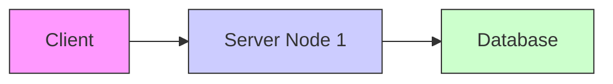
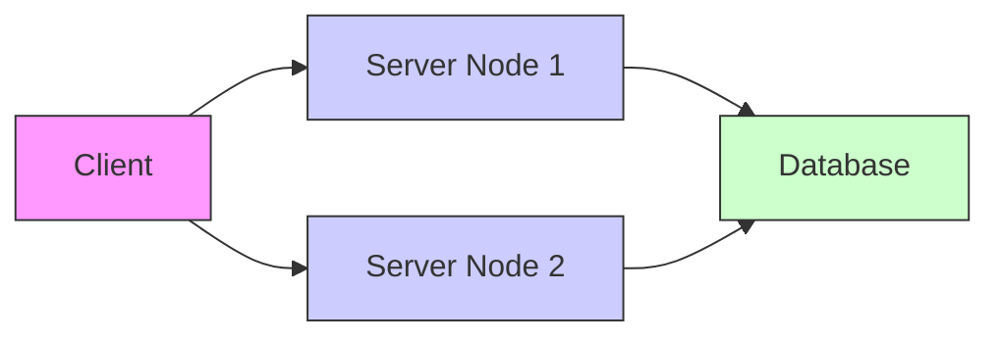
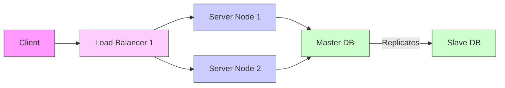
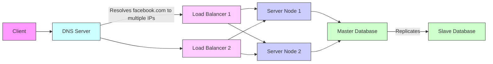
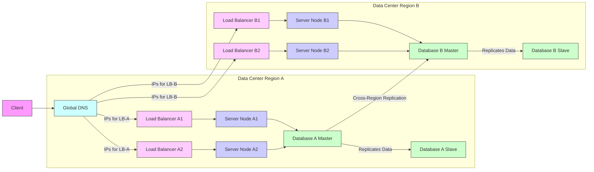

# How To Avoid A Single Point Of Failure In Distributed Systems ✅ (1080P60) - Part 1

### Understanding Single Points of Failure (SPOF)

A **Single Point of Failure (SPOF)** in a computing system refers to any component or part of the system whose failure would cause the entire system to stop functioning. It's a critical vulnerability that can lead to complete system downtime.

This concept isn't unique to computer science; it applies broadly. For instance, if a massive asteroid were to hit Earth, it would be a single point of failure for humanity's existence. In stories, a character that the plot cannot afford to lose often represents a SPOF for the narrative's progression.

In system design interviews, identifying and mitigating SPOFs is an advanced topic that demonstrates an understanding of **resiliency** – the ability of a system to recover from failures and continue functioning. A system with many SPOFs is considered **not resilient**.

**Core Idea of a SPOF:**
A SPOF exists when multiple components depend on a single, shared resource. If this single resource fails, all dependent components, and thus the entire system, will fail.

### Mitigating Single Points of Failure

The primary way to mitigate SPOFs is through **redundancy**, which means having backup or duplicate components ready to take over if a primary one fails.

#### 1. Adding More Nodes (Redundancy for Services)

The most straightforward approach to eliminate a SPOF is to introduce additional nodes that perform the same function.

_screenshots/frame_00-02-19.jpg)

Consider a basic system architecture:

In this setup, if `Server Node 1` crashes, the entire service becomes unavailable to the client. Similarly, if the `Database` crashes, the system also fails. The client itself is generally not a SPOF for the *entire system*, as its failure only impacts that specific user.

To address the `Server Node 1` SPOF, we add another node:

_screenshots/frame_00-01-29.jpg)
_screenshots/frame_00-02-58.jpg)



There are two main ways to configure these additional nodes:

1.  **Backup (Cold Standby):**
    *   One node is active, and the other remains idle, only becoming active if the primary node fails.
    *   **Pros:** Simpler to set up initially.
    *   **Cons:** Not very useful for services that process live requests (e.g., a "profile server"). If no one is connected to the backup, it won't contain current data or state, making the failover process complex and potentially data-losing. It's like having an empty spare tire that you still need to inflate.

2.  **Replication (Hot Standby/Active-Active):**
    *   Both nodes are active, or one is active and the other is a synchronized replica. For data stores like databases, changes made to the primary are continuously mirrored to the replica.
    *   **Pros:** Ensures data consistency and availability. If the primary fails, the replica has up-to-date information and can take over seamlessly.
    *   **Cons:** More complex to manage and ensure data synchronization.

**Why Replication is Better for Data Resilience:**
If the probability of a single database failing is `P`, then with a replicated database, the probability of *both* failing simultaneously becomes `P * P` (or `P^2`), assuming independent failures. Since `P` is typically a small number (e.g., 0.01), `P^2` (0.0001) is significantly smaller, meaning the system is much more resilient.

#### 2. Master-Slave Architecture (for Databases)

To specifically address the database as a SPOF, a common pattern is the **Master-Slave architecture**.

```mermaid
graph LR
    node1[Server Node 1] --> masterDB[Master Database]
    node2[Server Node 2] --> masterDB
    masterDB -- "Replicates Data" --> slaveDB[Slave Database (Replica)]

    subgraph Database Cluster
        masterDB
        slaveDB
    end

    style masterDB fill:#cfc,stroke:#333,stroke-width:1px
    style slaveDB fill:#cfc,stroke:#333,stroke-width:1px
```

*   **Master Database:** Handles all write operations (e.g., inserting, updating, deleting data).
*   **Slave Database(s):** Receive replicated data from the master. They can serve read operations (known as **read slaves**) to distribute the read load, or they can simply exist as hot backups for disaster recovery.
*   **Consistency:** Depending on the application's needs, read slaves might offer eventual consistency (data might be slightly out of date) or require strong consistency (ensuring reads always get the latest committed data).

#### 3. Redundant Load Balancers and DNS

As we add more server nodes and database replicas, we need a mechanism to distribute incoming client requests efficiently and direct them to healthy components. This is where **Load Balancers (LBs)** come in.

_screenshots/frame_00-04-01.jpg)

However, a single Load Balancer itself becomes a new SPOF.



**Addressing the Load Balancer SPOF:**

1.  **Multiple Load Balancers:** Deploy multiple Load Balancers in parallel.
2.  **DNS (Domain Name System) for Client Redirection:** The client needs a way to discover which of the multiple LBs to connect to. This is solved by pushing the responsibility back to the **DNS**.
    *   When a client (e.g., your web browser) tries to access a service like `facebook.com`, it first queries the DNS.
    *   Instead of resolving `facebook.com` to a single IP address, the DNS is configured to return **multiple IP addresses** for the same hostname. Each of these IP addresses belongs to one of the redundant Load Balancers.
    *   The client's system (or browser) will then attempt to connect to one of these IP addresses. If the first one fails, it tries the next, ensuring connectivity even if one LB is down.

This creates a highly resilient architecture:



By combining these strategies, a system can significantly reduce its single points of failure, making it more robust and available.

---

#### Load Balancer vs. Gateway

_screenshots/frame_00-04-09.jpg)
_screenshots/frame_00-04-25.jpg)

While we often refer to them as "Load Balancers," it's more accurate to think of them as **Gateways** that incorporate load balancing mechanisms. A **gateway** is an entry point for client requests, and within that gateway, the **load balancing** logic distributes those requests to available backend servers. This distinction emphasizes their role as the initial point of contact and traffic director.

#### 4. Geographical Redundancy (Multiple Regions)

Even with robust redundancy achieved through DNS, multiple load balancers, and redundant server nodes and databases, a single point of failure can still exist at a much larger scale: the **geographical location**. If your entire system is deployed in a single data center or region, a major disaster (e.g., natural calamity, widespread power outage, or network disruption) affecting that specific location would cause the entire service to fail. This is akin to the "Earth" example for humanity's existence – if Earth is gone, humanity is gone.

_screenshots/frame_00-04-17.jpg)

To mitigate this, the solution is to deploy your entire resilient architecture across **multiple distinct geographical regions**. This means having independent copies of your DNS, load balancers, server nodes, and databases in different parts of the world.



In this setup, the DNS would return IP addresses for load balancers in *both* Region A and Region B. If Region A goes completely offline, clients can still connect to Region B, ensuring continuous service. Data between regions would also be replicated to maintain consistency.

#### Propagating Resiliency

The process of eliminating SPOFs is not a one-time fix but a continuous effort that involves **propagating resiliency** throughout the entire system pipeline. Every component that acts as a central point for others must itself be made redundant. This includes:

*   **Server Nodes:** Redundant through multiple nodes.
*   **Databases:** Redundant through master-slave replication.
*   **Load Balancers/Gateways:** Redundant through multiple instances and DNS resolution.
*   **Distributed Database Coordinators:** In complex distributed databases that use a "coordinator" component to manage reads and writes across shards, this coordinator itself must also be made redundant in a similar fashion to load balancers.

This recursive application of redundancy ensures that the system can withstand failures at various levels, from individual machines to entire data centers.

#### Real-World Example: Netflix's Chaos Monkey

Netflix is a prime example of a company that prioritizes system resiliency. They go beyond theoretical design by actively testing their systems for weaknesses using tools like **Chaos Monkey**.

*   **Chaos Monkey:** This tool randomly disables production instances (servers) and services within Netflix's infrastructure.
*   **Purpose:** By introducing controlled failures, Netflix can proactively discover and fix vulnerabilities, ensuring that their systems are truly resilient and distributed as intended, rather than just on paper. This "break it to make it stronger" approach helps them maintain high availability.

#### System Design Interview Takeaways

For a system design interview, while the concepts of multi-region deployment and chaos engineering are advanced, the core strategies to discuss for mitigating SPOFs are:

*   **Master-Slave Replication:** Primarily for databases, ensuring data availability and read scalability.
*   **More Nodes (Redundancy):** Adding duplicate server instances to handle increased load and provide failover capabilities. This often implies increased infrastructure costs ("more money").

By demonstrating an understanding of these fundamental principles and their application, you can effectively discuss how to design resilient systems.

---

