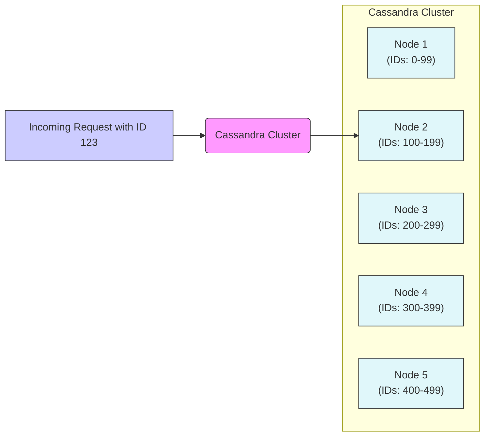

# Introduction To Nosql Databases (1080P60) - Part 1

### When to Use NoSQL Databases

The decision to use NoSQL databases is not solely dictated by the need for scale. While they excel in certain high-scale scenarios, many large-scale applications successfully use traditional Relational Database Management Systems (RDBMS). It's crucial to understand the specific use cases where NoSQL databases are most beneficial.

For instance, several prominent platforms do not rely on NoSQL databases for their primary data storage:
*   **YouTube**
*   **Stack Overflow**
*   **Instagram**
*   **WhatsApp** (Note: The claim that WhatsApp "doesn't have a database" is incorrect; it uses various database technologies, including Erlang Mnesia and others for specific purposes).

This highlights that scalability can be achieved with different database paradigms, and the choice depends on the data model, access patterns, and specific application requirements.

### SQL vs. NoSQL: Understanding Data Schemas

The fundamental difference between SQL (relational) and NoSQL (often document-oriented) databases lies in how they structure and store data.

_screenshots/frame_00-01-46.jpg)

#### SQL (Relational Model)

In a SQL database, data is organized into **tables**, which consist of rows and columns. Relationships between different pieces of data are established using **foreign keys**.

**Example: Person and Address Data**

Consider storing information about a person, including their address. In SQL, this typically involves at least two tables:

1.  **Person Table:** Stores core user details.
    | ID | Name | Address | Age | Role |
    |----|----------|---------|-----|------|
    | 123| John Doe | 23      | 30  | SDE  |

2.  **Address Table:** Stores detailed address information.
    | Address ID | City   | Country | District |
    |------------|--------|---------|----------|
    | 23         | Munich | Germany | -        |

Here, the `Address` column in the `Person` table (`23`) is a **foreign key** that references the `Address ID` in the `Address` table. This creates a normalized structure, minimizing data redundancy.

#### NoSQL (Document Model - JSON)

NoSQL databases, particularly document-oriented ones, store data in flexible, self-contained units called **documents**. These documents often use formats like JSON (JavaScript Object Notation), which allows for nested structures.

**Example: Person Data in NoSQL (JSON Document)**

Instead of separate tables and foreign keys, all related information about a person, including their address, is typically stored within a single document.

```json
{
    "ID": 123,
    "Name": "John Doe",
    "Address": {
        "ID": 23,
        "City": "Munich",
        "Country": "Germany"
        // Note: "District" is omitted if its value is null or empty,
        // as NoSQL schemas are flexible and don't require all fields to be present.
    },
    "Age": 30,
    "Role": "SDE"
}
```
In this NoSQL approach:
*   The `Address` is not a foreign key but an **embedded object** directly within the `Person` document.
*   The schema is **flexible**; fields with null or empty values (like `District` in the example) can simply be omitted, saving space and simplifying the structure.

#### Schema Comparison: SQL vs. NoSQL

| Feature          | SQL (Relational)                                  | NoSQL (Document-Oriented)                               |
|------------------|---------------------------------------------------|---------------------------------------------------------|
| **Structure**    | Tables with fixed schemas (rows, columns)         | Flexible, schema-less documents (e.g., JSON, BSON)      |
| **Relationships**| Defined by **foreign keys** linking separate tables | **Embedded/nested objects** within a single document    |
| **Normalization**| Typically highly normalized to reduce redundancy  | Often denormalized for read performance                 |
| **Null Values**  | Columns must exist, null values explicitly stored  | Fields can be omitted if null/empty, saving space       |

### Efficiency of NoSQL: The "Big Blob" Advantage

The efficiency of NoSQL, particularly for certain workloads, stems from its document-oriented storage model.

1.  **Efficient Data Insertion:**
    *   When a new user registers or a new record is created, applications typically provide all the necessary information at once (e.g., name, age, address).
    *   In a NoSQL document model, this entire "fat blob" of data (the complete JSON document) can be inserted as a **single write operation**. This is highly efficient as it avoids multiple writes or complex transactions across different tables.

2.  **Optimized Data Retrieval:**
    *   A common pattern in applications is to retrieve *all* information related to a specific entity (e.g., "get all details for user 123"). This is analogous to `SELECT *` in SQL.
    *   In NoSQL, since all related data for an entity (like a user) is co-located within a single document, retrieving that document involves a **single read operation**.
    *   This eliminates the need for complex **JOIN operations** that SQL databases perform to combine data from multiple tables, which can be resource-intensive, especially at scale. By avoiding joins, NoSQL can offer faster read performance for these specific access patterns.

---

### Why NoSQL is Efficient: The Core Advantages

The "big blob" (document-oriented) approach of NoSQL databases offers several key advantages, particularly in scenarios where data is frequently accessed and inserted as a whole.

_screenshots/frame_00-03-03.jpg)
_screenshots/frame_00-03-25.jpg)

#### 1. Co-location for Efficient Insertions and Retrievals

*   **NoSQL Approach:** When data for a single entity (like a user) is stored as one complete document, both insertion and retrieval operations become highly efficient.
    *   **Insertions:** All fields are typically available when a record is created, allowing the entire document to be written in a **single atomic operation**.
    *   **Retrievals:** When you need all information about an entity (a common pattern, similar to `SELECT *` in SQL), the database can fetch the entire document in a **single read operation**. This avoids the need to combine data from multiple locations.

*   **SQL Challenge:** In contrast, SQL databases often normalize data across multiple tables.
    *   **Sequential Reading:** When querying a row, the database sequentially reads columns. If related data is in another table (e.g., `Address` details for a `Person`), a separate operation is required.
    *   **Expensive Joins:** To retrieve a complete view of an entity whose data is spread across multiple tables, SQL requires **JOIN operations**. These operations can be computationally expensive, especially as the dataset grows, because the database must match records across different tables. NoSQL bypasses this overhead by keeping related data together.

#### 2. Flexible Schema

_screenshots/frame_00-04-09.jpg)

The schema flexibility of NoSQL databases is a significant differentiator:

*   **NoSQL Approach:**
    *   **Schema-less Nature:** NoSQL document databases do not enforce a rigid schema. This means documents within the same collection can have different structures.
    *   **Handling Missing Data:** If a field (e.g., `District` in our `Address` example) has a null or empty value, it can simply be **omitted** from the document, saving storage space and simplifying the structure.
    *   **Easy Attribute Addition:** Adding a new attribute (e.g., `Salary`) to existing data is straightforward. You can simply start including the new field in new documents. Older documents that don't have this field remain unaffected and do not require modification, as the database doesn't expect every document to conform to a universal structure.

*   **SQL Challenge:**
    *   **Rigid Schema:** SQL databases require a predefined schema. Every row in a table must conform to the columns defined for that table.
    *   **Adding New Columns:** Introducing a new column to a large SQL table is an **expensive and risky operation**. It often requires:
        *   **Table Locks:** The table may need to be locked (unavailable for writes) during the schema alteration to maintain data consistency.
        *   **Data Migration/Default Values:** Existing rows will need to be updated with a default value for the new column, or their values will be `NULL`.
        *   **Risk to Consistency:** This process can be complex and carries a risk of data inconsistency if not managed carefully.

#### 3. Horizontal Partitioning (Built-in for Scale)

_screenshots/frame_00-06-31.jpg)

NoSQL databases are fundamentally designed with **horizontal scaling** in mind.

*   **Concept:** Horizontal partitioning, often referred to as **sharding**, involves distributing data across multiple independent servers (nodes) in a cluster. Each node holds a subset of the total data.
*   **Scalability:** This allows databases to handle massive amounts of data and high user loads by adding more servers to the cluster. As demand grows, you simply add more machines, rather than upgrading a single, more powerful machine (vertical scaling).
*   **Availability:** This distributed nature also enhances **availability**. If one server fails, the rest of the system can continue to operate, as data is replicated or distributed across multiple nodes. This focus on availability aligns with the needs of many modern web applications that require continuous uptime.

#### 4. Built for Aggregations and Analytics

_screenshots/frame_00-06-31.jpg)

Many NoSQL databases are optimized for performing **aggregation queries** and deriving insights from large datasets.

*   **Purpose:** Users often store data in NoSQL databases with the expectation of extracting meaningful metrics and performing analytical operations.
*   **Examples:** Common analytical queries include:
    *   Calculating the **average age** of users.
    *   Determining the **total salary** across a group.
    *   Finding the count of users in a specific region.
*   **Optimization:** While SQL databases also perform aggregations, NoSQL databases (especially certain types like document or column-family stores) often have built-in features and architectures that make these types of queries highly efficient for their specific data models, supporting real-time analytics and business intelligence needs.

---

**Summary of NoSQL Advantages:**

| Feature                | Description                                                                                             | Benefit                                                                      |
|------------------------|---------------------------------------------------------------------------------------------------------|------------------------------------------------------------------------------|
| **Data Co-location**   | Related data is stored together in a single document/block.                                             | Faster insertions (single write) and retrievals (single read); no expensive JOINs. |
| **Flexible Schema**    | No rigid schema enforcement; documents can have varying structures.                                     | Easy to evolve data models; handle missing data gracefully; rapid development. |
| **Horizontal Partitioning** | Designed for distributing data across many servers (sharding).                                         | High scalability (handle massive data/traffic); improved availability.      |
| **Built for Aggregations** | Optimized for analytical queries like sums, averages, and counts on large datasets.                     | Efficient data analysis and generation of business metrics.                  |

---

### Disadvantages of NoSQL Databases

While NoSQL databases offer significant advantages in terms of scalability and flexibility, they also come with certain limitations, making them unsuitable for all types of applications.

_screenshots/frame_00-07-27.jpg)

#### 1. Not Built for Frequent Updates

*   NoSQL databases, particularly document-oriented ones, are optimized for writing and reading entire "blobs" (documents) of data.
*   If your application requires frequent, granular updates to small parts of a large document, this can be less efficient. Often, the entire document must be read, modified, and then written back, which can be more resource-intensive than updating a single field in a relational table.

#### 2. Relaxed Consistency (No ACID Guarantees)

*   **The Problem:** A major drawback for many traditional applications is that NoSQL databases generally do not guarantee **ACID properties** (Atomicity, Consistency, Isolation, Durability) in the same strict way as relational databases.
    *   **Atomicity:** All operations in a transaction either succeed or fail as a single unit.
    *   **Consistency:** A transaction brings the database from one valid state to another, maintaining all defined rules and constraints.
    *   **Isolation:** Concurrent transactions execute independently without interfering with each other.
    *   **Durability:** Once a transaction is committed, its changes are permanent, even in the event of system failures.
*   **Implication:** Because consistency might be relaxed (e.g., eventual consistency), it's possible for different nodes in a distributed NoSQL system to temporarily hold different versions of the same data.
*   **Use Case Impact:** This lack of strong, immediate consistency makes NoSQL databases generally unsuitable for applications requiring strict transactional integrity, such as **financial systems** (e.g., banking transactions where every debit must have a corresponding credit, and balances must always be accurate).

#### 3. Suboptimal for Specific Read Patterns (Column-wise Reads)

*   While NoSQL excels at retrieving entire documents, it can be less efficient when you need to query or filter based on a single field across many documents.
*   **Example:** If you need to find the "age" of all employees, a NoSQL database would typically have to read each entire document, extract the "age" field, and then process it.
*   **SQL Contrast:** In a SQL database, if the `Age` column is indexed, the database can directly access and process only that column's data, leading to potentially much faster read times for such specific queries.

#### 4. Lack of Implicit Relations

*   **Relational Databases (RDBMS):** The 'R' in RDBMS stands for **Relational**. They explicitly define relationships between tables using concepts like **foreign keys**. A foreign key constraint ensures that a value in one table's column (e.g., `Address ID` in `Person`) must correspond to an existing primary key in another table (e.g., `Address ID` in `Address`). This enforces data integrity and makes relationships clear and managed by the database itself.
*   **NoSQL Challenge:** NoSQL databases do not have built-in mechanisms for enforcing these kinds of relational constraints. Relationships are typically handled at the application layer. If you need to link data across different "collections" or documents, the application must manage this logic, and there's no inherent database-level guarantee of referential integrity.

#### 5. Complex/Manual Joins

*   **SQL Strength:** SQL databases excel at `JOIN` operations (e.g., `INNER JOIN`, `LEFT JOIN`, `OUTER JOIN`), which allow you to combine rows from two or more tables based on related columns. These are fundamental to relational data modeling.
*   **NoSQL Weakness:** Since NoSQL databases are designed to minimize or avoid explicit relationships and denormalize data, they generally do not support SQL-style `JOIN` operations natively or efficiently. If you need to combine data from different document types or collections in a NoSQL environment, you typically have to:
    *   **Perform manual joins in the application code:** Query data from one collection, then use the results to query another collection, and combine them programmatically.
    *   **Rely on denormalization:** Design your schema to include all necessary related data within a single document, effectively pre-joining the data during insertion. This is common but can lead to data redundancy.

### When to Choose NoSQL

Given its advantages and disadvantages, NoSQL databases are best suited for scenarios where:

*   **Data is naturally "blob-like" or document-oriented:** The data for an entity can be stored as a single, self-contained unit.
*   **Few updates, many writes/reads:** The primary operations are inserting new full documents or retrieving existing full documents.
*   **High write throughput is critical:** The application needs to handle a large volume of incoming data writes efficiently.
*   **Schema flexibility is important:** The data structure is likely to evolve frequently, or different records may have varying attributes.
*   **Horizontal scalability and high availability are paramount:** The application needs to handle massive scale and remain operational even if some nodes fail.
*   **Aggregations and analytics are primary use cases:** The system frequently needs to perform calculations (e.g., averages, sums) over large datasets for metrics and insights.
*   **Eventual consistency is acceptable:** The application can tolerate slight delays in data synchronization across distributed nodes.

Conversely, for applications requiring complex ad-hoc queries, strict transactional integrity (ACID), and a highly normalized data model, a traditional SQL database often remains the better choice (e.g., YouTube, Stack Overflow, Instagram for their core data).

### Introduction to Cassandra Architecture

To understand how NoSQL databases achieve their scale and availability, let's look at **Apache Cassandra**, a popular NoSQL database known for its distributed architecture.

_screenshots/frame_00-10-51.jpg)



*   **Distributed Cluster:** Cassandra operates as a **peer-to-peer distributed system**, forming a **cluster** of multiple nodes (servers). These clusters are designed to be highly available and scalable. Setting up and maintaining such a cluster can be complex and expensive due to the infrastructure requirements.
*   **Data Distribution (Sharding):** Data is automatically distributed across the nodes in the cluster using a technique called **sharding** or **partitioning**.
    *   Each node is responsible for a specific range of data based on a **partition key** (often derived from a request ID or primary key).
    *   **Example:** As shown in the diagram, a cluster with 5 nodes might distribute data as follows:
        *   Node 1: Handles data with IDs from 0 to 99.
        *   Node 2: Handles data with IDs from 100 to 199.
        *   Node 3: Handles data with IDs from 200 to 299.
        *   Node 4: Handles data with IDs from 300 to 399.
        *   Node 5: Handles data with IDs from 400 to 499.
*   **Request Routing:** When a request (e.g., for `Request ID 123`) comes into the Cassandra cluster, the system determines which node is responsible for that specific data range and routes the request accordingly (in this case, to Node 2). This distributed storage enables horizontal scaling and fault tolerance.

---

### Data Distribution in Cassandra: The Role of Hashing

In a distributed database like Cassandra, data is spread across multiple nodes (servers) within a cluster. When a request comes in, the system needs to determine which node is responsible for storing or retrieving that specific piece of data. This is achieved through a process called **hashing**.

_screenshots/frame_00-11-18.jpg)

1.  **Partition Key and Hashing:**
    *   Each piece of data is associated with a **partition key**. This key can be anything – a numeric ID (like `123`), a UUID (Universally Unique Identifier), a user's name, or any other identifier that uniquely identifies a record or a group of related records.
    *   This partition key is passed through a **hash function** (e.g., `h()`).
    *   The hash function converts the partition key into a **numeric hash value**.
    *   **Example:** For `Request ID 123`, a hash function `h(123)` might produce the hash value `256`.

2.  **Mapping Hash Value to a Node:**
    *   The cluster's data range (e.g., `0-499` in our 5-node example) is logically divided among the nodes.
    *   Each node is assigned a specific range of hash values.
    *   The calculated hash value (`256`) is then mapped to the node responsible for that range. In our example:
        *   Node 1: 0-99
        *   Node 2: 100-199
        *   **Node 3: 200-299** (where 256 falls)
        *   Node 4: 300-399
        *   Node 5: 400-499
    *   Therefore, a request with `Request ID 123` (hashing to `256`) would be routed to **Node 3**.

_screenshots/frame_00-12-47.jpg)

```mermaid
graph TD
    RequestID["Request ID: 123 <br> (e.g., UUID, Name)"] --> HashFunc[Hash Function h()]
    HashFunc --> HashValue[Hash Value: 256]

    subgraph Cassandra Cluster
        direction LR
        Node1["Node 1 <br> (0-99)"]
        Node2["Node 2 <br> (100-199)"]
        Node3["Node 3 <br> (200-299)"]
        Node4["Node 4 <br> (300-399)"]
        Node5["Node 5 <br> (400-499)"]
    end

    HashValue -- "Maps to Range" --> Node3
    
    style Node1 fill:#e0f7fa,stroke:#333,stroke-width:1px
    style Node2 fill:#e0f7fa,stroke:#333,stroke-width:1px
    style Node3 fill:#e0f7fa,stroke:#333,stroke-width:1px
    style Node4 fill:#e0f7fa,stroke:#333,stroke-width:1px
    style Node5 fill:#e0f7fa,stroke:#333,stroke-width:1px
```

### The Importance of a Good Hash Function

The effectiveness of this distributed system heavily relies on the quality of the hash function.

*   **Uniform Distribution (Goal):** A **good hash function** ensures that the hash values it produces are **uniformly distributed** across the entire possible range. This means that if many requests come in, they will be spread approximately equally among all the nodes.
    *   **Benefit:** Each node receives an approximately equal share of the load (e.g., 20% of the total load for a 5-node cluster), allowing all nodes to operate at their full capacity without any single node becoming overloaded.

*   **Consequences of a Bad Hash Function (Hotspots):**
    *   If the hash function is poor, it can lead to an **uneven distribution** of hash values. This results in some nodes receiving a disproportionately high number of requests, creating **hotspots**.
    *   **Example of a Bad Hash Function:** Consider a hash function `h(x)` where `h(x) = 0` if `x < 100` and `h(x) = 1` if `x >= 100`.
        *   In a cluster with 5 nodes, if this hash function is used, most requests (e.g., all IDs from 100 to 500) would map to a single hash value (say, `1`), which then maps to only one node (e.g., Node 2).
        *   This would leave the other nodes (Nodes 1, 3, 4, 5) largely idle, while Node 2 becomes severely overloaded and could crash, bringing down a significant portion of the cluster's capacity.

_screenshots/frame_00-13-25.jpg)

```mermaid
graph TD
    BadReq[Many Requests] --> BadHashFunc[Bad Hash Function <br> (e.g., h(x) < 100 = 0, h(x) >= 100 = 1)]
    BadHashFunc -- "Result 0" --> NodeA[Node A (Low Load)]
    BadHashFunc -- "Result 1" --> NodeB[Node B (High Load / Hotspot)]
    NodeB -- "Overloaded" --> Crash(Crash!)

    style NodeA fill:#e0f7fa,stroke:#333,stroke-width:1px
    style NodeB fill:#fcc,stroke:#f00,stroke-width:2px
    style Crash fill:#f00,stroke:#333,stroke-width:2px
```

### Multi-Level Sharding to Mitigate Hotspots

_screenshots/frame_00-14-16.jpg)

Sometimes, even with a good hash function, certain data patterns can lead to uneven load distribution. For instance, if data is sharded by country, during a major festival in one country (e.g., Diwali in India), the node handling that country's data might experience an extreme surge in traffic, becoming a hotspot.

To address such scenarios, **multi-level sharding** can be employed:

1.  **Primary Sharding:** Requests are initially routed using a primary sharding key (e.g., `country ID`). This directs all requests for a specific country to a designated node or a small sub-cluster.
2.  **Secondary Sharding (Load Balancing):** If a primary node or sub-cluster becomes overloaded (e.g., due to a festival), it doesn't directly store the data. Instead, it acts as a router and applies a **secondary, different hash function** (`h'`) to the incoming requests.
3.  **Distribution to Secondary Cluster:** This secondary hash function (`h'`) is designed for uniform distribution and routes the requests to a **secondary cluster** of nodes. This allows the load for the overloaded primary partition (e.g., India) to be further distributed across multiple machines, preventing a single point of failure and ensuring high availability.

While adding complexity, multi-level sharding provides a robust mechanism to handle unpredictable load spikes and ensure scalability in diverse real-world scenarios.

### Data Redundancy and Availability

A crucial inherent benefit of this distributed, sharded architecture is **data redundancy**. By distributing data across multiple nodes, and often replicating it, the system ensures that data is not lost if a single node goes down. This significantly contributes to the overall availability and fault tolerance of NoSQL databases like Cassandra.

---

### Advantages of Hashing in Distributed Systems

The hashing mechanism used for data distribution in Cassandra offers two primary benefits:

_screenshots/frame_00-14-55.jpg)

1.  **Load Balancing:** As discussed previously, a good hash function ensures that requests are uniformly distributed across all nodes in the cluster. This prevents any single node from becoming a "hotspot" and maximizes the overall capacity and throughput of the system.

2.  **Redundancy / Replication (Data Guarantee & Read Optimization):**
    *   **Data Guarantee:** To prevent data loss if a node fails, Cassandra employs **replication**. This means that copies of data are stored on multiple nodes.
        *   When a request (e.g., for data whose hash maps to Node 2) arrives, not only Node 2 stores the data, but also other designated nodes.
        *   **Replication Strategy:** Cassandra uses a "ring" architecture. If a request maps to Node X, its replicas are typically stored on the next `N-1` nodes in a clockwise direction (where `N` is the replication factor).
        *   **Example:** If a request falls on Node 2, and the replication factor is 3, then Node 2 (primary), Node 3 (replica), and Node 4 (replica) would all store a copy of that data. If the request falls on Node 5, then Node 5, Node 1, and Node 2 would store the copies.
        *   This ensures that even if Node 2 crashes, the data is still available on Node 3 and Node 4, preventing data loss.
    *   **Read Optimization:** Replication also significantly optimizes read queries. When a client requests data, the system can query **any of the replica nodes** that hold a copy of that data.
        *   If Node 2 is busy or slow, the read request can be served by Node 3 or Node 4, improving read latency and overall read throughput.
        *   This flexibility in choosing which replica to read from enhances both performance and availability.
    *   **Write Optimization (Failover):** Similarly, during a write operation, if the primary node (e.g., Node 5) fails to acknowledge the write, the system can attempt to write to one of its replicas (e.g., Node 1). This increases the robustness of write operations.

### Distributed Consensus and Quorum

In a distributed system with replicated data, different nodes might temporarily have conflicting views of the data, especially after a write operation that hasn't yet propagated to all replicas. This can lead to **inconsistent reads**, where a user might write data to one node, but then read from another node that hasn't yet received the update, leading to confusion or errors.

_screenshots/frame_00-16-25.jpg)

To address this, distributed databases like Cassandra employ **distributed consensus mechanisms**, with **Quorum** being a common approach to ensure a desired level of consistency and availability.

#### The Problem of Inconsistent Reads

Consider this scenario:
1.  A user creates a new profile (writes data) to **Node 5**.
2.  The replication factor is 3, so Node 5, Node 1, and Node 2 are designated to hold copies of this profile.
3.  Node 5 successfully writes the profile.
4.  However, Node 1 and Node 2 are temporarily slow and haven't yet received the update.
5.  Immediately after, Node 5 crashes.
6.  The user attempts to read their profile. Since Node 5 is down, the request is routed to Node 1.
7.  Node 1, not having received the update, returns a "User Not Found" error.
8.  The user becomes confused, as they just created the profile.

To prevent such confusing and erroneous behavior, the database needs a mechanism to either return the correct data or, failing that, return a database error to the application, signaling that there's an issue rather than providing incorrect information. This is where distributed consensus, specifically **Quorum**, comes into play.

#### Quorum Explained

**Quorum** is a strategy that determines how many nodes must acknowledge a read or write operation for it to be considered successful. It's about achieving agreement among a *majority* of relevant replicas.

*   **Definition:** For a specific query (read or write), a quorum is met when a certain number of nodes (a configurable threshold) involved in that query agree on the outcome or acknowledge the operation.

*   **How it Works (Simplified):**
    *   **Nodes Involved:** If a request targets data replicated on nodes A, B, and C, these are the nodes involved in the quorum decision.
    *   **Voting/Agreement:** For a write operation to succeed, a configurable number of these nodes must confirm they have written the data. For a read operation, a configurable number of these nodes must respond with the data.
    *   **Consistency vs. Availability Trade-off:** The quorum level directly impacts the trade-off between **consistency** and **availability** (part of the CAP theorem, which states a distributed system can only guarantee two of Consistency, Availability, and Partition Tolerance at any given time).

#### Quorum in Action (Read/Write Consistency)

Let `N` be the total number of replicas for a piece of data (Replication Factor).
Let `W` be the number of replicas that must acknowledge a write for it to be considered successful.
Let `R` be the number of replicas that must respond to a read request for it to be considered successful.

To guarantee **strong consistency** (meaning a read will always return the most recent successful write), the condition `W + R > N` must be met.

**Example:**
*   **Replication Factor (N) = 3** (Data replicated on Node 5, Node 1, Node 2)

*   **Scenario 1: Strong Consistency (W=2, R=2)**
    *   **Write (W=2):** Node 5 writes the profile. It must wait for at least 1 other replica (Node 1 or Node 2) to confirm the write before declaring the write successful. Let's say Node 5 and Node 1 confirm.
    *   **Read (R=2):** If Node 5 crashes, a read request goes to Node 1 and Node 2. It needs responses from 2 nodes. If Node 1 has the latest data and Node 2 doesn't, the system can (often using timestamps) determine Node 1's data is newer and return it, or if both are inconsistent, it could return an error. The key is that a majority (2 out of 3) must agree.

*   **Scenario 2: Eventual Consistency (W=1, R=1)**
    *   **Write (W=1):** Node 5 writes the profile and immediately acknowledges success, without waiting for Node 1 or Node 2.
    *   **Read (R=1):** If Node 5 crashes, a read request goes to Node 1. If Node 1 hasn't received the update yet, it will return "User Not Found" (the inconsistent read problem).

By configuring `W` and `R` values, system designers can fine-tune the consistency model to suit their application's needs. Quorum ensures that operations are not just performed, but also agreed upon by a sufficient number of nodes to meet the desired consistency guarantees.

---

### Quorum: Resolving Data Inconsistencies with a Majority Vote

As discussed, in a distributed system with replication, different nodes might temporarily hold different versions of the same data. Quorum is a mechanism to ensure that read and write operations are consistent enough for the application's needs by requiring a "majority" agreement among the replicated nodes.

_screenshots/frame_00-18-37.jpg)

#### How Quorum Works (with Replication Factor = 3)

Let's assume a **Replication Factor (RF) = 3**, meaning each piece of data is stored on three different nodes (e.g., Node 5, Node 1, Node 2 for a specific request).

**Scenario: Inconsistent Write and Subsequent Read**

1.  **Write Operation:** A new profile is written to **Node 5**.
2.  **Replication:** Node 5 attempts to replicate this write to Node 1 and Node 2.
3.  **Partial Replication:** Node 1 and Node 2 are slow and haven't received the write yet.
4.  **Node Failure:** Node 5 crashes.
5.  **Read Operation:** A subsequent read request for the profile is routed to Node 1 (since Node 5 is down).

Now, let's see how Quorum helps, depending on its configuration:

_screenshots/frame_00-18-47.jpg)

#### Quorum = 2 (Majority)

If the **Quorum value is set to 2** (meaning at least 2 out of the 3 replicas must agree for an operation to succeed):

*   **Read Request:** The system queries Node 1 and Node 2.
    *   **Case A: One node has the update, one doesn't.**
        *   Node 1 says: "Profile not found."
        *   Node 2 says: "Profile found, with timestamp X."
        *   The system (or a coordinator node) compares the responses. It will pick the data with the **latest timestamp** (or version ID). In this case, it would return the profile found by Node 2.
        *   **Outcome:** The user receives the correct, most up-to-date profile. This is the desired behavior, and it makes the user happy, as their profile seems to exist.
    *   **Case B: Both nodes do not have the update.**
        *   Node 1 says: "Profile not found."
        *   Node 2 says: "Profile not found."
        *   Since both agree, the system concludes that the profile does not exist (or hasn't been replicated sufficiently).
        *   **Outcome:** The user receives a "Profile Not Found" error. This is technically an incorrect error from the user's perspective (since they just created it), but it's consistent with the current state seen by the majority of available nodes. The application can then inform the user about temporary unavailability.

*   **Risk vs. Reward:** Setting Quorum to 2 (a majority) offers a good balance.
    *   It's **highly unlikely** that Node 5 would crash *and* both Node 1 and Node 2 would not have received the write before a read request comes in. This specific "wrong error" scenario is rare.
    *   This configuration prioritizes **availability** over strict, immediate consistency, accepting a small risk of temporary inconsistency for continued operation. Most of the time, it will return the correct data.

_screenshots/frame_00-18-57.jpg)

#### Quorum = 3 (All Replicas)

If the **Quorum value is set to 3** (meaning all 3 out of 3 replicas must agree for an operation to succeed):

*   **Write Request:** A write to Node 5 would require Node 5, Node 1, and Node 2 to all acknowledge the write before it's considered successful.
*   **Read Request:** If Node 5 crashes:
    *   The system would query Node 1 and Node 2.
    *   Since Node 5 is down, it cannot respond.
    *   Even if Node 1 and Node 2 both have the data, the Quorum of 3 cannot be met because Node 5 is missing.
    *   **Outcome:** The query will **fail**. The application will receive a database error, and the user will likely be told the service is unavailable for their request.

*   **Trade-off:**
    *   **Higher Consistency:** Quorum = 3 provides the strongest consistency guarantee (if the query succeeds, you know all replicas are up-to-date or have agreed).
    *   **Lower Availability:** It significantly reduces availability. If even one replica is temporarily down or slow, the operation will fail. This means that while you guarantee consistency, you might frequently experience unavailability.

#### The Role of a Coordinator (Simplified)

While the full details of distributed consensus (like Paxos or Raft) are complex, you can generally imagine a **coordinator node** in the Quorum process:

*   When a read or write request comes in, a designated coordinator node (which might be the node the client initially connected to, or a specific leader) receives the request.
*   This coordinator then sends the request to all relevant replica nodes.
*   It waits for responses from a sufficient number of replicas to meet the configured Quorum value.
*   For read requests, if multiple versions of data are returned, the coordinator typically uses **timestamps** or version IDs to determine the most recent value and returns that to the client.
*   If the Quorum is not met (e.g., not enough replicas respond, or they don't agree), the coordinator returns an error.

This architecture allows distributed databases to balance consistency and availability based on the application's specific requirements, making Quorum a fundamental concept in NoSQL database design.

---

### Cassandra's Data Storage and Write Mechanism

Cassandra, along with other NoSQL databases like ElasticSearch, employs a unique and highly efficient approach to data storage and writing, designed for high write throughput and scalability.

_screenshots/frame_00-21-30.jpg)

#### 1. In-Memory Write Buffer (Log File Analogy)

When a write request (a key-value pair) comes into a Cassandra node, it is initially stored in an **in-memory data structure**. This structure can be thought of as a **log file** or a **commit log**:

*   **Sequential Writes:** Data is written to this in-memory structure in a **sequential (append-only) fashion**. New requests are simply appended to the end of the current log.
*   **Efficiency:** This sequential writing is highly efficient because it avoids the overhead of searching for specific locations or performing random disk I/O. The system only needs to move its pointer to the next available slot and write the data.

#### 2. Sorted String Tables (SSTables)

_screenshots/frame_00-23-00.jpg)

Once the in-memory buffer reaches a certain size or after a defined time interval, its contents are **flushed** to disk as a **Sorted String Table (SSTable)**.

*   **Definition:** An SSTable is a persistent, ordered, immutable file of key-value pairs.
*   **Sorted:** The "Sorted String" in SSTable refers to the fact that the **keys** within the table are sorted alphabetically or numerically. This sorting is crucial for efficient lookups and range queries.
*   **Persistent Storage:** Unlike the in-memory buffer, SSTables are stored on the disk of the Cassandra cluster nodes, providing durable storage.
*   **Immutability:** A key characteristic of SSTables is their **immutability**. Once an SSTable is written to disk, it **cannot be changed**. This means:
    *   **No In-Place Updates:** If an existing key receives an update (e.g., changing "John Doe" to "John A. Doe"), the old version of the key-value pair remains in its original SSTable. The updated version is written as a *new* entry in a *new* in-memory buffer, which will eventually be flushed to a *new* SSTable.
    *   **Multiple Records for Same Key:** Over time, this results in multiple records for the same key across different SSTables, each with a different version or timestamp.

This concept of immutable, sorted files for persistent storage originated from Google's **Bigtable** data structure.

#### 3. The Challenge: Data Duplication

While immutability simplifies writes and allows for crash recovery (by replaying the log), it introduces a challenge:

*   **Storage Overhead:** Having multiple versions of the same key across different SSTables leads to **data duplication**. If a key is updated 10 times, you might end up with 10 copies of that key (and its value) occupying storage space. This can significantly increase storage usage over time.
*   **Read Performance Impact:** Although the latest version can be identified using timestamps, having to check multiple SSTables for a single key can slightly impact read performance.

#### 4. Compaction: Optimizing Storage and Reads

To mitigate the storage overhead and maintain read efficiency, Cassandra (and similar systems) uses a background process called **compaction**.

_screenshots/frame_00-24-29.jpg)

*   **Purpose:** Compaction merges multiple SSTables into fewer, larger SSTables. During this process, it resolves conflicts and discards old, outdated versions of data.
*   **Analogy: Merge Sort:** Compaction works much like the **merge sort algorithm**.
    *   Imagine you have two sorted lists (SSTables).
    *   Compaction takes these two (or more) sorted lists and merges them into a new, single sorted list.
    *   During the merge, if it encounters multiple entries for the same key, it intelligently picks the **latest version** (based on timestamp) and discards the older ones. Deleted records are also removed at this stage.
*   **Efficiency (O(N) time, low space):**
    *   The merge process is highly efficient, typically operating in **O(N) time complexity**, where N is the total number of entries in the SSTables being merged. This is because it only requires a single pass over the sorted data.
    *   The space complexity is also optimized (e.g., `O(min(M, N))` for merging two lists of size M and N, as explained in algorithms like TimSort), as the output is written sequentially, and the old SSTables can be deleted after the new one is complete.

_screenshots/frame_00-24-52.jpg)

```mermaid
graph TD
    subgraph Write Path
        ClientRequest["Client Write Request (Key-Value)"] --> InMemoryLog[In-Memory Log / Memtable <br> (Sequential Write)]
    end

    InMemoryLog -- "Flush (When full/timed out)" --> SSTable1[SSTable 1 <br> (Immutable, Sorted)]
    InMemoryLog -- "Later Flush" --> SSTable2[SSTable 2 <br> (Immutable, Sorted)]
    InMemoryLog -- "Even Later Flush" --> SSTable3[SSTable 3 <br> (Immutable, Sorted)]

    subgraph Compaction Process
        SSTable1 & SSTable2 & SSTable3 -- "Merge Sort Algorithm" --> CompactionEngine[Compaction Engine <br> (Selects Latest Version)]
    end

    CompactionEngine --> NewSSTable[New, Consolidated SSTable <br> (Optimized, No Duplicates)]

    style ClientRequest fill:#ccf,stroke:#333,stroke-width:1px
    style InMemoryLog fill:#f9f,stroke:#333,stroke-width:1px
    style SSTable1 fill:#e0f7fa,stroke:#333,stroke-width:1px
    style SSTable2 fill:#e0f7fa,stroke:#333,stroke-width:1px
    style SSTable3 fill:#e0f7fa,stroke:#333,stroke-width:1px
    style CompactionEngine fill:#fcc,stroke:#333,stroke-width:1px
    style NewSSTable fill:#aaffaa,stroke:#333,stroke-width:1px
```

By combining sequential writes to in-memory logs, immutable SSTables, and background compaction, Cassandra achieves high write throughput, efficient storage management, and consistent read performance, even in a highly distributed environment.

---

### Compaction and Deletion in SSTables

The use of immutable Sorted String Tables (SSTables) allows for very fast write operations, as new data is simply appended. However, this design necessitates a process to manage duplicate keys (due to updates) and deleted records. This process is primarily handled by **compaction**.

_screenshots/frame_00-25-03.jpg)

#### Fast Flushes, Batch Compaction

*   **Fast Flushes:** Because SSTables are immutable and new writes simply create new entries, flushing data from the in-memory buffer to disk is extremely fast. There's no need to search for existing records or handle duplicate keys at the time of flushing; the new data is just written sequentially.
*   **Batch Compaction:** The optimization for space and read performance happens later as a **background batch process** called compaction. Compaction routinely merges multiple SSTables, consolidating data, resolving conflicts (by picking the latest version for a key), and removing outdated entries.

#### Handling Deleted Records: Tombstones

Since SSTables are immutable, records cannot be physically deleted immediately when a `DELETE` operation occurs. Instead, a special marker called a **tombstone** is used.

*   **Placement:** When a record is "deleted," a new entry is written to the in-memory buffer (and subsequently flushed to a new SSTable) that contains the key of the deleted record, along with a special **tombstone marker** and a timestamp.
*   **Logical Deletion:** This tombstone effectively marks the record as "dead."
*   **Read Operations with Tombstones:**
    *   When a read operation occurs for a key that has multiple versions (across different SSTables), including a tombstone:
    *   The system will find all versions of that key and compare their timestamps.
    *   If the **latest timestamp** for that key corresponds to a tombstone, the system understands that the record has been deleted and will return a "record not found" or similar error to the application. This ensures that a deleted record doesn't mysteriously reappear.
*   **Update Operations with Tombstones:**
    *   If an update operation is attempted on a key that currently has a tombstone as its latest version:
    *   The system will likely throw an exception (e.g., "record doesn't exist"), indicating that the record is marked for deletion and cannot be updated until it's re-inserted.
*   **Physical Deletion (During Compaction):** Tombstoned records are not immediately removed from disk. They are only physically removed during the **compaction process**. When SSTables are merged, the compaction engine identifies keys with tombstones as their latest version and discards all versions of that key (including the tombstone itself), reclaiming the storage space. This ensures that only relevant, non-deleted data persists over time.

_screenshots/frame_00-25-57.jpg)

```mermaid
graph TD
    Write["Write Record (Key:123, Value: \"A\")"] --> SSTableA[SSTable A]
    Update["Update Record (Key:123, Value: \"B\")"] --> SSTableB[SSTable B]
    Delete["Delete Record (Key:123)"] --> SSTableC[SSTable C <br> (Contains Tombstone for 123)]

    subgraph Compaction Process
        SSTableA & SSTableB & SSTableC -- "Merge & Resolve" --> NewSSTable[New SSTable <br> (Key 123 removed)]
    end

    style Write fill:#ccf,stroke:#333,stroke-width:1px
    style Update fill:#ccf,stroke:#333,stroke-width:1px
    style Delete fill:#f9f,stroke:#333,stroke-width:1px
    style SSTableA fill:#e0f7fa,stroke:#333,stroke-width:1px
    style SSTableB fill:#e0f7fa,stroke:#333,stroke-width:1px
    style SSTableC fill:#fcc,stroke:#333,stroke-width:1px
    style NewSSTable fill:#aaffaa,stroke:#333,stroke-width:1px
```

### General Applicability of NoSQL Concepts

While Cassandra was used as a specific example, many of the architectural and operational concepts discussed (e.g., distributed hashing/sharding, replication, quorum, in-memory buffers, immutable sorted files, and compaction) are fundamental to various other NoSQL databases. These include:

*   **Amazon DynamoDB:** A fully managed NoSQL database service from AWS.
*   **Elasticsearch:** A distributed search and analytics engine often used as a NoSQL document store.
*   And many other NoSQL systems that prioritize scalability, high availability, and flexible schemas.

Understanding these core principles provides a strong foundation for comprehending how modern distributed NoSQL databases operate and why they are chosen for specific application requirements.

---

