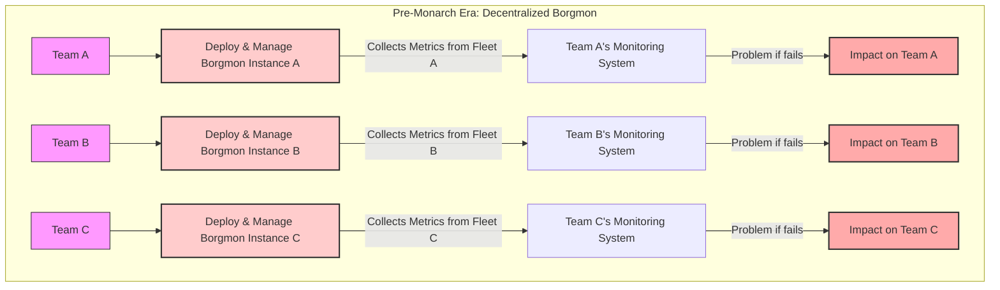
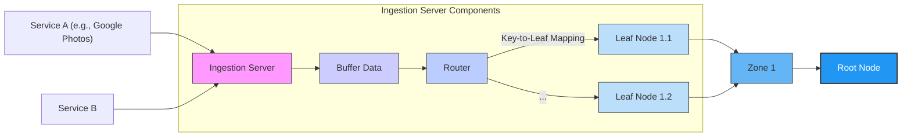

# Monarch： Google'S Planet Scale In Memory Time Series Database (1080P25) - Part 1

_screenshots/frame_00-00-01.jpg)

## Google Monarch: A Time Series Data Store

Introduced in a 2010 paper, Google Monarch is a specialized **time series data store** designed to handle vast amounts of server-side metrics and monitoring data.

### What is Monarch?

Imagine you're tracking the temperature of a complex machine over time. You want to see how it fluctuates, identify when it gets too hot, and pinpoint exactly when a problem started. Monarch serves this exact purpose for Google's internal systems.

-   **Purpose:** To store and manage server-side metrics, such as CPU utilization, memory usage, network traffic, or application-specific performance indicators.
-   **Visualization:** Data stored in Monarch is typically plotted on graphs where:
    -   The **X-axis** represents **time**.
    -   The **Y-axis** represents the **metric's value** (e.g., percentage of CPU used).
-   **Use Case:** This allows engineers to visualize system behavior, identify anomalies (like sudden spikes in CPU usage), and quickly investigate problems by drilling down into specific timestamps (e.g., `Timestamp T1` where a spike occurred).

### Key Requirements & Challenges

Monarch was built to address the unique demands of Google's scale and critical operations.

_screenshots/frame_00-00-50.jpg)

1.  **Massive Scale:**
    *   **Ingestion Rate:** Handles an astounding **6 million data points per second**. This is like trying to catch 6 million tiny balls every second and store them in order.
    *   **Total Data Volume:** Accumulates **Petabytes** (PB) of data, which is an enormous amount – roughly equivalent to millions of gigabytes.

2.  **Real-time Monitoring & Low Latency:**
    *   Since it's used for tracking metrics in real-time to detect and react to system issues, Monarch requires **very low latency**.
    *   The target latency is **less than 100 milliseconds** for data ingestion and retrieval. This means data needs to be available for analysis almost instantly after it's generated.

_screenshots/frame_00-01-27.jpg)

3.  **Extreme Availability & No Hard Dependencies:**
    *   **Criticality:** Monarch is so vital that Google's ability to react to system outages (e.g., if a core service like Spanner or Colossus goes down) directly depends on Monarch's operational status.
    *   **Independence:** To ensure this criticality, Monarch **cannot have hard dependencies** on other major Google systems. It must remain operational even if other foundational services experience failures. This requires an exceptionally robust and isolated design to achieve **extremely high availability**.

### The Problem: Pre-Monarch Monitoring (Borgmon)

Before Monarch, Google faced significant challenges with its decentralized monitoring approach, primarily relying on a system called **Borgmon**.

_screenshots/frame_00-02-04.jpg)

#### Borgmon: A Decentralized Approach

-   **Mechanism:** Borgmon (short for "Borg Monitor") was a common library used across Google. Each engineering team or service fleet (like Google Photos servers S1, S2, S3 in the diagram) would independently deploy and manage their own Borgmon instances.
-   **Operation:** These instances would collect metrics from their respective servers and push them to their local monitoring system.

#### Issues with Borgmon

This decentralized model, while seemingly flexible, led to several inefficiencies and problems:

1.  **Duplicate Work:** Multiple teams were performing the same tasks: deploying, configuring, and maintaining their own Borgmon instances. This was a classic case of reinventing the wheel across different organizational silos.
2.  **Management Overhead:** Each team was responsible for the operational health of their Borgmon instance. If a team's Borgmon went down, they had to troubleshoot and fix it themselves.
3.  **Internal Knowledge Required:** Engineers needed to understand the internal workings and complexities of the Borgmon library to effectively use and manage it. This steep learning curve added to the burden.
4.  **Inconsistent Monitoring:** Different teams might implement Borgmon slightly differently, leading to inconsistencies in how metrics were collected, stored, and analyzed across Google.
5.  **Cost Inefficiency:** The cumulative engineering time spent on redundant deployments and maintenance translated into significant financial costs for the company.



### The Solution: Centralized Monarch

Recognizing the inefficiencies and limitations of Borgmon, the decision was made to centralize monitoring infrastructure into a dedicated system: Monarch.

-   **Shift in Paradigm:** Moving away from individual team deployments to a single, common time series data store managed by a specialized team.
-   **Simplified Metric Reporting:** Instead of managing Borgmon, engineering teams now integrate with Monarch via **Monarch clients**.
    -   These clients are simple libraries that run on server fleets.
    -   They periodically collect metrics and push them to the central **Monarch servers**.
-   **Benefits:**
    -   **Reduced Burden on Teams:** Engineers no longer need to worry about the complexities of monitoring infrastructure deployment or management. They just use the client.
    -   **Cost Savings:** Eliminates duplicate work, freeing up significant engineering time and resources.
    -   **Consistency & Reliability:** Centralized management ensures consistent metric collection and higher overall system reliability.

```mermaid
graph TD
    subgraph "Monarch Era: Centralized Monitoring"
        direction LR
        TeamX[Team X] --> UseMonarchClientX[Use Monarch Client]
        TeamY[Team Y] --> UseMonarchClientY[Use Monarch Client]
        TeamZ[Team Z] --> UseMonarchClientZ[Use Monarch Client]

        UseMonarchClientX -- "Push Metrics" --> MonarchServers[Monarch Servers (Managed Centrally)]
        UseMonarchClientY -- "Push Metrics" --> MonarchServers
        UseMonarchClientZ -- "Push Metrics" --> MonarchServers

        MonarchServers -- "Provides High Availability & Reliability" --> AllTeamsBenefit[All Teams Benefit]

        style MonarchServers fill:#bcf,stroke:#333,stroke-width:2px
        style AllTeamsBenefit fill:#bfb,stroke:#333,stroke-width:2px
    end
```

#### Comparison: Borgmon vs. Monarch

| Feature                | Borgmon (Pre-Monarch)                               | Monarch (Solution)                                     |
| :--------------------- | :-------------------------------------------------- | :----------------------------------------------------- |
| **Deployment Model**   | Decentralized; each team deploys independently      | Centralized; single system managed by a dedicated team |
| **Management Burden**  | High; teams manage their own instances              | Low; teams use simple clients, Monarch team manages servers |
| **Required Knowledge** | Teams needed internal Borgmon knowledge             | Teams use abstract clients; internal complexity hidden |
| **Efficiency**         | Duplicate work, wasted engineering time             | Consolidated effort, significant engineering time saved |
| **Scalability**        | Limited by individual team efforts & expertise       | Designed for Google's extreme scale (Pb data, 6M points/sec) |
| **Availability**       | Dependent on individual team's setup; inconsistent  | Extreme availability, no hard external dependencies    |

### Architectural Decision: In-Memory Storage

Given the requirements of Petabytes of data that need to be accessed with very low latency at any given point in time, a crucial early architectural decision for Monarch was to store data **in-memory**.

-   **Rationale:** In-memory storage provides the fastest possible read and write access, directly addressing the <100ms latency requirement for real-time monitoring.
-   **Cost Implication:** While highly performant, maintaining Petabytes of data in RAM is an extremely expensive undertaking. This decision reflects the critical importance and value Monarch provides to Google's operations, justifying the substantial investment.

---

### Observing System Health with Monarch: Beyond Raw Data

Monarch's primary role is to provide deep insights into the health of Google's vast systems. While simple plots of metrics over time are useful, Monarch employs a more sophisticated approach, particularly for metrics like **request latency**.

#### Request Latency: From Raw Events to Histograms

Imagine a server processing requests. Each request takes a certain amount of time to complete (e.g., 10ms, 5ms, 2ms, 85ms). Plotting these individual latency values directly on a graph (latency on Y-axis, time on X-axis) might show a spike, indicating an anomaly. However, understanding the *distribution* of latencies is far more powerful.

_screenshots/frame_00-03-54.jpg)

Instead of just showing individual data points, Monarch constructs **histograms** of request latencies. A histogram groups data into "bins" and shows the frequency (or count) of data points falling into each bin.

**Example Latency Histogram:**

Let's say over a specific time window, we observed the following request latencies:

-   8 requests took between 0 and 10 milliseconds.
-   1 request took between 11 and 20 milliseconds (specifically, 16ms).
-   1 request took between 81 and 90 milliseconds (e.g., 85ms).

A histogram for this data would look like the screenshot, visually representing the distribution:

| Latency Bin (ms) | Frequency (Count of Requests) |
| :--------------- | :---------------------------- |
| 0-10             | 8                             |
| 11-20            | 1                             |
| 21-30            | 0                             |
| ...              | ...                           |
| 81-90            | 1                             |

#### Why Histograms are Better: P99 Latency and Anomaly Tracing

Histograms offer several advantages over raw time-series plots for system monitoring:

1.  **Understanding Performance Distribution:** Engineers can easily see how well requests are being served overall. Most requests might be fast, but a small percentage could be very slow.
2.  **P99 Latency:** Histograms make it easy to identify **percentile latencies**, such as **P99 latency** (the latency at which 99% of requests are served faster). If P99 latency spikes, it indicates that a significant portion of users are experiencing slow responses, even if the average latency remains low. This is crucial for user experience.
3.  **Anomaly Detection and Tracing:** When an anomaly is detected (e.g., a sudden increase in requests in a high-latency bin), Monarch takes it a step further by storing **example traces** for each histogram bin.
    *   For the 0-10ms bin, Monarch might store a `trace ID` for one typical, fast request.
    *   For the 11-20ms bin (where our 16ms request fell), its `trace ID` would be stored.
    *   Crucially, for the 81-90ms bin, the `trace ID` of that single, slow request (e.g., 85ms) is stored.
    *   Engineers can then use these stored `trace IDs` to **dig deeper** into the system, examining logs and internal operations of that specific slow request to understand *why* it was slow. This is like having a direct link to the problem's root cause.

#### Time-Windowed Histograms

Monarch doesn't just store one histogram; it continuously generates and stores histograms for specific **time windows**.

_screenshots/frame_00-05-17.jpg)

-   For every time window (e.g., every minute, every 5 minutes), Monarch compiles a new histogram representing the latency distribution during that period.
-   This allows engineers to observe the system's performance trend over time, seeing how the latency distribution evolves from one window to the next (e.g., Day 1, Day 2, Day 3...).
-   Engineers can then:
    -   **Dig into a single time window:** Analyze the performance characteristics for a specific problematic period.
    -   **Get an aggregate across multiple histograms:** Understand long-term trends or compare performance across different days or hours.

### Data Compression: Making Petabytes of In-Memory Data Feasible

Storing billions of data points, including detailed histograms and trace examples, in-memory at Petabyte scale would be prohibitively expensive if done naively. Google employs sophisticated compression algorithms to make this feasible, achieving massive savings.

_screenshots/frame_00-05-41.jpg)

#### 1. Shared Timestamps

-   **Problem:** If every metric's time series and every histogram had to store its own timestamp for each data point, there would be massive redundancy.
-   **Solution:** Monarch shares timestamps across all histograms and metrics generated within the same time window.
    -   Imagine a single "master clock" for a given time window. All metrics (latency, CPU, memory, etc.) recorded during that window reference this same timestamp.
-   **Benefit:** This technique alone achieves around **90% savings** when storing timestamp values.
-   **Additional Benefit:** It greatly simplifies **interpolating data** and performing **joins across different metrics**. For example, if you want to see how request latency correlates with memory usage at a specific moment, it's easy because both metrics are aligned to the same shared timestamps.

#### 2. Delta Encoding (for Histogram Values)

-   **Problem:** Histograms typically evolve slowly from one time window to the next. Storing the full frequency counts for each bin in every new histogram is inefficient.
    -   Example: Histogram A has bin counts `[8, 1, 1]` for `(0-10ms, 11-20ms, 81-90ms)`.
    -   The next histogram (Histogram B) might have `[7, 2, 1]`. Storing `[7, 2, 1]` directly is redundant.
-   **Solution:** Instead of storing the absolute frequency counts, Monarch stores the **differences (deltas)** between consecutive histograms for each bin.
    -   For `[8, 1, 1]` and `[7, 2, 1]`:
        -   Delta for bin 1: `7 - 8 = -1`
        -   Delta for bin 2: `2 - 1 = 1`
        -   Delta for bin 3: `1 - 1 = 0`
    -   So, instead of storing `[7, 2, 1]`, Monarch stores `[-1, 1, 0]` relative to the previous histogram.
-   **Benefit:** These delta values are usually much smaller than the original counts, requiring fewer bits to store. This compression technique helps compress *every time series for every metric* by around **90%**.
-   **Overall Impact:** These compression strategies reduce the memory footprint from what would have been Exabytes of raw data down to a manageable Petabytes, making the in-memory architecture economically viable.

### Monarch's High-Level Architecture: A Global Hierarchy

Monarch employs a hierarchical, distributed architecture to manage its global scale and ensure high availability.

_screenshots/frame_00-06-16.jpg)

```mermaid
graph TD
    RootNode["Root Node (1 Global Instance)"]
    RootNode -- "Manages & Aggregates" --> Zone1[Zone 1 (e.g., 30-40 Zones)]
    RootNode -- "Manages & Aggregates" --> Zone2[Zone 2]
    RootNode -- "..." --> ZoneN[Zone N]

    Zone1 -- "Manages & Collects" --> Leaf1_1[Leaf Node 1.1]
    Zone1 -- "Manages & Collects" --> Leaf1_2[Leaf Node 1.2]
    Zone1 -- "..." --> Leaf1_M[Leaf Node 1.M]

    Zone2 -- "Manages & Collects" --> Leaf2_1[Leaf Node 2.1]
    Zone2 -- "..." --> Leaf2_M[Leaf Node 2.M]

    subgraph "Global Hierarchy"
        style RootNode fill:#2196F3,stroke:#333,stroke-width:2px,color:#fff
        style Zone1 fill:#64B5F6,stroke:#333,stroke-width:1px,color:#fff
        style Zone2 fill:#64B5F6,stroke:#333,stroke-width:1px,color:#fff
        style ZoneN fill:#64B5F6,stroke:#333,stroke-width:1px,color:#fff
        style Leaf1_1 fill:#BBDEFB,stroke:#333,stroke-width:1px
        style Leaf1_2 fill:#BBDEFB,stroke:#333,stroke-width:1px
        style Leaf1_M fill:#BBDEFB,stroke:#333,stroke-width:1px
        style Leaf2_1 fill:#BBDEFB,stroke:#333,stroke-width:1px
        style Leaf2_M fill:#BBDEFB,stroke:#333,stroke-width:1px
    end
```

The architecture consists of three main tiers:

1.  **Root Node:**
    *   There is only **one Root Node** globally.
    *   It acts as the central coordinator and aggregator for all data.
    *   Its primary role is likely to provide a global view of metrics and manage the overall system.

2.  **Zones:**
    *   There are approximately **30 to 40 Zones** distributed worldwide.
    *   These act as "child nodes" to the Root.
    *   Each Zone is responsible for a geographical region or a cluster of data centers.
    *   They aggregate data from their respective Leaf Nodes and potentially perform some local processing or initial aggregation before sending data to the Root.

3.  **Leaf Nodes:**
    *   Each Zone contains a **bunch of Leaf Nodes**.
    *   These are the lowest tier in the hierarchy, closest to the actual systems generating metrics.
    *   Leaf Nodes are responsible for ingesting raw metric data from Monarch clients, performing initial processing (like building histograms), and storing a portion of the time-series data locally before forwarding it up the hierarchy to their parent Zone.

---

### Detailed Architecture: Data Flow and Fault Tolerance

Monarch's hierarchical architecture (Root, Zones, Leaves) facilitates efficient data ingestion and querying while ensuring high availability and fault tolerance. The system shares similarities with Google's Dremel, another large-scale distributed query system.

_screenshots/frame_00-07-39.jpg)

#### 1. Data Ingestion (Write Path)

Data points, such as "CPU consumed per server every second," are continuously ingested into Monarch.

1.  **Service Emission:** Client services (e.g., Google Photos servers) generate metric data points.
2.  **Ingestion Server:** These data points are sent to an **Ingestion Server**.
    *   The Ingestion Server acts as an entry point, buffering incoming data for a short period.
    *   It also contains a **Router** component.
3.  **Router's Role:** The Router is crucial for directing data to the correct storage location.
    *   It uses a **mapping of `key` to `leaf`** (e.g., `metric_name + server_ID` maps to a specific Leaf Node). This ensures that related time-series data for a particular metric or server consistently lands on the same Leaf Node.
    *   The Router then forwards the data to the appropriate **Leaf Node**.
4.  **Leaf Node Storage:** The Leaf Node receives the data and persists it. This is where the in-memory storage of histograms and raw data points occurs.



#### 2. Data Persistence and Fault Tolerance with Colossus

_screenshots/frame_00-08-57.jpg)

Each Leaf Node is connected to **Colossus**, Google's distributed file system (the successor to Google File System or GFS).

-   **Role of Colossus:** Colossus is primarily used for storing logs and other durable data. In Monarch's context, each metric data point can be thought of as a "log line."
-   **Durable Storage:** Leaf Nodes periodically write their in-memory data (or aggregated summaries/raw points) to Colossus. This ensures that even if a Leaf Node crashes, its data is not lost.
-   **Fault Tolerance (Rehydration):** If a Leaf Node server crashes, it can **rehydrate itself** by reading its stored data from Colossus. This mechanism is critical for Monarch's high availability, ensuring that monitoring data remains accessible and consistent even in the face of node failures.

```mermaid
graph LR
    LeafNode[Leaf Node] -- "Persists Data (Logs)" --> Colossus[Colossus (Distributed File Store)]
    Colossus -- "Rehydrates Data" --> LeafNodeCrashed[Leaf Node (Crashed & Recovering)]
    LeafNodeCrashed --> LeafNode[Leaf Node (Operational)]

    style LeafNode fill:#BBDEFB,stroke:#333,stroke-width:1px
    style LeafNodeCrashed fill:#FAA,stroke:#333,stroke-width:2px
    style Colossus fill:#d4edda,stroke:#333,stroke-width:1px
```

#### 3. Query Path

When an engineer wants to retrieve or analyze metric data, a query is initiated:

1.  **Query to Root:** All queries initially hit the **Root Node**. This is similar to how Dremel handles queries, providing a single entry point for global data access.
2.  **Root to Zones:** The Root Node analyzes the incoming query (e.g., which metric, which time range, which geographical region) to determine which **Zones** are responsible for the requested data. It then dispatches the query to these relevant Zones.
3.  **Zones to Leaves:** Each Zone, upon receiving the query, further identifies the specific **Leaf Nodes** that hold the required data within its domain. It then forwards the query to these Leaf Nodes.
4.  **Leaf Node Processing:** Leaf Nodes retrieve the requested data from their in-memory stores (and potentially Colossus for older data or recovery), process it, and return the results up the hierarchy.
5.  **Aggregation and Response:** Results from multiple Leaf Nodes are aggregated at the Zone level, then further aggregated at the Root level, before being returned to the querying engineer.

This multi-tiered query path allows Monarch to efficiently fan out queries to the relevant data partitions and aggregate results, handling complex analytical requests across its massive dataset.

---

