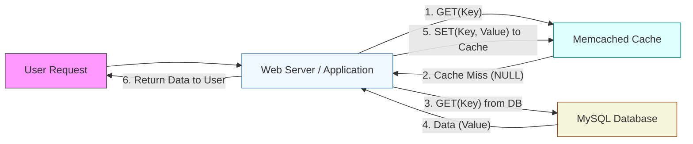

# Scaling Memcache At Facebook (1080P25) - Part 1

_screenshots/frame_00-00-01.jpg)

# Facebook Memcached: Scaling Challenges and Design Goals (2010)

Facebook, with its vast ecosystem including Instagram and WhatsApp, manages an immense volume of data. To ensure a responsive user experience, especially for frequently accessed content, efficient **caching** is paramount. Around 2010, Facebook faced a significant challenge: rapidly rendering user homepages and other dynamic pages.

## The Complexity of Homepage Rendering

Unlike a simple database lookup for a single piece of information, loading a user's homepage involves retrieving a complex "tree" of interconnected data. This is not a single key-value query but rather a process requiring **hundreds of concurrent and parallel key-value reads per query**.

Consider a user viewing a post by a celebrity like Brad Pitt. To fully display this content, the system needs to fetch:
1.  The post itself.
2.  The top comments on that post.
3.  The replies to those top comments.

_screenshots/frame_00-00-49.jpg)

This intricate dependency means that a single homepage request triggers multiple data fetches across various backend services. For example, a homepage might pull data from:
*   **Posts (NewsFeed) Service:** For the actual content, likes, top replies, and comment counts.
*   **Notifications Service:** For unread counts and types of notifications (likes, follows).
*   **Messages Service:** For unread message counts.
*   **Recommendation Service:** To determine what content should appear on the homepage.
*   **Activity Service:** To track and display likes, comments, and other interactions for each post.

_screenshots/frame_00-02-38.jpg)

This branching operation, hitting multiple machines and services, means that the work of dozens of engineering teams is involved in generating a single user's homepage. Consequently, these teams require a common, high-performance cache to deliver responses quickly.

The following diagram illustrates the data dependencies involved in rendering a typical homepage:

```mermaid
graph TD
    A[Render Homepage/Page] --> B[Messages]
    A --> C[Notifications]
    A --> D[Posts (NewsFeed)]

    C --> C1[Count]
    C --> C2[Type (like, follow, ...)]

    D --> D1[Popular Posts]
    D1 --> D2[Likes]
    D1 --> D3[Top Reply]
    D1 --> D4[Number of Comments]

    D3 --> D5[Number of Replies]
    D5 --> D6[Top Reply to Reply]

    style A fill:#f9f,stroke:#333,stroke-width:1px
```

## Key Design Goals for Facebook's Memcached (2010)

In 2010, facing these challenges, Facebook's staff engineers identified critical requirements for their caching solution, Memcached. These goals were central to enabling faster engineering development and improved user experience.

_screenshots/frame_00-03-26.jpg)

The primary design goals were:

1.  **Universal Adoption:**
    *   Create a **common cache** that could be utilized by the vast majority of engineers and services across Facebook. This centralized approach prevents fragmentation and promotes consistency.
2.  **High Concurrency for Complex Queries:**
    *   Efficiently handle the core use case of **hundreds of concurrent/parallel key-value reads per query**. A single request for a homepage should trigger these numerous data fetches without performance bottlenecks.
3.  **Low Latency:**
    *   Ensure extremely **low latency** for cached data retrieval. The target was to serve responses within **10 milliseconds**, as a cache with high latency defeats its purpose of speeding up access.
4.  **CAP Theorem Consideration:**
    *   Define its position within the **CAP theorem** (Consistency, Availability, Partition Tolerance). This fundamental distributed systems concept dictates trade-offs between these three properties, and understanding where Memcached would lie was crucial for its design and reliability. This aspect will be discussed in further detail.

---

### CAP Theorem and Memcached's Approach

_screenshots/frame_00-03-50.jpg)

The **CAP theorem** states that a distributed system can only guarantee two out of three properties simultaneously:
*   **Consistency (C):** All clients see the same data at the same time, regardless of which node they connect to.
*   **Availability (A):** Every request receives a response, without guarantee that it contains the most recent write.
*   **Partition Tolerance (P):** The system continues to operate despite arbitrary numbers of messages being dropped (or delayed) by the network between nodes.

In a distributed cache like Facebook Memcached, **Partition Tolerance (P)** is a given due to the nature of distributed networks. This means the system must choose between strict Consistency and high Availability.

It's a common misconception that a system must be *perfectly* consistent or *perfectly* available. In reality, most systems make **trade-offs**, prioritizing one over the other based on specific use cases. The "right" question to ask is: "Given our requirements, does this use case demand consistency or availability more?"

For Facebook Memcached, the philosophical choice leans towards **higher availability** with **eventual consistency**.
*   **High Availability:** This means the system prioritizes always being able to serve data, even if that data might be slightly outdated.
*   **Eventual Consistency:** Data will eventually propagate throughout the system and become consistent across all nodes, but there's no immediate guarantee.

**Why this choice?**
While perfect availability is not the goal, maximizing it is crucial. A cache that frequently returns stale data (e.g., a friend's reply to a post not appearing immediately) can degrade the user experience on a social media platform. Users expect to see up-to-date information. Therefore, while prioritizing availability, Facebook also strives to make the system **as consistent as possible** to prevent significant data staleness.

### Driving High Adoption Rates: Building an "Engineering Product for Engineers"

A core objective for Facebook's Memcached team was to ensure its widespread adoption by all (or most) engineers at Facebook. This isn't just a technical challenge; it's a "people problem" or an "engineering product problem." Building a system that saves the organization money (by avoiding redundant caching efforts) and enables faster development is a significant impact, often leading to career growth for engineers involved.

If every engineering team built and maintained its own caching solution, it would incur substantial costs in terms of:
*   **Development:** Re-inventing the wheel, writing similar code multiple times.
*   **Maintenance:** Fixing bugs, applying security patches, and upgrading multiple disparate systems.
*   **Testing:** Ensuring correctness and performance for each individual cache.
*   **Deployment:** Managing the infrastructure for numerous caching solutions.

_screenshots/frame_00-06-26.jpg)

To achieve high adoption rates for a shared caching system, several strategies are crucial:

1.  **Good Documentation:** Clear, comprehensive, and up-to-date documentation makes it easy for new engineers to understand, integrate, and troubleshoot the system.
2.  **Good Error Handling:** A robust system provides clear error messages and graceful degradation, making it easier for engineers to debug and recover from issues.
3.  **Soft Skills and Collaboration:** Building strong relationships with other teams, understanding their specific caching requirements, and communicating the benefits of the shared system are vital for buy-in.
4.  **Ease of Use (Primary Metric):** This is paramount. If the system is intuitive and simple to integrate, engineers will naturally gravitate towards it. Low friction for onboarding and daily use encourages widespread adoption.
5.  **Meeting Requirements:** Fundamentally, the system must meet the critical caching requirements of the various engineering teams, such as low latency and handling high concurrency. If it doesn't solve their problems effectively, it won't be used, regardless of how easy it is.

_screenshots/frame_00-06-49.jpg)

In essence, the goal is to build a system so compelling and user-friendly for internal engineers that it becomes the default choice, streamlining development and reducing organizational overhead.

---

### Enhancing Ease of Use: The Role of Client Libraries

Beyond meeting core requirements, **ease of use** is a paramount factor for driving high adoption of a shared caching system like Memcached. Engineers, like anyone else, prefer tools that are simple to integrate and operate.

Traditionally, interacting with a system's API involves:
1.  Reading extensive documentation.
2.  Manually constructing request objects.
3.  Handling raw API responses.

_screenshots/frame_00-07-23.jpg)

To simplify this, Facebook's Memcached team provided **client libraries** for various programming languages (e.g., Python, Java, Go). These libraries act as an abstraction layer, making the cache interaction feel like a native function call within the engineer's application code.

_screenshots/frame_00-07-54.jpg)

**How Client Libraries Enhance Ease of Use:**

*   **Simplified API Interaction:** Instead of manually handling HTTP requests, constructing JSON/XML objects, and parsing responses, engineers simply call a function provided by the library, passing in parameters. The library handles the underlying complexities.
    *   Example:
        ```python
        # Without client library (more complex)
        import requests
        data = {'key': 'user_id_123'}
        response = requests.post('http://memcached.api/get', json=data)
        user_data = response.json()

        # With client library (simple function call)
        from memcached_client import MemcachedClient
        client = MemcachedClient()
        user_data = client.get('user_id_123')
        ```
*   **Automatic Request/Response Handling:** The library automatically constructs the necessary request objects before sending them to Memcached and parses the response back into usable data structures (e.g., Python dictionaries, Java objects).
*   **Version Management & API Contract Updates:** When the Memcached API evolves, engineers simply update their client library version. The library handles the changes internally, ensuring backward compatibility or providing clear update paths, which reduces the burden of manual API integration updates.
*   **Built-in Optimizations:** Client libraries can incorporate advanced features without requiring engineers to implement them manually:
    *   **Compression:** Automatically compress data before sending it to Memcached, saving bandwidth and storage.
    *   **Batching/MGET:** Crucially, for systems like Facebook's homepage rendering, which require fetching hundreds of key-value pairs, the client library can **batch multiple `GET` requests into a single `MGET` (Multi-GET) request**. This significantly reduces network overhead (fewer round trips) and improves efficiency, saving bandwidth and compute resources.

_screenshots/frame_00-08-04.jpg)

The diagram illustrates how a client library abstracts the complexities of API interaction:

```mermaid
graph LR
    subgraph Client Application [Your Service (e.g., Service 1)]
        A[Your Application Code] --> B[Client Library]
    end

    subgraph Client Library Internals
        B --> C[HTTP Client]
        C --> D[Construct Request Objects]
        D --> E[Parse Response Objects]
        E --> B
    end

    B -- "Simplified API Call" --> F[Memcached APIs (HTTP)]

    style A fill:#e0f7fa,stroke:#00796b,stroke-width:1px
    style B fill:#c8e6c9,stroke:#388e3c,stroke-width:1px
    style C fill:#ffe0b2,stroke:#f57c00,stroke-width:1px
    style D fill:#ffccbc,stroke:#d32f2f,stroke-width:1px
    style E fill:#d1c4e9,stroke:#5e35b1,stroke-width:1px
    style F fill:#bbdefb,stroke:#1976d2,stroke-width:1px
```

_screenshots/frame_00-08-25.jpg)

### Basic Cache Operations: Get and Set

The fundamental operations in a cache are `GET` (read) and `SET` (write). Let's trace a `GET` request flow:

1.  **User Request:** A user's request (e.g., "show me Gorib's friends list") arrives at a **web server**.
2.  **Cache Lookup (`GET`):** The web server first attempts to retrieve the data from Memcached using a `GET` request (e.g., `get("gorib_friends")`).
3.  **Cache Miss:** If the data is **not found** in the cache (a "cache miss," common when the cache is initially empty or data has expired/been evicted), Memcached returns a `NULL` or empty response.
4.  **Database Fallback:** Upon receiving a cache miss, the web server then queries the **primary data source**, typically a database (in Facebook's case, MySQL).
5.  **Data Retrieval from DB:** The database fetches the required data (e.g., Gorib's friends list).
6.  **Cache Population (`SET`):** The web server receives the data from the database and immediately stores it in Memcached using a `SET` request (e.g., `set("gorib_friends", [list of friends])`). This ensures that subsequent requests for the same data will hit the cache.
7.  **Response to User:** Finally, the web server sends the retrieved data back to the user.

This "read-through" pattern (check cache, if miss, go to DB and populate cache) is fundamental to how caching systems reduce database load and improve response times.

---

### Cache Update Strategies: Write-Through vs. Write-Around (Cache-Aside)

The previous section described how a cache is populated on a **read miss**. Now, let's explore how data updates are handled.

#### Look-Aside Cache (Cache-Aside Pattern)

_screenshots/frame_00-10-41.jpg)

Facebook Memcached employs a **Look-Aside Cache** strategy, also known as the **Cache-Aside** pattern. In this model, the cache operates independently of the database. The application layer (e.g., the web server) is responsible for managing both reading from and writing to the cache, as well as interacting with the underlying database.

Here's the process for a `GET` request with a Look-Aside Cache:



The client library mentioned earlier plays a crucial role here. When an engineer calls `client.get("key")`, the library internally handles steps 1-6, abstracting the cache miss logic and database fallback from the application code.

#### Write Operation: Invalidate-on-Update

When data needs to be updated, Facebook Memcached uses an **invalidate-on-update** strategy rather than directly updating the cache. This means:

```mermaid
graph LR
    WebServerUpdate[Web Server / Application] --> DBUpdate[1. UPDATE(Key) in MySQL Database]
    DBUpdate -- "2. Success Response" --> WebServerUpdate
    WebServerUpdate -- "3. DELETE(Key) from Memcached Cache" --> CacheDelete[Memcached Cache]

    style WebServerUpdate fill:#f0f8ff,stroke:#4682b4,stroke-width:1px
    style DBUpdate fill:#f5f5dc,stroke:#8b4513,stroke-width:1px
    style CacheDelete fill:#e0ffff,stroke:#008080,stroke-width:1px
```

1.  **Update Database First:** The web server first performs the update operation directly on the **database (MySQL)**. This ensures that the source of truth is always updated.
2.  **Delete from Cache:** Once the database update is successful, the corresponding key is **deleted (invalidated)** from the Memcached cache.

**Why delete instead of update the cache?**

*   **Idempotency:** Deleting a key is an **idempotent operation**. This means performing the operation multiple times has the same effect as performing it once (deleting a non-existent key simply does nothing). If the `DELETE` API call fails and needs to be retried, there are no adverse side effects.
*   **Simplicity and Consistency:** If the cache were updated directly (`SET` operation), managing retries for a failed `SET` could be complex, especially with concurrent updates. For instance, if two updates happen simultaneously, and one `SET` fails and is retried, it could lead to an inconsistent state where the cache holds an older value than the database. Deleting ensures the cache entry is simply removed, forcing the next read to fetch the fresh data from the database.

### Network Protocols: UDP vs. TCP for Cache Operations

The choice of network protocol (UDP or TCP) significantly impacts the behavior and reliability of cache operations.

_screenshots/frame_00-13-02.jpg)

#### TCP (Transmission Control Protocol)

*   **Reliable and Ordered:** TCP is a **connection-oriented** protocol that guarantees delivery of packets in the correct order. It achieves this through acknowledgments (ACKs) and retransmissions.
*   **Synchronous Operations:** For every request sent, the client waits for an acknowledgment before sending the next request. This serializes operations.
*   **Use Case for Memcached:** Ideal for **`SET` (write) operations**.
    *   **Ensures Consistency:** If you send `SET K1=1` followed by `SET K1=2`, TCP guarantees that the server will process `K1=1` before `K1=2`. The final value of `K1` will reliably be `2`. This is crucial for maintaining data integrity during updates.
    *   **Benefit:** Prevents "lost writes" or out-of-order updates that could lead to stale data in the cache if the cache were directly updated.

#### UDP (User Datagram Protocol)

*   **Unreliable and Connectionless:** UDP is a **connectionless** protocol that does not guarantee delivery, order, or duplication. It sends data packets without establishing a connection or waiting for acknowledgments.
*   **Asynchronous Operations:** Requests are sent in a "fire-and-forget" manner. The client does not wait for a response before sending the next request.
*   **Use Case for Memcached:** Used for **`GET` (read) operations** in some scenarios (though Facebook's white paper suggests TCP for `SET` and potentially UDP for `GET` for performance reasons).
    *   **High Performance/Low Latency:** Since there's no overhead of connection establishment or acknowledgments, UDP can be faster and use less memory per connection.
    *   **Potential Issues (for `SET`):** If UDP were used for `SET` operations, there's no guarantee of order or delivery.
        *   Example: If `SET K1=1` is sent, followed immediately by `SET K1=2` via UDP.
            *   Due to network latency or packet loss, the server might receive `K1=2` first, process it, and then receive `K1=1` and process that. The final value could incorrectly be `1`, losing the `K1=2` update.
            *   Alternatively, `K1=1` might be lost entirely.
        *   This unreliability makes UDP unsuitable for write operations where consistency is critical.

_screenshots/frame_00-13-28.jpg)

The trade-off between TCP and UDP for cache operations:

| Feature           | TCP                                            | UDP                                                |
| :---------------- | :--------------------------------------------- | :------------------------------------------------- |
| **Reliability**   | Guaranteed delivery, ordered packets           | No delivery guarantee, packets may be out of order |
| **Connection**    | Connection-oriented (handshake required)       | Connectionless (no handshake)                      |
| **Acknowledgement** | Yes (waits for ACK for each packet)            | No                                                 |
| **Overhead**      | Higher (more handshake, retransmissions)       | Lower (minimal header)                             |
| **Latency**       | Potentially higher (due to ACKs and retrans.) | Potentially lower (fire-and-forget)                |
| **Primary Use**   | `SET` (Write operations)                       | `GET` (Read operations - for speed, if acceptable to lose some reads) |
| **Data Integrity**| High                                           | Low                                                |

_screenshots/frame_00-14-32.jpg)

For Facebook Memcached, the choice of TCP for `SET` operations ensures that write operations are reliable and ordered, preventing data inconsistencies in the cache (before it's invalidated). While `GET` requests might tolerate some unreliability for speed, `SET` operations require the guarantees provided by TCP.

---

### UDP for GET Requests: Embracing Controlled Unreliability for Speed

While **TCP** is used for reliable `SET` (write) operations, Facebook Memcached leverages **UDP** for `GET` (read) requests. This choice is a deliberate trade-off, prioritizing extreme low latency and high throughput for reads over strict ordering guarantees.

_screenshots/frame_00-14-46.jpg)

**Challenges with UDP for GETs:**

*   **Out-of-Order Responses:** Since UDP is connectionless and does not guarantee order, a `GET` request for `Key1` at `Timestamp T1` might receive its response *after* a `GET` request for `Key1` at `Timestamp T2` (where `T2 > T1`). This means a client could receive an older value *after* receiving a newer one for the same key.
*   **Packet Loss:** UDP does not retransmit lost packets. A `GET` request might simply never receive a response if the packet is dropped.

**Facebook's Solution to UDP Anomalies:**

*   **Dropping Out-of-Order Packets:** If the Memcached client receives responses out of order (e.g., an older timestamped value after a newer one), it simply **drops the older packet**.
*   **Error Classification:** Approximately **20% of all errors** observed in Memcached are attributed to these out-of-order packet processing issues.

**Why is this trade-off worthwhile for Facebook?**
For read-heavy workloads like Facebook's newsfeed, the priority is to get *any* data quickly, even if it's occasionally slightly stale or if a small percentage of requests result in dropped packets that need to be retried by the application. The performance gains outweigh the minor consistency and reliability compromises for reads.

### Benefits of Using UDP for GET Requests

The decision to use UDP for `GET` requests offers significant performance advantages, contributing to the desired low latency:

1.  **Reduced Connection Overhead and Memory Savings:**
    *   **No Connection Establishment:** UDP is connectionless, meaning it doesn't require the three-way handshake and state management associated with TCP connections. This saves significant memory on the cache servers, as each client doesn't need to maintain an open TCP socket.
    *   **Increased Key Capacity:** By saving memory per connection, cache servers can store a larger number of keys, leading to a **higher cache hit rate**. This translates to more requests being served directly from the fast cache instead of hitting the slower database.
2.  **Overcoming File Descriptor Limits:**
    *   Operating systems typically impose limits on the number of open file descriptors (which include network sockets) per process, often around 65,000.
    *   While Facebook engineers modified the Unix kernel to increase this limit to over a million connections per server, using UDP inherently bypasses this bottleneck for `GET` requests, as it doesn't consume persistent file descriptors per request.
3.  **Eliminating Head-of-Line Blocking (HOLB):**
    *   **What is HOLB?** In connection-oriented protocols like TCP (or older HTTP/1.1), if multiple requests are multiplexed over a single connection, and an early request gets stuck or takes a long time to process, all subsequent requests on that same connection are blocked, even if they are ready to be processed quickly.
    *   **Analogy:** Imagine a single security line at an airport. If the first passenger in line has complex issues and takes a long time, everyone behind them (even those ready to go) has to wait, potentially missing their flights.
    *   **UDP's Advantage:** With UDP, requests are sent independently and in parallel ("fire and forget"). There's no single "line" that can get blocked. If one request is slow, it doesn't impede others. This is a key reason why modern protocols like HTTP/3.0 use QUIC, which is built on UDP.

_screenshots/frame_00-15-22.jpg)
_screenshots/frame_00-15-46.jpg)
_screenshots/frame_00-15-58.jpg)

The combined effect of these optimizations allows Memcached to achieve extremely high throughput and low latency for read operations, which are the most frequent operations in Facebook's workload.

### Scaling Memcached: Horizontal Scaling with Sharding

To handle the immense scale of Facebook's data and traffic, **vertical scaling** (adding more resources like CPU, RAM to a single server) is insufficient. The system must eventually scale **horizontally** by adding more servers.

The primary method for horizontal scaling in Memcached is **sharding (or partitioning)**.

*   **Concept:** Sharding involves distributing the entire dataset across multiple cache nodes (servers). Each node is responsible for a specific subset of the data.
*   **How it works (Key Range Sharding Example):** If you have a range of keys (e.g., 1 to 1000) and 3 cache nodes, you might distribute them as follows:
    *   **Node 1:** Stores keys 1 to 333
    *   **Node 2:** Stores keys 334 to 666
    *   **Node 3:** Stores keys 667 to 1000

When a request for a specific key comes in, the system determines which node holds that key using a **sharding key** (e.g., a hash of the key) and directs the request to the appropriate server. This allows for parallel processing of requests and distributes the data load across many machines.

---

### Horizontal Scaling Strategies: Sharding vs. Replication

When scaling a system horizontally, two common strategies are **sharding** and **replication**. The choice between them heavily depends on the system's access patterns and requirements.

#### Sharding (Partitioning)

_screenshots/frame_00-18-36.jpg)
_screenshots/frame_00-18-47.jpg)

**Concept:** Sharding divides a dataset into smaller, independent pieces called "shards" (or partitions), each stored on a separate server. Each key belongs to exactly one shard.

**How it works:**
*   **Data Distribution:** Keys are distributed across multiple cache nodes (e.g., M1, M2, M3) based on a sharding key (e.g., hash of the key, or key range).
    *   Example: For keys 1-1000 across 3 nodes:
        *   M1 stores keys 1-333
        *   M2 stores keys 334-666
        *   M3 stores keys 667-1000
*   **Load Distribution:** When new nodes are added, keys are re-distributed from existing nodes to the new ones to balance the load.
*   **Benefits:**
    *   **Scales Storage Capacity:** Allows storing a dataset larger than what a single server can hold.
    *   **Increased Unique Keys:** Each server holds a unique subset of keys, expanding the total number of unique keys that can be cached (e.g., if each server holds 100 unique keys, 3 servers can hold 300 unique keys).
    *   **Direct Access:** A client knows exactly which node to query for a specific key, leading to efficient lookups for single keys.

**Why Sharding is *Not* Suitable for Facebook's Homepage Use Case:**

Facebook's primary challenge, as discussed, is rendering homepages that require **hundreds of keys per query**. These keys are often disparate and belong to different logical entities (e.g., messages, notifications, posts, comments).

*   **Increased Network Hops:** If a homepage requires 100 keys, and these keys are sharded across 10 different nodes, then a single homepage request would need to query **all 10 nodes** to gather the necessary data.
*   **Aggravated Problem:** Instead of simplifying the problem, sharding *spreads* the data points for a single aggregated view across many machines. This doesn't reduce the number of requests; it increases the number of *target servers* for a single user's request.
*   **Higher Latency for Aggregated Views:** Fetching data from multiple nodes concurrently adds complexity and latency due to parallel network requests and aggregation logic at the application layer.

Therefore, for use cases involving fetching many disparate keys for a single aggregated view (like a homepage), sharding actually makes the problem worse by distributing the required data too widely.

#### Replication

_screenshots/frame_00-19-40.jpg)
_screenshots/frame_00-21-59.jpg)

**Concept:** Replication involves creating multiple identical copies (replicas) of the entire dataset across different servers. Each replica can serve any read request.

**How it works:**
*   **Full Dataset on Each Node:** Every cache node holds a complete copy of the entire cacheable dataset (or a large portion of it).
*   **Load Balancing:** Client requests are load-balanced across all available replica nodes.
*   **Benefits (for Facebook's use case):**
    *   **Scales Read Throughput:** When you need to handle 10x the read traffic, you add 9 more replica servers. Each server can handle a portion of the incoming read requests independently.
    *   **Reduced Latency for Aggregated Views:** Since each node holds a copy of all data, a single user's homepage request can be directed to *any one* of the replica nodes. This node can then fulfill all `GET` requests for that homepage without needing to query other cache nodes.
    *   **Improved Availability:** If one replica node fails, others can seamlessly take over, ensuring continuous service.
    *   **Matches Access Pattern:** For Facebook's common access pattern (retrieving hundreds of keys for a single aggregated page), replication is a perfect fit. A user's request for their homepage hits one cache server, which can then provide all the necessary data.

**Comparison of Sharding vs. Replication for Facebook's Read Patterns:**

| Feature            | Sharding (Partitioning)                               | Replication                                            |
| :----------------- | :---------------------------------------------------- | :----------------------------------------------------- |
| **Data Storage**   | Each node stores a unique subset of data.             | Each node stores a full copy of the data.              |
| **Primary Benefit**| Scales total data storage capacity.                   | Scales read throughput and improves availability.      |
| **Read Pattern**   | Best for single-key lookups or small, localized queries. | Best for aggregate queries needing many disparate keys. |
| **Facebook Homepage Issue** | Requires querying multiple shards for one page, increasing network hops and complexity. | A single request hits one replica, which serves all data needed for the page. |
| **Use Case Fit**   | Database scaling, large datasets.                     | Cache scaling, high read traffic, complex queries.     |

For Facebook's core requirement of rapidly rendering homepages by aggregating many pieces of data, **replication** is the superior scaling strategy for Memcached. It directly addresses the need to serve many keys per query efficiently by ensuring that any single cache server can fulfill the entire request.

### Handling Viral Content and Hot Keys

Replication is particularly effective when dealing with **viral content** or "hot keys" – data that experiences a massive surge in access (e.g., a celebrity's new post, a trending topic like a SpaceX launch).

*   **Increased Capacity for Hot Reads:** When a hot key is requested, the load is distributed across all replica nodes. Each node can serve the same popular content from its local cache, preventing any single node from becoming a bottleneck. This is crucial for maintaining performance during peak traffic events.
*   **No Single Point of Contention:** Unlike sharding where a hot key would reside on a single shard, replication ensures that multiple copies are available to absorb the sudden increase in read requests.

---

### Protecting Caches from Overload: Rate Limiting with Sliding Windows

Even with replication, a sudden surge in traffic (e.g., a viral post, trending topic) can overwhelm cache servers. To prevent this, Facebook Memcached implements a form of **rate limiting** at the client level.

_screenshots/frame_00-22-12.jpg)
_screenshots/frame_00-22-49.jpg)

**Sliding Window Mechanism:**
*   **Client-Side Queue:** Each Memcached client (running on the web servers) maintains a **sliding window** or a queue of outgoing cache requests.
*   **Request Flow:** When the web server needs to fetch data from Memcached, it sends the request to its local client library. The client library then manages sending these requests to the actual Memcached nodes.
*   **Dropping Excess Requests:** If the rate of incoming requests to the client exceeds the capacity of its sliding window (queue size), excess requests are dropped. This prevents the client from bombarding the cache servers with more requests than they can handle.
    *   **Policy:** Depending on the policy, either the oldest requests (from the head of the queue) or the newest requests (from the back) can be dropped. Facebook's approach seems to suggest dropping from the back, meaning newer requests are dropped if the queue is full.

**Optimizing Sliding Window Size:**

Facebook's experience showed that finding the right balance for the sliding window size is crucial:

*   **Large Sliding Window:**
    *   **Problem:** If the window is too large, requests might queue up for a long time. While they eventually get processed, the user might have already given up or retried, making the original request's processing useless. This leads to **congestion** and increased perceived latency for the end-user.
    *   **Analogy:** A very long queue at a cashier. Even if you eventually get served, the wait itself is frustrating.
*   **Small Sliding Window:**
    *   **Problem:** If the window is too small, requests are dropped very quickly. This leads to frequent cache misses or immediate drops, prompting the end-user's device (mobile/desktop client) to **retry** the request. Repeated retries generate unnecessary load on the web servers and the cache system, creating a retry storm.
    *   **Analogy:** A cashier with a tiny queue. Many customers are immediately turned away, forcing them to re-queue repeatedly.

The ideal sliding window size is a **fine balance** – large enough to absorb transient spikes and avoid excessive client-side retries, but small enough to drop requests that are unlikely to be useful to the user due to long processing times.

### Fault Tolerance: The Gutter Pool (Spare Instances)

Despite extensive replication and rate limiting, individual cache servers can still become overloaded or fail, especially during events like:
*   **Server Warm-up:** A new server being added to the system starts with an empty cache and needs to fetch all data from the database, causing a temporary spike in load.
*   **Server Loss:** When a server fails, its load is redistributed among the remaining servers, potentially overwhelming them.

_screenshots/frame_00-23-26.jpg)
_screenshots/frame_00-23-38.jpg)

To mitigate these critical failure scenarios, Facebook introduced a concept called the **Gutter Pool**.

**Gutter Pool (Spare Instances):**
*   **Purpose:** A small pool of dedicated **spare Memcached instances** designed to absorb overflow requests when primary cache servers are under severe stress or fail.
*   **Mechanism:** If a client's request to a primary Memcached server fails or times out (indicating overload or failure), the client automatically redirects the request to a server in the Gutter Pool.
*   **Analogy:** Like a storm drain or 'gutter' that handles excess rainwater when the main drainage system is overwhelmed.
*   **Scale:** These Gutter Pool instances are a relatively small percentage of the total Memcached fleet (e.g., **~1% of all Memcached nodes**).
*   **Effectiveness:** Despite their small number, these spare instances are highly effective, managing to absorb and handle approximately **99% of all cache server failures or overloads**.

The Gutter Pool acts as a crucial safety net, ensuring high availability and protecting the primary cache servers from cascading failures during periods of high stress or system changes. This demonstrates a sophisticated approach to fault tolerance in a large-scale distributed caching system.

---

### The Gutter Pool: A Proactive Fault Tolerance Mechanism (Continued)

_screenshots/frame_00-25-57.jpg)

The **Gutter Pool** serves as a vital fault-tolerance mechanism for Facebook's Memcached. While failures in a highly replicated system are rare, they do occur, particularly when:
*   A new cache server is brought online and needs to "warm up" (populate its cache). This initial period can cause it to be overloaded as it fetches data from the database.
*   An existing cache server fails or is taken offline, causing its traffic to be redirected to other nodes, potentially overloading them.

In these scenarios, the Gutter Pool acts as an overflow system:
*   **Functionality:** Gutter instances are essentially spare Memcached servers. If a client's request to a primary Memcached server fails (e.g., due to timeout or overload), the client's logic automatically redirects the request to a Gutter instance.
*   **Data Locality:** The data locality on a Gutter instance is intentionally "horrible." This means Gutter instances don't specialize in specific data ranges or user groups. They are general-purpose fallbacks designed to serve *any* request that a primary server couldn't handle, regardless of where the data *should* ideally reside.
*   **Efficiency:** Despite making up only **~1% of all Memcached nodes**, the Gutter Pool is remarkably effective, handling **99% of all cache server failures or overloads**. This makes it an incredibly cost-efficient and impactful solution for maintaining high availability.
*   **Connection to Database:** Like primary Memcached instances, Gutter instances also connect to the underlying MySQL database to fetch data when they experience a cache miss.

```mermaid
graph TD
    Client["Client (on Web Server)"] --> PrimaryMemcache[Primary Memcached Server]
    PrimaryMemcache -- "Failure / Overload" --> Client
    Client -- "Redirect Request" --> GutterPool[Gutter Pool (Spare Instances)]
    GutterPool -- "Data Request" --> MySQL[MySQL Database]

    style Client fill:#e0f7fa,stroke:#00796b,stroke-width:1px
    style PrimaryMemcache fill:#c8e6c9,stroke:#388e3c,stroke-width:1px
    style GutterPool fill:#ffccbc,stroke:#d32f2f,stroke-width:1px
    style MySQL fill:#f5f5dc,stroke:#8b4513,stroke-width:1px
```

### Scaling the Database Layer: Global MySQL Replication

While Memcached handles read scaling, the underlying persistent data store (MySQL) also needs to scale to support Facebook's global user base. A single database server cannot serve the entire world, necessitating horizontal scaling for the database layer as well.

The challenge is to maintain **consistency** across geographically distributed database servers while ensuring **high availability**. If different regions (e.g., India, US, Europe) have their own MySQL servers, updates made in one region must eventually propagate to others to prevent users from seeing stale or different data.

_screenshots/frame_00-26-09.jpg)
_screenshots/frame_00-26-45.jpg)

**Database Replication Strategy: Eventual Consistency via Change Logs**

Instead of a "fan-out" approach where every client writes to all MySQL instances simultaneously (which would be complex and slow), Facebook opts for an **eventually consistent** model using **change logs** for asynchronous replication.

1.  **Primary Write Region:** A write operation (e.g., updating a user's friend list) is typically directed to a primary MySQL server in a specific region (e.g., the Indian server).
2.  **Transaction Log / Binary Log (BinLog):** MySQL records all data modification operations (CREATE, UPDATE, DELETE) in a sequential, immutable log file known as the **Binary Log (BinLog)**. This log captures the exact commands or events that changed the data. `SELECT` (read) operations are not typically included as they don't modify data.
3.  **Log Propagation:** The BinLog from the primary server is then asynchronously copied and sent to other MySQL replica servers in different regions (e.g., US, Europe).
4.  **Replication and Execution:** Each replica server receives this BinLog and "replays" or executes the commands in the exact sequence they occurred on the primary server. This ensures that the replica eventually becomes consistent with the primary.

```mermaid
graph TD
    ClientWrite[Client Write Request] --> MySQL_IN[MySQL Server (India - Primary for writes)]

    subgraph Replication Process
        MySQL_IN --> BinLog[Binary Log / Change Log (MySQL BinLog)]
        BinLog -- "Propagates Changes" --> MySQL_US[MySQL Server (US - Replica)]
        BinLog -- "Propagates Changes" --> MySQL_EU[MySQL Server (Europe - Replica)]
    end

    MySQL_US -- "Replays Commands" --> MySQL_US
    MySQL_EU -- "Replays Commands" --> MySQL_EU

    style ClientWrite fill:#e0f7fa,stroke:#00796b,stroke-width:1px
    style MySQL_IN fill:#f5f5dc,stroke:#8b4513,stroke-width:1px
    style BinLog fill:#ffe0b2,stroke:#f57c00,stroke-width:1px
    style MySQL_US fill:#f5f5dc,stroke:#8b4513,stroke-width:1px
    style MySQL_EU fill:#f5f5dc,stroke:#8b4513,stroke-width:1px
```

This approach guarantees that even if there's a delay, all servers will eventually converge to the same consistent state.

### MexSQL: Enhancing Replication and Cache Invalidation

_screenshots/frame_00-28-56.jpg)

Facebook employs a custom component called **MexSQL** to enhance this replication process. MexSQL acts as an intermediary or a specialized server that sits "in between" the MySQL BinLog and the replication targets.

**Role of MexSQL:**
*   **Consumes BinLog:** MexSQL reads the BinLog stream from the primary MySQL server.
*   **Appends Custom Commands:** Crucially, MexSQL can **append its own custom commands** to this log file.
*   **Cache Invalidation Commands:** One of the most clever uses of MexSQL is to inject **cache invalidation commands** directly into the BinLog stream. When a data change occurs in MySQL, MexSQL adds a corresponding `DELETE(Key)` command for the affected cache entry into the stream.
*   **Propagates Enhanced Log:** This "enhanced" log, now containing both database changes and cache invalidation instructions, is then sent to other MySQL replicas *and* potentially to other systems that need to react to data changes (like Memcached client libraries or specialized cache invalidation services).

This integration ensures that as database changes are replicated, the associated cache entries are also invalidated, maintaining consistency between the database and the cache across the distributed system. This centralized, log-based approach for cache invalidation is highly efficient and scalable.

---

### MexSQL: Centralized Change Propagation

_screenshots/frame_00-29-43.jpg)

As discussed, **MexSQL** plays a crucial role in Facebook's global data consistency strategy. It acts as a central hub for propagating database changes and related cache invalidations.

*   **BinLog Consumption:** MexSQL continuously consumes the **Binary Log (BinLog)** stream from primary MySQL servers. This stream contains all data modification events (CREATE, UPDATE, DELETE).
*   **Command Appending:** A key feature of MexSQL is its ability to **append custom commands** to this log stream. This is particularly useful for injecting specific instructions, such as cache invalidation requests.
*   **Global Propagation:** After processing and potentially enhancing the log, MexSQL propagates these changes to all other MySQL replicas worldwide. This ensures that database updates eventually reach every region.
*   **Cache Invalidation Integration:** By adding `DELETE(Key)` commands for cache entries into the BinLog stream, MexSQL ensures that as database changes propagate, the corresponding stale data in Memcached is also invalidated across the system. This maintains eventual consistency between the database and the cache.

This centralized, log-based propagation via MexSQL is highly efficient and scalable, preventing a "thundering herd" problem where every client tries to update multiple database and cache instances directly.

### Scaling Writes: Leveraging the Read-Heavy Workload

A fundamental characteristic of Facebook's workload (and many large-scale web applications) is that **read operations are vastly more frequent than write operations**.

*   **Read-to-Write Ratio:** For Memcached, reads are approximately **1,000 times more common than writes**. This significant imbalance presents a crucial optimization opportunity for scaling the underlying database layer.

_screenshots/frame_00-31-01.jpg)

**Dedicated Write Nodes and Abundant Read Nodes:**

Given the disproportionate read-to-write ratio, Facebook's MySQL architecture is optimized as follows:

*   **Few Write Nodes:** Only a small number of MySQL servers are designated as **write nodes**. For instance, there might be one primary write node per major geographical region (e.g., one in India, one in the US, one in Europe). All write operations are directed to these few dedicated nodes.
*   **Many Read Nodes:** In contrast, there are a **multitude of read nodes** (MySQL replicas) that primarily serve read traffic. These read nodes are numerous and distributed to handle the massive volume of read requests.

**Benefits of this Architecture:**

*   **Efficient Write Handling:** By centralizing writes to a few nodes, the complexity of managing concurrent writes and consistency across many servers is greatly reduced. A write operation only needs to hit a single primary database server.
*   **Asynchronous Propagation:** Once a write hits a primary node, MexSQL takes care of asynchronously propagating that change (via the BinLog) to all other read and write nodes across the globe. This prevents the write operation from becoming a bottleneck by waiting for all replicas to acknowledge the change.
*   **Avoids "Thundering Herd" for Writes:** If every write operation had to simultaneously update hundreds of database servers and then trigger cache updates across all caches, it would lead to a massive, unmanageable "thundering herd" problem, overwhelming the system. The dedicated write node + MexSQL approach elegantly avoids this.
*   **Scalability:** This setup allows Facebook to scale its read capacity almost infinitely by simply adding more read replica nodes, without significantly increasing the complexity or cost of managing write consistency.

_screenshots/frame_00-31-14.jpg)

```mermaid
graph TD
    UserReq["User Request (Read/Write)"] --> Client[Client (Web Server)]

    subgraph Write Path
        Client -- "Write Request" --> WriteNode[MySQL Write Node (e.g., India)]
        WriteNode --> BinLog[MySQL BinLog]
        BinLog --> MexSQL[MexSQL (Log Processor)]
    end

    subgraph Read Path
        Client -- "Read Request" --> ReadNode1[MySQL Read Node 1]
        Client -- "Read Request" --> ReadNode2[MySQL Read Node 2]
        Client -- "Read Request" --> ReadNodeN[...MySQL Read Node N]
    end

    MexSQL -- "Propagate Changes (incl. Cache Invalidation)" --> ReadNode1
    MexSQL -- "Propagate Changes (incl. Cache Invalidation)" --> ReadNode2
    MexSQL -- "Propagate Changes (incl. Cache Invalidation)" --> ReadNodeN
    MexSQL -- "Propagate Changes" --> WriteNodeResp[Other MySQL Write Nodes]

    style WriteNode fill:#f5f5dc,stroke:#8b4513,stroke-width:1px
    style ReadNode1 fill:#e6ffe6,stroke:#339933,stroke-width:1px
    style ReadNode2 fill:#e6ffe6,stroke:#339933,stroke-width:1px
    style ReadNodeN fill:#e6ffe6,stroke:#339933,stroke-width:1px
    style BinLog fill:#ffe0b2,stroke:#f57c00,stroke-width:1px
    style MexSQL fill:#d1c4e9,stroke:#5e35b1,stroke-width:1px
    style WriteNodeResp fill:#f5f5dc,stroke:#8b4513,stroke-width:1px
```

### Conclusion: Nuanced Scaling for Real-World Access Patterns

Facebook's approach to scaling Memcached and its underlying MySQL database is a prime example of a **nuanced and highly optimized system design**. Instead of applying generic scaling solutions, they meticulously analyzed their specific access patterns (hundreds of concurrent key-value reads per homepage, read-heavy workload) and built a system tailored to these demands.

Key takeaways from Facebook's Memcached scaling:

*   **Client Libraries:** Crucial for ease of use and internal adoption.
*   **UDP for Reads, TCP for Writes:** A deliberate trade-off to optimize for the dominant read workload (low latency, no HOLB) while ensuring write reliability.
*   **Replication over Sharding for Caching:** Best suited for aggregating many disparate data points for complex page views.
*   **Gutter Pool:** An efficient fault-tolerance mechanism for handling cache server overloads and failures with minimal overhead.
*   **Eventual Consistency with BinLog/MexSQL:** A robust strategy for global database replication and integrated cache invalidation, optimizing for the read-heavy nature of the system.

This comprehensive strategy, detailed in papers like "Scaling Memcache at Facebook," highlights how deep understanding of application requirements and clever architectural choices can lead to highly performant and resilient distributed systems.

---

