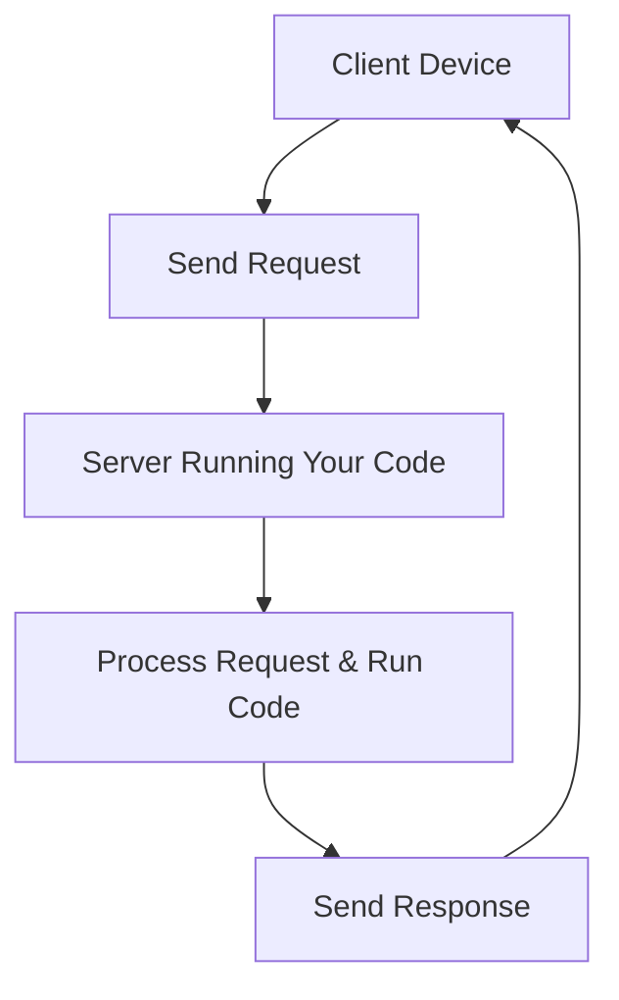

# System Design Basics： Horizontal Vs. Vertical Scaling (1080P30) - Part 1

## System Design Basics: From Local Code to Scalable Services

This section introduces fundamental concepts in system design, focusing on how a simple program evolves into a robust, accessible service.

### 1. The Genesis of a Service: From Local Code to API

Imagine you've written a useful program or **algorithm** on your personal computer. This program functions like any other: it takes some **input** and produces an **output**.

Initially, your code runs locally. However, if others find your code valuable and are willing to pay to use it, you face a challenge: you can't physically give your computer to everyone.

The solution is to make your code accessible remotely, transforming it into a **service**.

#### 1.1 Exposing Your Code: The API

To allow others to use your code without direct access to your machine, you **expose** it over the internet using a **protocol**. The primary mechanism for this is an **Application Programming Interface (API)**.

An API acts as a contract, defining how other programs can interact with your service. Instead of storing its output locally (e.g., in a file or database), your code now *returns* its output directly to the requesting party.

#### 1.2 The Request-Response Model

_screenshots/frame_00-01-16.jpg)

When your code is exposed via an API, the interaction follows a **request-response model**:

*   **Request**: A client (e.g., a user's mobile app or another server) sends a **request** to your computer (now acting as a **server**) to execute your code with specific inputs.
*   **Response**: Your server processes the request, runs the code, and sends back the resulting **output** as a **response** to the client.

This continuous exchange of requests and responses forms the backbone of how most internet services operate.



### 2. The Need for Cloud Hosting: Beyond the Desktop

Initially, you might try to host your service directly on your desktop computer. However, this approach quickly reveals significant limitations:

_screenshots/frame_00-02-21.jpg)

*   **Data Storage**: Your service might need to store information persistently, requiring a **database** to be connected to your computer.
*   **Endpoint Configuration**: You need to properly configure the network "endpoints" (addresses and ports) that people connect to.
*   **Reliability Issues**: Your desktop is susceptible to power loss, internet outages, or hardware failures. If your service goes down, paying customers will be impacted, leading to dissatisfaction and lost revenue.

#### 2.1 Embracing the Cloud

_screenshots/frame_00-02-32.jpg)

To overcome the limitations of local hosting, the standard practice is to host your services on the **cloud**.

*   **What is the Cloud?** The "cloud" is essentially a vast collection of computers (servers, storage devices, networking hardware) provided and maintained by a third-party vendor (e.g., Amazon Web Services - AWS, Google Cloud, Microsoft Azure). You pay these providers to use their infrastructure.
*   **Computation Power**: When you "rent" computation power from the cloud, you're essentially getting access to a powerful computer (or a portion of one) located in their data center. You can remotely log in and deploy your algorithm on these machines.
*   **Benefits of Cloud Hosting**:
    *   **Reliability**: Cloud providers offer high uptime guarantees, redundant power, and robust infrastructure, significantly reducing the risk of your service going down.
    *   **Maintenance & Configuration**: A large part of the underlying hardware and network configuration, security, and maintenance is handled by the cloud provider. This frees you from operational burdens.
    *   **Focus on Business Logic**: By offloading infrastructure management, you can concentrate your efforts on developing and improving your core business requirements and features.

```mermaid
graph TD
    User[User] --> Internet
    Internet --> DNS[DNS Resolution]
    DNS --> CloudProvider[Cloud Provider (e.g., AWS)]
    CloudProvider --> VirtualServer[Virtual Server / EC2 Instance]
    VirtualServer --> YourCode[Your Code (Service)]
    YourCode --> Database[Managed Database Service]
    VirtualServer -- "Handles" --> Reliability[Reliability, Security, Maintenance]
    CloudProvider -- "Provides" --> Scalability[Scalability Features]

    style CloudProvider fill:#ddf,stroke:#333,stroke-width:1px
    style Reliability fill:#cfc,stroke:#333,stroke-width:1px
    style Scalability fill:#fcc,stroke:#333,stroke-width:1px
```

### 3. Business Requirement: Scalability

Once your service gains popularity, a new challenge emerges: your single server, even if hosted on the cloud, might become overwhelmed by the sheer number of incoming requests. It can no longer handle all connections efficiently.

This brings us to a crucial concept in system design: **Scalability**.

#### 3.1 What is Scalability?

**Scalability** refers to a system's ability to handle an increasing amount of work or a growing number of users without a significant drop in performance. In simple terms, it's the capacity to handle more requests.

There are two primary ways to achieve scalability:

#### 3.2 Methods of Scaling

| Scaling Method      | Description                                                                                             | Analogy                                                                                                                              | Pros                                                                        | Cons                                                                               |
| :------------------ | :------------------------------------------------------------------------------------------------------ | :----------------------------------------------------------------------------------------------------------------------------------- | :-------------------------------------------------------------------------- | :------------------------------------------------------------------------------------- |
| **Vertical Scaling**<br>(Scaling Up) | **Upgrade** the existing machine with more powerful hardware (e.g., faster CPU, more RAM, larger storage). | Imagine a single restaurant kitchen that becomes overwhelmed. You upgrade it with bigger ovens, more counter space, and faster equipment. | Simpler to implement initially (often just a configuration change).         | Limited by the maximum capacity of a single machine; often more expensive per unit of performance. |
| **Horizontal Scaling**<br>(Scaling Out) | **Add more machines** (servers) to distribute the workload across multiple instances.                         | Instead of upgrading one kitchen, you open multiple identical kitchens in different locations or even within the same building.        | Highly flexible; virtually limitless capacity; provides redundancy (if one machine fails, others can take over). | More complex to implement (requires load balancing, distributed data management).       |

Both methods involve "throwing more money at the problem" (investing in better or more infrastructure) to accommodate increased demand. The choice between them, or a combination of both, depends on the specific needs and architecture of the system.

---

### 3.3 Vertical vs. Horizontal Scaling: A Detailed Comparison

_screenshots/frame_00-03-27.jpg)
_screenshots/frame_00-03-40.jpg)

As discussed, **scalability** is the system's ability to handle increasing demand. We achieve this through two main mechanisms: **Vertical Scaling** (scaling up) and **Horizontal Scaling** (scaling out). Let's delve into a detailed comparison of their characteristics:

_screenshots/frame_00-03-53.jpg)
_screenshots/frame_00-06-52.jpg)
_screenshots/frame_00-07-31.jpg)

| Feature / Aspect       | Vertical Scaling (Scaling Up)                                                                                                    | Horizontal Scaling (Scaling Out)                                                                                                                                                           |
| :--------------------- | :------------------------------------------------------------------------------------------------------------------------------- | :------------------------------------------------------------------------------------------------------------------------------------------------------------------------- |
| **Concept**            | Upgrading a single server with more resources (e.g., faster CPU, more RAM, larger storage) to handle more requests.              | Adding more individual servers (machines) to a system and distributing incoming requests across them.                                                                      |
| **Load Balancing**     | **Not Applicable (N/A)**: Since there's only one machine, there's no "load" to balance among multiple instances.                 | **Required**: A **load balancer** is essential to distribute incoming requests evenly among the multiple servers, ensuring no single server is overloaded and all are utilized. |
| **Resilience / Fault Tolerance** | **Single Point of Failure (SPOF)**: If this one powerful machine fails, the entire service goes down.                            | **Resilient**: If one machine fails, requests can be redirected to the other available machines, ensuring the service remains operational. This provides high availability.     |
| **Communication**      | **Inter-process Communication (IPC)**: Communication between different parts of your application on the *same* machine is very fast as it happens within the local memory. | **Network Calls (Remote Procedure Calls - RPC)**: Communication between different servers occurs over the network, which is significantly slower due to network latency and overhead. |
| **Data Consistency**   | **Consistent**: All data resides on a single system, making it straightforward to maintain strong data consistency (e.g., ensuring all reads see the latest writes). | **Challenging (Loose Guarantees)**: When data is distributed across multiple servers and databases, maintaining strict transactional consistency (like atomic operations across all servers) becomes complex and can be impractical. Often, systems opt for looser consistency models (e.g., eventual consistency). |
| **Scalability Limit**  | **Hardware Limit**: There's an inherent physical limit to how powerful a single machine can become. You can't endlessly upgrade one computer. | **Scales Well**: Can scale almost linearly with the number of users or requests. You can add more servers as demand grows, providing virtually limitless capacity.                 |
| **Cost Efficiency**    | Can be cost-effective for initial growth, but very powerful machines become disproportionately expensive.                          | More cost-effective for large-scale growth as you can use commodity hardware and add resources incrementally.                                                                 |

### 3.4 The Hybrid Approach: Real-World Scalability

In practice, most large-scale systems leverage a **hybrid approach**, combining the best aspects of both vertical and horizontal scaling:

1.  **Start with Vertical Scaling (within limits)**: Initially, you might choose to run your service on a single, powerful machine (a "big box"). This benefits from fast inter-process communication and simpler data consistency.
2.  **Transition to Horizontal Scaling as Demand Grows**: Once your user base expands and the single machine approaches its practical limits (both in terms of hardware and cost-effectiveness), you transition to a horizontal scaling model.
3.  **Optimal "Big Box" per Node**: Even when horizontally scaling, each individual server in your cluster will often be vertically scaled to a reasonable degree. This means each server itself is a "big box" (as powerful as financially and practically feasible), and then you add *more* of these big boxes.

This approach balances the performance benefits of local communication and consistency with the resilience and near-limitless capacity of distributed systems.

Ultimately, when designing a system, the key considerations revolve around:

*   **Scalability**: Can it handle future growth in users and requests?
*   **Resilience / High Availability**: Can it remain operational even if components fail?
*   **Consistency**: How will data integrity be maintained across the system?

---

### 4. The Art of System Design: Balancing Trade-offs

_screenshots/frame_00-07-32.jpg)

System design is fundamentally about making **trade-offs**. There is no single "perfect" solution that optimizes every desirable quality equally. Instead, designers must carefully weigh the pros and cons of different architectural choices to meet specific **business and technical requirements**.

The goal is to build a system that is not only functional but also aligned with the practical possibilities of computer science and the budget.

The three paramount qualities that often involve significant trade-offs in system design are:

*   **Scalability**: The system's ability to handle increasing loads (more users, more data, more requests). As seen with vertical vs. horizontal scaling, achieving high scalability often introduces complexity in other areas.
*   **Resilience (or High Availability)**: The system's ability to remain operational and accessible even when parts of it fail. Horizontal scaling inherently offers better resilience due to redundancy, but requires more distributed coordination.
*   **Consistency**: The guarantee that all users see the same, most up-to-date data at any given time. Achieving strong consistency in distributed (horizontally scaled) systems is significantly harder and can impact performance and availability.

Understanding these core concepts and the inherent trade-offs between them is crucial for effectively designing robust and efficient systems.

---

