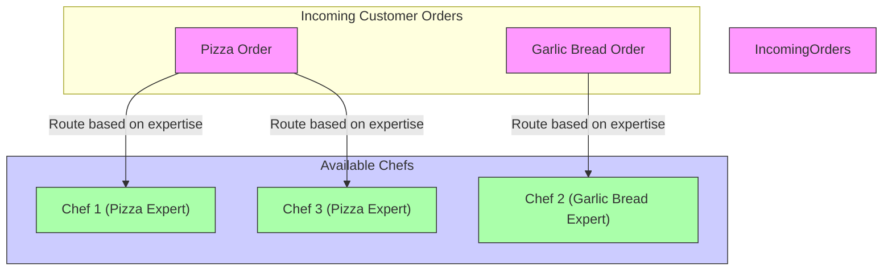

# System Design Primer ⭐️： How To Start With Distributed Systems？ (1080P25) - Part 1

_screenshots/frame_00-00-30.jpg)

# Introduction to System Design Concepts

Building robust and efficient engineering systems often involves understanding fundamental principles like **scaling** and **resilience**. We'll explore these concepts using a real-world analogy: opening and growing a pizza parlour.

## Scaling a System: A Pizza Parlour Analogy

Imagine you've just opened a new pizza parlour, **GKCS Pizza Parlour**, and initially, you have **just one chef**.

### The Initial Scenario: The Single Chef
Initially, one chef might be sufficient to handle a few orders. However, as your business grows and more customers come in, a single chef will quickly become overwhelmed. This highlights a common challenge in systems: how to handle increasing demand.

### Vertical Scaling: Doing More with the Same Resource

_screenshots/frame_00-01-20.jpg)

When demand increases, the first instinct might be to make your existing resource work harder and more efficiently. This approach is known as **Vertical Scaling**.

*   **Concept:** Increasing the capacity of a single resource (e.g., a single server, a single database instance) by upgrading its specifications (e.g., faster CPU, more RAM, more storage).
*   **Analogy:**
    *   **Paying the Chef More:** You might pay your existing chef more to work longer hours or be more productive. In a computer system, this is like upgrading a server with a more powerful processor or more memory. The goal is to get more output from the *same* chef (resource).
    *   **Optimizing Processes:** Improving the chef's workflow to produce more pizzas in the same amount of time.

#### Preprocessing and Optimization
A key aspect of optimizing processes is **preprocessing**, which involves preparing tasks beforehand, especially during non-peak hours.

*   **Concept:** Performing resource-intensive or time-consuming tasks in advance when the system load is low, freeing up resources during peak demand.
*   **Analogy:** Instead of making pizza dough from scratch for every order, the chef can prepare large batches of pizza bases during the quiet hours (e.g., 4 AM). This ensures that during busy periods, they can focus solely on toppings and baking, significantly speeding up order fulfillment.

### Ensuring Resilience: Avoiding Single Points of Failure (SPOF)

_screenshots/frame_00-01-50.jpg)

What happens if your single chef calls in sick? Your entire business comes to a halt! This chef represents a **Single Point of Failure (SPOF)** – if this one component fails, the entire system fails.

*   **Concept:** A component in a system whose failure would cause the entire system to stop functioning. Identifying and mitigating SPOFs is crucial for system **resilience** and **availability**.
*   **Analogy & Solution:**
    *   **Problem:** The single chef is a SPOF.
    *   **Solution:** Hire a **backup chef**. If the primary chef is unavailable, the backup chef can step in, ensuring business continuity. You might only pay the backup chef when they are needed.
    *   **In Computer Systems:** This often translates to **redundancy**, such as having a master-slave architecture for databases, where a slave server can take over if the master fails.

### Horizontal Scaling: Adding More Resources

If your business continues to grow significantly, even a super-efficient, highly paid chef with a backup won't be enough. You'll need more hands on deck. This leads to **Horizontal Scaling**.

*   **Concept:** Adding more instances of the same type of resource to distribute the workload. This means adding more servers, more database instances, or more nodes to a cluster.
*   **Analogy:**
    *   **Hiring More Chefs:** Instead of just one chef and a backup, you now hire ten full-time chefs, plus a few additional backups. Each chef can handle a portion of the incoming orders, dramatically increasing the total capacity of your pizza parlour.

#### Vertical vs. Horizontal Scaling Comparison

| Feature            | Vertical Scaling (Scale Up)                               | Horizontal Scaling (Scale Out)                                    |
| :----------------- | :-------------------------------------------------------- | :---------------------------------------------------------------- |
| **Approach**       | Upgrade existing resource (e.g., faster CPU, more RAM).   | Add more identical resources (e.g., more servers, more chefs).    |
| **Capacity Limit** | Limited by the maximum capacity of a single resource.      | Potentially unlimited by adding more resources.                   |
| **Cost**           | Often becomes disproportionately expensive for high-end upgrades. | Can be more cost-effective for large-scale growth.                |
| **Complexity**     | Simpler to manage a single, powerful resource.            | More complex due to distributed systems, load balancing, data consistency. |
| **Downtime**       | Often requires downtime for upgrades.                     | Can be achieved with minimal or no downtime by adding new resources incrementally. |
| **Resilience**     | Single point of failure if the upgraded resource fails.   | Inherently more resilient; failure of one resource doesn't halt the entire system. |
| **Analogy**        | Making one chef super-fast.                               | Hiring many chefs.                                                |

### Efficient Resource Utilization: Routing and Specialization

With multiple chefs, you now face a new challenge: how do you assign orders efficiently? Let's say you have three chefs, each with unique skills:

*   **Chef 1:** Expert at Pizzas
*   **Chef 2:** Expert at Garlic Bread
*   **Chef 3:** Expert at Pizzas

If orders for both pizza and garlic bread come in, how should you route them to maximize efficiency?

*   **Inefficient Routing (Random Assignment):**
    *   Sending a garlic bread order to Chef 1 (who's a pizza expert) or a pizza order to Chef 2 (who's a garlic bread expert) would be inefficient. They might still complete the order, but it would take longer or result in lower quality.
    *   In computing, this is like sending any request to any server, without considering if certain servers are optimized for specific tasks.

*   **Efficient Routing (Based on Specialization):**
    The most efficient approach is to leverage each chef's strengths. This is a form of **load balancing** and **request routing**.



*   **In Computer Systems:** This translates to using a **load balancer** or a **router** that intelligently directs incoming requests to the most appropriate server or service based on the request type, server capabilities, or current load. This ensures that specialized services handle their respective requests, optimizing overall system performance and resource utilization.

---

and route all pizza orders to Chef 1 and Chef 3.

### Specialization and Microservices Architecture

_screenshots/frame_00-03-09.jpg)
_screenshots/frame_00-03-17.jpg)

By routing orders based on chef specializations (e.g., garlic bread orders to Chef 2, pizza orders to Chef 1 and Chef 3), you achieve several benefits:

*   **Simplicity:** When you need to change the garlic bread recipe, you only need to inform Chef 2. Similarly, for status updates on garlic bread orders, you know exactly who to ask. This simplifies management and communication.
*   **Independent Scaling:** You can create dedicated "teams" or "departments" within your single pizza shop, each specializing in a particular type of food.
    *   For example, if garlic bread orders grow rapidly, you can hire more garlic bread specialists and scale up the "Garlic Bread Team" independently, without affecting the pizza teams.
    *   Conversely, if pizza orders are less frequent, you might have fewer chefs dedicated to pizza.
*   **Well-Defined Responsibilities:** Each team or chef has clear, focused responsibilities, which prevents scope creep and ensures expertise.

This concept directly maps to a **Microservices Architecture** in software engineering.

*   **Concept:** Instead of a single, monolithic application, a system is broken down into a collection of small, independent services. Each service handles a specific business capability and can be developed, deployed, and scaled independently.
*   **Analogy:**
    *   The "Pizza Shop" becomes the overall system.
    *   "Chef Teams" (e.g., Garlic Bread Team, Pizza Team) become individual **microservices**.
    *   Each microservice is responsible for a specific function (e.g., `GarlicBreadService`, `PizzaService`).
    *   This allows you to scale the `GarlicBreadService` (hire more garlic bread chefs) at a different rate than the `PizzaService` (hire more pizza chefs), optimizing resource allocation.

```mermaid
graph TD
    subgraph PizzaShopApp [GKCS Pizza Parlour System]
        CustomerOrder[Customer Order Interface]
        CustomerOrder --> OrderRouter[Order Router (API Gateway/Load Balancer)]
    end

    subgraph Microservices [Specialized Services]
        OrderRouter -- "Garlic Bread Requests" --> GarlicBreadSvc[Garlic Bread Service]
        OrderRouter -- "Pizza Requests" --> PizzaSvc[Pizza Service]
    end

    GarlicBreadSvc --> Chef2_GB[Chef 2 (Garlic Bread Expert)]
    PizzaSvc --> ChefTeamPizza[Pizza Chef Team (Chefs 1, 3, etc.)]

    style PizzaShopApp fill:#f9f,stroke:#333,stroke-width:1px
    style CustomerOrder fill:#ccf,stroke:#333,stroke-width:1px
    style OrderRouter fill:#add8e6,stroke:#333,stroke-width:1px
    style Microservices fill:#e0ffe0,stroke:#333,stroke-width:1px
    style GarlicBreadSvc fill:#afa,stroke:#333,stroke-width:1px
    style PizzaSvc fill:#afa,stroke:#333,stroke-width:1px
    style Chef2_GB fill:#ffd700,stroke:#333,stroke-width:1px
    style ChefTeamPizza fill:#ffd700,stroke:#333,stroke-width:1px
```

### Distributed Systems: Expanding Beyond a Single Location

Your pizza shop is now highly scalable and resilient *within its single location*. But what if the entire building loses power, or you lose your business license for a day? Your entire business would still grind to a halt. This means the single shop itself is a **single point of failure** at a higher level.

_screenshots/frame_00-05-17.jpg)

To achieve even greater resilience and reach, you need to **distribute your system** across multiple locations.

*   **Concept:** A system where components are located on different networked computers, which communicate and coordinate their actions by passing messages. This is crucial for high availability, fault tolerance, and reduced latency for geographically dispersed users.
*   **Analogy:**
    *   **Opening a New Shop:** You open a second pizza shop in a different part of the city. This new shop can also prepare and deliver pizzas.
    *   **Increased Complexity:** This introduces complexity because the shops might need to communicate (e.g., share inventory, transfer orders), and you need a way to route customer orders to the correct shop.
    *   **Advantages:**
        *   **Fault Tolerance:** If one shop experiences a power outage or other issue, the other shop can continue to serve customers, ensuring business continuity. This is a higher level of backup than just a backup chef.
        *   **Quicker Response Times (Locality):** Customers who live closer to the new shop can receive their orders much faster, improving the overall customer experience. This is analogous to a global service like Facebook having local servers (data centers) around the world to serve users quickly.

#### Request Routing in a Distributed System

When a customer places an order, they shouldn't have to figure out which pizza shop is closest or available. This responsibility needs to be handled by the system itself.

*   **Challenge:** How do you route an incoming pizza order to the most appropriate shop (Pizza Shop 1 or Pizza Shop 2)?
*   **Solution: Centralized Order Router (Load Balancer/Proxy):**
    *   Introduce a central entity (like a call center or an online ordering platform) that receives all customer requests.
    *   This entity's sole responsibility is to **route** the order to the correct pizza shop.
    *   The routing is not random; it's based on a specific, critical parameter.
*   **Key Routing Parameter:** The most important factor for a pizza order is usually **delivery time** (or proximity to the customer). The router would determine which shop can fulfill the order fastest.

```mermaid
graph LR
    Customer[Customer Places Order] --> CentralRouter[Central Order Router (DNS/Load Balancer)]

    subgraph PizzaShops [Distributed Pizza Shops]
        Shop1["Pizza Shop 1 (Location A)"]
        Shop2["Pizza Shop 2 (Location B)"]
    end

    CentralRouter -- "Route based on proximity/delivery time" --> Shop1
    CentralRouter -- "Route based on proximity/delivery time" --> Shop2

    Shop1 --> Delivery1[Delivery Agent from Shop 1]
    Shop2 --> Delivery2[Delivery Agent from Shop 2]

    Delivery1 -- "Delivers Pizza" --> Customer
    Delivery2 -- "Delivers Pizza" --> Customer

    style Customer fill:#f9f,stroke:#333,stroke-width:1px
    style CentralRouter fill:#add8e6,stroke:#333,stroke-width:1px
    style PizzaShops fill:#e0ffe0,stroke:#333,stroke-width:1px
    style Shop1 fill:#afa,stroke:#333,stroke-width:1px
    style Shop2 fill:#afa,stroke:#333,stroke-width:1px
    style Delivery1 fill:#ccf,stroke:#333,stroke-width:1px
    style Delivery2 fill:#ccf,stroke:#333,stroke-width:1px
```

---

### Intelligent Routing with a Load Balancer

_screenshots/frame_00-05-52.jpg)
_screenshots/frame_00-06-02.jpg)

When you have multiple distributed shops (or servers), the central router needs to make smart decisions about where to send requests.

*   **Scenario:**
    *   **Pizza Shop 1 (PS1):** Very popular, might have a 1-hour queue, 5 minutes to make, 10 minutes delivery. Total time: 1 hour 15 minutes.
    *   **Pizza Shop 2 (PS2):** Less busy, shorter queue, 5 minutes to make, 0 minutes delivery (customer pickup or very close). Total time: 1 hour 5 minutes.
*   **Decision:** The central router should intelligently send the order to **Pizza Shop 2** because it offers a faster total delivery time.

This intelligent routing mechanism is precisely what a **Load Balancer** does in a computing system.

*   **Load Balancer:** A device or software that distributes network traffic efficiently across multiple servers. It ensures no single server is overworked and optimizes overall response times and resource utilization.
    *   **Analogy:** The central order router that decides which pizza shop gets the order.
    *   **Functionality:** It constantly monitors the status and load of each server (pizza shop) and routes incoming requests (orders) to the most appropriate one based on predefined algorithms (e.g., shortest response time, least connections, round-robin).
*   **Benefits:**
    *   **Optimal Performance:** Ensures faster response times by directing traffic away from overloaded resources.
    *   **Increased Reliability:** If a server (shop) goes down, the load balancer stops sending requests to it, maintaining system availability.
    *   **Scalability:** Allows you to seamlessly add or remove servers without affecting the overall system.

### Separation of Concerns and Extensibility

As your distributed system grows, it becomes crucial to maintain **flexibility** and **extensibility**. This involves clearly separating different parts of the system based on their responsibilities.

*   **Concept: Separation of Concerns (SoC):** Dividing a computer program into distinct sections, each addressing a separate concern. This makes complex systems easier to design, understand, and maintain.
*   **Analogy:**
    *   **Delivery Agent vs. Pizza Shop:** A delivery agent's primary concern is efficient delivery, regardless of whether it's a pizza, burger, or groceries. Similarly, a pizza shop's concern is making food, not how it gets to the customer (pickup or delivery).
    *   **Decoupling:** These two entities (delivery and food preparation) are **decoupled**. They can operate independently, and changes in one do not necessarily require changes in the other.
*   **Benefits of Decoupling and Extensibility:**
    *   **Maintainability:** Changes to the delivery process don't impact the pizza-making process, and vice-versa.
    *   **Reusability:** The delivery system can be used for pizzas, burgers, or any other product without significant re-engineering. This is how companies like Amazon can start with parcel delivery and expand to groceries, streaming, etc., leveraging a flexible, decoupled backend.
    *   **Scalability:** Independent components can be scaled separately.
    *   **Reduced Complexity:** Each component focuses on its specific task.

### Monitoring and Metrics

In a complex, distributed system with many moving parts (like multiple shops, chefs, delivery agents), it's essential to know what's happening.

*   **Concept: Logging and Metrics:**
    *   **Logging:** Recording events and activities within the system (e.g., "order received," "pizza started," "delivery dispatched," "oven faulty"). This provides detailed historical data for debugging and auditing.
    *   **Metrics:** Aggregated, quantitative data about system performance and health (e.g., "average pizza delivery time," "number of orders per hour," "chef utilization rate," "faulty oven count"). Metrics provide a high-level view of system health and trends.
*   **Analogy:**
    *   If a pizza shop's oven is faulty, its "churning rate" (pizza production speed) goes down.
    *   If a delivery agent's bike breaks, their "order times" increase.
    *   By logging these events and collecting metrics (e.g., average delivery time per shop, number of pizzas made per hour), you can identify problems quickly and make informed business decisions to improve efficiency.

### High-Level Design vs. Low-Level Design

The process of building a complex system, like our scalable pizza parlour, involves different levels of design.

_screenshots/frame_00-08-45.jpg)
_screenshots/frame_00-08-55.jpg)

#### High-Level System Design (HLD)

*   **Focus:** The overall architecture and interaction between major components of a system. It's about *what* the system does and *how* its main parts communicate.
*   **Analogy:**
    *   Deciding to open multiple pizza shops (distributed system).
    *   Implementing a central order router (load balancer).
    *   Structuring the internal operations into specialized chef teams (microservices).
    *   Considering how different shops will interact (data consistency, request routing).
*   **Key Questions:**
    *   Which services will we need?
    *   How will they interact?
    *   How will data flow between them?
    *   How will we scale the system?
    *   What technologies will we use at a broad level (e.g., specific database types, messaging queues)?

#### Low-Level System Design (LLD)

*   **Focus:** The detailed internal logic and implementation of individual components or modules. It's about *how* the code for each part is written.
*   **Analogy:**
    *   Designing the specific steps a chef takes to make a pizza (the algorithm).
    *   Defining the ingredients list and proportions for a pizza (data structures).
    *   Creating a standard operating procedure for the delivery agent (function signatures).
    *   Designing the layout of the pizza kitchen for optimal workflow (class design).
*   **Key Questions:**
    *   What classes and objects will be needed?
    *   What methods (functions) will each class have, and what are their parameters (signatures)?
    *   How will data be stored and manipulated within a specific module?
    *   What are the specific algorithms for tasks?
    *   How do we write efficient, clean, and testable code for a particular service?

| Feature             | High-Level Design (HLD)                                        | Low-Level Design (LLD)                                         |
| :------------------ | :------------------------------------------------------------- | :------------------------------------------------------------- |
| **Scope**           | Entire system architecture, major components, interactions.    | Internal logic of individual components/modules.               |
| **Perspective**     | "Bird's-eye view" – how parts fit together.                    | "Microscopic view" – how a single part works internally.       |
| **Analogy**         | Blueprint of a city (districts, roads, major buildings).       | Detailed floor plan of a single building (rooms, plumbing, wiring). |
| **Deliverables**    | Architectural diagrams, component breakdowns, data flow.       | Class diagrams, API specifications, database schemas, pseudocode. |
| **Concerned with**  | Scalability, resilience, fault tolerance, distributed systems. | Code efficiency, maintainability, clean code, specific algorithms. |
| **Target Audience** | System architects, senior engineers, project managers.         | Software developers, junior engineers.                         |

Both HLD and LLD are critical for successful system development. HLD provides the strategic direction, while LLD ensures the practical, efficient implementation of that vision. Senior engineers typically need proficiency in both to effectively design and build complex systems.

---

_screenshots/frame_00-09-05.jpg)

## Conclusion: Key Takeaways in System Design

This exploration, using the analogy of a pizza parlour, has introduced fundamental concepts critical to designing robust, scalable, and resilient systems. By understanding these principles, engineers can build systems that effectively handle growth, recover from failures, and remain adaptable to future changes.

Here's a summary of the key system design concepts covered:

1.  **Vertical Scaling (Scale Up):**
    *   **Concept:** Enhancing the capacity of a single resource (e.g., a more powerful server).
    *   **Analogy:** Making one chef work harder or faster.
    *   **Benefit:** Initial performance boost.

2.  **Preprocessing:**
    *   **Concept:** Performing tasks in advance during low-demand periods.
    *   **Analogy:** Preparing pizza bases during non-peak hours.
    *   **Benefit:** Optimizes resource utilization and improves peak performance.

3.  **Resilience & Avoiding Single Points of Failure (SPOF):**
    *   **Concept:** Designing systems to continue operating even if components fail, by eliminating critical single points of failure.
    *   **Analogy:** Hiring a backup chef to cover for the primary chef.
    *   **Benefit:** Ensures high availability and fault tolerance.

4.  **Horizontal Scaling (Scale Out):**
    *   **Concept:** Adding more instances of resources to distribute the workload.
    *   **Analogy:** Hiring multiple full-time chefs.
    *   **Benefit:** Allows for near-limitless scalability to handle increasing demand.

5.  **Microservices Architecture & Specialization:**
    *   **Concept:** Breaking down a monolithic system into smaller, independent services, each responsible for a specific function.
    *   **Analogy:** Creating specialized chef teams (e.g., Pizza Team, Garlic Bread Team).
    *   **Benefit:** Enables independent development, deployment, scaling, and clear responsibility.

6.  **Distributed Systems:**
    *   **Concept:** Spreading system components across multiple physical locations or machines.
    *   **Analogy:** Opening multiple pizza shops in different areas.
    *   **Benefit:** Enhanced fault tolerance, reduced latency for geographically dispersed users, and greater overall resilience.

7.  **Load Balancing:**
    *   **Concept:** Intelligently distributing incoming requests across multiple servers or resources.
    *   **Analogy:** A central order router sending orders to the closest or least busy pizza shop.
    *   **Benefit:** Optimizes resource usage, improves response times, and ensures high availability.

8.  **Separation of Concerns & Extensibility:**
    *   **Concept:** Dividing a system into distinct, independent modules with clear responsibilities, making it adaptable to future changes.
    *   **Analogy:** A delivery agent not needing to know *what* they are delivering (pizza vs. burger), just *how* to deliver it.
    *   **Benefit:** Facilitates maintainability, reusability, and allows businesses to easily expand their offerings.

9.  **Monitoring and Metrics:**
    *   **Concept:** Collecting data (logs and metrics) about system performance and health.
    *   **Analogy:** Tracking delivery times, order queues, and oven status.
    *   **Benefit:** Enables proactive problem identification, performance optimization, and informed decision-making.

10. **High-Level Design (HLD) vs. Low-Level Design (LLD):**
    *   **HLD:** Focuses on the overall architecture and interaction between major system components.
    *   **LLD:** Focuses on the detailed internal implementation of individual components (e.g., class design, function signatures).
    *   **Benefit:** Provides a structured approach to system development, from broad architectural vision to granular code implementation.

By applying these concepts, engineers can design and build complex, reliable, and efficient systems that can grow and adapt with evolving demands.

---

