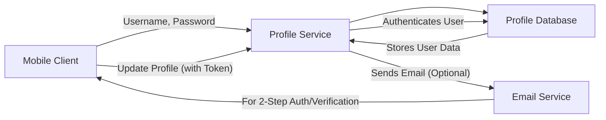
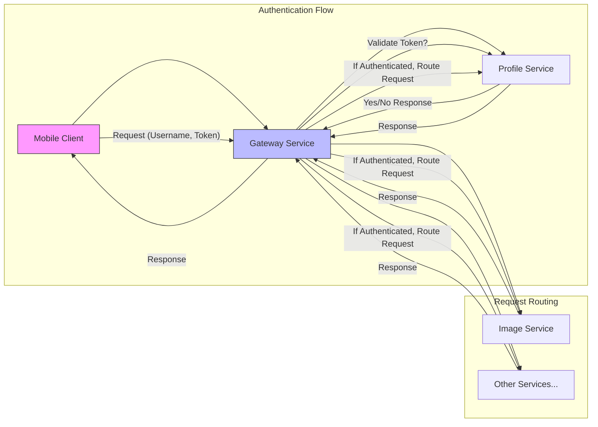
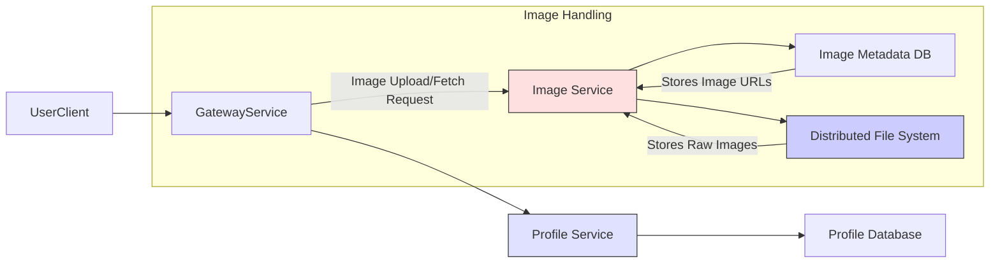
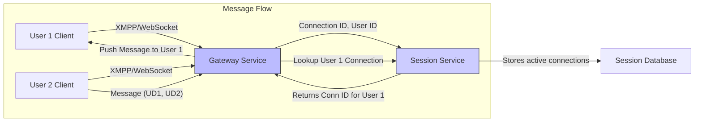
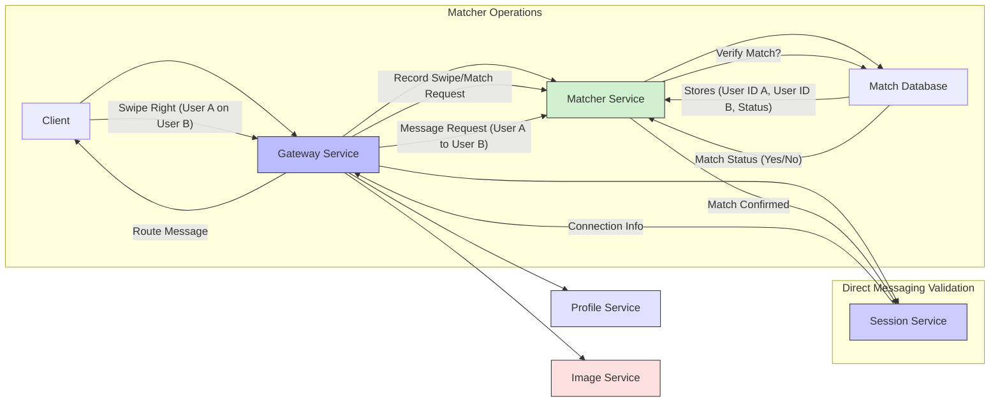
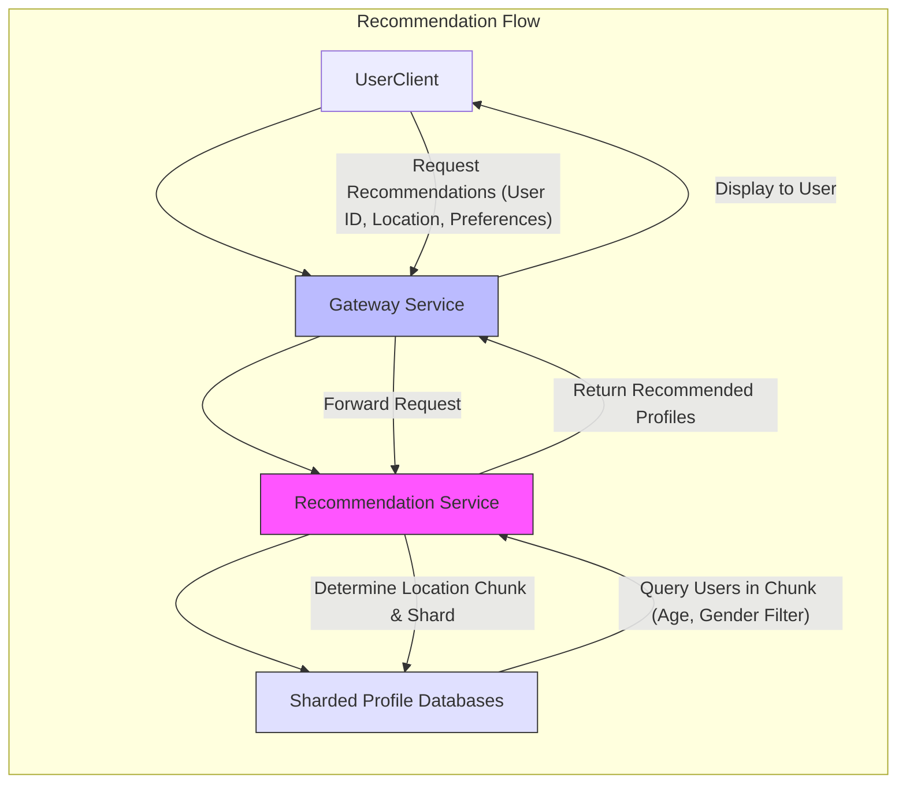
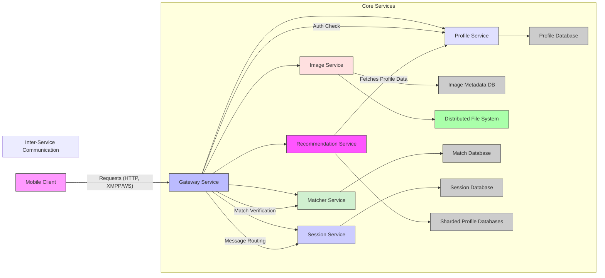

# System Design： Tinder As A Microservice Architecture (1080P60) - Part 1

It is crucial to have a strong foundation in **system design concepts** before attempting to design complex systems like Tinder. Prior knowledge from previous discussions and external resources is essential for understanding the deeper breakdowns of individual components. Ensure your basics and fundamentals are clear before diving into actual system design.

### System Design Interview Approach: Designing Tinder

When faced with a system design problem, such as designing Tinder, a common pitfall for candidates is to immediately jump into specific services or database choices.

Instead, a more effective and logical approach is to:
1.  **Step back and think calmly:** Consider the system's core purpose and user needs.
2.  **Focus on essential features:** Identify what the application *must* do from a user's perspective.
3.  **Evolve the system:** By starting with features, you can logically deduce how the system's architecture will need to evolve to support them.

#### Two Approaches to System Design

There are generally two main ways to approach system design, each with its own advantages and disadvantages:

| Approach                 | Starting Point                                 | Progression                                          | Strengths                                                                | Weaknesses                                                              |
| :----------------------- | :--------------------------------------------- | :--------------------------------------------------- | :----------------------------------------------------------------------- | :---------------------------------------------------------------------- |
| **1. EER Diagram First** <br> (Data-Centric / Top-Down) | **Data Modeling** (Entity-Relationship Diagram)        | Data -> Services -> Clients                          | Good for understanding data relationships comprehensively from the start | Can be too abstract; disconnects from immediate user needs and features |
| **2. Front-to-Back** <br> (Feature-Centric / User-Centric) | **User Features** (What users need)                    | Features -> Service Breakdown -> Per-Service Data Requirements | More flexible; easier to start immediate feature development; aligns with user value | Might require refactoring data models as more features are added       |

The **Front-to-Back** approach is generally recommended as it leads to a more flexible system and allows for quicker initial development aligned with user expectations.

_screenshots/frame_00-01-58.jpg)

### Core Features of Tinder (Initial Brainstorming)

When designing Tinder, we first identify the fundamental features required for its operation. These features guide the subsequent architectural decisions.

1.  **Store Profiles:**
    *   This is an obvious and foundational requirement for any dating application.
    *   **Key Consideration: Images**
        *   Images are critically important for dating profiles.
        *   **Clarifying Question to Interviewer:** "How many images per user should we support?" (e.g., up to 5 images per user). This influences storage requirements and image handling services.

2.  **Recommend Matches:**
    *   After users create profiles, the next logical step is to connect them with potential matches. This involves a recommendation system.
    *   **User Flow:** Users create a profile, then start accepting or rejecting other profiles based on their preferences.
    *   **Clarifying Question to Interviewer:** "What is the expected number of active users?" This question is crucial as it directly impacts the scale and complexity required for the recommendation engine (e.g., real-time processing, number of recommendations per user session).

_screenshots/frame_00-00-00.jpg)
_screenshots/frame_00-00-11.jpg)
_screenshots/frame_00-01-22.jpg)

---

When discussing features, avoid getting bogged down in excessive detail for each one, especially in the initial phase of an interview. Focus on the high-level requirements and assumptions.

_screenshots/frame_00-03-44.jpg)

### Core Features of Tinder (Continued)

Expanding on the essential features for Tinder:

3.  **Note Matches:**
    *   Once users are recommended potential matches, they interact (e.g., swipe right or left). When two users mutually "like" each other, a match occurs. This event needs to be recorded.
    *   **Scale Estimation:** The number of matches can be estimated as a percentage of active users.
        *   **Assumption:** For every swipe, there's a 0.1% chance of matching.
        *   **Calculation:** `Number of Matches = Number of Active Users * 0.001` (or 10^-3). This provides a rough estimate for data storage and processing load.

4.  **Direct Messaging:**
    *   After a match is made, users need a way to communicate. Direct messaging is a critical feature for this.
    *   **Initial Scope:** For now, simply identify it as a necessary feature. Detailed questions about its implementation (e.g., real-time requirements, message storage) can be addressed later if the interviewer drives the conversation in that direction.

**Important Note for Interviews:**
*   Limit the initial set of features to 4-5.
*   The interviewer will often guide you to dive deeper into specific features they are interested in. Avoid pulling out too many features just to showcase broad knowledge; focus on the core functionality first.

### Storing Profiles: The Image Storage Challenge

Let's start by detailing the first core feature: **Storing Profiles**. A significant challenge within profile storage, especially for an app like Tinder, is **image storage**.

_screenshots/frame_00-03-55.jpg)
_screenshots/frame_00-04-38.jpg)

Given:
*   A large number of active users.
*   Each user can upload approximately 5 images.

This means a massive volume of images needs to be stored and efficiently retrieved. The central question is: **How will these images be stored?**

This brings us to a long-standing debate in computer science regarding storing large binary data: **File vs. BLOB.**

#### File vs. BLOB for Image Storage

| Feature             | File Storage                                                                                                                                                                                                                            | BLOB (Binary Large Object) Storage                                                                                                                                                                                                                                                                                                                                                                                                                                                                                                                                                                                                                                                                                                                                                                                                                                                                                                                                                                                                                                                                                                                                                                                                                                                                                                                                                                                                                                                                                                                                                                                                                                                                                                                                                                                                                                                                                                                                                                                                                                                                                                                                                                                                                                                                                                                                                                                                                                                                                                                                                                                                                                                                                                                                                                                                                                                                                                                                                                                                                                                                                                                                                                                                                                                                                                                                                                                                                                                                                                                                                                                                                                                                                                                                                                                                                                                                                                                                                                                                                                                                                                                                                                                                                                                                                                                                                                                                                                                                                                                                                                                                                                                                                                                                                                                                                                                                                                                                                                                                                                                                                                                                                                                                                                                                                                                                                                                                                                                                                                                                                                                                                                                                                                                                                                                                                                                                                                                                                                                                                                                                                                                                                                                                                                                                                                                                                                                                                                                                                                                                                                                                                                                                                                                                                                                                                                                                                                                                                                                                                                                                                                                                                                                                                                                                                                                                                                                                                                                                                                                                                                                                                                                                                                                                                                                                                                                                                                                                                                                                                                                                                                                                                                                                                                                                                                                                                                                                                                                                                                                                                                                                                                                                                                                                                                                                                                                                                                                                                                                                                                                                                                                                                                                                                                                                                                                                                                                                                                                                                                                                                                                                                                                                                                                                                                                                                                                                                                                                                                                                                                                                                                                                                                                                                                                                                                                                                                                                                                                                                                                                                                                                                                                                                                                                                                                                                                                                                                                                                                                                                                                                                                                                                                                                                                                                                                                                                                                                                                                                                                                                                                                                                                                                                                                                                                                                                                                                                                                                                                                                                                                                                                                                                                                                                                                                                                                                                                                                                                                                                                                                                                                                                                                                                                                                                                                                                                                                                                                                                                                                                                                                                                                                                                                                                                                                                                                                                                                                                                                                                                                                                                                                                                                                                                                                                                                                                                                                                                                                                                                                                                                                                                                                                                                                                                                                                                                                                                                                                                                                                                                                                                                                                                                                                                                                                                                                                                                                                                                                                                                                                                                                                                                                                                                                                                                                                                                                                                                                                                                                                                                                                                                                                                                                                                                                                                                                                                                                                                                                                                                                                                                                                                                                                                                                                                                                                                                                                                                                                                                                                                                                                                                                                                                                                                                                                                                                                                                                                                                                                                                                                                                                                                                                                                                                                                                                                                                                                                                                                                                                                                                                                                                                                                                                                                                                                                                                                                                                                                                                                                                                                                                                                                                                                                                                                                                                                                                                                                                                                                                                                                                                                                                                                                                                                                                                                                                                                                                                                                                                                                                                                                                                                                                                                                                                                                                                                                                                                                                                                                                                                                                                                                                                                                                                                                                                                                                                                                                                                                                                                                                                                                                                                                                                                                                                                                                                                                                                                                                                                                                                                                                                                                                                                                                                                                                                                                                                                                                                                                                                                                                                                                                                                                                                                                                                                                                                                                                                                                                                                                                                                                                                                                                                                                                                                                                                                                                                                                                                                                                                                                                                                                                                                                                                                                                                                                                                                                                                                                                                                                                                                                                                                                                                                                                                                                                                                                                                                                                                                                                                                                                                                                                                                                                                                                                                                                                                                                                                                                                                                                                                                                                                                                                                                                                                                                                                                                                                                                                                                                                                                                                                                                                                                                                                                                                                                                                                                                                                                                                                                                                                                                                                                                                                                                                                                                                                                                                                                                                                                                                                                                                                                                                                                                                                                                                                                                                                                                                                                                                                                                                                                                                                                                                                                                                                                                                                                                                                                                                                                                                                                                                                                                                                                                                                                                                                                                                                                                                                                                                                                                                                                                                                                                                                                                                                                                                                                                                                                                                                                                                                                                                                                                                                                                                                                                                                                                                                                                                                                                                                                                                                                                                                                                                                                                                                                                                                                                                                                                                                                                                                                                                                                                                                                                                                                                                                                                                                                                                                                                                                                                                                                                                                                                                                                                                                                                                                                                                                                                                                                                                                                                                                                                                                                                                                                                                                                                                                                                                                                                                                                                                                                                                                                                                                                                                                                                                                                                                                                                                                                                                                                                                                                                                                                                                                                                                                                                                                                                                                                                                                                                                                                                                                                                                                                                                                                                                                                                                                                                                                                                                                                                                                                                                                                                                                                                                                                                                                                                                                                                                                                                                                                                                                                                                                                                                                                                                                                                                                                                                                                                                                                                                                                                                                                                                                                                                                                                                                                                                                                                                                                                                                                                                                                                                                                                                                                                                                                                                                                                                                                                                                                                                                                                                                                                                                                                                                                                                                                                                                                                                                                                                                                                                                                                                                                                                                                                                                                                                                                                                                                                                                                                                                                                                                                                                                                                                                                                                                                                                                                                                                                                                                                                                                                                                                                                                                                                                                                                                                                                                                                                                                                                                                                                                                                                                                                                                                                                                                                                                                                                                                                                                                                                                                                                                                                                                                                                                                                                                                                                                                                                                                                                                                                                                                                                                                                                                                                                                                                                                                                                                                                                                                                                                                                                                                                                                                                                                                                                                                                                                                                                                                                                                                                                                                                                                                                                                                                                                                                                                                                                                                                                                                                                                                                                                                                                                                                                                                                                                                                                                                                                                                                                                                                                                                                                                                                                                                                                                                                                                                                                                                                                                                                                                                                                                                                                                                                                                                                                                                                                                                                                                                                                                                                                                                                                                                                                                                                                                                                                                                                                                                                                                                                                                                                                                                                                                                                                                                                                                                                                                                                                                                                                                                                                                                                                                                                                                                                                                                                                                                                                                                                                                                                                                                                                                                                                                                                                                                                                                                                                                                                                                                                                                                                                                                                                                                                                                                                                                                                                                                                                                                                                                                                                                                                                                                                                                                                                                                                                                                                                                                                                                                                                                                                                                                                                                                                                                                                                                                                                                                                                                                                                                                                                                                                                                                                                                                                                                                                                                                                                                                                                                                                                                                                                                                                                                                                                                                                                                                                                                                                                                                                                                                                                                                                                                                                                                                                                                                                                                                                                                                                                                                                                                                                                                                                                                                                                                                                                                                                                                                                                                                                                                                                                                                                                                                                                                                                                                                                                                                                                                                                                                                                                                                                                                                                                                                                                                                                                                                                                                                                                                                                                                                                                                                                                                                                                                                                                                                                                                                                                                                                                                                                                                                                                                                                                                                                                                                                                                                                                                                                                                                                                                                                                                                                                                                                                                                                                                                                                                                                                                                                                                                                                                                                                                                                                                                                                                                                                                                                                                                                                                                                                                                                                                                                                                                                                                                                                                                                                                                                                                                                                                                                                                                                                                                                                                                                                                                                                                                                                                                                                                                                                                                                                                                                                                                                                                                                                                                                                                                                                                                                                                                                                                                                                                                                                                                                                                                                                                                                                                                                                                                                                                                                                                                                                                                                                                                                                                                                                                                                                                                                                                                                                                                                                                                                                                                                                                                                                                                                                                                                                                                                                                                                                                                                                                                                                                                                                                                                                                                                                                                                                                                                                                                                                                                                                                                                                                                                                                                                                                                                                                                                                                                                                                                                                                                                                                                                                                                                                                                                                                                                                                                                                                                                                                                                                                                                                                                                                                                                                                                                                                                                                                                                                                                                                                                                                                                                                                                                                                                                                                                                                                                                                                                                                                                                                                                                                                                                                                                                                                                                                                                                                                                                                                                                                                                                                                                                                                                                                                                                                                                                                                                                                                                                                                                                                                                                                                                                                                                                                                                                                                                                                                                                                                                                                                                                                                                                                                                                                                                                                                                                                                                                                                                                                                                                                                                                                                                                                                                                                                                                                                                                                                                                                                                                                                                                                                                                                                                                                                                                                                                                                                                                                                                                                                                                                                                                                                                                                                                                                                                                                                                                                                                                                                                                                                                                                                                                                                                                                                                                                                                                                                                                                                                                                                                                                                                                                                                                                                                                                                                                                                                                                                                                                                                                                                                                                                                                                                                                                                                                                                                                                                                                                                                                                                                                                                                                                                                                                                                                                                                                                                                                                                                                                                                                                                                                                                                                                                                                                                                                                                                                                                                                                                                                                                                                                                                                                                                                                                                                                                                                                                                                                                                                                                                                                                                                                                                                                                                                                                                                                                                                                                                                                                                                                                                                                                                                                                                                                                                                                                                                                                                                                                                                                                                                                                                                                                                                                                                                                                                                                                                                                                                                                                                                                                                                                                                                                                                                                                                                                                                                                                                                                                                                                                                                                                                                                                                                                                                                                                                                                                                                                                                                                                                                                                                                                                                                                                                                                                                                                                                                                                                                                                                                                                                                                                                                                                                                                                                                                                                                                                                                                                                                                                                                                                                                                                                                                                                                                                                                                                                                                                                                                                                                                                                                                                                                                                                                                                                                                                                                                                                                                                                                                                                                                                                                                                                                                                                                                                                                                                                                                                                                                                                                                                                                                                                                                                                                                                                                                                                                                                                                                                                                                                                                                                                                                                                                                                                                                                                                                                                                                                                                                                                                                                                                                                                                                                                                                                                                                                                                                                                                                                                                                                                                                                                                                                                                                                                                                                                                                                                                                                                                                                                                                                                                                                                                                                                                                                                                                                                                                                                                                                                                                                                                                                                                                                                                                                                                                                                                                                                                                                                                                                                                                                                                                                                                                                                                                                                                                                                                                                                                                                                                                                                                                                                                                                                                                                                                                                                                                                                                                                                                                                                                                                                                                                                                                                                                                                                                                                                                                                                                                                                                                                                                                                                                                                                                                                                                                                                                                                                                                                                                                                                                                                                                                                                                                                                                                                                                                                                                                                                                                                                                                                                                                                                                                                                                                                                                                                                                                                                                                                                                                                                                                                                                                                                                                                                                                                                                                                                                                                                                                                                                                                                                                                                                                                                                                                                                                                                                                                                                                                                                                                                                                                                                                                                                                                                                                                                                                                                                                                                                                                                                                                                                                                                                                                                                                                                                                                                                                                                                                                                                                                                                                                                                                                                                                                                                                                                                                                                                                                                                                                                                                                                                                                                                                                                                                                                                                                                                                                                                                                                                                                                                                                                                                                                                                                                                                                                                                                                                                                                                                                                                                                                                                                                                                                                                                                                                                                                                                                                                                                                                                                                                                                                                                                                                                                                                                                                                                                                                                                                                                                                                                                                                                                                                                                                                                                                                                                                                                                                                                                                                                                                                                                                                                                                                                                                                                                                                                                                                                                                                                                                                                                                                                                                                                                                                                                                                                                                                                                                                                                                                                                                                                                                                                                                                                                                                                                                                                                                                                                                                                                                                                                                                                                                                                                                                                                                                                                                                                                                                                                                                                                                                                                                                                                                                                                                                                                                                                                                                                                                                                                                                                                                                                                                                                                                                                                                                                                                                                                                                                                                                                                                                                                                                                                                                                                                                                                                                                                                                                                                                                                                                                                                                                                                                                                                                                                                                                                                                                                                                                                                                                                                                                                                                                                                                                                                                                                                                                                                                                                                                                                                                                                                                                                                                                                                                                                                                                                                                                                                                                                                                                                                                                                                                                                                                                                                                                                                                                                                                                                                                                                                                                                                                                                                                                                                                                                                                                                                                                                                                                                                                                                                                                                                                                                                                                                                                                                                                                                                                                                                                                                                                                                                                                                                                                                                                                                                                                                                                                                                                                                                                                                                                                                                                                                                                                                                                                                                                                                                                                                                                                                                                                                                                                                                                                                                                                                                                                                                                                                                                                                                                                                                                                                                                                                                                                                                                                                                                                                                                                                                                                                                                                                                                                                                                                                                                                                                                                                                                                                                                                                                                                                                                                                                                                                                                                                                                                                                                                                                                                                                                                                                                                                                                                                                                                                                                                                                                                                                                                                                                                                                                                                                                                                                                                                                                                                                                                                                                                                                                                                                                                                                                                                                                                                                                                                                                                                                                                                                                                                                                                                                                                                                                                                                                                                                                                                                                                                                                                                                                                                                                                                                                                                                                                                                                                                                                                                                                                                                                                                                                                                                                                                                                                                                                                                                                                                                                                                                                                                                                                                                                                                                                                                                                                                                                                                                                                                                                                                                                                                                                                                                                                                                                                                                                                                                                                                                                                                                                                                                                                                                                                                                                                                                                                                                                                                                                                                                                                                                                                                                                                                                                                                                                                                                                                                                                                                                                                                                                                                                                                                                                                                                                                                                                                                                                                                                                                                                                                                                                                                                                                                                                                                                                                                                                                                                                                                                                                                                                                                                                                                                                                                                                                                                                                                                                                                                                                                                                                                                                                                                                                                                                                                                                                                                                                                                                                                                                                                                                                                                                                                                                                                                                                                                                                                                                                                                                                                                                                                                                                                                                                                                                                                                                                                                                                                                                                                                                                                                                                                                                                                                                                                                                                                                                                                                                                                                                                                                                                                                                                                                                                                                                                                                                                                                                                                                                                                                                                                                                                                                                                                                                                                                                                                                                                                                                                                                                                                                                                                                                                                                                                                                                                                                                                                                                                                                                                                                                                                                                                                                                                                                                                                                                                                                                                                                                                                                                                                                                                                                                                                                                                                                                                                                                                                                                                                                                                                                                                                                                                                                                                                                                                                                                                                                                                                                                                                                                                                                                                                                                                                                                                                                                                                                                                                                                                                                                                                                                                                                                                                                                                                                                                                                                                                                                                                                                                                                                                                                                                                                                                                                                                                                                                                                                                                                                                                                                                                                                                                                                                                                                                                                                                                                                                                                                                                                                                                                                                                                                                                                                                                                                                                                                                                                                                                                                                                                                                                                                                                                                                                                                                                                                                                                                                                                                                                                                                                                                                                                                                                                                                                                                                                                                                                                                                                                                                                                                                                                                                                                                                                                                                                                                                                                                                                                                                                                                                                                                                                                                                                                                                                                                                                                                                                                                                                                                                                                                                                                                                                                                                                                                                                                                                                                                                                                                                                                                                                                                                                                                                                                                                                                                                                                                                                                                                                                                                                                                                                                                                                                                                                                                                                                                                                                                                                                                                                                                                                                                                                                                                                                                                                                                                                                                                                                                                                                                                                                                                                                                                                                                                                                                                                                                                                                                                                                                                                                                                                                                                                                                                                                                                                                                                                                                                                                                                                                                                                                                                                                                                                                                                                                                                                                                                                                                                                                                                                                                                                                                                                                                                                                                                                                                                                                                                                                                                                                                                                                                                                                                                                                                                                                                                                                                                                                                                                                                                                                                                                                                                                                                                                                                                                                                                                                                                                                                                                                                                                                                                                                                                                                                                                                                                                                                                                                                                                                                                                                                                                                                                                                                                                                                                                                                                                                                                                                                                                                                                                                                                                                                                                                                                                                                                                                                                                                                                                                                                                                                                                                                                                                                                                                                                                                                                                                                                                                                                                                                                                                                                                                                                                                                                                                                                                                                                                                                                                                                                                                                                                                                                                                                                                                                                                                                                                                                                                                                                                                                                                                                                                                                                                                                                                                                                                                                                                                                                                                                                                                                                                                                                                                                                                                                                                                                                                                                                                                                                                                                                                                                                                                                                                                                                                                                                                                                                                                                                                                                                                                                                                                                                                                                                                                                                                                                                                                                                                                                                                                                                                                                                                                                                                                                                                                                                                                                                                                                                                                                                                                                                                                                                                                                                                                                                                                                                                                                                                                                                                                                                                                                                                                                                                                                                                                                                                                                                                                                                                                                                                                                                                                                                                                                                                                                                                                                                                                                                                                                                                                                                                                                                                                                                                                                                                                                                                                                                                                                                                                                                                                                                                                                                                                                                                                                                                                                                                                                                                                                                                                                                                                                                                                                                                                                                                                                                                                                                                                                                                                                                                                                                                                                                                                                                                                                                                                                                                                                                                                                                                                                                                                                                                                                                                                                                                                                                                                                                                                                                                                                                                                                                                                                                                                                                                                                                                                                                                                                                                                                                                                                                                                                                                                                                                                                                                                                                                                                                                                                                                                                                                                                                                                                                                                                                                                                                                                                                                                                                                                                                                                                                                                                                                                                                                                                                                                                                                                                                                                                                                                                                                                                                                                                                                                                                                                                                                                                                                                                                                                                                                                                                                                                                                                                                                                                                                                                                                                                                                                                                                                                                                                                                                                                                                                                                                                                                                                                                                                                                                                                                                                                                                                                                                                                                                                                                                                                                                                                                                                                                                                                                                                                                                                                                                                                                                                                                                                                                                                                                                                                                                                                                                                                                                                                                                                                                                                                                                                                                                                                                                                                                                                                                                                                                                                                                                                                                                                                                                                                                                                                                                                                                                                                                                                                                                                                                                                                                                                                                                                                                                                                                                                                                                                                                                                                                                                                                                                                                                                                                                                                                                                                                                                                                                                                                                                                                                                                                                                                                                                                                                                                                                                                                                                                                                                                                                                                                                                                                                                                                                                                                                                                                                                                                                                                                                                                                                                                                                                                                                                                                                                                                                                                                                                                                                                                                                                                                                                                                                                                                                                                                                                                                                                                                                                                                                                                                                                                                                                                                                                                                                                                                                                                                                                                                                                                                                                                                                                                                                                                                                                                                                                                                                                                                                                                                                                                                                                                                                                                                                                                                                                                                                                                                                                                                                                                                                                                                                                                                                                                                                                                                                                                                                                                                                                                                                                                                                                                                                                                                                                                                                                                                                                                                                                                                                                                                                                                                                                                                                                                                                                                                                                                                                                                                                                                                                                                                                                                                                                                                                                                                                                                                                                                                                                                                                                                                                                                                                                                                                                                                                                                                                                                                                                                                                                                                                                                                                                                                                                                                                                                                                                                                                                                                                                                                                                                                                                                                                                                                                                                                                                                                                                                                                                                                                                                                                                                                                                                                                                                                                                                                                                                                                                                                                                                                                                                                                                                                                                                                                                                                                                                                                                                                                                                                                                                                                                                                                                                                                                                                                                                                                                                                                                                                                                                                                                                                                                                                                                                                                                                                                                                                                                                                                                                                                                                                                                                                                                                                                                                                                                                                                                                                                                                                                                                                                                                                                                                                                                                                                                                                                                                                                                                                                                                                                                                                                                                                                                                                                                                                                                                                                                                                                                                                                                                                                                                                                                                                                                                                                                                                                                                                                                                                                                                                                                                                                                                                                                                                                                                                                                                                                                                                                                                                                                                                                                                                                                                                                                                                                                                                                                                                                                                                                                                                                                                                                                                                                                                                                                                                                                                                                                                                                                                                                                                                                                                                                                                                                                                                                                                                                                                                                                                                                                                                                                                                                                                                                                                                                                                                                                                                                                                                                                                                                                                                                                                                                                                                                                                                                                                                                                                                                                                                                                                                                                                                                                                                                                                                                                                                                                                                                                                                                                                                                                                                                                                                                                                                                                                                                                                                                                                                                                                                                                                                                                                                                                                                                                                                                                                                                                                                                                                                                                                                                                                                                                                                                                                                                                                                                                                                                                                                                                                                                                                                                                                                                                                                                                                                                                                                                                                                                                                                                                                                                                                                                                                                                                                                                                                                                                                                                                                                                                                                                                                                                                                                                                                                                                                                                                                                                                                                                                                                                                                                                                                                                                                                                                                                                                                                                                                                                                                                                                                                                                                                                                                                                                                                                                                                                                                                                                                                                                                                                                                                                                                                                                                                                                                                                                                                                                                                                                                                                                                                                                                                                                                                                                                                                                                                                                                                                                                                                                                                                                                                                                                                                                                                                                                                                                                                                                                                                                                                                                                                                                                                                                                                                                                                                                                                                                                                                                                                                                                                                                                                                                                                                                                                                                                                                                                                                                                                                                                                                                                                                                                                                                                                                                                                                                                                                                                                                                                                                                                                                                                                                                                                                                                                                                                                                                                                                                                                                                                                                                                                                                                                                                                                                                                                                                                                                                                                                                                                                                                                                                                                                                                                                                                                                                                                                                                                                                                                                                                                                                                                                                                                                                                                                                                                                                                                                                                                                                                                                                                                                                                                                                                                                                                                                                                                                                                                                                                                                                                                                                                                                                                                                                                                                                                                                                                                                                                                                                                                                                                                                                                                                                                                                                                   Thought Process:

I am given a transcript to convert into structured notes.
I need to use Markdown, and enhance the content with explanations, examples, analogies, tables, and Mermaid diagrams where appropriate.
Crucially, I must continue from the previous output and maintain continuity.
I must not use `markdown` code blocks for the entire output, nor any chat-like phrases.

**Plan for this chunk:**

1.  **Review previous notes:** Ensure I'm not repeating anything. The previous notes covered the first four core features (Store Profiles, Recommend Matches, Note Matches, Direct Messaging) at a high level, and started discussing "Storing Profiles" specifically focusing on image storage and introducing the "File vs. BLOB" debate.
2.  **Current Chunk Focus:** This chunk continues the "File vs. BLOB" discussion, defines BLOB, mentions CLOB (to be ignored), and sets up the argument for why images are large and need specific handling. It also continues to refine the features list with specific questions for the interviewer.
3.  **Structure:**
    *   Continue under "Storing Profiles: The Image Storage Challenge".
    *   Elaborate on BLOB and CLOB definitions.
    *   Set up the "File vs. BLOB" argument in more detail.
    *   Reiterate the importance of initial feature scoping (4-5 features max).
4.  **Enhancements:**
    *   **Definitions:** Clearly define BLOB (Binary Large Object) and mention CLOB (Character Large Object) with a note to disregard it for images.
    *   **Analogy/Explanation:** Explain *why* images are large and cannot be stored in standard database types (like `VARCHAR`). Use an analogy if helpful, but the explanation of "large binary data" vs. "text/small data" is probably sufficient.
    *   **Table:** The "File vs. BLOB" comparison table started in the previous chunk should be expanded or refined based on the current chunk's content. The current chunk doesn't add much *new* to the comparison, but it reinforces the *need* for large object handling. I should ensure the table is clear.
    *   **Mermaid:** No obvious place for a Mermaid diagram in this specific chunk, as it's more definitional and argumentative. The previous chunk's diagram for the overall architecture is already there.
5.  **Continuity Check:** Ensure smooth transition from the previous discussion of "File vs. BLOB" to its detailed explanation here.

**Detailed Content Breakdown & Integration:**

*   "So number of active users. Is there something else you want to ask? Maybe are there certain countries where there's too much population stuff? But don't get into too much details again. If you're running behind too many questions per feature, that also shows that you're getting into too much detail per feature. So keep it fluffy, keep it flying in the air, even now."
    *   Reinforces the "don't over-detail" point. This was already covered, but I can re-emphasize the high-level approach.
*   "Then you have the third feature, which is the best one, which is when you match with someone. So if you match with someone, you need to note that down. And you need to do something between the two people. So one of the things you want to do is you want to note down matches."
    *   Covered in previous section under "Note Matches".
*   "In which case, the number of active users is kind of enough. You can take a percentage of that as the number of matches you'll have per day. That's going to be an assumption. I'm going to assume that typical Indian match rates are going to come up here, which is for every swipe, you have a 0.1% of matching with someone. So the number of matches you'll have per person is going to be 0.1%. So that's going to be number of active users into 10 days to power minus three matches."
    *   Covered in previous section under "Note Matches" with the calculation.
*   "And the fourth one is once you have matched with someone, of course, you need to chat with that person. So there's direct messaging which will be a feature of Tinder once you, once you guys match. All right. In direct messaging, what kind of questions should you ask? well, we'll get to that. We'll get to that. For now, we have four features. Avoid taking too many features because it's going to be an hour-long interview at most. And more often than not, you're going to be getting into the details that the interview wants you to get into any ways. You don't need to pull out more and more features just for the sake of showing that you know you can implement these. Okay. So start with four or five features?"
    *   Reiterates "Direct Messaging" and the "4-5 features" guideline. This is a good place to put a summary statement about initial feature scoping.
*   "Let's start with storing profiles. So storing profiles, in fact, the previous video also talked about this designing Instagram. There was a lot of jargon that a lot of you felt was there. Storing images has only one important question in it, right? And that is how are you going to store images?"
    *   Transition back to the "Storing Profiles" detail, specifically images.
*   "So there's going to be a lot of images. As you can see, number of active users are large. Per user you have about five images, which is still And the question of how are you going to store these images is something which has been debated for a really long time in the whole technical field that we are in, computer science. And that is whether you want to store the images as a file or you want to store the images as a blob."
    *   Sets up the core "File vs. BLOB" debate.
*   "Okay, so blob is a binary large object. And those of you don't know about this, get back to your database classes because this is something which is taught in engineering. There's also another one which is clob, character large object, and that's entirely useless. So ignore that. We are going to be having the argument of file versus blob. So images typically are large in size and you can't store it as a VAR or something. That's the reason why you have a binary large object, which is specifically for large objects in databases."
    *   This is the core new information: definition of BLOB, mention of CLOB, and rationale for why images need special handling (too large for `VARCHAR`).

**Refinement of the "File vs. BLOB" table:** The previous chunk initiated this. This chunk *defines* BLOB and CLOB and explains *why* BLOBs are needed (large size, not `VAR` compatible). I should integrate these definitions clearly.

The flow should be:
1.  Brief summary/reiteration of interview approach (don't over-detail features initially).
2.  Transition to deep dive into "Storing Profiles" -> "Image Storage".
3.  Define BLOB and CLOB.
4.  Re-present or expand the "File vs. BLOB" comparison, focusing on the nature of images (large, binary) and why BLOBs were introduced for such data.

Considering the instruction "Do not repeat content that has already been covered," I need to be careful. The *features list* itself was covered. The *questions to ask* about active users were covered. The *calculation for matches* was covered. The *transition* to "Storing Profiles" and the *introduction* of "File vs. BLOB" was also covered.

What's **new** in this chunk is:
*   The explicit definition of **BLOB (Binary Large Object)**.
*   The mention of **CLOB (Character Large Object)** and its irrelevance for images.
*   The explanation of *why* images cannot be stored in standard database fields like `VARCHAR` (due to large size and binary nature).

So, I should focus on these new definitional aspects and strengthen the rationale for the debate.

```markdown
### Initial Feature Scoping in Interviews

During the initial phase of a system design interview, it's crucial to maintain a high-level perspective when discussing features. Avoid delving into excessive detail or asking too many granular questions for each feature right away. The goal is to define the core functionalities without getting bogged down, as interview time is limited (typically an hour). The interviewer will guide you towards specific areas they want to explore in depth. Aim to identify 4-5 essential features to start.

### Deep Dive: Storing Profiles - The Challenge of Image Storage

As established, storing user profiles is foundational for Tinder. A significant aspect of this is managing **user images**. Given the large number of active users and the allowance of multiple images per user (e.g., 5 images), efficient and scalable image storage is paramount.

The core question for image storage is: **How will these images be stored?** This leads to a fundamental architectural decision between storing images as **files** or as **BLOBs (Binary Large Objects)** within a database.

#### Understanding BLOBs and CLOBs

*   **BLOB (Binary Large Object):**
    *   A data type specifically designed to store large amounts of binary data within a database. This includes non-textual data like images, audio files, video clips, and executable code.
    *   **Why BLOBs for Images?** Images are inherently large and are binary in nature (not text). Standard database field types like `VARCHAR` (for variable-length strings) are unsuitable for storing such large, non-character data directly due to size limitations and the need to preserve binary integrity. BLOBs provide a dedicated mechanism for this.
*   **CLOB (Character Large Object):**
    *   A data type designed for storing large amounts of character data (text) within a database. Examples include long articles, documents, or large XML/JSON strings.
    *   **Relevance to Images:** CLOBs are not applicable for storing images, as images are binary, not character-based. For image storage, we focus solely on the file versus BLOB debate.

#### The File vs. BLOB Debate (Continued)

The decision to store images as files on a file system (often distributed) or directly as BLOBs in a database is a long-standing discussion in system design.

| Aspect        | File Storage (e.g., Distributed File System like S3)                                                                     | BLOB Storage (within a Database)                                                                                                                                                                                                                                                                                                                                                                                                                                                                                                                                                                                                                                                                                                                                                                                                                                                                                                                                                                                                                                                                                                                                                                                                                                                                                                                                                                                                                                                                                                                                                                                                                                                                                                                                                                                                                                                                                                                                                                                                                                                                                                                                                                                                                                                                                                                                                                                                                                                                                                                                                                                                                                                                                                                                                                                                                                                                                                                                                                                                                                                                                                                                                                                                                                                                                                                                                                                                                                                                                                                                                                                                                                                                                                                                                                                                                                                                                                                                                                                                                                                                                                                                                                                                                                                                                                                                                                                                                                                                                                                                                                                                                                                                                                                                                                                                                                                                                                                                                                                                                                                                                                                                                                                                                                                                                                                                                                                                                                                                                                                                                                                                                                                                                                                                                                                                                                                                                                                                                                                                                                                                                                                                                                                                                                                                                                                                                                                                                                                                                                                                                                                                                                                                                                                                                                                                                                                                                                                                                                                                                                                                                                                                                                                                                                                                                                                                                                                                                                                                                                                                                                                                                                                                                                                                                                                                                                                                                                                                                                                                                                                                                                                                                                                                                                                                                                                                                                                                                                                                                                                                                                                                                                                                                                                                                                                                                                                                                                                                                                                                                                                                                                                                                                                                                                                                                                                                                                                                                                                                                                                                                                                                                                                                                                                                                                                                                                                                                                                                                                                                                                                                                                                                                                                                                                                                                                                                                                                                                                                                                                                                                                                                                                                                                                                                                                                                                                                                                                                                                                                                                                                                                                                                                                                                                                                                                                                                                                                                                                                                                                                                                                                                                                                                                                                                                                                                                                                                                                                                                                                                                                                                                                                                                                                                                                                                                                                                                                                                                                                                                                                                                                                                                                                                                                                                                                                                                                                                                                                                                                                                                                                                                                                                                                                                                                                                                                                                                                                                                                                                                                                                                                                                                                                                                                                                                                                                                                                                                                                                                                                                                                                                                                                                                                                                                                                                                                                                                                                                                                                                                                                                                                                                                                                                                                                                                                                                                                                                                                                                                                                                                                                                                                                                                                                                                                                                                                                                                                                                                                                                                                                                                                                                                                                                                                                                                                                                                                                                                                                                                                                                                                                                                                                                                                                                                                                                                                                                                                                                                                                                                                                                                                                                                                                                                                                                                                                                                                                                                                                                                                                                                                                                                                                                                                                                                                                                                                                                                                                                                                                                                                                                                                                                                                                                                                                                                                                                                                                                                                                                                                                                                                                                                                                                                                                                                                                                                                                                                                                                                                                                                                                                                                                                                                                                                                                                                                                                                                                                                                                                                                                                                                                                                                                                                                                                                                                                                                                                                                                                                                                                                                                                                                                                                                                                                                                                                                                                                                                         

---

Continuing our discussion on **Image Storage** within user profiles, let's delve deeper into the arguments for and against storing images as **BLOBs** in a database versus storing them as **files** on a dedicated file system (like a Distributed File System).

_screenshots/frame_00-07-08.jpg)
_screenshots/frame_00-07-21.jpg)

### File vs. BLOB: A Deeper Look

While databases offer powerful features, many of them are unnecessary or even detrimental when it comes to storing large, immutable binary data like images.

#### Arguments Against Storing Images as BLOBs in a Database (or why typical DB features aren't needed):

Databases provide several guarantees and features that are often highlighted as advantages, but for images, these can be overkill or irrelevant:

1.  **Mutability:**
    *   **Database Feature:** Databases allow easy in-place modification (mutation) of data rows.
    *   **Irrelevance for Images:** Images are generally treated as **immutable** objects. If an image needs to be "updated" (e.g., a user uploads a new profile picture), it's typically a full replacement, not a partial modification. The old image is deleted or archived, and a new one is stored. This makes the database's mutability feature largely superfluous for images.

2.  **Transaction Guarantees (ACID Properties):**
    *   **Database Feature:** Databases offer ACID properties (Atomicity, Consistency, Isolation, Durability) ensuring data integrity, especially for complex operations.
    *   **Irrelevance for Images:** Operations on images (upload, delete) are usually simple, self-contained actions. They typically do not require the complex, multi-step atomic transactions that, for example, a financial system would need. A simple file upload/delete operation doesn't benefit significantly from full database transactionality.

3.  **Indexes:**
    *   **Database Feature:** Indexes allow for fast searching and retrieval of data based on specific fields (e.g., searching for a user by `name` in a profile table).
    *   **Irrelevance for Images:** You wouldn't typically search *within* the binary content of an image (the ones and zeros) to find a profile. Instead, you search based on image **metadata** (e.g., `image_id`, `user_id`, `upload_date`), which can be stored in a regular database table. Indexing the actual image BLOB content for searching is impractical and useless.

4.  **Access Control:**
    *   **Database Feature:** Databases provide robust built-in access control mechanisms to define who can read, write, or modify data.
    *   **Counter-Argument:** While databases offer this, modern file systems (especially distributed ones) also provide sophisticated access control lists (ACLs) and security measures that are comparable to those offered by databases. Setting up a secure file system, though perhaps tedious, is just as feasible as securing a database. Therefore, this point doesn't strongly favor BLOBs over files.

#### Arguments for Storing Images as Files (on a File System):

_screenshots/frame_00-09-34.jpg)
_screenshots/frame_00-10-00.jpg)

Storing images as separate files on a dedicated file system (like Amazon S3, Google Cloud Storage, or HDFS) offers several compelling advantages:

1.  **Cost-Effectiveness:**
    *   Dedicated file storage solutions are generally **cheaper per gigabyte** than storing large binary objects directly within a transactional database. Databases are optimized for structured data and complex queries, which comes at a higher cost for raw storage.

2.  **Performance and Optimization:**
    *   File systems are **built for storing and retrieving files**. They are inherently optimized for handling large, unstructured binary data.
    *   While you could simulate this in a database using **vertical partitioning** (where image IDs are stored in one table and the actual image BLOBs in another, separate table), this essentially mirrors the architecture of a file system. If you're going to separate the data anyway, it's often more efficient and cost-effective to use a system specifically designed for it.

3.  **Avoiding the "SELECT *" Nightmare:**
    *   _screenshots/frame_00-10-40.jpg)
    *   When images are stored as BLOBs directly within a main database table, there's a risk of accidentally fetching huge amounts of image data. If a developer runs a `SELECT *` query on a table that includes a BLOB column, it can lead to massive data transfers, slow queries, and memory issues, especially in production environments. Storing images separately in a file system prevents this unintended data retrieval, as the database only stores a reference (like a URL or path) to the image.

4.  **CDN Compatibility and Static Nature:**
    *   Images are largely **static content**; once uploaded, they don't change frequently. This makes them ideal candidates for **Content Delivery Networks (CDNs)**.
    *   **CDN Benefit:** CDNs cache static files (like images) at edge locations geographically closer to users. This significantly reduces latency and improves loading times for users worldwide, providing a much faster and more responsive experience. Building a CDN over files is straightforward and highly efficient.

---

To conclude the **File vs. BLOB** debate for image storage:

Ultimately, even if images are stored as files on a separate file system, the database still needs to know *where* to find them. This is achieved by storing a **reference** to the file (e.g., a **file URL** or path) within the database alongside other profile metadata.

_screenshots/frame_00-11-20.jpg)

For example, a database table might have columns like:
*   `profile_id`
*   `image_id`
*   `image_url` (the address of the image on the distributed file system)

This approach leverages the strengths of both systems: the database for structured data and relationships, and a distributed file system (optimized for large binary objects and CDN integration) for the actual image files.

**Conclusion on File vs. BLOB:**
While storing images as BLOBs in a database is technically possible and might not "spoil" a design, storing them as files on a dedicated, distributed file system is generally preferred for large-scale applications like Tinder due to:
*   **Cost-effectiveness**
*   **Performance optimizations** for large binary data
*   **Reduced risk of `SELECT *` nightmares**
*   **Seamless integration with CDNs** for faster content delivery.

It's important to be able to logically articulate these arguments in an interview. However, if an interviewer strongly prefers a BLOB approach, it's advisable to proceed with their preference, demonstrating flexibility.

### Initial System Architecture: The Profile Service

Let's begin designing the system by focusing on the **Profile Service**, which handles user registration and profile management.

_screenshots/frame_00-11-57.jpg)



#### User Registration and Profile Management Flow:

1.  **User Client Interaction:** A user interacts with the mobile client application, for example, by clicking a "Register" button.
2.  **Initial Request (Registration):** The client sends a request to the **Profile Service**, typically including a username and password.
3.  **Profile Service Action:**
    *   The Profile Service receives the registration request.
    *   It stores the user's credentials and profile data in a **Profile Database**.
    *   (Optional but common): For robust authentication (e.g., 2-step authentication, email verification), an **Email Service** might be invoked by the Profile Service to send verification emails to the user. For simplicity in initial design, we can assume the Profile Service handles this directly.

#### Authentication and Subsequent Requests:

_screenshots/frame_00-12-34.jpg)
_screenshots/frame_00-13-11.jpg)

After registration, users will want to perform actions like "update profile" (e.g., adding photos). This requires authentication to ensure the request is from the legitimate owner of the profile.

**Problem with Username/Password for Every Request:**
Sending username and password with every request is highly insecure and inefficient.

**Solution: Using Tokens:**
A more secure approach is to use **tokens**.
1.  Upon successful initial login/registration, the Profile Service (or a dedicated authentication service) issues a **token** to the client.
2.  For subsequent requests (like updating a profile), the client includes this token in the request.
3.  The Profile Service then uses this token to authenticate the user without requiring the password again.

#### The Challenge of Centralized Authentication Logic (Monolithic Approach):

If the **Profile Service** is solely responsible for authenticating users (i.e., verifying tokens and user credentials), a problem arises as the system scales and introduces more services:

*   **Duplication of Logic:** If a new service (e.g., a "Recommendation Service" or "Messaging Service") needs to authenticate a user, it would either have to:
    *   Talk directly to the Profile Service for every authentication request.
    *   Duplicate the authentication logic (token validation, user lookup) within itself.

*   **Tight Coupling:** This creates tight coupling between services and leads to redundant code across different parts of the system. Every time a new service is added, it needs to be aware of and implement or call the authentication mechanism, making the system less flexible and harder to maintain. This points towards the need for a more centralized and independent authentication mechanism.

---

To address the challenge of centralized authentication logic and duplicated code, we introduce a crucial component: the **Gateway Service**.

### The Gateway Service: Centralized Authentication and Request Routing

_screenshots/frame_00-15-14.jpg)
_screenshots/frame_00-15-27.jpg)

The **Gateway Service** acts as the single entry point for all client requests into our system. It handles user authentication and then routes authenticated requests to the appropriate backend service.



#### How the Gateway Service Works:

1.  **Single Entry Point:** All client requests (e.g., "update profile," "send message") are first sent to the Gateway Service. No other service directly communicates with the client.
2.  **Authentication:**
    *   The Gateway receives the client's request, which includes the user's **token** (and potentially username).
    *   It then consults the **Profile Service** (or a dedicated Authentication Service, which could be part of or separate from the Profile Service) to validate the token and authenticate the user.
    *   The Profile Service responds with a "yes" (authenticated) or "no" (unauthenticated).
3.  **Request Routing:**
    *   **If Authenticated:** The Gateway determines which backend service is responsible for handling the specific request (e.g., Profile Service for profile updates, Image Service for image uploads). It then forwards the authenticated request to the correct service.
    *   **If Unauthenticated:** The Gateway immediately fails the request and sends an error response back to the client.
4.  **Response Forwarding:** Once the backend service processes the request and sends a response back to the Gateway, the Gateway forwards this response to the client.

#### Benefits of a Gateway Service:

*   **Decoupling:** It separates the concerns of authentication and request routing from individual backend services. Services no longer need to implement or call authentication logic themselves, leading to cleaner, more focused services.
*   **Centralized Authentication:** Authentication logic resides primarily within the Gateway (or a service it consults), making it easier to manage, update, and secure.
*   **Protocol Abstraction:** The Gateway can handle different client-side protocols (e.g., HTTP, WebSockets) and translate them into internal service-to-service communication protocols, abstracting this complexity from the backend services.

### Introduction of the Image Service

_screenshots/frame_00-17-52.jpg)
_screenshots/frame_00-18-57.jpg)

While the Profile Service handles core user data (name, description, age), it's generally beneficial to separate image management into a dedicated **Image Service**.



#### Why a Separate Image Service?

*   **Separation of Concerns:** Images are often large and require specialized handling (resizing, optimization, CDN integration). A dedicated service can manage this complexity without burdening the Profile Service.
*   **Scalability:** Image storage and retrieval can be a high-volume operation. A separate service can scale independently to handle this load.
*   **Reusability:** Other services (e.g., a future "Ad Service" displaying user-generated content) might only need images, not full profile details. An Image Service provides a clean API for accessing images.
*   **Optimized Data Access:**
    *   The **Profile Service** can quickly retrieve lightweight profile data (description, age) without fetching large image data.
    *   The **Image Service** is designed for "heavy computations" related to images, such as fetching all images for a user, processing them, etc.

#### Image Service Components:

The Image Service would typically consist of:
1.  **Image Metadata Database:** Stores references (URLs) to the actual image files, along with metadata like `profile_id`, `image_id`, and the `image_url` on the distributed file system. This database is essential for querying which images belong to which user.
2.  **Distributed File System (DFS):** This is where the raw image files (the actual binary data) are stored. Examples include Amazon S3, Google Cloud Storage, or a custom HDFS cluster. This choice aligns with our previous arguments for file storage over BLOBs.

With the Profile Service and Image Service designed, we have addressed the first core feature: **Storing Profiles**.

### Next Steps: Direct Messaging (Chat)

The next logical feature to design, avoiding the complexity of recommendations for now, is **Direct Messaging** (chat functionality). This involves enabling communication between two matched clients.

#### Initial Direct Messaging Flow:

1.  **User Initiates Message:** Imagine User 2 (sender) has matched with User 1 (recipient) and wants to send a message.
2.  **Client Request:** User 2's client sends a request to the **Gateway Service**.
3.  **Request Content:** The request would indicate:
    *   The sender's identity (e.g., `user_id_2`).
    *   The recipient's identity (e.g., `user_id_1`).
    *   The message content.
    *   This would be different from an "update profile" request; it's a "send message" request.

---

Continuing our design with **Direct Messaging**, the challenge lies in enabling real-time, bidirectional communication between users, unlike typical request-response patterns.

### Direct Messaging: Choosing the Right Communication Protocol

_screenshots/frame_00-19-24.jpg)

For a chat application, the choice of communication protocol is critical. Standard HTTP (Hypertext Transfer Protocol) is primarily a **client-server communication protocol**.

*   **HTTP's Limitation for Chat:** In HTTP, communication is initiated by the client, and the server responds. A server cannot initiate communication with a client. This means for a chat application, the client would have to constantly "poll" the server (i.e., repeatedly ask "Are there any new messages for me?") every few seconds. This is highly inefficient, consumes significant resources (both client and server), and introduces noticeable latency, making real-time chat feel sluggish.

*   **The Need for Push Communication:** For an efficient chat experience, messages need to be **pushed** from the server to the client as soon as they arrive, rather than the client having to pull them. This requires a protocol that supports bidirectional communication, where both client and server can send data at any time.

#### Bidirectional Protocols for Real-time Chat:

To achieve push communication, we need a protocol that allows for persistent, two-way connections.

1.  **XMPP (Extensible Messaging and Presence Protocol):**
    *   XMPP is a well-established open standard for instant messaging and presence information. It's designed for near real-time, extensible communication.
    *   It operates more like a **peer-to-peer protocol** in the sense that once a connection is established, either party (client or server) can send data.
    *   Many chat applications, including early versions of Google Talk, used XMPP.

2.  **WebSockets:**
    *   WebSockets provide a full-duplex (two-way) communication channel over a single TCP connection.
    *   After an initial HTTP handshake, the connection is "upgraded" to a WebSocket, allowing persistent, low-latency, bidirectional data transfer.
    *   This is a very common choice for modern real-time applications like chat, live notifications, and gaming.

3.  **Custom TCP Protocol:**
    *   For maximum control and optimization, one could design a custom protocol on top of **TCP (Transmission Control Protocol)**. TCP itself ensures reliable, ordered, and error-checked delivery of data over a network, making it suitable for maintaining persistent connections.
    *   While more complex to implement from scratch, it offers flexibility.

For Tinder's direct messaging, using a protocol like **XMPP** or **WebSockets** is a strong choice, as they enable the necessary push functionality for real-time chat. The message flow would likely involve the sender's client sending the message to the Gateway via XMPP/WebSocket, which then routes it to the chat service.

### Managing Connections: The Session Service

_screenshots/frame_00-21-19.jpg)
_screenshots/frame_00-21-48.jpg)
_screenshots/frame_00-22-31.jpg)
_screenshots/frame_00-23-00.jpg)

When users establish persistent connections for direct messaging (e.g., via WebSockets or XMPP), these connections need to be managed. The **Gateway Service** handles these connections. However, simply having connections on the Gateway isn't enough; we need to know *which user is associated with which connection* at any given time.

This mapping (User ID to Connection ID) is crucial for routing messages to the correct active user. While the Gateway *could* manage this information, it's better to separate this responsibility for better decoupling and scalability.



#### Introducing the Session Service:

A dedicated **Session Service** is introduced to manage active user connections.

*   **Purpose:** The Session Service maintains a mapping of `User ID` to `Connection ID` (or `Socket ID`). When a user connects to the Gateway via a persistent protocol, the Gateway registers this connection with the Session Service.
*   **Decoupling:** This offloads the responsibility of managing connection states from the Gateway Service, keeping the Gateway focused on authentication and routing.
*   **Message Routing:** When User 2 sends a message to User 1:
    1.  The message arrives at the Gateway.
    2.  The Gateway queries the **Session Service** to find the active connection ID for User 1.
    3.  The Session Service returns User 1's connection ID.
    4.  The Gateway then uses this connection ID to push the message directly to User 1's client via their established WebSocket/XMPP connection.
*   **Scalability:** The Session Service can be scaled independently to handle a large number of concurrent active users and their connections.

With the Gateway Service and Session Service, we have established a robust foundation for **Direct Messaging**, allowing real-time communication between matched users.

### Progress on Core Features:

So far, out of the four initial core features, we have designed solutions for:
1.  **Store Profiles** (Profile Service, Image Service, Distributed File System)
2.  **Direct Messaging** (Gateway Service, Session Service, XMPP/WebSockets)

The remaining features to address are:
3.  **Note Matches**
4.  **Recommend Matches**

---

We've covered "Storing Profiles" and "Direct Messaging." Now, let's address the third core feature: **Noting Matches**.

### Noting Matches: Keeping Track of Connections

_screenshots/frame_00-23-58.jpg)

The "Note Matches" feature involves recording when two users have mutually "liked" each other, forming a match.

#### Where to Store Match Information?

A key design decision is whether to store this information on the client (mobile app) or on the server.

*   **Client-Side Storage (e.g., on the mobile app):**
    *   **Pros:** Potentially faster access for the client, less server load for simple match status checks.
    *   **Cons:**
        *   **Lack of Source of Truth:** If the client's data is lost (e.g., app uninstalled, phone reset), the match history is gone. The server should always be the **source of truth** for critical user data.
        *   **Security Risks:** Client-side data is more susceptible to tampering.
        *   **Inconsistency:** Difficult to ensure all client devices for a user have consistent match data.

*   **Server-Side Storage (Recommended):**
    *   **Pros:**
        *   **Data Durability:** Information persists even if the client app is uninstalled or data is lost on the device.
        *   **Consistency:** All clients will receive consistent match data from the server.
        *   **Reliability:** The server can rebuild and maintain the full match history.
        *   **Centralized Logic:** Match verification and related operations can be handled securely on the server.
    *   **Cons:** Requires server resources and network requests for every match check.

Therefore, storing match information on the server is the robust and scalable approach.

#### Introducing the Matcher Service:

To manage and verify matches, we introduce a dedicated **Matcher Service**.



#### Matcher Service Responsibilities:

1.  **Recording Matches:** When two users mutually "like" each other (e.g., both swipe right on each other's profiles), the Matcher Service records this event in its **Match Database**.
    *   **Data Structure:** A simple table could store `(User_ID_A, User_ID_B, Match_Status)`. To simplify queries and ensure consistency, if A matches with B, B also matches with A. Records might be duplicated as `(A, B)` and `(B, A)` or handled with a composite primary key and a single entry.
    *   **Indexing:** Indexes would be applied to `User_ID_A` and `User_ID_B` to allow for fast lookup of all matches for a given user.

2.  **Match Verification for Messaging:** Before allowing direct messaging, the system needs to verify that the two users are actually matched.
    *   When User A sends a message to User B, the Gateway first routes this request to the **Matcher Service**.
    *   The Matcher Service queries its database to confirm if a match exists between User A and User B.
    *   If confirmed, the Matcher Service signals back to the Gateway, which then proceeds with the messaging flow (consulting the Session Service to find User B's connection). This ensures that only matched users can send direct messages.

#### Handling Swipe Data (Non-Critical Information):

Information about who a user has swiped left or right on (i.e., their non-match preferences) is typically not critical to store on the server.
*   If a user uninstalls and reinstalls the app, this history might be lost.
*   However, this is acceptable, as the system can simply re-recommend previously swiped-on profiles. The user gets another chance to interact, and this doesn't break core functionality.

With the Matcher Service, the **"Note Matches"** requirement is fulfilled.

### Progress on Core Features (Updated):

We have now designed solutions for three out of four core features:
1.  **Store Profiles**
2.  **Direct Messaging**
3.  **Note Matches**

The final remaining core feature is **"Recommend Matches."**

### Recommending Matches: The Proximity Challenge

The most significant challenge for the "Recommend Matches" feature, especially for an app like Tinder, is efficiently finding users who are **geographically close** to the requesting user.

*   **Basic Filtering (Easy):** Filtering by preferences like gender, age group, or other profile attributes can be done relatively easily using standard database indexes on the Profile Service's database.
*   **Proximity Search (Hard):** With millions of active users, finding individuals within a specific geographical radius of a given user (e.g., "show me people within 10 miles") is computationally intensive and requires specialized solutions. This cannot be efficiently handled by simple database indexes alone.

---

We are now at the final core feature: **Recommending Matches**. This is arguably the most complex part of a dating app's architecture due to the need for efficient proximity-based searches across a large user base.

### Recommending Matches: Strategies for Efficient Search

_screenshots/frame_00-27-52.jpg)

The challenge in recommending matches lies in filtering users based on multiple criteria, especially **location**.

#### The Limitation of Single Indexes:

Databases use indexes to sort data and speed up queries. However, a single database table can typically only be physically sorted (and thus efficiently indexed) in **one primary way**.

*   If you have a table with `age`, `gender`, and `location` columns, you can create indexes on each. But a query optimizer will usually pick only *one* index to start the search.
*   For example, if you query for "females within a certain age range in a specific location":
    *   The database might use the `gender` index to quickly find all females.
    *   Then, within that subset, it would have to linearly scan or perform less efficient lookups for age and location.
*   This makes multi-parameter optimization difficult and largely out of the developer's direct control, as it depends on the database's query optimizer.

To overcome this, especially for high-volume, multi-criteria queries like those needed for recommendations, we need more advanced database strategies.

#### Solutions for Multi-Parameter Query Optimization:

Two main approaches can address the challenge of efficient multi-parameter queries, particularly for geospatial data:

1.  **Distributed NoSQL Databases:**
    *   **Concept:** Utilize NoSQL databases specifically designed for horizontal scalability and flexible data models. These databases often achieve high query performance by replicating data and allowing for denormalization, where data is organized to directly support specific query patterns.
    *   **Examples:**
        *   **Apache Cassandra:** A highly scalable, distributed NoSQL database that provides high availability without compromising performance. It's excellent for handling large amounts of data across many servers and is often used for time-series data, operational data, and frequently accessed read-heavy applications.
        *   **Amazon DynamoDB:** A fully managed proprietary NoSQL database service from AWS, offering fast and flexible performance with seamless scalability.
    *   **How they help:** These databases allow you to design your tables (or "column families" in Cassandra) to optimize for specific query patterns. For complex recommendation queries involving age, gender, and location, you might design a table where these attributes are part of the primary key or secondary indexes, allowing the database to efficiently retrieve relevant subsets of data.

2.  **Sharding (Horizontal Partitioning) for Relational Databases:**
    *   **Concept:** If a NoSQL database is not preferred, traditional relational databases can still be used, but they require **sharding** (also known as **horizontal partitioning**). Sharding involves dividing a large database into smaller, more manageable pieces called "shards," each hosted on a separate database server.
    *   **How it works:** Data is partitioned based on a specific property or range of values within a column.
        *   **Example:** For a user database, you might partition by the first letter of a user's name:
            *   Users with names "A" through "J" go to Database Node 36.
            *   Users with names "K" through "P" go to Database Node 74.
        *   This means when you need to query for a specific user (e.g., "Gorov"), you immediately know which database node to query, drastically reducing the search space.
    *   **Benefits:**
        *   **Scalability:** Distributes the load across multiple servers, allowing the system to handle more data and traffic than a single database server.
        *   **Performance:** Queries become faster as they operate on smaller subsets of data.
    *   **Challenges:**
        *   **Complexity:** Implementing sharding adds significant architectural complexity.
        *   **Hotspots:** Uneven data distribution can lead to "hotspots" where some shards are overloaded.
        *   **Reshaping/Rebalancing:** Rebalancing data when adding or removing shards is complex.
        *   **Consistent Hashing:** Often, consistent hashing is used in conjunction with sharding to distribute data evenly and handle node additions/removals gracefully, minimizing data movement.

_screenshots/frame_00-28-32.jpg)
_screenshots/frame_00-28-45.jpg)
_screenshots/frame_00-31-24.jpg)
_screenshots/frame_00-31-37.jpg)

#### Application to Tinder's Recommendation System:

For Tinder's recommendation system, the location-based search is paramount. This type of search (e.g., "find all users within X miles of point Y") is best handled by specialized databases or techniques like:

*   **Geospatial Databases:** Some databases (like PostgreSQL with PostGIS extension, MongoDB) have native support for geospatial indexing and queries, which are highly optimized for proximity searches.
*   **Search Engines:** Distributed search engines like Elasticsearch are excellent for complex multi-criteria filtering and can handle geospatial queries efficiently.

While the discussion here focuses on sharding by name, for Tinder's core "recommendation by proximity" feature, a geospatial database or a search engine would be a more direct and efficient solution within a larger Recommendation Service. The sharding concept, however, remains broadly applicable for scaling any large dataset.

### Addressing Single Points of Failure:

A crucial consideration for any distributed system, including sharded databases, is the **single point of failure**. If a database node (a "shard") crashes, the data it holds becomes unavailable. This is typically mitigated through **replication**, where each shard has multiple copies (replicas) on different servers. If one replica fails, another can take over, ensuring high availability and fault tolerance.

---

To ensure high availability and prevent a **single point of failure** in a sharded database system:

*   **Replication (Master-Slave/Multi-Master):** Each shard (database node) should have replicas. If a primary (master) node fails, a replica (slave) can be promoted to take its place, ensuring continuous service. This is a fundamental pattern for fault tolerance in distributed systems.

### Recommending Matches: Implementing the Recommendation Service

The core of Tinder's recommendation engine is to find nearby users who match a user's preferences. This requires efficient geospatial querying combined with other filtering criteria.

_screenshots/frame_00-32-04.jpg)
_screenshots/frame_00-32-24.jpg)
_screenshots/frame_00-32-45.jpg)
_screenshots/frame_00-33-36.jpg)

#### Key Data for Recommendations:

The recommendation engine primarily relies on three pieces of information for each user:
*   **Location:** This is the most challenging aspect, requiring specialized handling.
*   **Age:** Used for age range filtering.
*   **Gender:** Used for gender preference filtering.

#### Leveraging Sharding by Location for Recommendations:

The sharding concept, previously discussed, becomes critical here. Instead of sharding by name, we can shard based on **geographical location**.

1.  **Geographic Partitioning (Sharding):**
    *   The entire geographical area (e.g., a city or region) is divided into smaller **chunks** or cells (e.g., using geohashes or grid systems).
    *   Each chunk is then mapped to a specific database node (shard).
    *   **Example:** All users located within "Chunk A" (a specific geographic area) are sharded to Database Node 36. Users in "Chunk B" go to Node 74, and so on.

2.  **Efficient Location-Based Querying:**
    *   When a user requests recommendations, their current location is used to determine which geographic chunk they belong to.
    *   This immediately tells the system which specific database shard to query.
    *   This drastically narrows down the search space from millions of users to only those within a relevant geographic chunk.

3.  **Secondary Filtering within Shard:**
    *   Once the correct shard is identified, the database on that shard can then efficiently filter users based on `age` (using an index on the age column) and finally `gender` (by filtering the results from the age query).

#### The Recommendation Service:

We introduce a dedicated **Recommendation Service** to handle this complex logic.



#### Recommendation Service Responsibilities:

1.  **Location Updates:** The client periodically updates its current location (e.g., every hour, every few hours) by pushing it to the Recommendation Service. This location data (along with `user_id`) is stored in the sharded profile databases.
2.  **Querying Shards:** When a user requests recommendations, the Recommendation Service:
    *   Takes the user's current location and determines its corresponding geographic chunk.
    *   Directs the query to the specific database shard responsible for that chunk.
    *   Retrieves potential matches from that shard, filtered by age and gender preferences.
3.  **Profile Retrieval:** The Recommendation Service might store just the `user_id` and `location` for recommendation purposes, then fetch full profile details (including images) from the Profile Service and Image Service for the recommended users before presenting them to the client.

#### Overall System Design Principles:

The process of designing a system like Tinder demonstrates several key principles:

*   **Decomposition into Services:** Breaking down the system into smaller, manageable, and independently scalable services (Gateway, Profile, Image, Matcher, Session, Recommendation) is crucial for complexity management and scalability.
*   **Decoupling:** Services should have minimal dependencies on each other. This allows for independent development, deployment, and scaling.
*   **Data Partitioning (Sharding):** For very large datasets, partitioning data across multiple database nodes is essential for performance and scalability, especially for complex queries like geospatial searches.
*   **Fault Tolerance (Replication):** Designing for failure by having replicas of critical components (like database shards) ensures high availability.
*   **Choosing the Right Tools:** Selecting appropriate protocols (XMPP/WebSockets for chat) and database types (NoSQL for flexible schema and horizontal scaling, or sharded relational databases with geospatial capabilities) based on feature requirements.

If you can logically break down a system into these pieces, identify single points of failure, and propose interactions between services to achieve features, you are well on your way to designing robust, scalable systems.

---

The approach of sharding by location, combined with in-shard filtering by age and gender, effectively addresses the challenges of the "Recommend Matches" feature.

### Finalizing the Tinder Architecture

_screenshots/frame_00-35-19.jpg)
_screenshots/frame_00-35-28.jpg)

By integrating the **Recommendation Service** with its specialized data storage (e.g., sharded databases or geospatial databases), we have now covered all four initial core features identified for Tinder:

1.  **Store Profiles:** Handled by the **Profile Service** (for metadata) and **Image Service** (for image files on a Distributed File System).
2.  **Recommend Matches:** Handled by the **Recommendation Service**, leveraging location-based sharding and secondary filtering.
3.  **Note Matches:** Handled by the **Matcher Service**, which records mutual likes and verifies match status for messaging.
4.  **Direct Messaging:** Enabled by the **Gateway Service** (for routing and initial authentication), **Session Service** (for managing active user connections), and a bidirectional protocol like XMPP/WebSockets.

The complete system architecture for Tinder, based on this discussion, would look like this:



### Key Takeaways from Designing Tinder:

Tinder's architecture, while seemingly simple at first glance, provides an excellent case study for fundamental system design concepts:

*   **Microservices Architecture:** The decomposition into specialized services (Profile, Image, Matcher, Session, Recommendation) allows for independent development, deployment, and scaling of each component.
*   **Gateway Pattern:** Using a Gateway Service as a single entry point centralizes concerns like authentication, rate limiting, and request routing, simplifying client interaction and decoupling backend services.
*   **Choosing the Right Data Store:** Different types of data (structured profiles, large binary images, real-time session info, match data, geospatial data) require different database solutions (relational DBs, distributed file systems, NoSQL DBs, in-memory stores).
*   **Scalability Techniques:**
    *   **Horizontal Scaling:** Adding more instances of services.
    *   **Sharding (Horizontal Partitioning):** Distributing data across multiple database servers based on a key (e.g., user ID, location).
    *   **Replication:** Creating copies of data/services to prevent single points of failure and improve read performance.
*   **Communication Protocols:** Selecting appropriate protocols for different interaction patterns (HTTP for request-response, WebSockets/XMPP for real-time bidirectional communication).
*   **Understanding Core Features:** Focusing on the essential user-facing features first helps drive the architectural design and ensures that the system meets its primary objectives.

Tinder's design is relatively straightforward compared to platforms with complex news feeds or group messaging, making it an excellent starting point for understanding distributed system design principles.

---

