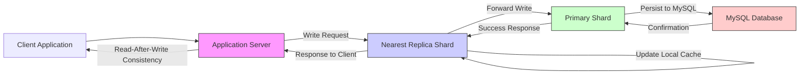

# Tao： Facebook’S Distributed Data Store For The Social Graph (1080P25) - Part 1

### Introduction to Facebook's TAO Graph Store

_screenshots/frame_00-00-00.jpg)

Facebook's graph store, known as **TAO**, was introduced in a 2013 white paper. The acronym TAO stands for **The Associations and Objects**, which are the fundamental building blocks of its graph model.

*   **Objects (Nodes):** Represent entities within the graph. These are the "things" in the system.
*   **Associations (Edges):** Represent relationships or actions between objects. These are the "connections" or "events."

_screenshots/frame_00-00-50.jpg)

**Example:**
Consider a social graph where:
*   **Object 1 (Node):** A person (e.g., "Gaurut").
*   **Association (Edge):** The action of "checking into" a hotel.
*   **Object 2 (Node):** A hotel.

In this context:
*   Objects often map to **repeatable actions** or persistent entities (like a user profile, a photo, a hotel).
*   Associations generally map to **events** or relationships (like a "like," a "comment," a "friendship," a "check-in").

A key characteristic of associations is that while the source object might remain the same, the destination object can be distinct for each instance of an event. For example, if a user adds multiple comments, the user (source object) is constant, but each comment (destination object) is unique.

### Scale and Performance Challenges (circa 2013)

_screenshots/frame_00-03-20.jpg)

Facebook's social graph presented unprecedented scaling challenges:
*   **Data Volume:** The graph contained petabytes of data, requiring a storage solution capable of handling immense scale.
*   **Query Throughput:** In 2013, the system needed to handle approximately **1 billion queries per second** on the social graph. Given the growth of Facebook, this number is likely significantly higher today (potentially 10x or more).
*   **Read-Heavy Workload:** A crucial observation was that around **99.8% of these queries were read operations**. This pattern is similar to what was observed with other large-scale caching systems like Memcached, indicating that read-optimization would be paramount.

### The Search for a Graph Database Solution

In 2013, Facebook engineers faced a dilemma:
*   **Existing Graph Databases:** While solutions like **Neo4j** (an in-memory graph database) existed, they were not designed to operate at the petabyte scale with billions of queries per second. Storing such vast amounts of data primarily on disk would be too slow to meet the performance requirements.
*   **Building from Scratch:** While an option, building an entirely new in-memory graph database from the ground up would be a massive undertaking with significant development costs and time.

### Leveraging Existing Infrastructure: MySQL and Memcached

_screenshots/frame_00-03-46.jpg)

Instead of building a new system from scratch, Facebook's engineers opted for a pragmatic approach: leveraging their existing, highly optimized infrastructure.

*   **MySQL Expertise:** Facebook was (and still is) a master of MySQL, having extensively tuned and scaled it for various applications.
*   **Memcached Expertise:** Facebook had made significant contributions to and were experts in using **Memcached**, an open-source distributed memory caching system. They had already built an extremely efficient caching layer using Memcached.

The core idea behind TAO was to **build a graph store wrapper on top of Memcached, with MySQL serving as the persistent backing store.** This strategy allowed them to:
1.  **Utilize in-memory speed** for the vast majority of read queries (99.8%) by storing graph data in Memcached.
2.  **Rely on MySQL for durability and consistency** for writes and less frequent reads, leveraging their deep operational expertise.
3.  **Avoid reinventing the wheel**, accelerating development and deployment while meeting the stringent performance and scale requirements.

This architecture aimed to combine the strengths of a fast, in-memory cache with a robust, persistent database, tailored specifically for the unique demands of a massive social graph.

```mermaid
graph TD
    UserQuery["User Query (e.g., \"Get friends of X\")"] --> TAO_Service[TAO Service]
    TAO_Service --> Memcached[Memcached Layer (In-memory Graph Store)]
    Memcached -- "Cache Hit (99.8% Reads)" --> UserQueryResponse[Fast Response]

    Memcached -- "Cache Miss / Writes" --> MySQL[MySQL (Persistent Backing Store)]
    MySQL --> Memcached_Update[Update Memcached]
    MySQL --> UserQueryResponse
    
    subgraph Data Flow
        MySQL --> Memcached
    end

    style TAO_Service fill:#f9f,stroke:#333,stroke-width:1px
    style Memcached fill:#ccf,stroke:#333,stroke-width:1px
    style MySQL fill:#cfc,stroke:#333,stroke-width:1px
```

---

### Core Requirements and Design Principles of TAO

_screenshots/frame_00-04-12.jpg)

The design of Facebook's TAO graph store was driven by several critical requirements to address the scale and complexity of the social graph:

1.  **Low Latency (In-Memory):**
    *   **Goal:** Achieve extremely fast response times, ideally under 25 milliseconds.
    *   **Solution:** Store frequently accessed graph data primarily in **in-memory caches** (Memcached). This minimizes disk I/O, which is inherently slower.

2.  **Graph Store Behavior (API Wrappers):**
    *   **Goal:** Make the underlying Memcached and MySQL infrastructure behave like a dedicated graph database.
    *   **Solution:** Develop **API wrappers** on top of Memcached. These wrappers abstract away the key-value nature of Memcached, presenting a graph-centric interface to developers.

3.  **Ease of Use:**
    *   **Goal:** Ensure the system is easy for Facebook engineers to adopt, use, and understand without needing deep knowledge of Memcached's internal workings or nuances.
    *   **Motivation:** Previously, engineers had to write custom code to interact with Memcached for graph-like operations. TAO consolidates these common patterns into a unified, simpler API. This principle highlights that for widespread adoption, ease of use often trumps raw efficiency in initial design.

4.  **High Cache Hit Rate:**
    *   **Goal:** Maximize the number of queries served directly from the fast in-memory cache, minimizing slower lookups to the persistent store.
    *   **Solution:** Design the cache to observe and optimize for **common access patterns** within the social graph. A cache is only effective if its design aligns with how data is typically accessed.

### The Graph Store API: Interacting with Objects and Associations

_screenshots/frame_00-05-09.jpg)

To achieve the "Graph Store Behavior" requirement, TAO exposes a set of intuitive APIs that allow developers to perform standard graph operations (Create, Read, Update, Delete) on **associations**.

**Core Association Operations:**

*   **`add_association(source_id, destination_id, association_type)`:**
    *   **Purpose:** Creates a new edge (association) between two objects (nodes).
    *   **Example:** Adding a friend request.
        ```
        add_association(user_gorav_id, user_pramod_id, "friend_request")
        ```
    *   This API takes the `source_id` (e.g., Gorav), the `destination_id` (e.g., Pramod Varma), and the `association_type` (e.g., "friend_request").

*   **`get_associations(source_id, association_type, [limit], [time_range], [pagination_cursor])`:**
    *   **Purpose:** Retrieves a list of associations (and their connected destination objects) originating from a specific source object and of a specific type.
    *   **Flexibility:** This API is highly flexible, allowing for:
        *   **Limiting Results:** Retrieve only a certain number of associations (e.g., `limit=100` for the top 100 friends). This is crucial for UI displays where only a subset is shown.
        *   **Time Ranges:** Filter associations by a specific time window (e.g., `now - 15 days` to `now` for recently active friends).
        *   **Pagination:** Retrieve results in chunks for large lists (e.g., "next page" functionality on a friend list).

    _screenshots/frame_00-05-52.jpg)
    *   **Example:** Getting the top 100 friends of Gorav.
        ```
        get_associations(user_gorav_id, "friends", limit=100)
        ```
    *   **Example:** Getting friends added in the last 15 days.
        ```
        get_associations(user_gorav_id, "friends", start_time=now-15days, end_time=now)
        ```

*   **`get_association_count(source_id, association_type)`:**
    *   **Purpose:** Efficiently retrieves the number of associations of a specific type originating from a source object, without fetching all the actual association data.
    *   **Use Cases:** Useful for displaying metrics (e.g., "X friends," "Y places visited") directly in the user interface or for analytics. It avoids the overhead of retrieving and then counting potentially millions of records.
    *   **Example:** Getting the total number of friends Gorav has.
        ```
        get_association_count(user_gorav_id, "friends")
        ```
    *   **Example:** Getting the number of people who checked into a specific hotel.
        ```
        get_association_count(hotel_las_vegas_id, "checked_in_to")
        ```

### The Clever Design: Bidirectional Associations (Implicitly)

_screenshots/frame_00-08-15.jpg)

A key design choice in TAO allows for efficient querying from "both sides" of a conceptual relationship, even if the underlying storage primarily focuses on outgoing edges. This addresses scenarios like: "How many people checked into this specific hotel?"

Traditionally, a "check-in" association might be modeled as `Person -> Check-in -> Hotel`. To find all people who checked into a hotel, you'd have to traverse all `Check-in` associations and filter by the hotel.

Facebook's TAO system handles this by **storing associations in a way that allows them to be queried efficiently from both the source and the destination perspective**, without necessarily creating explicit "reverse" edges for every type. This is often achieved by internally indexing associations based on both source and destination IDs.

**Conceptual Example:**

Let's say we have:
*   `P1` (Person 1) checks into `Hotel A`
*   `P2` (Person 2) checks into `Hotel A`
*   `P3` (Person 3) checks into `Hotel A`

To get the count of people checked into `Hotel A`:
Instead of modeling `Person --check-in--> Hotel`, TAO effectively allows querying associations where `Hotel A` acts as the "source" for a "checked_in_by" type of association, even if the original record was `Person -> Hotel`. This is achieved by having internal indexes that map associations both ways.

```mermaid
graph TD
    subgraph Conceptual View
        P1[Person 1] -- "check-in" --> HotelA[Hotel A]
        P2[Person 2] -- "check-in" --> HotelA
        P3[Person 3] -- "check-in" --> HotelA
    end

    subgraph TAO's Query Capability
        HotelA_Query[Query: "How many checked into Hotel A?"]
        HotelA_Query --> getCountAPI[get_association_count(HotelA_ID, "checked_in_by")]
        getCountAPI --> Result[Result: 3]
    end

    style HotelA_Query fill:#f9f,stroke:#333,stroke-width:1px
    style getCountAPI fill:#ccf,stroke:#333,stroke-width:1px
```

---

### Bi-directional Relations and Minimal API Set

TAO's design supports bi-directional relationships, meaning you can query associations from both the source and destination perspectives. This flexibility is crucial for a social graph where relationships are often reciprocal or need to be viewed from different angles.

*   **Example:** If "Person A checks into Hotel B," you can:
    *   Query from the person's perspective: "What hotels has Person A checked into?" (Source: Person A, Type: Check-in)
    *   Query from the hotel's perspective: "Who has checked into Hotel B?" (Source: Hotel B, Type: Checked-in-by - an inverse association type).

Despite the complexity of handling such queries at scale, TAO maintains a **minimal API set**. This is a deliberate design choice driven by the need for extreme performance and high adoption rates. Adding too much functionality to a system handling billions of queries per second can lead to performance degradation and increased complexity, discouraging engineers from using it. A limited, well-defined API ensures the system remains highly performant and easy to understand.

### Scalability and Performance Architecture

TAO's architecture is designed for massive scale and high performance, leveraging Facebook's existing infrastructure:

1.  **Distributed MySQL Backend:**
    *   The entire graph dataset, which spans petabytes and is globally distributed, cannot reside on a single MySQL server.
    *   Therefore, TAO uses **multiple MySQL nodes** that are sharded or replicated to store the persistent graph data. This allows for horizontal scaling of the durable storage layer.

2.  **Distributed TAO Caches (Memcached):**
    *   On top of MySQL, TAO employs **multiple distributed Memcached instances**, acting as the primary in-memory cache layer. These are often referred to as "TAO Caches" or "Cache Shards."
    *   Each cache shard is responsible for a specific subset of the overall data.

#### Query Flow and Sharding Mechanism

_screenshots/frame_00-09-57.jpg)

The process of querying and writing data in TAO involves several steps:

1.  **Client Request:** When a user's application (e.g., Facebook app) needs graph data, it sends a request to a Facebook **application server**.
2.  **Client-Side Hashing:** The application server runs a **TAO client library**. This client is responsible for determining which cache shard holds the data for a given object ID.
    *   It uses a **hashing function** (e.g., `h(object_ID)`) to transform the object ID into a numerical value.
    *   This numerical value is then mapped to a specific **shard range**.

    _screenshots/frame_00-11-00.jpg)
    *   **Example:** If object IDs are mapped to values from 1 to 1000, and there are three shards:
        *   Shard 1 might handle keys 1-333.
        *   Shard 2 might handle keys 334-666.
        *   Shard 3 might handle keys 667-1000.
    *   This ensures that a specific object always maps to the same cache shard.

3.  **Cache Lookup (Read Operations):**
    *   The TAO client directs the read request to the appropriate **TAO cache shard**.
    *   If the data (object or association list) is present in the cache (a **cache hit**), it is returned quickly, fulfilling the low-latency requirement. This is the path for the vast majority (99.8%) of read queries.
    *   If the data is **not** in the cache (a **cache miss**), the cache shard then queries the underlying **MySQL database** to retrieve the data. Once fetched, the data is stored in the cache for future requests, and then returned to the client.

    _screenshots/frame_00-12-15.jpg)

4.  **Write Operations:**
    *   For **write operations** (e.g., adding a new friend, updating an association), the request is primarily sent directly to the **MySQL database**.
    *   This simplifies the architecture by ensuring data consistency at the persistent layer. Memcached's eventual consistency model (where data might be invalidated or updated later) is handled by its inherent mechanisms.

**Summary of Data Flow:**

```mermaid
graph LR
    User[User] --> AppServer[Application Server]
    AppServer --> TAOClient[TAO Client Library]
    
    subgraph Read Flow
        TAOClient -- "h(Object ID)" --> ShardMapper[Shard Mapping Logic]
        ShardMapper -- "Request to Shard" --> CacheShard[TAO Cache Shard (Memcached)]
        CacheShard -- "Cache Hit" --> AppServer
        CacheShard -- "Cache Miss" --> MySQL_Read[MySQL Database]
        MySQL_Read --> CacheShard -- "Populate Cache" --> AppServer
    end

    subgraph Write Flow
        TAOClient -- "Write Request" --> MySQL_Write[MySQL Database]
        MySQL_Write -- "Update Confirmed" --> AppServer
        MySQL_Write -- "Invalidate/Update Cache" --> CacheShard
    end

    style AppServer fill:#f9f,stroke:#333,stroke-width:1px
    style TAOClient fill:#ccf,stroke:#333,stroke-width:1px
    style CacheShard fill:#cfc,stroke:#333,stroke-width:1px
    style MySQL_Read fill:#fcc,stroke:#333,stroke-width:1px
    style MySQL_Write fill:#fcc,stroke:#333,stroke-width:1px
```

This architecture ensures high performance for reads by leveraging a massive in-memory cache and scalability for both reads and writes through distributed sharding of both the cache and the persistent database.

---

### Hashing Edges and Objects for Sharding

_screenshots/frame_00-12-28.jpg)

While hashing an object (node) ID is straightforward (e.g., `h(object_ID) = 123` which maps to Shard 1), hashing an edge (association) is more nuanced. The goal is to ensure that all associations originating from a specific source object are co-located (stored together) on the same shard. This aligns with common access patterns, where queries often ask for "all friends of X" or "all posts liked by Y."

*   **Hashing Objects:**
    *   Simple: Hash the unique ID of the object.
    *   Example: `h(user_gorav_id)` maps Gorav's profile data to a specific shard.

*   **Hashing Edges (Associations):**
    *   **Principle:** An edge is typically routed to the shard determined by its **source object's ID**.
    *   **Reasoning:** TAO's APIs are designed around querying associations *from* a source (e.g., `get_associations(source_id, type)`). To efficiently retrieve all associations for a given source, they must be stored together.
    *   **Mechanism:** When an association (e.g., "Person 123 liked Post 345") is created, its primary storage location is determined by `h(Person_123_ID)`. This ensures that when someone asks for "all posts liked by Person 123," the system only needs to query the shard where Person 123's outgoing associations are stored.

#### The Challenge of Bi-directional (Inverse) Edges

_screenshots/frame_00-13-38.jpg)

Facebook's social graph often requires querying relationships from both ends. For example:
*   **Forward Edge:** `Person 123 -- "likes" --> Post 345` (stored on the shard of `Person 123`).
*   **Inverse Edge:** To answer "Who liked Post 345?", an "inverse" perspective is needed, conceptually `Post 345 -- "liked_by" --> Person 123`.

This inverse relationship conceptually acts as a separate edge. If this inverse edge is stored on the shard determined by `h(Post_345_ID)`, then a single logical "like" action would result in **two physical writes to potentially two different shards**.

**Problem:** Data Inconsistency
*   If `Shard A` (for `Person 123`) successfully accepts the `likes` edge, but `Shard B` (for `Post 345`) fails to accept the `liked_by` inverse edge (due to network issues, shard downtime, clock skew, etc.), the data becomes inconsistent.
*   `Person 123` would show they liked the post, but the post wouldn't show `Person 123` as a liker.

### Ensuring Consistency for Bi-directional Writes

_screenshots/frame_00-14-26.jpg)

To address the consistency challenge of bi-directional writes across multiple shards, TAO employs a client-managed, sequential write strategy:

1.  **Primary Edge First:**
    *   When an application server initiates a write operation (e.g., a "like"), the TAO client first attempts to persist the **primary edge** (e.g., `Person 123 -- "likes" --> Post 345`) to its corresponding shard (determined by `h(Person_123_ID)`).
    *   The client **waits for a successful response** from this first shard.

2.  **Inverse Edge Second (Conditional):**
    *   Only *after* the primary edge has been successfully persisted and acknowledged by its shard, the TAO client then attempts to persist the **inverse edge** (e.g., `Post 345 -- "liked_by" --> Person 123`) to its corresponding shard (determined by `h(Post_345_ID)`).

**Benefits of this approach:**
*   **Atomicity (Simulated):** While not a true distributed transaction, this sequential process ensures that if the first write fails, the second one is never attempted, preventing partial updates.
*   **Client-Managed Retries:** If the first write fails, the client can retry until it succeeds, ensuring the primary relationship is established.
*   **Reduced Inconsistency Window:** If the second write fails *after* the first succeeded, the system is in a temporarily inconsistent state. However, this is a known trade-off. For read-heavy systems like Facebook, eventual consistency for writes is often acceptable, and background reconciliation or subsequent retries can fix these rare discrepancies. The critical part is that the *primary* view of the data (e.g., a user's outgoing actions) is prioritized for consistency.

```mermaid
graph TD
    AppServer["Application Server (TAO Client)"]
    ShardA["Shard A (for Source Object ID)"]
    ShardB["Shard B (for Destination Object ID)"]
    
    subgraph Bi-directional Write Process
        AppServer -- "1. Write Primary Edge (e.g., Person Likes Post)" --> ShardA
        ShardA -- "2. Success Response" --> AppServer
        AppServer -- "3. Write Inverse Edge (e.g., Post Liked_by Person)" --> ShardB
        ShardB -- "4. Success Response" --> AppServer
    end

    subgraph Failure Scenarios
        ShardA -- "Fail (e.g., Timeout)" -.- AppServer
        AppServer -- "Retry 1 (or Abort if persistent fail)" -.- ShardA

        ShardA -- "Success" --> AppServer
        AppServer -- "Write Inverse Edge" --> ShardB
        ShardB -- "Fail (e.g., Network Error)" -.- AppServer
        AppServer -- "Known Temporary Inconsistency (Client handles retry/reconciliation)" -.- ShardB
    end

    style AppServer fill:#f9f,stroke:#333,stroke-width:1px
    style ShardA fill:#ccf,stroke:#333,stroke-width:1px
    style ShardB fill:#cfc,stroke:#333,stroke-width:1px
```

---

### Handling Inconsistency in Bi-directional Writes

_screenshots/frame_00-16-12.jpg)
_screenshots/frame_00-16-24.jpg)

As discussed, a single logical action (like a "like") results in two physical write operations to potentially different shards (one for the primary edge, one for the inverse edge). If the second write fails, it leads to a temporary **data inconsistency**. For example, a user might see their "like" on a post, but the post's list of likers might not include them.

Rather than implementing complex and slow distributed transactions to guarantee atomicity across shards (which would be impractical for Facebook's scale and performance requirements), TAO adopts an **eventual consistency** model for these specific failure scenarios:

*   **Hanging Edge:** If the second write operation (for the inverse edge) fails, the system allows this "hanging edge" to exist. It means one side of the relationship is recorded, but the other is not.
*   **Background Reconciliation:** To resolve these inconsistencies, Facebook relies on **background cron jobs**. These jobs periodically scan for and identify such hanging or incomplete edges and then retry or complete the missing write operations. This ensures that eventually, the data becomes consistent across all relevant shards.

### Optimizing for Read-Heavy Workloads: Primary and Replica Shards

_screenshots/frame_00-18-53.jpg)

Given that approximately **99.8% of queries are reads** and only 0.2% are writes, TAO's architecture is heavily optimized for read performance. A naive approach of propagating every write to *all* replicas would lead to:
*   **High Write Amplification:** A single write would trigger updates across potentially hundreds or thousands of replica shards, causing immense network traffic and load.
*   **Slow Write Performance:** Waiting for acknowledgments from all replicas would significantly increase write latency.
*   **Slow Read Performance on Replicas:** Replicas constantly processing write updates would experience contention, slowing down read operations.

To mitigate these issues, TAO splits its cache shards into two distinct types:

1.  **Primary Shards:**
    *   Responsible for handling **all write operations** for a specific range of object IDs.
    *   There is typically **only one primary shard** for any given key range.
    *   They are the authoritative source for the most up-to-date data.

2.  **Replica Shards (Read Replicas):**
    *   Responsible for serving **read operations** for the same range of object IDs as their corresponding primary shard.
    *   There can be **many replica shards** for a single primary shard, allowing for massive read scaling.
    *   They are eventually consistent with the primary shard.

#### Write Propagation and Change Data Capture (CDC)

When a write operation occurs:
1.  The TAO client directs the write **only to the relevant primary shard**.
2.  The primary shard processes the write and records the change.
3.  These changes are then propagated to all associated replica shards using a **Change Data Capture (CDC)** mechanism. Facebook uses a system called **MaxQueen**, which is a wrapper built on top of MySQL's binlog (a transactional log of changes).
    *   **MaxQueen** ensures that updates are efficiently distributed to all other primary shards (for other key ranges, if a write affects multiple primary shards) and, crucially, to all replica shards.

This split architecture significantly reduces **write amplification**. Instead of a write hitting potentially thousands of replicas directly, it only hits one primary shard, and then `MaxQueen` handles the efficient asynchronous propagation to replicas. This means a "write amplification of 10" (e.g., 1 primary + 9 replicas) is more manageable than "1000" if all were write-enabled.

_screenshots/frame_00-20-08.jpg)

### Achieving Read-After-Write Consistency

The primary/replica shard model, combined with `MaxQueen` for propagation, allows TAO to achieve **read-after-write consistency** for clients. While clients **never directly connect to a primary shard for reads** (they always go to a replica for performance), the system employs clever mechanisms (discussed further in the next section) to ensure that a client who just performed a write can immediately read their own updated data, even if it hasn't propagated to all replicas yet.

This is a critical feature for user experience: if you post a comment, you expect to see it immediately, even if others might see it a few milliseconds later.

```mermaid
graph TD
    AppServer["Application Server (TAO Client)"]

    subgraph Shard Range 0-200
        PShard1["Primary Shard 1 (0-200)"]
        RShard1A["Replica Shard 1A (0-200)"]
        RShard1B["Replica Shard 1B (0-200)"]
    end

    subgraph Shard Range >200
        PShard2["Primary Shard 2 (>200)"]
        RShard2A["Replica Shard 2A (>200)"]
    end

    MySQL["MySQL Database (Persistent Store)"]

    AppServer -- "Write Operation" --> PShard1
    PShard1 -- "Propagate Changes via MaxQueen" --> RShard1A
    PShard1 -- "Propagate Changes via MaxQueen" --> RShard1B
    PShard1 -- "Propagate Changes via MaxQueen" --> PShard2

    AppServer -- "Read Operation" --> RShard1A
    AppServer -- "Read Operation" --> RShard1B
    AppServer -- "Read Operation" --> RShard2A

    PShard1 -- "Sync/Backup" --> MySQL
    PShard2 -- "Sync/Backup" --> MySQL

    style AppServer fill:#f9f,stroke:#333,stroke-width:1px
    style PShard1 fill:#ccf,stroke:#333,stroke-width:1px
    style RShard1A fill:#cfc,stroke:#333,stroke-width:1px
    style RShard1B fill:#cfc,stroke:#333,stroke-width:1px
    style PShard2 fill:#ccf,stroke:#333,stroke-width:1px
    style RShard2A fill:#cfc,stroke:#333,stroke-width:1px
    style MySQL fill:#fcc,stroke:#333,stroke-width:1px
```

---

### Achieving Read-After-Write Consistency in TAO

_screenshots/frame_00-20-09.jpg)

In TAO, achieving read-after-write consistency (where a user immediately sees their own changes) is critical for a good user experience. This is handled by a clever interaction between the client, replica shards, and primary shards:

1.  **Write Request to Nearest Replica:** When a client (via the application server) initiates a write operation (e.g., "like a post"), the request is first sent to the **nearest replica shard** that serves the relevant data range.
2.  **Replica Forwards to Primary:** This replica shard acts as a proxy. It **forwards the write operation to its corresponding primary shard**. Every replica knows which primary shard it is associated with.
3.  **Primary Persists and Responds:** The primary shard is responsible for actually persisting the write to the underlying MySQL database and then updating its own in-memory cache. Once successful, the primary sends a response back to the replica.
4.  **Replica Becomes Consistent:** Upon receiving the success response from the primary, the replica shard immediately updates its local cache to reflect the new write.
5.  **Client Sees Latest Data:** Since the client initially sent the write to this specific replica, subsequent reads from *that same replica* will now reflect the newly written data, ensuring read-after-write consistency for the initiating client. Meanwhile, `MaxQueen` will asynchronously propagate this change to other replicas.



### Handling "Hot Shards" from Viral Events

_screenshots/frame_00-22-31.jpg)

A significant challenge in large-scale social graphs is managing "viral events" which can lead to **"hot shards."** A hot shard is one that experiences an abnormally high volume of requests, potentially overwhelming its capacity.

*   **Scenario:** A celebrity (e.g., Shahrukh Khan) posts something that goes viral. This post, as an object, becomes extremely popular.
*   **Problem:** The post's object ID (and thus its associated shard) will receive an enormous number of related edges (likes, comments, shares). If all these edges are routed to a single shard, that shard becomes a bottleneck. Even with many read replicas, the sheer volume of data and queries for that single logical entity can overwhelm the individual shards.

#### Mitigation Strategy: Sharding by `Source ID + Type`

_screenshots/frame_00-22-44.jpg)

To alleviate the pressure on individual shards during viral events, TAO employs a more granular sharding strategy for associations:

*   Instead of just hashing the `source_id` to determine the shard for all outgoing edges, edges are sometimes routed based on a combination of **`source_id + association_type`**.
*   **Example:** For Shahrukh Khan's viral post (Source ID):
    *   All `like` associations for that post might go to Shard X.
    *   All `comment` associations for that post might go to Shard Y.
    *   All `share` associations for that post might go to Shard Z.

This distributes the load for a single hot object across multiple shards based on the type of interaction, somewhat mitigating the "hot shard" problem.

#### Limitations and the Ultimate Fallback

_screenshots/frame_00-23-49.jpg)

While sharding by `source_id + type` helps, it doesn't solve all "hot shard" problems:
*   Even a single type of association (e.g., "likes" on a viral post) can still generate millions of edges, making the shard responsible for those likes incredibly hot.
*   The problem isn't necessarily the *storage* of the object itself, but the **volume of its associated edges** (e.g., thousands or millions of likes, comments).

**Why more read replicas don't help here:**
Adding more read replicas for a hot shard doesn't resolve the core issue. If a single logical collection of data (like all likes on one post) is too large to fit efficiently within *any* single cache shard (due to **cache thrashing** with an LRU policy), then simply adding more identical shards won't improve performance. Each replica would still be trying to hold the same massive, highly-contended dataset, leading to constant evictions and cache misses.

_screenshots/frame_00-24-02.jpg)

**The Ultimate Solution: Querying the Database Directly**
When a cache shard becomes **critically hot** and is failing to serve requests efficiently (e.g., due to thrashing, excessive load), the TAO client has a final fallback: **bypass the cache and query the underlying MySQL database directly.**

*   This is a less optimal path in terms of latency but ensures that the data is eventually retrieved.
*   It acknowledges that for extremely large or highly contentious datasets, the cache might not be able to provide the desired performance, and relying on the persistent store is the most robust approach.

This pragmatic design highlights that even with sophisticated caching strategies, there are limits to what an in-memory cache can handle for truly viral, massive datasets.

---

### Conclusion: The Elegance of TAO's Design

_screenshots/frame_00-24-15.jpg)

The Facebook TAO graph store stands out as a prime example of innovative system design. Its core brilliance lies in its ability to:

*   **Mimic a Graph Database:** From a developer's perspective, TAO provides a clear, concise API for interacting with a social graph, treating entities as "objects" (nodes) and relationships as "associations" (edges). It "feels like a graph store."
*   **Leverage Existing Infrastructure:** Internally, TAO cleverly builds this graph abstraction on top of Facebook's battle-tested and highly optimized technologies:
    *   **Memcached:** Used as the distributed, in-memory cache layer for low-latency reads.
    *   **MySQL:** Serves as the robust, persistent backing store for durability.
    *   **MaxQueen:** A custom Change Data Capture (CDC) system built on MySQL's binlog, ensuring efficient propagation of writes and eventual consistency across replicas.

By combining these components with intelligent sharding, primary/replica separation, and client-side logic for consistency and hot shard management, Facebook engineered a system capable of handling petabytes of data and billions of queries per second, predominantly read-heavy, without inventing an entirely new database from scratch. This approach prioritizes **ease of use for developers** and **extreme performance** by adapting existing, well-understood solutions to a novel problem.

---

