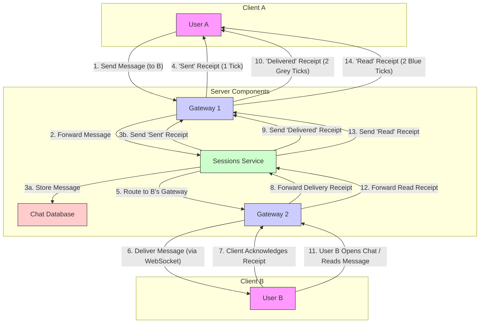
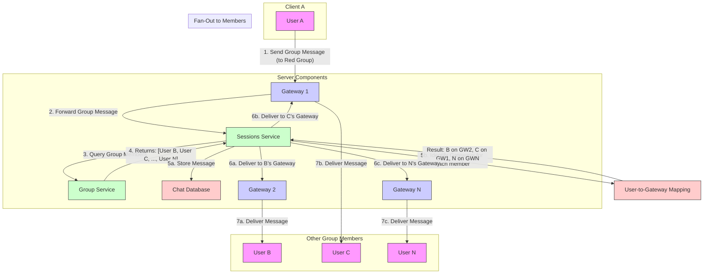

# Whatsapp System Design： Chat Messaging Systems For Interviews (1080P25) - Part 1

### WhatsApp System Design: An Overview

This section will cover the fundamental principles behind designing a chat-based application like WhatsApp. Understanding its core architecture will equip you to design similar systems effectively.

#### Key Features of WhatsApp

WhatsApp, as a prominent chat application, incorporates several critical features that are often discussed in system design interviews. The following list, as captured on the whiteboard, outlines these key functionalities:

_screenshots/frame_00-01-36.jpg)

1.  **Group Messaging:** This feature enables multiple users (up to 200 in WhatsApp's case) to communicate within a single chat thread. Designing for group messaging introduces complexities related to efficiently delivering messages to numerous recipients and managing dynamic group memberships.
2.  **Message Receipts (Sent, Delivered, Read):** This provides users with clear feedback on the status of their messages through distinct visual indicators (tick marks):
    *   **Sent (Single Tick):** Indicates the message has successfully left the sender's device.
    *   **Delivered (Double Grey Ticks):** Confirms the message has successfully reached the recipient's device.
    *   **Read (Double Blue Ticks):** Signifies that the recipient has viewed the message.
3.  **Online Status / Last Seen:** This functionality shows whether a user is currently active and connected to the application ("online") or displays the last timestamp they were seen using the app. Implementing this requires a robust system for real-time presence tracking.
4.  **Image Sharing:** The ability to send and receive images within chat conversations.
    *   *Note: The detailed design for storing and retrieving images efficiently is a complex topic often covered separately, for example, in discussions about media-heavy applications like Tinder.*
5.  **Chat Persistence (Temporary vs. Permanent):** This refers to how long chat messages are stored and where they reside.
    *   **Temporary Chats (e.g., WhatsApp, Snapchat):** Messages are primarily stored on the user's local device. If the application is deleted or the chat history is cleared, these messages are typically lost (unless cloud backups are enabled).
        *   **Advantages:** Enhances user privacy by keeping data on client devices and significantly reduces server-side storage costs.
        *   **Disadvantages:** Lacks persistent records for compliance or official communication needs, and can lead to data loss if not properly backed up by the user.
    *   **Permanent Chats (e.g., many office messaging applications):** Messages are stored indefinitely on central servers, ensuring a complete and accessible history for compliance, auditing, or long-term record-keeping.
6.  **One-to-One Chat:** This is the foundational capability allowing two individual users to exchange messages directly. It forms the core requirement and the basic building block for any chat application.

#### Interview Strategy: Feature Selection

When approaching a system design interview, it's crucial to strategically select which features to discuss within the typical time constraint (usually one hour).

*   **Start Simple:** Always begin with the most basic and fundamental functionalities.
*   **Choose Familiar Features:** Opt for features you understand well, as interviewers are more likely to agree to the first feature you propose, allowing you to demonstrate your expertise.
*   **Prioritize Core Functionality:** For a chat application, the ability to send and receive messages (one-to-one chat) is the absolute prerequisite.
*   **Exclude Complexities (Initially):** Features like image sharing, while important, can be acknowledged but deferred if they've been covered in previous discussions or if time is limited.

#### Focus for This Discussion

For this specific design deep-dive, we will concentrate on the core mechanism of **one-to-one chat**: how a message is sent from one user to another. The other mentioned features (Group Messaging, Sent/Delivered/Read Receipts, Online/Last Seen, and Chat Persistence) will be discussed as extensions or built upon this fundamental understanding of one-to-one communication.

---

### Core Communication Flow: One-to-One Chat

The foundation of any chat application is the ability for one user to send a message to another. This section details the initial steps of a user connecting to the system and the journey of a message from sender to receiver.

#### Client Connection and Gateway

_screenshots/frame_00-03-24.jpg)

When a user opens their WhatsApp application on their mobile phone, the first step is to establish a connection with the WhatsApp servers. This connection is typically made to a component called a **Gateway**.

*   **Gateway's Role:** The Gateway acts as the primary entry point for all client connections. It's the "front door" of the WhatsApp backend, responsible for:
    *   Receiving incoming connections from mobile clients.
    *   Handling initial security and authentication.
    *   Forwarding client requests to appropriate internal services.
*   **Protocol Choice:** Unlike traditional web browsing which heavily relies on HTTP for client-server communication, internal communication within a chat system (especially between the client and gateway, and within the backend) may use more optimized protocols. HTTP, while robust, carries overhead (larger headers, request-response model) that isn't always necessary for constant, bidirectional message flow in a chat application. Security mechanisms can be handled efficiently at the Gateway level, allowing for lighter internal protocols.

#### The Challenge of User-to-Gateway Mapping

_screenshots/frame_00-04-15.jpg)

Consider a scenario where multiple users (e.g., User A, User B) are connected to different Gateway servers (e.g., Gateway 1, Gateway 2, Gateway 3). For User A to send a message to User B, the system needs to know which Gateway User B is currently connected to.

An initial, naive approach might be to have each Gateway store a mapping of which users are connected to it. For example:
*   Gateway 1 knows User A is connected.
*   Gateway 2 knows User B is connected.

However, this approach presents several significant problems:

1.  **Memory Overhead:** Maintaining an active TCP connection for each user consumes memory on the Gateway server. Storing additional user-to-box mapping information directly on the Gateway would further increase this memory burden, limiting the maximum number of concurrent connections a single Gateway can handle. The goal is to maximize connections per Gateway, making them "dumb" connection handlers.
2.  **Data Duplication & Consistency Issues:** If this mapping information is stored on *each* Gateway, it becomes duplicated across multiple servers. This leads to:
    *   **Increased Storage:** Redundant storage of the same information.
    *   **Consistency Challenges:** When a user's connection shifts (e.g., due to network changes, server restart, or load balancing), updating this transient information consistently across all Gateways becomes complex and error-prone.
3.  **Tight Coupling:** The Gateways become tightly coupled with the logic of knowing "who is where." This violates the principle of separation of concerns, making the system less flexible and harder to scale independently.

Ideally, a Gateway should be a "dumb" connection handler: it accepts connections, forwards messages, and doesn't concern itself with complex routing logic or user presence information.

#### Introducing the Sessions Service

_screenshots/frame_00-04-28.jpg)
_screenshots/frame_00-05-07.jpg)

To address the challenges of user-to-Gateway mapping, a dedicated microservice called the **Sessions Service** is introduced.

*   **Role of Sessions Service:**
    *   The Sessions Service is responsible for maintaining the transient mapping of **which user ID is currently connected to which Gateway server (or "box")**.
    *   It acts as a central directory or a "concierge" that knows the current location (Gateway) of every online user.
    *   This service is highly available, often replicated across multiple servers to avoid a single point of failure and handle a high volume of updates (as users connect and disconnect frequently).
*   **Decoupling:** By offloading this responsibility to a separate service, the Gateways remain simple and stateless (or nearly stateless) regarding user location. This significantly **decouples** the connection management logic from the user presence and routing logic.
*   **Transient Data Handling:** The Sessions Service is optimized for handling highly transient data (user connections come and go frequently), requiring a fast, highly available data store.

The Sessions Service essentially maintains a dynamic table, similar to this:

| User ID | Connected Gateway |
| :------ | :---------------- |
| A       | Gateway 1         |
| B       | Gateway 2         |
| C       | Gateway 1         |
| D       | Gateway 3         |

#### Message Flow with Sessions Service (A to B)

Let's trace the path of a message from User A to User B using the newly introduced Sessions Service.

_screenshots/frame_00-06-11.jpg)

```mermaid
graph LR
    userA["User A (Client)"] --> gw1[Gateway 1]
    gw1 -- "1. Message for B (from A)" --> sessions[Sessions Service]
    sessions -- "2. Lookup B's Gateway" --> sessions_data[User-to-Gateway Mapping]
    sessions_data -- "Result: B is on Gateway 2" --> sessions
    sessions -- "3. Route message to B's Gateway" --> gw2[Gateway 2]
    gw2 -- "4. Deliver message to B (Problematic with HTTP)" --> userB[User B (Client)]

    style userA fill:#f9f,stroke:#333,stroke-width:1px
    style userB fill:#f9f,stroke:#333,stroke-width:1px
    style gw1 fill:#ccf,stroke:#333,stroke-width:1px
    style gw2 fill:#ccf,stroke:#333,stroke-width:1px
    style sessions fill:#cfc,stroke:#333,stroke-width:1px
    style sessions_data fill:#fcc,stroke:#333,stroke-width:1px
```

1.  **User A Sends Message:** User A, connected to `Gateway 1`, composes and sends a message intended for User B. `Gateway 1` receives this message.
2.  **Gateway Forwards to Sessions Service:** Since `Gateway 1` is "dumb" and doesn't know User B's location, it forwards the message (or at least a request containing User B's ID and the message content) to the `Sessions Service`.
3.  **Sessions Service Lookup:** The `Sessions Service` receives the request. Its primary task is to look up User B's ID in its `User-to-Gateway Mapping` to determine which Gateway User B is currently connected to. In our example, it finds that User B is connected to `Gateway 2`.
4.  **Sessions Service Routes:** The `Sessions Service` then instructs `Gateway 2` to deliver the message to User B. This effectively routes the message from the originating Gateway (`Gateway 1`) to the destination Gateway (`Gateway 2`) via the `Sessions Service`.

#### The Server-to-Client Communication Problem

At step 4, `Gateway 2` needs to send the message to User B's device. This immediately highlights a fundamental challenge if we were to rely solely on HTTP:

*   **HTTP is Client-Server (Request-Response):** HTTP is primarily a client-pull protocol. The client initiates a request, and the server sends a response. A server cannot spontaneously "push" data to a client without a prior client request or an open connection designed for such push notifications.
*   **The Dilemma:** If `Gateway 2` tries to send a message to User B using a standard HTTP request, it would violate the protocol's nature. User B's device (the client) isn't expecting a server-initiated request in this manner.

This limitation means that for real-time chat, a different communication mechanism is required that allows the server to push messages to connected clients asynchronously. This will be explored in the next section.

---

### Overcoming HTTP Limitations for Real-time Communication

As discussed, traditional HTTP operates on a **client-server, request-response model**. This means the client (your phone) initiates a request, and the server responds. The server cannot spontaneously "push" data to the client without the client first asking for it. This fundamental limitation makes HTTP unsuitable for real-time chat applications where messages need to be delivered instantly to a recipient without them constantly checking for new messages.

#### Limitations of HTTP for Real-time Chat

*   **Long Polling:** One common workaround using HTTP is **Long Polling**. In this approach, the client makes an HTTP request to the server, and the server holds the connection open until new data is available or a timeout occurs. Once data is available, the server sends the response, and the client immediately makes another request.
    *   **How it works:** Imagine User B's phone constantly asking the server, "Any new messages for me?" The server waits and only replies when there's a message.
    *   **Drawbacks:** While better than short polling (where the client polls every few seconds regardless of new data), Long Polling is still not truly real-time. There's an inherent delay between the message arriving at the server and the client's next poll. It also consumes more resources due to repeated connection setups and tear-downs, and requires managing open connections on the server side. It's not ideal for the instantaneity expected in chat applications.

#### The Solution: WebSockets

_screenshots/frame_00-07-29.jpg)

For truly real-time, bidirectional communication, chat applications like WhatsApp rely on **WebSockets**.

*   **Persistent, Full-Duplex Connection:** Unlike HTTP's transient request-response model, WebSockets establish a persistent, bidirectional (full-duplex) communication channel over a single TCP connection. Once the connection is "upgraded" from HTTP to WebSocket, both the client and the server can send data to each other at any time, without needing to initiate a new request.
*   **"Peer-to-Peer" Analogy:** While not truly peer-to-peer (communication still goes through the server), WebSockets allow the server to "push" messages to a client, and the client to "push" messages to the server, mimicking a direct communication flow. This is crucial for instant message delivery.
*   **Efficiency:** After the initial handshake, WebSocket connections have minimal overhead, making them very efficient for continuous, low-latency data exchange.

_screenshots/frame_00-08-13.jpg)

### Enhanced Message Flow with WebSockets and Persistence

To ensure messages are delivered reliably and to implement features like message receipts, we need to integrate WebSockets and a message persistence layer.

#### Introducing the Chat Database

_screenshots/frame_00-09-43.jpg)

A **Chat Database** (or Message Store) is critical for several reasons:

*   **Persistence:** It stores messages until they are successfully delivered to the recipient. This guarantees that messages are not lost if the recipient is offline or experiences network issues.
*   **Guaranteed Delivery:** The system can retry sending messages from this database until delivery is confirmed.
*   **Message History:** It enables users to retrieve past conversations.

The Chat Database is typically a highly scalable NoSQL database (e.g., Cassandra, HBase) designed for high write throughput and eventual consistency, given the sheer volume of messages.

#### Detailed Message Flow and Receipt Mechanism

Let's trace the journey of a message from User A to User B, including the generation of "Sent," "Delivered," and "Read" receipts.



1.  **User A Sends Message:** User A's client sends the message to `Gateway 1` (the Gateway User A is connected to via a WebSocket). The message includes the recipient's User ID (B).
2.  **Gateway 1 Forwards:** `Gateway 1` receives the message and forwards it to the `Sessions Service`.
3.  **Sessions Service Processes Message:**
    *   **3a. Store in Chat Database:** The `Sessions Service` first writes the message into the `Chat Database`. This ensures message persistence and guaranteed delivery, even if User B is offline. The system will keep retrying delivery until successful.
    *   **3b. Send "Sent" Receipt:** Immediately after successfully storing the message in the `Chat Database`, the `Sessions Service` sends a "message sent" acknowledgment back to `Gateway 1`.
4.  **"Sent" Receipt to User A:** `Gateway 1` receives this acknowledgment and pushes the "sent" status (single tick) to User A's device via the established WebSocket connection. User A now knows the message has left their device and reached the server.
5.  **Sessions Service Routes:** The `Sessions Service` then queries its user-to-Gateway mapping to find out which Gateway User B is currently connected to (e.g., `Gateway 2`). It then instructs `Gateway 2` to deliver the message.
6.  **Deliver Message to User B:** `Gateway 2` receives the message from the `Sessions Service` and pushes it directly to User B's device via User B's established WebSocket connection.
7.  **Client Acknowledges Receipt:** Once User B's device successfully receives the message, User B's client sends an acknowledgment (a "delivery receipt") back to `Gateway 2` via its WebSocket. This is a client-side confirmation that the message has arrived.
8.  **Forward Delivery Receipt:** `Gateway 2` forwards this delivery receipt to the `Sessions Service`.
9.  **Sessions Service Processes Delivery Receipt:** The `Sessions Service` notes that the message has been delivered to User B. It then looks up User A's Gateway (`Gateway 1`) to notify User A.
10. **"Delivered" Receipt to User A:** The `Sessions Service` sends the "delivered" status to `Gateway 1`, which then pushes the "delivered" receipt (double grey ticks) to User A's device. User A now knows the message has reached User B's device.
11. **User B Reads Message:** When User B opens the chat or views the message within the application, User B's client sends a "read receipt" notification to `Gateway 2` via its WebSocket.
12. **Forward Read Receipt:** `Gateway 2` forwards this read receipt to the `Sessions Service`.
13. **Sessions Service Processes Read Receipt:** The `Sessions Service` registers that the message has been read by User B. It then looks up User A's Gateway (`Gateway 1`).
14. **"Read" Receipt to User A:** The `Sessions Service` sends the "read" status to `Gateway 1`, which then pushes the "read" receipt (double blue ticks) to User A's device. User A now knows the message has been read by User B.

This elaborate flow ensures reliability, real-time delivery, and the provision of crucial feedback (receipts) to the sender, forming the backbone of a robust chat system.

---

### Implementing Online Status and Last Seen

The "Online" status and "Last Seen" timestamp are crucial features for user experience in chat applications, indicating a user's availability. While seemingly simple, implementing these at a massive scale (millions of users) requires careful architectural considerations.

#### Core Concept: Storing Last Activity Time

The fundamental idea is to store the `last_seen` timestamp for each user in a dedicated data store. This information can be queried by other users who wish to know a contact's status.

*   **Data Structure:** Conceptually, this can be represented as a simple key-value pair or a table:

    | User ID (Key) | Last Seen Timestamp (Value) |
    | :------------ | :-------------------------- |
    | A             | 2023-10-27 10:35:12 UTC     |
    | B             | 2023-10-27 10:38:05 UTC     |
    | C             | 2023-10-27 10:30:00 UTC     |

    _screenshots/frame_00-11-54.jpg)

#### Updating the `Last Seen` Timestamp

The `last_seen` timestamp needs to be updated whenever a user performs an activity that indicates they are actively using the application.

*   **User Activity Triggers:** Any client-initiated interaction with the server should update the `last_seen` timestamp. Examples include:
    *   Sending a message
    *   Opening a chat
    *   Reading a message
    *   Actively browsing the app (even without sending messages)

*   **Dedicated Microservice: Last Seen Service:**
    *   To manage this at scale and decouple it from other services, a dedicated **Last Seen Microservice** is introduced.
    *   Whenever a user's client sends a request to a Gateway, the Gateway can forward this activity information to the `Last Seen Service`.
    *   The `Last Seen Service` then updates the `last_seen` timestamp for that user in its persistent storage (e.g., a database like Redis or Cassandra optimized for fast writes and reads of volatile data).

    _screenshots/frame_00-12-33.jpg)

*   **Distinguishing User Activity vs. App-Generated Requests:**
    *   It's crucial to differentiate between actions initiated directly by the user and requests sent by the application itself in the background.
    *   **User Activities:** These are explicit actions (e.g., typing, sending, opening). These *should* update the `last_seen` timestamp.
    *   **App-Generated Requests:** These are background processes (e.g., fetching delivery receipts, background syncing, polling for notifications while the app is in the background). These *should NOT* update the `last_seen` timestamp, as the user might not be actively present.
    *   **Implementation:** The client application can include a flag in its requests to the Gateway (e.g., `is_user_activity: true/false`). The Gateway then uses this flag to decide whether to forward the request to the `Last Seen Service` for a timestamp update.

    ```mermaid
    graph LR
        userClient[User Client (App)] -- "Request (with activity flag)" --> gateway[Gateway]
        gateway -- "If is_user_activity=true" --> lastSeenService[Last Seen Microservice]
        lastSeenService -- "Update User's Last Seen Timestamp" --> lastSeenDB[Last Seen DB]
        gateway -- "If is_user_activity=false" --> otherServices[Other Services (e.g., Message Delivery)]

        style userClient fill:#f9f,stroke:#333,stroke-width:1px
        style gateway fill:#ccf,stroke:#333,stroke-width:1px
        style lastSeenService fill:#cfc,stroke:#333,stroke-width:1px
        style lastSeenDB fill:#fcc,stroke:#333,stroke-width:1px
        style otherServices fill:#eee,stroke:#333,stroke-width:1px
    ```

#### "Online" vs. "Last Seen At..."

*   **Online Status:** To display "Online," a threshold is used. If a user's `last_seen` timestamp was updated within a very recent window (e.g., the last 10-15 seconds), they are considered "Online." This provides a smoother user experience, avoiding rapid flickers between "online" and "offline" if a user is momentarily inactive.
*   **Last Seen At:** If the `last_seen` timestamp is older than this threshold, the exact timestamp is displayed (e.g., "Last seen today at 10:35 AM").

*   **Querying Status:** When User B wants to know User A's status, User B's client queries the server (via its Gateway), which then consults the `Last Seen Service`. The `Last Seen Service` retrieves A's `last_seen` timestamp and applies the "online" threshold logic before returning the appropriate status to User B's client.

This completes the discussion on the "Online Status / Last Seen" feature.

### Next Steps: System-Level Considerations

Having covered the core one-to-one messaging and presence features, we now shift our focus to broader system architecture components that enable scalability and reliability:

*   **Load Balancers:** Essential for distributing incoming traffic across multiple Gateway servers and other services to prevent overload and ensure high availability. While generally a standard component, its specific role in a chat system (e.g., maintaining sticky sessions for WebSockets) is important.
*   **Service Discovery:** In a microservices architecture, services need to find and communicate with each other. Service discovery mechanisms allow services to register themselves and locate other services dynamically, which is crucial for a complex, distributed system like WhatsApp.

_screenshots/frame_00-14-43.jpg)
_screenshots/frame_00-14-56.jpg)

---

### System Architecture Components and Group Messaging

Now that we've covered the basics of one-to-one chat and presence, let's integrate other essential services and tackle the complexity of group messaging.

#### Auxiliary Services (Common to Many Systems)

Before diving into group messaging, it's worth noting several generic microservices that are part of a complete system like WhatsApp but are not unique to chat applications. These are often discussed in separate system design contexts.

_screenshots/frame_00-15-09.jpg)

*   **Authentication Service (Auth Service):** Handles user registration, login, and verification. It ensures that only legitimate users can access the system. This service typically involves secure credential storage and token-based authentication.
*   **Profile Service:** Manages user profile data (e.g., name, profile picture, status message, contact information).
*   **Image Service:** Dedicated for handling the storage, retrieval, and processing of images (e.g., resizing, thumbnails). This is often a separate content delivery network (CDN) or object storage solution.
*   **Email Service & SMS Service:** Used for sending notifications, verification codes, or other external communications outside the app.
*   **Load Balancer:** Distributes incoming network traffic across multiple servers (e.g., Gateways) to ensure no single server is overwhelmed, improving responsiveness and availability. In the context of WebSockets, load balancers often need to support "sticky sessions" to ensure a client's persistent WebSocket connection remains with the same Gateway server.
*   **Service Discovery / Heartbeat Maintenance:** In a microservices architecture, services need to dynamically discover and communicate with each other. A service discovery mechanism (e.g., Consul, Eureka, etcd) allows services to register themselves and for other services to look them up. Heartbeat mechanisms ensure that services are healthy and available.

While crucial for a complete system, these services are generic and not specific to the unique challenges of a chat application's core messaging flow.

#### Group Messaging: The Fan-Out Challenge

Group messaging introduces a significant challenge: delivering a single message from one sender to multiple recipients. This is often referred to as a **fan-out** problem.

_screenshots/frame_00-15-44.jpg)

Imagine a group where some members (e.g., "red" users) are connected to `Gateway 1`, and others are connected to `Gateway 2`. When a "red" user on `Gateway 1` sends a group message, it needs to reach all other "red" users, regardless of which Gateway they are connected to.

The `Sessions Service`, while responsible for user-to-Gateway mapping, would become overwhelmed if it also had to store and manage the membership of every group and then fan out messages to hundreds of members directly. This would tightly couple group logic with session management.

#### Introducing the Group Service

To decouple group management and handle the fan-out efficiently, a dedicated **Group Service** is introduced.

*   **Role of Group Service:**
    *   Stores and manages all information related to groups: group ID, members list, group metadata (e.g., name, admin).
    *   When a message is sent to a group, the `Sessions Service` delegates the task of identifying all group members to the `Group Service`.
*   **Decoupling:** This separation of concerns means:
    *   The `Sessions Service` remains focused on user-to-Gateway mapping.
    *   The `Group Service` handles all group-related data and logic.

#### Group Message Flow

Let's trace the flow of a group message from User A (a member of "Red Group") to other members of "Red Group":



1.  **User A Sends Group Message:** User A's client sends the group message to `Gateway 1`.
2.  **Gateway Forwards:** `Gateway 1` forwards the message to the `Sessions Service`.
3.  **Sessions Queries Group Service:** The `Sessions Service` identifies it as a group message and queries the `Group Service` for the list of all members in the specified group.
4.  **Group Service Responds:** The `Group Service` returns the list of all User IDs belonging to that group (e.g., User B, User C, ..., User N).
5.  **Sessions Service Prepares Delivery:**
    *   **5a. Store Message:** The message is first stored in the `Chat Database` for persistence and guaranteed delivery for each group member.
    *   **5b. Identify Gateways:** For each user ID returned by the `Group Service`, the `Sessions Service` looks up their current connected Gateway using its `User-to-Gateway Mapping`.
6.  **Sessions Service Initiates Fan-Out:** The `Sessions Service` then iterates through the list of identified Gateways and instructs each relevant Gateway to deliver the message to its connected users.
7.  **Gateways Deliver Messages:** Each Gateway (e.g., `Gateway 1`, `Gateway 2`, `Gateway N`) pushes the message to its respective connected group members (User C, User B, User N) via their established WebSocket connections.

#### Limiting Group Size for Real-time Performance

*   **Fan-out Explosion:** If groups were unlimited in size (e.g., millions of members like a celebrity's Instagram followers), fanning out messages in real-time to every single member would be impractical and resource-intensive. Sending millions of individual WebSocket messages immediately is a massive undertaking.
*   **WhatsApp's Approach (Limit 200):** WhatsApp limits group size to 200 members. This is a deliberate design choice. While 200 messages is still a fan-out, it's a manageable number for real-time delivery without resorting to complex batching or pull mechanisms typically needed for massive fan-outs (like Instagram's feed delivery).
*   **Trade-off:** This limits the scale of broadcast within a single group but ensures that messages within that group are delivered with the low latency expected of a chat application. For larger broadcasts, other paradigms (like publish-subscribe systems or content delivery networks) are more suitable, but they might sacrifice strict real-time guarantees.

This refined architecture, incorporating dedicated microservices and WebSockets, allows WhatsApp to handle both one-to-one and group messaging efficiently while ensuring real-time delivery and message persistence.

---

### Optimizing Gateway Performance and Ensuring Reliability

To handle millions of concurrent users and messages, a chat application's architecture must be highly optimized. This involves offloading non-essential tasks from critical components and implementing robust mechanisms for fault tolerance and guaranteed delivery.

#### Offloading Message Parsing from Gateways

_screenshots/frame_00-18-59.jpg)

The **Gateways** are the front-facing servers responsible for maintaining thousands, if not millions, of WebSocket connections with clients. Their primary role should be to simply pass raw data back and forth. Any heavy processing on the Gateway itself can consume precious memory and CPU cycles, limiting the number of concurrent connections it can handle.

*   **Problem:** If a Gateway has to parse incoming messages (e.g., de-serialize a JSON string into a programming language object), perform authentication checks, or do any complex logic, it adds significant overhead.
*   **Solution: "Dumb" Gateways:** The goal is to keep Gateways as "dumb" as possible. They should receive raw messages and forward them without extensive processing.

#### Introducing the Parser Microservice

To achieve "dumb" Gateways, a dedicated **Parser Microservice** is introduced.

_screenshots/frame_00-19-52.jpg)

*   **Role of Parser Service:**
    *   Receives raw, unparsed messages from the Gateways.
    *   Parses these messages, converting the raw byte stream (or string, like JSON) into a structured, usable programming language object.
    *   Can validate message format and potentially handle initial authentication checks (though full authentication might reside in a separate Auth Service).
    *   For internal communication, efficient binary protocols like **Thrift** (used by Facebook) or Protocol Buffers (used by Google) are often preferred over text-based protocols like JSON, as they are more compact and faster to serialize/deserialize.
*   **Workflow with Parser:**
    1.  User A sends a message to `Gateway 1`.
    2.  `Gateway 1` receives the raw message and immediately forwards it (still unparsed) to the `Parser Service`.
    3.  The `Parser Service` then converts this raw message into a structured object.
    4.  This parsed object is then forwarded to the `Sessions Service` (or other relevant services like `Group Service`) for further processing.
*   **Advantage:** By centralizing parsing in a dedicated service, Gateways remain lightweight, freeing up their resources to manage more WebSocket connections efficiently.

#### Consistent Hashing for Scalable Group Management

The **Group Service** manages all group-related data, specifically the `group ID` to `user ID` mappings (one group has many users). As the number of groups and users scales, storing all group data on every `Group Service` instance becomes inefficient and problematic (data duplication, consistency issues).

_screenshots/frame_00-20-25.jpg)

*   **Problem:** How do you ensure that when the `Sessions Service` needs information about a specific `Group ID`, it always queries the correct `Group Service` instance that holds that group's data, without having to query all of them?
*   **Solution: Consistent Hashing:**
    *   **Concept:** Consistent hashing is a technique used to distribute data or requests across a dynamic set of servers (or nodes) in a distributed system. It minimizes data redistribution when servers are added or removed.
    *   **Application to Group Service:**
        *   Each `Group ID` is hashed, and this hash determines which specific `Group Service` instance is responsible for storing and managing that group's membership data.
        *   This means the group data is **partitioned** across multiple `Group Service` instances. For example, `Group Service A` might manage groups whose IDs hash to a certain range, `Group Service B` for another range, and so on.
    *   **Routing:** When the `Sessions Service` receives a group message for `Group X`, it applies the consistent hashing algorithm to `Group X's ID`. This immediately tells it which `Group Service` instance (e.g., `Group Service A`) is responsible for `Group X`. The request is then directly routed to that specific instance.
*   **Benefits:**
    *   **Reduced Duplication:** Each `Group Service` instance only stores a subset of all group data.
    *   **Efficient Routing:** Requests for group information are routed directly to the responsible server, avoiding unnecessary lookups or broadcasts.
    *   **Scalability:** New `Group Service` instances can be added, and consistent hashing will automatically redistribute a portion of the groups to them, allowing the system to scale horizontally.

#### Ensuring Reliable Message Delivery with Message Queues

In a distributed system, services can fail, networks can have latency, and downstream services might be temporarily unavailable. To ensure that messages are *eventually* delivered, even in the face of these challenges, **Message Queues** are indispensable.

*   **Problem:** If the `Sessions Service` tries to send a message directly to a `Gateway` (or any other service) and that `Gateway` is temporarily down or overloaded, the message might be lost or delayed. How can we guarantee delivery and manage retries?
*   **Solution: Message Queues (e.g., Kafka, RabbitMQ, SQS):**
    *   **Asynchronous Communication:** Instead of directly calling a downstream service, a service places a message onto a message queue.
    *   **Guaranteed Delivery:** The message queue takes responsibility for ensuring that the message is eventually consumed by the intended recipient service. It acts as a buffer and a reliable intermediary.
    *   **Retries:** Message queues can be configured to retry message delivery multiple times if a consumer fails to acknowledge processing. This ensures messages aren't lost due to transient errors.
    *   **Decoupling:** The sending service (producer) and the receiving service (consumer) are decoupled. The producer doesn't need to know if the consumer is currently available; it just publishes to the queue.
    *   **Buffering & Load Leveling:** Queues can absorb bursts of traffic, preventing downstream services from being overwhelmed.
*   **Application in WhatsApp:**
    *   When the `Sessions Service` identifies the target `Gateway` for a message, instead of directly pushing the message to the `Gateway`'s WebSocket (which is the final delivery step to the client), the message could first be placed onto a queue for that specific `Gateway` (or a queue that the `Gateway` monitors).
    *   This ensures that even if a `Gateway` is momentarily unavailable, the message is not lost and will be delivered once the `Gateway` recovers.
    *   Similarly, internal communications between services (e.g., `Sessions Service` notifying `Group Service` or `Chat Database`) can leverage message queues for enhanced reliability and fault tolerance.

By integrating these advanced techniques – parser services, consistent hashing, and message queues – the WhatsApp architecture becomes more robust, scalable, and resilient to failures, ensuring a seamless user experience for billions of messages daily.

---

### Enhancing Reliability and Operational Resilience

Beyond the core message flow, a robust chat system must handle failures gracefully and maintain performance under extreme load.

#### Message Queue Failure Handling

As discussed, **Message Queues** ensure eventual delivery by buffering messages and retrying failed attempts.

*   **Configurable Retries:** Message queues allow for configurable retry policies:
    *   **Retry Count:** How many times should a message be retried? (e.g., 5 times).
    *   **Retry Interval:** How long to wait between retries? (e.g., exponential backoff).
*   **Failure Propagation:** If a message queue exhausts its configured retries and still cannot deliver a message (e.g., the destination service remains unreachable), it must inform the upstream service (e.g., the `Sessions Service`) of the failure. This failure should then be propagated back to the original sender's client.
    *   **Client Notification:** The sender's client (User A) would receive a notification that the message could not be sent (e.g., a red exclamation mark next to the message). This ensures the user is aware of the delivery status.

#### Group Message Receipts: A Trade-off

While one-to-one chats typically feature "sent," "delivered," and "read" receipts, implementing "delivered" and "read" receipts for **group messages** is significantly more complex and resource-intensive.

*   **The "Fan-in" Problem:**
    *   For a group message, every recipient in the group would need to send a "delivered" acknowledgment back to the server, and then another "read" acknowledgment.
    *   The server would then need to aggregate these acknowledgments from potentially hundreds of users for each message.
    *   Finally, this aggregated status would need to be sent back to the original sender.
    *   This "fan-in" of acknowledgments can create a massive burden on the system, especially for large groups and frequent messages.
*   **Practicality:** Due to this complexity and overhead, many chat applications (including WhatsApp for group read receipts) choose **not to implement** detailed "delivered" or "read" receipts for group messages. The focus remains on ensuring the message is "sent" from the sender's device and processed by the server.

#### Idempotency: Handling Retries Gracefully

When messages are retried (e.g., by a message queue), it's possible for a message to be delivered multiple times to the recipient. This is where **idempotency** becomes crucial.

*   **Definition:** An operation is **idempotent** if executing it multiple times has the same effect as executing it once.
*   **Importance in Messaging:** In a system with retries, a message might be processed by a service more than once. Without idempotency, this could lead to duplicate messages being shown to the user, incorrect state updates, or other undesirable side effects.
*   **Implementation:**
    *   Messages are typically given a unique identifier (e.g., a `message_ID` or `request_ID`).
    *   When a service receives a message, it first checks if it has already processed a message with that specific ID.
    *   If it has, it simply acknowledges the message (as if it processed it successfully) but discards the duplicate. If not, it processes the message normally.
*   **Example:** If User A sends "Hello" with `message_ID: 123`, and due to a retry, User B's device receives "Hello" twice with the same `message_ID`, User B's client should recognize the duplicate and only display it once.

#### Operational Tips: Message Prioritization During Peak Loads

Real-world chat systems face immense traffic spikes during events like New Year's Eve, major festivals (e.g., Diwali), or global events. During these periods, the sheer volume of messages can overwhelm the system. Rather than completely failing, a common strategy is **message prioritization** or **de-prioritization**.

*   **The Challenge:** A sudden surge in messages (e.g., "Happy New Year!") can push the system beyond its capacity, leading to latency or complete outages.
*   **Strategy: De-prioritize Non-Critical Features:**
    *   **Core Priority:** The absolute highest priority is ensuring that messages are *actually sent and delivered* (at least to the server and eventually to the recipient).
    *   **Lower Priority Features:** Features like "Last Seen" updates or "Read Receipts" are important for user experience but are **less critical** than the message content itself.
    *   **Action During Peak Load:** During peak times, the system might:
        *   **Reduce Frequency of Updates:** Update "Last Seen" less frequently.
        *   **Temporarily Disable:** Temporarily disable features like "Read Receipts" for group messages or even one-to-one messages if the load is extreme.
        *   **Delay Processing:** Process non-critical messages (like status updates or some receipts) with higher latency or batch them for later processing.
*   **Benefit:** By intelligently de-prioritizing less critical operations, the system can shed load and dedicate resources to its core function (message delivery), ensuring it remains operational and provides a basic, functional experience rather than collapsing entirely. This is a form of **graceful degradation**.

This comprehensive overview covers the fundamental components and strategies required to build a scalable, reliable, and performant chat application like WhatsApp, addressing key features from one-to-one communication to group messaging and handling real-world operational challenges.

---

### Conclusion

This concludes the detailed system design discussion for a chat application like WhatsApp, covering the core functionalities and key architectural considerations for building a scalable and reliable messaging platform.

We've explored:
*   The fundamental flow of **one-to-one messaging** using WebSockets for real-time communication.
*   The implementation of **message receipts** (sent, delivered, read).
*   The design of **online status** and **last seen** features.
*   The architecture for **group messaging**, including the fan-out challenge and the role of the Group Service.
*   Crucial system-level components like **Gateways**, **Sessions Service**, **Chat Database**, **Parser Service**, **Consistent Hashing**, and **Message Queues** for reliability, scalability, and efficiency.
*   Advanced operational concepts such as **idempotency** and **message prioritization** during peak loads to ensure system resilience and graceful degradation.

Understanding these concepts provides a strong foundation for designing similar distributed, real-time communication systems.

_screenshots/frame_00-25-11.jpg)

---

