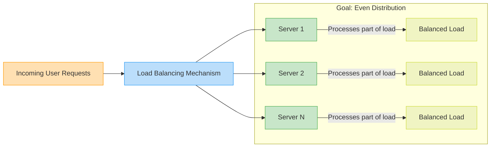

# What Is Load Balancing？ ⚖️ (1080P30) - Part 1

# Consistent Hashing: Scaling Systems

## Introduction to Scalable Systems
_screenshots/frame_00-00-00.jpg)
_screenshots/frame_00-01-25.jpg)
**Consistent Hashing** is a fundamental concept in distributed systems, essential for building **scalable systems**. A scalable system is one designed to handle an increasing amount of work (like more users or data) by efficiently adding more resources (such as servers) without significant performance degradation. This technique is particularly vital when managing large-scale services.

### What is a Server in this Context?
_screenshots/frame_00-02-08.jpg)
In simple terms, a **server** is a computer or a program that "serves" requests from other computers or devices, known as **clients**.
*   **Scenario:** Imagine you've developed an algorithm, for instance, a facial recognition tool that adds a mustache to an image.
*   **Client Interaction:** A client (e.g., someone using a mobile app) sends a **request** to your server. This request contains the image.
*   **Processing:** Your server runs the algorithm on the received image.
*   **Response:** The server then sends a **response** back to the client, which is the modified image with the mustache.

```mermaid
graph LR
    Client[Mobile Phone Client] --> Req[Sends Request (e.g., Image)]
    Req --> Server[Server (Running Algorithm)]
    Server --> Process[Processes Request (e.g., Adds Mustache)]
    Process --> Resp[Sends Response (e.g., Modified Image)]
    Resp --> Client
    style Client fill:#e0f7fa,stroke:#00796b,stroke-width:1px
    style Server fill:#fffde7,stroke:#ffb300,stroke-width:1px
    style Process fill:#e8f5e9,stroke:#388e3c,stroke-width:1px
    style Req fill:#e3f2fd,stroke:#1976d2,stroke-width:1px
    style Resp fill:#f3e5f5,stroke:#8e24aa,stroke-width:1px
```

## The Challenge of Scaling: Handling High Demand
Initially, a single server might be sufficient to handle a few requests. However, if your service becomes popular, you could quickly face thousands of requests per second. A single computer cannot handle such immense load and would become overloaded, leading to slow responses or even crashes.

To address this, you need to add more servers.

_screenshots/frame_00-03-19.jpg)

### The Load Balancing Problem
Once you have multiple servers (let's say `N` servers), a critical question emerges: **"How do we decide which server should process each incoming request?"**

The objective is to distribute the incoming requests as evenly as possible across all `N` available servers. This process is known as **Load Balancing**.

_screenshots/frame_00-04-01.jpg)

**Load Balancing** is crucial for:
*   **Distributing Workload:** Spreading the processing "load" (requests) uniformly among all servers.
*   **Preventing Overload:** Ensuring that no single server becomes a bottleneck or fails due to excessive demand, while others remain underutilized.
*   **Maximizing Performance:** Maintaining optimal and consistent response times for clients by efficiently using all available server resources.



## How Consistent Hashing Helps
**Consistent Hashing** provides an efficient and robust method to solve this load balancing problem, particularly beneficial in dynamic environments where servers may frequently join or leave the system.

### Request Identification
To facilitate intelligent load distribution, each incoming request is assigned a unique identifier:
*   **Request ID:** Each client generates a **Request ID**, which is typically a uniformly random number within a predefined range (e.g., from `0` to `M-1`).
*   This `Request ID` is then sent along with the actual request to the system.
*   This ID acts as a unique key that the load balancing mechanism will use to deterministically assign the request to a specific server.

---

### Simple Hashing for Load Balancing
_screenshots/frame_00-04-31.jpg)
A straightforward approach to load balancing involves using a **hash function** and the modulo operator.

1.  **Generate a Hash:** Take the `Request ID` (let's call it `R_ID`) and pass it through a hash function, `h()`. This converts the `R_ID` into a numerical hash value, `m`.
    *   `m = h(R_ID)`
2.  **Map to a Server:** To map this hash value to one of the `N` available servers, use the modulo operator:
    *   `Server Index = m % N`

This `Server Index` tells you exactly which server (from `0` to `N-1`) should handle the request.

#### Example Scenario (N=4 Servers)
Let's assume you have 4 servers: `S0`, `S1`, `S2`, `S3`. `N = 4`.

| Request ID | Hash Value `h(R_ID)` | Server Mapping `h(R_ID) % 4` | Target Server |
| :--------- | :------------------- | :---------------------------- | :------------ |
| `R1`       | `10`                 | `10 % 4 = 2`                  | `S2`          |
| `R2`       | `15`                 | `15 % 4 = 3`                  | `S3`          |
| `R3`       | `12`                 | `12 % 4 = 0`                  | `S0`          |

_screenshots/frame_00-05-04.jpg)
_screenshots/frame_00-05-53.jpg)

```mermaid
graph LR
    subgraph Request Flow
        ClientReq[Client Request] --> RequestID[Request ID (e.g., R1)]
        RequestID --> HashFunc[Hash Function h()]
        HashFunc --> HashVal[Hash Value m (e.g., 10)]
        HashVal --> ModuloN[Modulo N (m % N)]
        ModuloN --> ServerAssign[Server Index (e.g., 2)]
    end

    subgraph Servers (N=4)
        ServerAssign --> S0[Server S0]
        ServerAssign --> S1[Server S1]
        ServerAssign --> S2[Server S2]
        ServerAssign --> S3[Server S3]
    end

    style ClientReq fill:#e0f7fa,stroke:#00796b,stroke-width:1px
    style RequestID fill:#fff3e0,stroke:#ff9800,stroke-width:1px
    style HashFunc fill:#e3f2fd,stroke:#1976d2,stroke-width:1px
    style HashVal fill:#fff8e1,stroke:#ffe082,stroke-width:1px
    style ModuloN fill:#e8f5e9,stroke:#388e3c,stroke-width:1px
    style ServerAssign fill:#f3e5f5,stroke:#8e24aa,stroke-width:1px
    style S0 fill:#c8e6c9,stroke:#4caf50,stroke-width:1px
    style S1 fill:#c8e6c9,stroke:#4caf50,stroke-width:1px
    style S2 fill:#c8e6c9,stroke:#4caf50,stroke-width:1px
    style S3 fill:#c8e6c9,stroke:#4caf50,stroke-width:1px
```

**Why this works (initially):**
If `Request IDs` are uniformly random, and your hash function `h()` distributes values uniformly, then the `h(R_ID) % N` operation will generally distribute requests evenly across all `N` servers. Each server would ideally handle `X/N` requests if there are `X` total requests, resulting in a load factor of `1/N` per server. This seems perfect for static systems.

## The Problem with Simple Hashing: Adding/Removing Servers
_screenshots/frame_00-06-10.jpg)
_screenshots/frame_00-07-49.jpg)
The simple `hash(R_ID) % N` approach has a major drawback when the number of servers `N` changes. This is a common occurrence in scalable systems:
*   **Scaling Up:** Adding new servers (e.g., `S4`) due to increased demand.
*   **Scaling Down:** Removing servers due to decreased demand or maintenance.
*   **Server Failure:** A server unexpectedly goes offline.

### Impact of Changing `N`
When `N` changes, the modulo operation `m % N` changes for *almost all* existing hash values `m`. This means that most `Request IDs` will now map to different servers than before.

#### Example: Adding a 5th Server (N=5)
Let's reconsider our previous example, but now we add a new server, `S4`, so `N` becomes `5`.

| Request ID | Hash Value `h(R_ID)` | Old Mapping `h(R_ID) % 4` | New Mapping `h(R_ID) % 5` | Change? |
| :--------- | :------------------- | :------------------------ | :------------------------ | :------ |
| `R1`       | `10`                 | `10 % 4 = 2` (to `S2`)    | `10 % 5 = 0` (to `S0`)    | **YES** |
| `R2`       | `15`                 | `15 % 4 = 3` (to `S3`)    | `15 % 5 = 0` (to `S0`)    | **YES** |
| `R3`       | `12`                 | `12 % 4 = 0` (to `S0`)    | `12 % 5 = 2` (to `S2`)    | **YES** |

As seen, all three requests that were previously mapped to `S0`, `S2`, and `S3` now map to entirely new servers (`S0` and `S2`).

### The "Bamboozled" Problem: Massive Re-mapping
This re-mapping means:
1.  **Cache Invalidation:** If servers cache data related to specific `Request IDs`, adding or removing a server invalidates a huge portion of the cache across *all* servers. This leads to a flood of cache misses and re-fetching data, severely impacting performance.
2.  **State Loss:** If servers maintain session state or specific data for certain `Request IDs`, this data needs to be migrated or re-computed, which is complex and resource-intensive.
3.  **Inefficiency:** Instead of just redistributing a small fraction of requests to the new server, almost *all* requests need to be re-routed, leading to a system-wide disruption.

### Analogy: The Pie Chart of Buckets
_screenshots/frame_00-08-55.jpg)
Imagine the entire range of possible `Request IDs` (or their hash values) as a large **pie**.
*   **Initial State (4 Servers):** If you have 4 servers, the pie is divided into 4 equal slices, each representing 25% of the total `Request IDs` that a server is responsible for. Each server "owns" 25% of the "buckets" (hash ranges).
    *   `S0`: 0-24%
    *   `S1`: 25-49%
    *   `S2`: 50-74%
    *   `S3`: 75-99%

*   **Adding a 5th Server:** When you add a 5th server (`S4`), the pie must now be divided into 5 equal slices, each representing 20% of the total.
    *   `S0`: 0-19% (lost 5% of its original buckets)
    *   `S1`: 20-39% (lost 10% of its original buckets)
    *   `S2`: 40-59% (lost 15% of its original buckets)
    *   `S3`: 60-79% (lost 15% of its original buckets)
    *   `S4`: 80-99% (newly gained 20% of buckets)

This seemingly small change (adding one server) causes a ripple effect where almost every server has to give up or take on a significant portion of its assigned `Request IDs` ("buckets" or "numbers"). The percentage of changed mappings is high (`(N-1)/N`). This is the fundamental problem that Consistent Hashing aims to solve.

---

### The Cost of Re-mapping: A "Bamboozled" System
_screenshots/frame_00-09-46.jpg)

When using simple modulo hashing (`hash(R_ID) % N`), adding or removing a server (changing `N`) has a catastrophic impact:

*   **Massive Re-distribution:** If `N` changes to `N'`, nearly all `Request IDs` (`m`) will map to a new server because `m % N` will likely be different from `m % N'`.
    *   For example, if you go from 4 servers to 5 servers, approximately `(N-1)/N = 4/5 = 80%` of all existing mappings will change. This means 80% of `Request IDs` will now be handled by a different server.

*   **The "Pie Chart" Analogy:**
    Imagine the entire range of possible hash values as a pie.
    *   **Initial State (4 Servers):** Each of the 4 servers (`S0`, `S1`, `S2`, `S3`) is responsible for an equal slice of the pie, say 25% of the `Request ID` range.
    *   **Adding a 5th Server (`S4`):** When `S4` is added, the pie must now be divided into 5 equal slices, each 20%. This requires a complete re-drawing of the boundaries.
        *   `S0` (originally 25%) now becomes 20%, losing 5% of its original assigned `Request IDs`.
        *   `S1` (originally 25%) also becomes 20%, losing 5% of its `Request IDs`.
        *   `S2` (originally 25%) now becomes 20%, losing 5% of its `Request IDs`.
        *   `S3` (originally 25%) now becomes 20%, losing 5% of its `Request IDs`.
        *   `S4` (new server) takes 20% of the pie.
    *   **Total Change:** The sum of all these changes (the `Request IDs` that move from one server to another) effectively covers the entire search space. This means almost every single `Request ID` might be re-assigned to a different server.

### Why This Massive Re-mapping is a Problem

The primary reason this is detrimental in real-world systems relates to how `Request IDs` are often generated and how servers optimize performance.

1.  **Request IDs are Not Truly Random (Often User-Specific):**
    *   In practice, `Request IDs` are frequently derived from a consistent identifier, such as a `UserID`, `Session ID`, or a specific `Content ID`.
    *   For example, if a user named "Gorab" sends a request, `h("Gorab")` will always produce the same hash value. This deterministic behavior means that "Gorab's" requests will consistently be routed to the same server (e.g., `S2`) if the number of servers `N` remains constant.

2.  **Leveraging Consistency for Caching and Performance:**
    *   Sending a user's requests to the same server allows that server to **cache** relevant information about that user (e.g., their profile data, recent activity, personalization settings) in its local memory.
    *   This caching significantly speeds up subsequent requests from the same user, as the server doesn't need to fetch the data from a slower, centralized database every time. This is known as **data locality** or **session affinity**.

3.  **The Devastating Impact of Simple Hashing on Caching:**
    *   When you add or remove a server, changing `N`, the `h(UserID) % N` calculation changes for almost all users.
    *   This means "Gorab," who was consistently routed to `S2`, might suddenly be routed to `S0`.
    *   **Cache Invalidation:** The cached data for "Gorab" on `S2` is now useless, as `S0` is handling the request and doesn't have that data. `S0` will have to fetch it from the database, negating the benefits of caching.
    *   **System-Wide Performance Hit:** Because most users are re-routed, a huge portion of the cached data across *all* servers becomes invalid simultaneously. This leads to a massive wave of cache misses, forcing all servers to hit the database, severely degrading overall system performance.

In essence, the simple modulo hashing method causes a **full system reset** of data locality and caching whenever the server pool changes, which is unacceptable for dynamic, scalable applications.

### The Goal: Minimal Re-mapping
What is desired is a hashing strategy where:
*   When a server is added, only the requests that were previously handled by *some* server are re-assigned to the *new* server.
*   When a server is removed, only the requests it was handling are re-assigned to the *remaining* servers.
*   The mappings for all other requests (the vast majority) should remain unchanged.

This is precisely the problem that **Consistent Hashing** is designed to solve.

---

