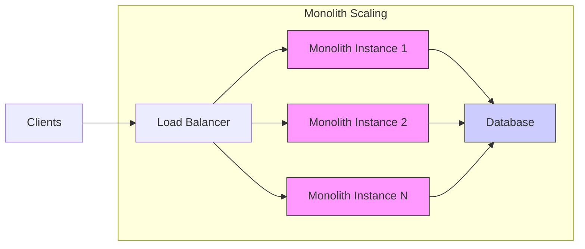
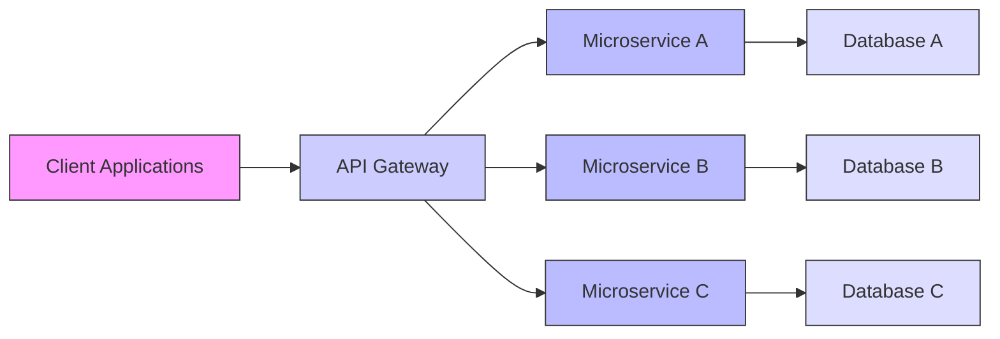

# What Is A Microservice Architecture And What Are Its Advantages？ (720P60) - Part 1

### Monolith vs. Microservices: Architectural Choices

In software engineering, a fundamental architectural decision involves choosing between a **Monolith** and **Microservices**. This choice significantly impacts development, deployment, and scalability.

_screenshots/frame_00-00-00.jpg)

#### Understanding Monolith Architecture

A **Monolith architecture** refers to a single, unified application where all components (user interface, business logic, data access layer) are tightly coupled and run as one service.

**Common Misconception vs. Reality:**

Initially, it's often believed that a monolith implies a single, massive system running on just one machine, with all clients connecting to this singular entity. However, this is a misconception.

*   **Misconception:** A monolith is confined to a single machine and cannot scale horizontally.
*   **Reality:** A monolith can be **horizontally scaled** (scaled out) by deploying multiple instances of the entire application across different machines. Clients can then connect to any of these instances, which in turn connect to a shared or replicated database.

_screenshots/frame_00-01-57.jpg)

This horizontal scaling capability means that the concept of a "huge machine running the entire system" is not an inherent limitation of a monolith.

#### Understanding Microservices Architecture

**Microservices architecture** decomposes an application into a collection of small, independent services, each running in its own process and communicating with lightweight mechanisms, often over a network. Each service typically manages its own data store.

**Common Misconception vs. Reality:**

The term "micro" often leads to the belief that microservices are extremely tiny functions running on individual machines with minute databases. This is also a misconception.

*   **Misconception:** Microservices are literally "tiny" machines, each running a single, isolated function, and constantly interacting with each other.
*   **Reality:** A microservice represents a **single business capability or unit**. It encapsulates all relevant data and functions for that specific business domain. The size of a microservice is determined by its business scope, not by an arbitrary "tiny" constraint. An architecture might only have a few well-defined microservices if the system's business domains are few.

**Client Interaction in Microservices:**

Clients typically **do not directly interact with individual microservices**. Instead, they connect to an **API Gateway**. This gateway acts as a single entry point, routing requests to the appropriate internal microservices and often handling cross-cutting concerns like authentication, rate limiting, and caching.

#### Advantages and Disadvantages: Monolith vs. Microservices

Now that we have clarified the fundamental nature of both architectures, let's explore their respective strengths and weaknesses, starting with the monolith.

##### Advantages of Monolith Architecture

1.  **Ideal for Small, Cohesive Teams:**
    *   When a development team is small and works closely together, a monolith reduces the overhead of communication and coordination.
    *   Breaking down an application into microservices requires significant planning, team interaction, and coordination, which might not be feasible for smaller teams.

2.  **Fewer Moving Parts & Simpler Deployment:**
    *   A monolith is a single deployable unit. This simplifies the deployment process as there's only one artifact to manage.
    *   There's no need to manage multiple independent services, their versions, and their interactions, which reduces operational complexity.
    *   **Analogy:** Imagine building a single, large Lego castle versus building many small, independent Lego houses and trying to get them to interact perfectly. The single castle is simpler to assemble and move.

3.  **Reduced Code Duplication:**
    *   Common functionalities like logging, authentication, session management, and database connections are typically implemented once within the monolith.
    *   This eliminates the need to duplicate this shared code across multiple services, simplifying maintenance and ensuring consistency.

4.  **Faster Internal Communication (In-Process Calls):**
    *   Components within a monolith communicate directly through in-process function calls, which are extremely fast.
    *   There's no network latency involved, unlike microservices which rely on inter-service communication (e.g., RPC or HTTP calls) over a network. This can lead to better performance for operations that require extensive interaction between different parts of the application.

##### Disadvantages of Monolith Architecture

1.  **Steep Learning Curve for New Team Members:**
    *   A large, complex monolithic codebase can be overwhelming for new developers. Understanding the entire system, its dependencies, and how changes in one area might affect others requires significant time and effort.
    *   **Analogy:** Learning to navigate a giant, interconnected city without a map versus learning to navigate a few small, well-defined neighborhoods.

---

##### Disadvantages of Monolith Architecture (Continued)

2.  **Complex and Frequent Deployments:**
    *   Any change, no matter how small or localized, requires redeploying the *entire* monolithic application. This can lead to:
        *   **Frequent downtime:** If the deployment process involves stopping the service, it can lead to service interruptions.
        *   **Increased risk:** A bug in one small part of the code can bring down the entire system upon deployment.
        *   **Tedious testing:** Since all components are tightly coupled, even a minor change necessitates extensive regression testing of the entire system to ensure no unintended side effects.
    *   **Analogy:** Imagine changing a single light bulb in a house that requires shutting down the entire city's power grid and then testing every appliance in every house before turning it back on.

3.  **Single Point of Failure / High Blast Radius:**
    *   Because all functionalities reside within a single application, a failure in one component (e.g., a memory leak, an unhandled exception) can cause the entire monolithic server to crash.
    *   This leads to a complete system outage, impacting all users and functionalities.
    *   **Example:** If your monolith handles user profiles, analytics, and chat, a crash in the analytics module could bring down the entire application, making user profiles and chat unavailable as well. This is in contrast to microservices, where a failure in one service might only impact that specific functionality, allowing other parts of the system to continue operating (partial success).

#### Advantages of Microservices Architecture

_screenshots/frame_00-06-53.jpg)

Microservices address many of the challenges faced by monolithic applications, especially as systems grow larger and more complex.

1.  **Independent Scalability (Granular Scaling):**
    *   Microservices allow for **independent scaling** of individual services. If a specific service, like the "Chat" service, experiences high load, only that service needs to be scaled up by adding more instances, not the entire application.
    *   This leads to more efficient resource utilization, as you only allocate resources where they are most needed.
    *   **Analogy:** Instead of buying more buses for your entire city because one specific bus route is popular, you can just add more buses to that single popular route.

2.  **Easier Onboarding for New Developers:**
    *   New team members can be assigned to work on a specific microservice. They only need to understand the codebase and context of that particular service, rather than the entire, potentially massive, monolithic application.
    *   This significantly reduces the learning curve and allows developers to become productive much faster.

3.  **Facilitates Parallel Development:**
    *   Different teams or developers can work on different microservices simultaneously with minimal dependencies on each other.
    *   This reduces "coupling" not just in code, but also in the development process itself, leading to faster feature delivery. For example, the "Chat" team can develop independently of the "Analytics" team.

4.  **Optimized Resource Allocation & Deployment:**
    *   Since each service is independent, deployments are less risky and faster. A change in one service only requires deploying that specific service, not the entire application.
    *   Monitoring is more focused: if the "Chat" service is experiencing high CPU usage, you know exactly where to investigate and scale. This allows for a more streamlined and targeted approach to problem-solving and resource management.

#### Disadvantages of Microservices Architecture

While offering significant benefits, microservices also introduce their own set of complexities.

1.  **Increased Design Complexity:**
    *   Designing a microservices architecture is inherently more complex than a monolith. It requires careful consideration of how to decompose the application into meaningful, independent services (defining "business capabilities").
    *   **Anti-pattern:** A common mistake is to break services too granularly, leading to services that are overly dependent on each other. If Service 1 is *only* talking to Service 2 constantly, it's often an indicator that they should have been a single service.
    *   _screenshots/frame_00-07-28.jpg)
    *   In such cases, what would have been a simple in-process function call in a monolith becomes a complex, network-bound Remote Procedure Call (RPC) or HTTP request, adding latency and overhead.

2.  **Operational Overhead:**
    *   Managing multiple, independent services (deployment, monitoring, logging, tracing, service discovery) is significantly more complex than managing a single application.
    *   Requires robust infrastructure, automation, and DevOps practices.

3.  **Distributed System Challenges:**
    *   Dealing with distributed transactions, eventual consistency, network latency, and fault tolerance across multiple services adds complexity.
    *   Debugging issues can be harder as a request might traverse several services.

4.  **Requires Experienced Architects:**
    *   Successfully implementing a microservices architecture demands a deep understanding of distributed systems, domain-driven design, and strong architectural leadership. Poorly designed microservices can lead to a "distributed monolith" which has the disadvantages of both without the benefits.

#### Monolith vs. Microservices in System Design Interviews

In system design interviews, the choice between monolith and microservices is a common discussion point.

*   **Default for Large Systems:** For **large-scale systems**, a microservices architecture is generally the preferred default choice due to its scalability, resilience, and development agility benefits. Approximately 90% of system design interview scenarios will lean towards microservices for this reason.
*   **Justification is Key:** It is crucial to be able to **justify** your architectural choice. While microservices are often the default for large systems, understanding *why* they are suitable and acknowledging their complexities demonstrates a comprehensive understanding.
*   **Considerations for Choice:**
    *   **Team Size and Cohesion:** Small, cohesive teams might start with a monolith.
    *   **Project Scope:** Small, simple applications might benefit from the simplicity of a monolith.
    *   **Scalability Needs:** High and varied scaling requirements favor microservices.
    *   **Organizational Structure:** Teams organized around business domains align well with microservices.

Ultimately, the "better" architecture depends on the specific context, requirements, team capabilities, and future growth projections of the system.

---

#### Architectural Decision Making: Monolith vs. Microservices

When faced with the choice between a monolith and microservices, especially in a system design interview, it's crucial to understand the trade-offs and be able to justify your decision.

**Key Takeaways for System Design Interviews:**

*   **Default for Large Systems:** For designing large-scale systems, the **microservices architecture is generally the default and often preferred choice**. This is because large systems typically require the benefits microservices offer in terms of scalability, resilience, independent deployments, and parallel development.
*   **Justification is Essential:** While microservices might be the default, simply stating "I'll use microservices" is insufficient. You must be prepared to **articulate the specific advantages** that make microservices suitable for the given system's requirements (e.g., high traffic, diverse teams, need for fault isolation).
*   **Recognizing Monolith Suitability:** Be aware that interviewers might guide you towards a monolith if the system's requirements (e.g., small scale, small team, low initial complexity) align better with its advantages. If your justifications for microservices don't quite fit the problem, it might be a hint to consider the monolith.

_screenshots/frame_00-07-29.jpg)

**Real-World Examples:**

Both architectural styles have proven successful in real-world applications, depending on their specific contexts and needs:

*   **Monolith Success Story:**
    *   **Stack Overflow:** A highly successful and widely used platform for programmers, Stack Overflow famously operates on a **monolithic architecture**. This demonstrates that a monolith can be incredibly robust and scalable when managed effectively, especially if the team and operational processes are optimized for it.

*   **Microservices Success Stories:**
    *   **Google, Facebook, Netflix:** These tech giants, along with many other large enterprises, extensively utilize **microservices architectures**. Their massive scale, diverse functionalities, and need for rapid, independent development cycles across numerous teams make microservices a natural fit.

The debate between monoliths and microservices is ongoing and context-dependent. A deep understanding of their respective strengths and weaknesses allows architects to make informed decisions that best serve the project's goals.

---

