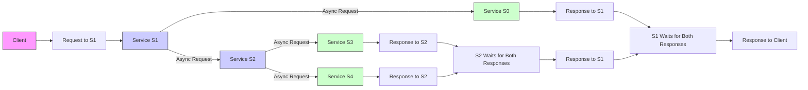

# What Is The Publisher Subscriber Model？ (720P60) - Part 1

### Event-Driven Services: Understanding Microservice Communication

Event-driven architecture is a powerful pattern for building scalable and resilient microservices. It contrasts with traditional request-response models by focusing on asynchronous communication through events.

_screenshots/frame_00-00-00.jpg)

#### Traditional Request-Response Model: Challenges

Consider a microservice architecture involving services S0, S1, S2, S3, and S4, with a client interacting with S1.

**Scenario:**
1.  A **Client** sends a **request** to **S1**.
2.  After processing, **S1** needs to send messages to both **S0** and **S2**. The order in which S0 and S2 receive these messages does not matter.
3.  Similarly, after **S2** completes its processing, it needs to send messages to **S3** and **S4**. Again, the order is not important.

In a traditional **request-response** model, this interaction would typically involve:
*   **S1** sending an asynchronous request to **S0** and another to **S2**, then waiting for their responses.
*   **S2** sending asynchronous requests to **S3** and **S4**, and waiting for their responses before responding back to S1.



**Drawbacks of this Request-Response Approach:**

1.  **Tight Coupling:** Services are directly dependent on the availability and responsiveness of other services. S1 depends on S0 and S2, and S2 depends on S3 and S4. This creates a brittle system where a failure in one service can directly impact others.
2.  **Cascading Failures:**
    *   Imagine if **S4 fails** or becomes unresponsive.
    *   **S2** will be stuck waiting for S4's response. After a timeout, S2 will report a failure to S1.
    *   **S1** then reports a timeout to the **Client**.
    *   This entire process is slow and significantly delays the client's experience, as the failure has to propagate back up the chain.
3.  **Data Inconsistency and Stale Data:**
    *   If a request fails due to a downstream service (like S4), the client might retry the request.
    *   **S1** might re-process the request and make changes to its database *again*.
    *   **S2** might also re-process and make changes to its database *again*.
    *   This leads to multiple, potentially redundant, changes for the same logical request, risking data staleness or inconsistencies across services. For example, if S1 correctly processed the request and updated its data, but a downstream failure occurred, its data might become stale if the client retries the whole process.
4.  **Lack of Resilience:** Downtime in one service can directly impact others, leading to a fragile system that is difficult to maintain and scale.

#### Publisher-Subscriber Model: A Solution

_screenshots/frame_00-02-11.jpg)
_screenshots/frame_00-02-47.jpg)
_screenshots/frame_00-03-35.jpg)

A superior approach to mitigate these issues is the **Publisher-Subscriber (Pub/Sub) model**, facilitated by a **Message Broker**. This model removes direct dependencies between services, allowing them to communicate asynchronously through events.

**How it Works:**

1.  **Publishers:** Services that generate events (e.g., S1, S2) publish these events as messages to a central **Message Broker**.
2.  **Message Broker:** This is an intermediary system (like Apache Kafka or RabbitMQ) responsible for:
    *   Receiving messages from publishers.
    *   Persisting these messages reliably in a queue or topic.
    *   Ensuring messages are delivered to interested subscribers.
    *   Abstracting away the complexities of direct service-to-service communication. It acts like a post office, taking mail from senders and delivering it to recipients, even if the recipient isn't home immediately.
3.  **Subscribers:** Services that are interested in specific events (e.g., S0, S2, S3, S4) subscribe to the Message Broker to receive those messages.

```mermaid
graph LR
    Client --> S1_Req_PubSub[Request to S1]
    S1_Req_PubSub --> S1[Service S1]
    S1 -- "Publishes Message" --> MB1[Message Broker 1 (e.g., Kafka)]
    S1 -- "Sends Immediate Success" --> Client_Resp_PubSub[Response to Client]

    MB1 -- "Delivers Message" --> S0[Service S0]
    MB1 -- "Delivers Message" --> S2[Service S2]

    S2 -- "Publishes Message" --> MB2[Message Broker 2 (e.g., Kafka)]
    MB2 -- "Delivers Message" --> S3[Service S3]
    MB2 -- "Delivers Message" --> S4[Service S4]

    style Client fill:#f9f,stroke:#333,stroke-width:1px
    style S1 fill:#ccf,stroke:#333,stroke-width:1px
    style S2 fill:#ccf,stroke:#333,stroke-width:1px
    style S0 fill:#cfc,stroke:#333,stroke-width:1px
    style S3 fill:#cfc,stroke:#333,stroke-width:1px
    style S4 fill:#cfc,stroke:#333,stroke-width:1px
    style MB1 fill:#fcf,stroke:#333,stroke-width:1px
    style MB2 fill:#fcf,stroke:#333,stroke-width:1px
```

**Key Advantages of the Publisher-Subscriber Architecture:**

1.  **Decoupling:** This is the primary benefit.
    *   **S1** no longer needs to know about **S0** or **S2** directly. It simply publishes a message to the Message Broker and can immediately respond to the client with success. The client doesn't wait for S0 or S2 to process.
    *   Similarly, **S2** publishes its messages to a Message Broker without needing to know if S3 or S4 are online or how to reach them.
    *   This loose coupling makes services independent, easier to develop, deploy, and scale, as changes in one service's implementation don't require changes in its consumers, only in the message format if necessary.

2.  **Asynchronous Communication:**
    *   The client receives an immediate response from S1, improving user experience, even if downstream processing is still ongoing. This is like ordering a product online and getting an immediate confirmation, even if the warehouse hasn't shipped it yet.
    *   Messages are processed in the background, non-blocking the calling service.

3.  **Enhanced Resilience and Reliability:**
    *   **Message Persistence:** Message brokers persist messages. If a subscriber (e.g., S2) is down, the Message Broker holds the message until S2 comes back online.
    *   **Message Replay:** Once S2 recovers, the Message Broker replays the pending messages to S2, ensuring no data is lost and processing continues seamlessly. This prevents cascading failures. If S4 fails, S2 is not blocked; it has already published its message to MB2 and can continue its own tasks or respond to its caller. S4 will eventually pick up the message from MB2 when it recovers. The system is more tolerant to individual service failures.

4.  **Improved Scalability:**
    *   Producers and consumers can scale independently. If a task becomes computationally intensive, more instances of the subscribing service can be added to process messages from the broker in parallel.
    *   New consumers can be added without affecting existing ones, simply by subscribing to the relevant messages.

The advantages significantly outweigh the added complexity of introducing a message broker, especially in large, distributed microservice environments.

---

### Advantages of the Publisher-Subscriber Model (Continued)

Beyond decoupling and resilience, the Pub/Sub model offers several other significant benefits:

_screenshots/frame_00-03-48.jpg)

1.  **Simplified System Understanding and Management:**
    *   Instead of managing complex direct connections and potential failure points between every pair of services, the system introduces a single, centralized point of interaction: the **Message Broker**.
    *   This simplifies the overall architecture, making it easier to reason about data flow and troubleshoot issues. A single point of failure (the broker itself) is generally easier to monitor, secure, and make highly available than managing distributed failures across many direct service connections.

2.  **Streamlined Developer Experience (Single Interface):**
    *   For developers, a service like **S1** only needs to know how to interact with the **Message Broker**. It publishes messages using a standardized interface provided by the broker.
    *   **S0** and **S2** (subscribers) then consume these messages based on their requirements.
    *   Developers of **S1** are freed from worrying about the specific interfaces or communication protocols required by **S0** or **S2**. This reduces complexity and speeds up development.

3.  **Transactional Guarantees (At-Least-Once Delivery):**
    *   Message brokers are designed for persistence. When a service publishes a message to the broker and receives an acknowledgment, it means the broker has durably stored that message.
    *   This provides an "at-least-once" delivery guarantee: the message broker will ensure the message is delivered to its intended subscribers *at least once*, even if the subscriber is temporarily down. If a subscriber fails after receiving a message but before processing it fully, the broker can re-deliver it.
    *   Therefore, if **S1** sends a request and successfully publishes it to the Message Broker, there's a strong guarantee that the message will eventually reach **S0** and **S2** (and subsequently S3 and S4 via their respective brokers), ensuring eventual completion of the process.

4.  **Enhanced Scalability:**
    *   The Pub/Sub model inherently supports horizontal scalability. If a new service, say **S6**, becomes interested in messages produced by **S1**, all that's required is for **S6** to register as a subscriber with the Message Broker.
    *   **S1** does not need to be modified or even aware of **S6**'s existence. It continues to publish messages as usual, and the Message Broker ensures **S6** receives them. This allows for flexible expansion of the system without impacting existing services.

_screenshots/frame_00-04-14.jpg)
_screenshots/frame_00-04-27.jpg)

### Disadvantages of Event-Driven Services (Consistency Challenges)

While event-driven architectures offer many advantages, they are not a silver bullet, especially when strong, immediate consistency is required. Let's consider a scenario in a financial system:

_screenshots/frame_00-05-18.jpg)
_screenshots/frame_00-06-21.jpg)

**Scenario: Fund Transfer in a Banking System**

Imagine a banking system with the following services:
*   **S1 (Gateway):** Receives client requests.
*   **S0 (Invoice Generator / Commission Service):** Handles bank commissions.
*   **S2 (Fund Transfer Service):** Manages actual fund movements between accounts.

**Client Request:** Transfer 950 rupees from Account A to Account B.
*   **Initial State:** Account A has 1000 rupees. Account B has 0 rupees.
*   **Bank Policy:** A 50-rupee commission is charged per transaction.
*   **Expected Outcome:** After the transaction, Account A should have 0 rupees (1000 - 950 - 50) and Account B should have 950 rupees.

**Problem with Eventual Consistency in Financial Systems:**

1.  **First Transfer Attempt (950 Rupees):**
    *   The **Client** sends a request to **S1 (Gateway)**.
    *   **S1** processes the request and publishes messages to the Message Broker, intended for **S0** and **S2**.
    *   **S0 (Invoice Generator)** picks up its message, processes the commission (deducts 50 rupees from Account A). So, Account A's balance becomes **950 rupees** (1000 - 50). S0 might also send an email confirmation to the client.
    *   However, the **Fund Transfer Service (S2) is currently down**. The message for S2 remains in the Message Broker's queue, waiting for S2 to come back online.
    *   **Crucially, the actual fund transfer of 950 rupees from A to B has NOT occurred yet.** The client has received a confirmation (from S0's email) that 50 rupees were deducted, implying the transaction is underway, but the main transfer is stalled.

2.  **Second Transfer Attempt (800 Rupees):**
    *   The **Client**, unaware of the stalled fund transfer, sends another request: transfer 800 rupees (with a 50 rupee commission).
    *   **S1** again processes and publishes messages to the Message Broker for **S0** and **S2**.
    *   **S0 (Invoice Generator)** picks up its new message. It sees Account A's current balance as **950 rupees** (from the previous commission deduction). It deducts another 50 rupees for the new commission.
    *   Now, Account A's balance, according to S0, is **900 rupees** (950 - 50).
    *   **S2 (Fund Transfer Service) is still down**, so neither the first 950-rupee transfer nor the second 800-rupee transfer has actually moved funds from A to B.

**The Inconsistency:**

At this point, Account A's balance, as recorded by the **Invoice Generator (S0)**, is 900 rupees. However, the actual funds transferred out of Account A are still 0 rupees, as the **Fund Transfer Service (S2)** has not processed any of the transfers.

This highlights the core challenge:
*   **Eventual Consistency:** In an event-driven system, different services process events at different times. While the system will eventually reach a consistent state (once S2 comes back online and processes all pending messages), there can be periods of **inconsistency** where different parts of the system (e.g., S0's view of A's balance vs. the actual funds moved by S2) hold conflicting data.
*   **Difficulty with Strict ACID Properties:** Financial transactions often require **Atomicity, Consistency, Isolation, and Durability (ACID)** properties, where an entire transaction must succeed or fail as a single, indivisible unit. Event-driven architectures, by their asynchronous and decoupled nature, make it harder to enforce such strict, immediate consistency across multiple services without complex distributed transaction mechanisms (like Sagas), which add their own overhead.

In summary, while event-driven services excel in scalability and resilience for many use cases, they introduce complexities regarding data consistency, especially in domains like finance where real-time, strong consistency is paramount.

---

_screenshots/frame_00-07-51.jpg)

**Continuation of the Financial System Scenario:**

Let's trace the financial transaction problem to its conclusion.
In our previous example, Account A had 1000 rupees initially.
1.  **First Request (Transfer 950, Commission 50):**
    *   Client sends request.
    *   **S0 (Invoice Generator)** deducts 50 rupees commission. Account A balance according to S0: 1000 - 50 = **950 rupees**.
    *   **S2 (Fund Transfer Service)** is down; its message (to transfer 950) is queued in the Message Broker.

2.  **Second Request (Transfer 800, Commission 50):**
    *   Client sends another request.
    *   **S0 (Invoice Generator)** deducts another 50 rupees commission. Account A balance according to S0: 950 - 50 = **900 rupees**.
    *   **S2 (Fund Transfer Service)** is still down; its message (to transfer 800) is also queued.

**The Inconsistent Outcome When S2 Recovers:**

Now, assume **S2 (Fund Transfer Service)** comes back online and starts processing the queued messages from the Message Broker.

*   **Processing First Message (Transfer 950):**
    *   S2 receives the message to transfer 950 rupees from Account A.
    *   However, Account A's *actual* current balance is 900 rupees (as the 50-rupee commissions were deducted by S0, which had access to the account).
    *   Since 950 > 900, this **first transfer transaction will FAIL** due to insufficient funds.

*   **Processing Second Message (Transfer 800):**
    *   S2 then receives the message to transfer 800 rupees from Account A.
    *   The current balance in Account A is still 900 rupees.
    *   Since 800 < 900, this **second transfer transaction will SUCCEED**. Account A's balance becomes 900 - 800 = **100 rupees**. Account B receives 800 rupees.

**Final State vs. Expectation:**

| Expected Final State (Ideal) | Actual Final State (Event-Driven Issue) |
| :--------------------------- | :-------------------------------------- |
| Account A: 0 rupees          | Account A: 100 rupees                   |
| Account B: 950 + 800 = 1750 rupees | Account B: 800 rupees                   |
| Total Commissions: 100 rupees | Total Commissions: 100 rupees           |

**The Problem:**
The initial expectation after the first transaction was that Account A would have 0 rupees. Instead, due to the asynchronous nature and delayed processing, the first transaction failed, and the second one succeeded, leaving an unexpected 100 rupees in Account A. This highlights a significant challenge:

*   **Lack of Atomicity (across services):** In this architecture, there's no inherent mechanism to ensure that all parts of a complex, multi-service operation (like a fund transfer involving commission deduction and fund movement) either succeed completely or fail completely as a single, indivisible unit. The system lacks **ACID** properties (Atomicity, Consistency, Isolation, Durability) across distributed services out-of-the-box. This makes it unsuitable for "mission-critical" systems where strict financial consistency is paramount.

#### Idempotency Issues

Another significant drawback of event-driven services, especially with "at-least-once" delivery guarantees from message brokers, is the challenge of **idempotency**.

*   **Idempotency Defined:** An operation is **idempotent** if applying it multiple times produces the same result as applying it once.
    *   **Example of Idempotent:** Setting a value (e.g., `SET balance = 100`). If you set it to 100 multiple times, it remains 100.
    *   **Example of Non-Idempotent:** Debiting an amount (e.g., `DEBIT balance BY 50`). If you debit 50 multiple times, the balance decreases by 50 each time.

_screenshots/frame_00-09-50.jpg)
_screenshots/frame_00-09-39.jpg)

**How Non-Idempotency Becomes a Problem:**

1.  **S2 (Fund Transfer Service)** processes a message, say, to debit 50 rupees from an account.
2.  It successfully debits the account and updates its internal state.
3.  Then, **S2 attempts to publish a follow-up message** (e.g., to indicate completion) to its own Message Broker (MB2 in the diagram).
4.  **Crucially, this publishing step might fail** (e.g., network glitch, broker temporary unavailability).
5.  Because the Message Broker (MB1, the first one) has an "at-least-once" delivery guarantee, it will **replay the original message** to S2, as S2 did not successfully acknowledge the *entire* processing and subsequent publishing.
6.  **S2 receives the same "debit 50 rupees" message again.** If S2's internal logic is not designed to handle duplicates, it will **debit another 50 rupees** from the account.
7.  This leads to the same problem we saw with inconsistent balances: an account being debited multiple times for a single logical operation.

**Solution: Application-Level Idempotency:**

The event-driven architecture itself does not enforce idempotency. Developers must implement it in their application logic.
*   **Request IDs/Transaction IDs:** The most common solution is to include a unique **Request ID** or **Transaction ID** with every message.
*   When a service like S2 receives a message, it should:
    1.  Check if it has already processed a message with that specific Request ID.
    2.  If it has, it should simply ignore the duplicate message (or return the previous result) rather than re-executing the non-idempotent operation.

This adds complexity to the application code, shifting the responsibility from the communication layer (broker) to the individual services.

### When to Use Event-Driven Services

Despite these drawbacks, the Publisher-Subscriber model and event-driven architectures are incredibly powerful and form the basis for many complex, scalable systems.

**Ideal Use Cases:**

*   **High Throughput / Asynchronous Processing:** When operations can be processed independently and don't require immediate, synchronous responses.
*   **Decoupled Systems:** Where services need to operate autonomously and changes in one shouldn't directly impact others.
*   **Scalability:** When the system needs to easily scale by adding more consumers to handle increased message volumes.
*   **Data Analytics and Event Streaming:** Collecting and processing large volumes of events for real-time analytics, monitoring, or business intelligence.
*   **Notifications and Alerts:** Sending notifications (e.g., email, SMS) based on system events.
*   **Examples:**
    *   **Gaming Services:** Tracking player actions, game events, and sending analytical data.
    *   **Social Media Platforms (e.g., Twitter):** When a user posts a tweet (an event), many other services (timeline updates, notification services, analytics, search indexing) need to consume that event. The Pub/Sub model is perfect for this "one-to-many" asynchronous distribution, as Twitter itself famously uses this pattern.

**Less Suitable Use Cases:**

*   **Mission-Critical Financial Transactions:** Where strict, immediate ACID consistency across multiple services is an absolute requirement, the eventual consistency of event-driven systems can lead to complex reconciliation issues.
*   **Simple Request-Response Interactions:** For very straightforward synchronous interactions where immediate feedback is required and the overhead of a message broker is unnecessary.

Understanding these advantages and disadvantages is crucial for choosing the right architectural pattern for your specific business requirements.

---

### Conclusion and Key Takeaways

_screenshots/frame_00-11-18.jpg)

This discussion has provided a foundational understanding of **Event-Driven Services**, primarily built upon the **Publisher-Subscriber (Pub/Sub) model**. We've explored how this architecture contrasts with traditional request-response patterns and the significant implications it has for designing resilient and scalable microservice systems.

#### Comparing Communication Models: Request-Response vs. Publisher-Subscriber

To summarize the core differences and their impacts:

| Feature                   | Traditional Request-Response Model                 | Event-Driven (Publisher-Subscriber) Model            |
| :------------------------ | :------------------------------------------------- | :--------------------------------------------------- |
| **Communication Style**   | Synchronous (often blocking)                       | Asynchronous (non-blocking)                          |
| **Coupling**              | Tight coupling between services                    | Loose coupling via Message Broker                    |
| **Resilience**            | Prone to cascading failures; direct dependencies   | High resilience; Message Broker persists messages    |
| **Scalability**           | Can be difficult to scale independently            | Highly scalable; services scale independently        |
| **Data Consistency**      | Easier to enforce immediate consistency (ACID)     | Eventual consistency; challenges with strong ACID    |
| **Idempotency**           | Not inherently guaranteed; relies on client retries | Not inherently guaranteed; requires application logic |
| **Complexity for Devs**   | Manage direct service interfaces                   | Single interface to Message Broker                   |
| **Best Suited For**       | High-consistency, real-time, simple interactions   | High-throughput, complex, decoupled, analytical systems |
| **Example Use Case**      | Bank API for single balance query                  | Twitter's tweet distribution, gaming analytics       |

#### When to Choose Event-Driven Architecture

Event-driven services, powered by message brokers, are an excellent choice for:
*   Building highly **scalable** systems that can handle large volumes of events.
*   Achieving significant **decoupling** between microservices, leading to more independent development and deployment.
*   Improving **resilience** by buffering events and replaying them when services recover from downtime.
*   Scenarios where **eventual consistency** is acceptable, and immediate, strong consistency across all services is not a strict requirement (e.g., social media feeds, analytics pipelines, IoT data processing).

However, they are generally **less suitable** for:
*   Systems requiring **strict, immediate ACID transactional consistency** across multiple services, such as complex financial transactions, unless sophisticated distributed transaction patterns (like Sagas) are carefully implemented, which adds considerable complexity.
*   Situations where the overhead of a message broker and the complexities of eventual consistency outweigh the benefits for simpler, synchronous interactions.

Understanding these trade-offs is fundamental to designing robust and appropriate distributed systems.

---

